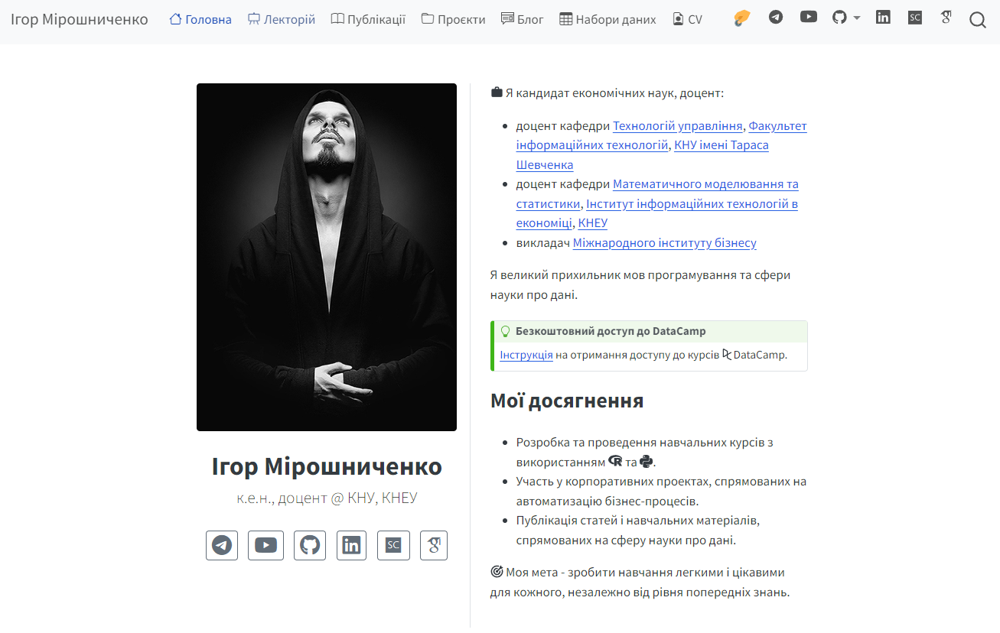

# [aranaur.rbind.io](https://aranaur.rbind.io/)

&nbsp;&nbsp;&nbsp;
[url("data:image/svg+xml,%3Csvg xmlns='http://www.w3.org/2000/svg' width='96' height='96' viewBox='0 0 256 256'%3E%3Cpath fill='%230a66c2' d='M218.123 218.127h-37.931v-59.403c0-14.165-.253-32.4-19.728-32.4c-19.756 0-22.779 15.434-22.779 31.369v60.43h-37.93V95.967h36.413v16.694h.51a39.907 39.907 0 0 1 35.928-19.733c38.445 0 45.533 25.288 45.533 58.186zM56.955 79.27c-12.157.002-22.014-9.852-22.016-22.009c-.002-12.157 9.851-22.014 22.008-22.016c12.157-.003 22.014 9.851 22.016 22.008A22.013 22.013 0 0 1 56.955 79.27m18.966 138.858H37.95V95.967h37.97zM237.033.018H18.89C8.58-.098.125 8.161-.001 18.471v219.053c.122 10.315 8.576 18.582 18.89 18.474h218.144c10.336.128 18.823-8.139 18.966-18.474V18.454c-.147-10.33-8.635-18.588-18.966-18.453'/%3E%3C/svg%3E")](https://send.monobank.ua/jar/3rgj2uzZTs)&nbsp;&nbsp;&nbsp;
[<svg xmlns="http://www.w3.org/2000/svg" width="40" height="40" viewBox="0 0 256 256"><defs><linearGradient id="logosTelegram0" x1="50%" x2="50%" y1="0%" y2="100%"><stop offset="0%" stop-color="#2aabee"/><stop offset="100%" stop-color="#229ed9"/></linearGradient></defs><path fill="url(#logosTelegram0)" d="M128 0C94.06 0 61.48 13.494 37.5 37.49A128.038 128.038 0 0 0 0 128c0 33.934 13.5 66.514 37.5 90.51C61.48 242.506 94.06 256 128 256s66.52-13.494 90.5-37.49c24-23.996 37.5-56.576 37.5-90.51c0-33.934-13.5-66.514-37.5-90.51C194.52 13.494 161.94 0 128 0"/><path fill="#fff" d="M57.94 126.648c37.32-16.256 62.2-26.974 74.64-32.152c35.56-14.786 42.94-17.354 47.76-17.441c1.06-.017 3.42.245 4.96 1.49c1.28 1.05 1.64 2.47 1.82 3.467c.16.996.38 3.266.2 5.038c-1.92 20.24-10.26 69.356-14.5 92.026c-1.78 9.592-5.32 12.808-8.74 13.122c-7.44.684-13.08-4.912-20.28-9.63c-11.26-7.386-17.62-11.982-28.56-19.188c-12.64-8.328-4.44-12.906 2.76-20.386c1.88-1.958 34.64-31.748 35.26-34.45c.08-.338.16-1.598-.6-2.262c-.74-.666-1.84-.438-2.64-.258c-1.14.256-19.12 12.152-54 35.686c-5.1 3.508-9.72 5.218-13.88 5.128c-4.56-.098-13.36-2.584-19.9-4.708c-8-2.606-14.38-3.984-13.82-8.41c.28-2.304 3.46-4.662 9.52-7.072"/></svg>](https://t.me/araprof)&nbsp;&nbsp;&nbsp;
[<svg xmlns="http://www.w3.org/2000/svg" height="40" viewBox="0 0 256 180"><path fill="#f00" d="M250.346 28.075A32.18 32.18 0 0 0 227.69 5.418C207.824 0 127.87 0 127.87 0S47.912.164 28.046 5.582A32.18 32.18 0 0 0 5.39 28.24c-6.009 35.298-8.34 89.084.165 122.97a32.18 32.18 0 0 0 22.656 22.657c19.866 5.418 99.822 5.418 99.822 5.418s79.955 0 99.82-5.418a32.18 32.18 0 0 0 22.657-22.657c6.338-35.348 8.291-89.1-.164-123.134"/><path fill="#fff" d="m102.421 128.06l66.328-38.418l-66.328-38.418z"/></svg>](https://www.youtube.com/@datamirosh)&nbsp;&nbsp;&nbsp;
[<svg xmlns="http://www.w3.org/2000/svg" width="40" height="40" viewBox="0 0 256 256"><path fill="#0a66c2" d="M218.123 218.127h-37.931v-59.403c0-14.165-.253-32.4-19.728-32.4c-19.756 0-22.779 15.434-22.779 31.369v60.43h-37.93V95.967h36.413v16.694h.51a39.907 39.907 0 0 1 35.928-19.733c38.445 0 45.533 25.288 45.533 58.186zM56.955 79.27c-12.157.002-22.014-9.852-22.016-22.009c-.002-12.157 9.851-22.014 22.008-22.016c12.157-.003 22.014 9.851 22.016 22.008A22.013 22.013 0 0 1 56.955 79.27m18.966 138.858H37.95V95.967h37.97zM237.033.018H18.89C8.58-.098.125 8.161-.001 18.471v219.053c.122 10.315 8.576 18.582 18.89 18.474h218.144c10.336.128 18.823-8.139 18.966-18.474V18.454c-.147-10.33-8.635-18.588-18.966-18.453"/></svg>](https://www.linkedin.com/in/ihormiroshnychenko)&nbsp;&nbsp;&nbsp;
  

