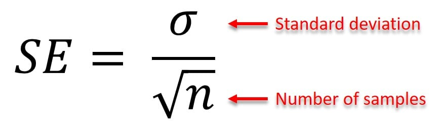

::: {.column-margin}

:::

**Закон великих чисел та мільярдні помилки: 5 класичних прикладів** 📊

**tl;dr:** У своїй [статті](http://nsmn1.uh.edu/dgraur/niv/themostdangerousequation.pdf) Говард Вейнер називає рівняння стандартної похибки середнього (рівняння де Муавра: $\sigma_{\bar{x}} = \sigma / \sqrt{n}$) "найнебезпечнішим рівнянням". Нерозуміння того факту, що дисперсія обернено пропорційна кореню з розміру вибірки, століттями призводило до хибних рішень у різних сферах. У статті наведено п'ять класичних прикладів, які чудово це ілюструють.

Суть проблеми полягає в тому, що малі вибірки завжди генерують більший розкид (дисперсію) результатів. Якщо ми дивимося лише на екстремальні значення і забуваємо про розмір вибірки, ми ризикуємо знайти закономірності там, де працює звичайна математика. Ось п'ять прикладів із дослідження Вейнера:

* **Монети та "Випробування Пікса" (Trial of the Pyx)**. З 1150 року в Англії перевіряли якість карбування монет. Допустима похибка для партії монет розраховувалася пропорційно до кількості монет, а не до квадратного кореня з їх кількості, як показує рівняння де Муавра. Ця математична хиба дозволяла обманювати систему та переплавляти заважкі монети для власної вигоди протягом майже 600 років!
* **Сільське життя: рай чи загроза?** Округи з найнижчим рівнем раку нирок у США — це малонаселені сільські райони. Здавалося б, це прямий наслідок здорового сільського способу життя та чистої екології. Але парадокс у тому, що округи з *найвищим* рівнем раку нирок — це також малонаселені сільські райони. Справжня причина криється у малій кількості населення, яка дає набагато більший розкид статистичних показників у порівнянні з великими мегаполісами.
* **Рух за малі школи**. Фонд Білла та Мелінди Гейтс витратив близько $1.7 млрд на створення малих шкіл. Реформатори спиралися на дані, які вказували, що серед найкращих шкіл непропорційно багато дрібних. Проте згодом з'ясувалося, що серед найгірших шкіл їх так само багато. Це був лише наслідок вищої дисперсії через малу кількість учнів, що згодом змусило фонд змінити свою стратегію і відмовитися від цієї ідеї.
* **Найбезпечніші міста**. Коли страхова компанія Allstate склала рейтинг 10 "найбезпечніших" та 10 "найнебезпечніших" міст США за частотою автомобільних аварій, жодне з 10 найбільших міст країни не потрапило до жодного з цих списків. Менші міста значно частіше опиняються на краях будь-якого розподілу через більшу варіативність даних.
* **Гендерні відмінності в успішності**. Статистика демонструє, що серед найуспішніших учнів, які отримують престижні академічні нагороди, традиційно більше хлопців. Але замість поспішних висновків про різний рівень інтелекту , дослідникам варто зважати на дисперсію: серед найгірших учнів хлопців також більше. Загальний розподіл результатів у чоловіків просто має більшу дисперсію, ніж у жінок.

Розмір вибірки — це фундамент, без якого будь-які "інсайти" перетворюються на пил. Ці п'ять прикладів ідеально ілюструють, як відсутність базового розуміння статистики генерує міфи, впливає на державну політику та призводить до мільярдних втрат. Економетрика та Data Science — це не просто про те, як написати код на `Python` чи `R`, це передусім про критичне мислення та глибоке розуміння природи даних, з якими ви працюєте. 
