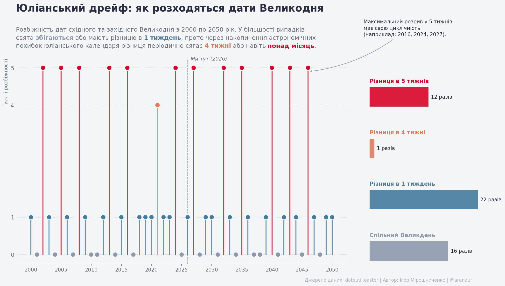

::: {.column-margin}

:::

У неділю багато хто святкував православний Великдень, тоді як католицький та протестантський світ відзначив його ще тиждень тому. Здавалося б, алгоритм розрахунку дати однаковий для всіх: **перша неділя після першого весняного повного місяця**. То чому ж дати розходяться?

## Однакове рівняння, різні константи

Проблема не в алгоритмі, а в **базових параметрах**, які в нього підставляються. Формально і Схід, і Захід рахують Великдень за однією формулою, але по-різному визначають два ключові поняття: *весняне рівнодення* та *перший повний місяць*.

І ці визначення ґрунтуються не на точних астрономічних вимірах — своєрідному «API Всесвіту» — а на хардкоді: апроксимаціях, жорстко закріплених сотні років тому.

## Що саме розходиться під капотом

**1. Точка відліку весни.** Обидві традиції фіксують початок весни як 21 березня. Але Захід користується григоріанським календарем, а Схід — юліанським. Через це «21 березня за юліанським» і «21 березня за григоріанським» — це вже різні дні.

**2. Накопичення похибки.** Юліанський рік становить рівно 365,25 доби. Григоріанський — 365 + 97/400 ≈ 365,2425 доби. Різниця невелика, але вона накопичується: юліанське 21 березня поступово дрейфує від реального астрономічного рівнодення — наразі воно вже відстає на 13 діб.

**3. Апроксимація повного місяця.** Метод обчислення «церковного повного місяця» (paschal full moon) на Сході також традиційно повертає пізнішу дату порівняно із Заходом.

Через ці особливості православна Пасха або **збігається** із католицькою, або **настає пізніше** — але ніколи раніше.

## Юліанський дрейф у цифрах: 2000–2050

На @fig-easter нижче візуалізовано розбіжність між датами православного та католицького Великодня для кожного року з 2000 по 2050-й.

```{python}
#| label: fig-easter
#| fig-cap: "Розбіжність дат православного та католицького Великодня"
#| column: page
import pandas as pd
import matplotlib.pyplot as plt
from matplotlib.gridspec import GridSpec
from dateutil.easter import easter
from highlight_text import fig_text

# 1. Налаштування
plt.rcParams['font.family'] = 'sans-serif'
plt.rcParams['font.sans-serif'] = ['DejaVu Sans', 'Roboto', 'Helvetica', 'Arial']
BG_COLOR = '#F4F5F7'
TEXT_COLOR = '#2B2D42'
SUBTEXT_COLOR = '#6C757D'

color_map = {0: '#8D99AE', 1: '#457B9D', 4: '#E07A5F', 5: '#D90429'}
legend_labels = {0: 'Спільний Великдень', 1: 'Різниця в 1 тиждень', 4: 'Різниця в 4 тижні', 5: 'Різниця в 5 тижнів'}

years = range(2000, 2051)
data = [{'year': y, 
         'delta_weeks': (pd.to_datetime(easter(y, 2)) - pd.to_datetime(easter(y, 3))).days // 7}
        for y in years]
df = pd.DataFrame(data)
df['color'] = df['delta_weeks'].map(color_map)
freq = df['delta_weeks'].value_counts().sort_index()

# 2. Композиція
fig = plt.figure(figsize=(15, 8), facecolor=BG_COLOR)
gs = GridSpec(1, 2, figure=fig, width_ratios=[3.5, 1.2], wspace=0.1)

# --- ОСНОВНИЙ ГРАФІК ---
ax1 = fig.add_subplot(gs[0, 0])
ax1.set_facecolor(BG_COLOR)

ax1.vlines(x=df['year'], ymin=0, ymax=df['delta_weeks'], color=df['color'], alpha=0.8, linewidth=2)
ax1.scatter(df['year'], df['delta_weeks'], color=df['color'], s=100, zorder=3, edgecolors=BG_COLOR, linewidths=1.5)

current_year = 2026
ax1.axvline(x=current_year, color=SUBTEXT_COLOR, linestyle='--', linewidth=1, zorder=1, alpha=0.5)
ax1.text(current_year + 0.5, 5.2, "Ми тут (2026)", color=SUBTEXT_COLOR, fontstyle='italic', fontsize=10)

# ---------------------------------------------------------
# Елегантна анотація на головному графіку
# ---------------------------------------------------------
ax1.annotate(
    "Максимальний розрив у 5 тижнів\nмає свою циклічність\n(наприклад: 2016, 2024, 2027).",
    xy=(2046.2, 4.9),
    xytext=(2055.2, 6.3),
    ha='left', va='top',
    fontsize=10, 
    color=TEXT_COLOR,
    linespacing=1.4,
    bbox=dict(facecolor=BG_COLOR, edgecolor='none', pad=4, alpha=0.85),
    arrowprops=dict(
        arrowstyle="->,head_width=0.15,head_length=0.25",
        color="#8D99AE",
        linewidth=1,
        connectionstyle="arc3,rad=-0.15"
    )
)
# ---------------------------------------------------------

ax1.spines[['top', 'right', 'left']].set_visible(False)
ax1.spines['bottom'].set_color('#CED4DA')
ax1.grid(axis='y', linestyle=':', alpha=0.6, color='#ADB5BD')

ax1.set_yticks([0, 1, 4, 5])
ax1.set_yticklabels(['0', '1', '4', '5'], color=SUBTEXT_COLOR, fontsize=11)
ax1.set_ylabel('Тижні розбіжності', color=SUBTEXT_COLOR, fontsize=10, loc='top')
ax1.set_xticks(range(2000, 2051, 5))
ax1.tick_params(axis='x', colors=SUBTEXT_COLOR, labelsize=10)
ax1.tick_params(axis='y', length=0)

# --- ДОДАТКОВИЙ ГРАФІК ---
ax2 = fig.add_subplot(gs[0, 1])
ax2.set_facecolor(BG_COLOR)

categories = [0, 1, 4, 5]
y_pos_right = [0, 1.2, 2.4, 3.6] 
counts = [freq.get(c, 0) for c in categories]

bars = ax2.barh(y_pos_right, counts, color=[color_map[c] for c in categories], height=0.45, alpha=0.9)

for i, bar in enumerate(bars):
    c = categories[i]
    width = bar.get_width()
    
    ax2.text(0, bar.get_y() + bar.get_height() + 0.08, legend_labels[c], 
             color=color_map[c], fontsize=11, fontweight='bold', ha='left', va='bottom')
    
    ax2.text(width + 0.5, bar.get_y() + bar.get_height()/2, f'{counts[i]} разів', 
             va='center', ha='left', color=TEXT_COLOR, fontsize=10)

ax2.spines[['top', 'right', 'bottom', 'left']].set_visible(False)
ax2.set_xticks([])
ax2.set_yticks([])
ax2.set_ylim(-0.3, 4.5) 

# --- ТИПОГРАФІКА ---
fig.suptitle("Юліанський дрейф: як розходяться дати Великодня", fontsize=20, fontweight='bold', 
             color=TEXT_COLOR, x=0.06, y=0.98, ha='left')

subtitle_text = (
    "Розбіжність дат східного та західного Великодня з 2000 по 2050 рік. У більшості випадків\n"
    "свята <збігаються> або мають різницю в <1 тиждень>, проте через накопичення астрономічних\n"
    "похибок юліанського календаря різниця періодично сягає <4 тижні> або навіть <понад місяць>."
)

fig_text(
    x=0.06, y=0.90,
    s=subtitle_text,
    fontsize=12,
    color=SUBTEXT_COLOR,
    linespacing=1.5,
    va='top',
    fig=fig,
    highlight_textprops=[
        {"color": color_map[0], "fontweight": "bold"}, 
        {"color": color_map[1], "fontweight": "bold"}, 
        {"color": color_map[4], "fontweight": "bold"}, 
        {"color": color_map[5], "fontweight": "bold"}  
    ]
)

fig.text(0.9, 0.02, "Джерело даних: dateutil.easter | Автор: Ігор Мірошниченко | @aranaur", 
         fontsize=9, color='#ADB5BD', ha='right')

plt.subplots_adjust(top=0.79, bottom=0.08, left=0.06, right=0.92)
plt.show()
```

```{python}
#| echo: false
#| output: false
fig.savefig('featured.jpg', dpi=150, bbox_inches='tight', facecolor=BG_COLOR)
```


Спільне свято — далеко не норма: за 51 рік воно збігається лише **16 разів**. Найчастіше православна Пасха запізнюється на тиждень, але накопичена похибка юліанського календаря періодично генерує екстремальні розриви — 4 або навіть 5 тижнів (понад місяць).

## Це не баг, це архітектурне рішення

Ситуація — чудова ілюстрація того, що стається, коли дві системи роками використовують **різні базові константи** для одного й того самого рівняння. Жодна зі сторін не «помиляється» у вузькому математичному сенсі: кожна послідовно дотримується власного стандарту.

Проблема виникає на рівні **сумісності стандартів** — і це явище, добре знайоме розробникам. Часові зони, формати дат, кодування символів — скрізь, де різні системи незалежно фіксували константи, а потім намагалися взаємодіяти, з'являлися подібні «дрейфи».

Різниця між Великоднем і timezone hell лише в тому, що перший святкують раз на рік, а другий — щоразу, коли пишеш `datetime.now()` без явного зазначення часової зони.