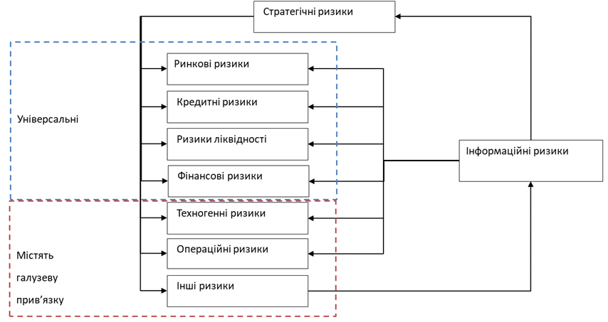
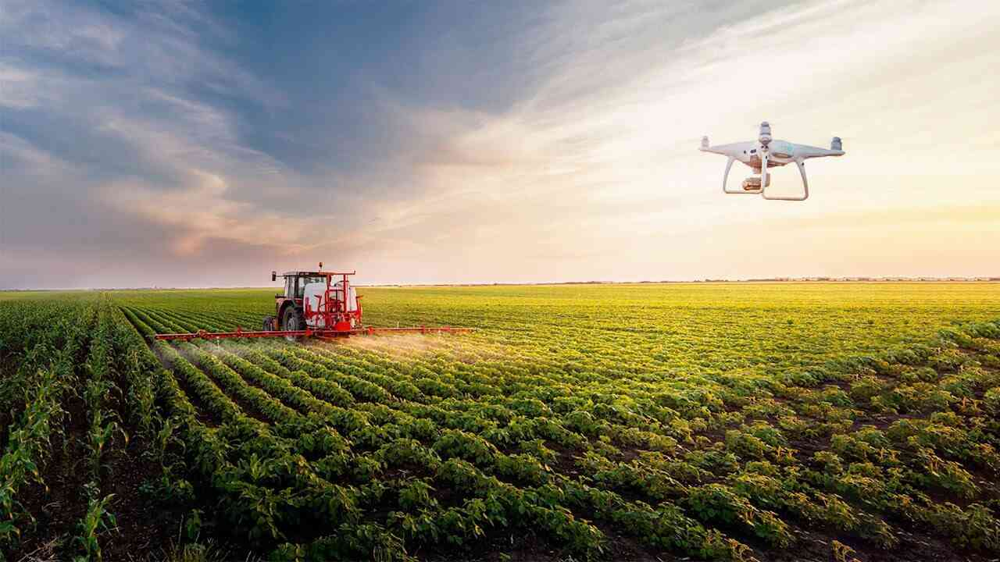

```{r}
#| label: setup
#| include: false

library(ggplot2)
library(dplyr)
library(knitr)
library(kableExtra)
library(DiagrammeR)

# Define colors
red_pink   = "#e64173"
turquoise  = "#20B2AA"
orange     = "#FFA500"
red        = "#fb6107"
blue       = "#181485"
navy       = "#150E37FF"
green      = "#8bb174"
yellow     = "#D8BD44"
purple     = "#6A5ACD"
slate      = "#314f4f"

```

# 1. НЕВИЗНАЧЕНІСТЬ

---

## ТРИ ПОМИЛКИ ЩОДО РИЗИКУ {.smaller}

::: {.columns}
::: {.column}


У 1996 році Kodak мала 140 000 співробітників і капіталізацію $28 млрд. Вони фактично винайшли цифрову фотокамеру. Чому через 16 років компанія збанкрутувала? Тому що вони зробили три ключові помилки щодо ризику...
:::
::: {.column .fragment}
- ❌ **Помилка 1**: Захист прибуткового бізнесу (плівка) важливіший за прийняття нового ризику (цифра).
- 🚫 **Помилка 2.** Спроба "виключити" ринок цифрової фотографії, ігноруючи його.
- ⚠️ **Помилка 3.** Віра в те, що "безпечний шлях" (продовження бізнесу з плівкою) є дійсно безпечним.
:::
:::

---

## ФАКТОРИ ФОРМУВАННЯ РИЗИКУ

- 🔮 **Фактор 1. Невизначеність події:** декілька альтернатив майбутнього.
- 📉 **Фактор 2. Втрати:** небажаний результат (падіння акцій, попиту).
- 👤 **Фактор 3. Небайдужість:** суб'єктивність впливу.

---

## РИЗИКИ ЗА ПОХОДЖЕННЯМ

- 🔥 **Чистий ризик:** можливість несподіваної чи незапланованої втрати (зміна податкового законодавства, сходження лавини, втрата майна внаслідок форс-мажорних обставин)
- 📈 **Спекулятивний ризик:** можливість не тільки зазнати втрат, а й придбати деякі вигоди з різних варіантів розвитку подій (операції купівлі-продажу акцій, валюти, різних фінансових інструментарії для подальшого перепродажу)

---

## РІЗНИЦЯ МІЖ РИЗИКОМ ТА НЕВИЗНАЧЕНІСТЮ

- **Невизначеність** - це іманентний стан природи, при якому достовірно невідомо, яка саме подія з усіх можливих може трапитись.
- **Ключові фактори:**
    - Неможливість передбачити майбутнє на 100%
    - Відсутність інформації щодо параметрів системи
    - Непередбачуваність учасників
- **Ризик** - це ймовірнісна категорія. Це наслідок невизначеності, який намагаємось оцінити.

---

## РІЗНИЦЯ МІЖ РИЗИКОМ ТА НЕВИЗНАЧЕНІСТЮ

- **Залишкова невизначеність:**
    - Інтервальна невизначеність
    - Дискретна невизначеність
    - Ймовірнісна невизначеність

---

## ПОМИЛКИ

```{r}
#| echo: false
#| message: false


df <- data.frame(
  " " = c("Приймається", "Відхиляється"),
  "Вірна гіпотеза" = c("Правильне рішення", "Помилка 1-го роду"),
  "Помилкова гіпотеза" = c("Помилка 2-го роду", "Правильне рішення")
)

kable(df, col.names = c(" ", "Вірна гіпотеза", "Помилкова гіпотеза")) |>
  kable_styling(bootstrap_options = c("striped", "hover"), full_width = F)
```

---

## 4 ГРУПИ РИЗИКІВ {.smaller}

```{r}
#| echo: false
#| message: false
df_risks <- data.frame(
  "Рівень" = c("0", "1", "2", "3"),
  "Назва ризику" = c("Глобальні ризики", "Стратегічні ризики: ризики, на які компанія йде свідомо, реалізуючи свою стратегію", "Традиційні ризики: які характерні в тією чи іншою мірою для всіх підприємств (комерційні, кредитні, операційні, ризики ліквідності)", "Галузеві ризики: які характерні тільки для підприємств конкретної галузі"),
  "Приклади" = c("Унікальні події, які призводять до великих втрат", "Попит на продукцію, Поява нових конкурнтів, Технологічні зміни", "Ринкові ризики, Кредитні ризики, Ризики ліквідності", "Металургійна галузь, Банківська справа, Страхові компанії")
)

kable(df_risks, col.names = c("Рівень", "Назва ризику", "Приклади")) |>
  kable_styling(bootstrap_options = c("striped", "hover"), full_width = F)
```

# 2. СТРАТЕГІЧНІ РИЗИКИ

---

## ОСНОВНІ ПОЛОЖЕННЯ

- **Стратегія** - те, що формується у головах у власника і керівників вищої ланки. Відсутність єдності у стратегічному фокусуванні топ-менеджерів, мабуть, найсерйозніший стратегічний ризик бізнесу
- Стратегічні ризики важно розпізнати та кількісно оцінити.

---

## ТРИ КОНЦЕПТУАЛЬНІ СТРАТЕГІЧНІ РИЗИКИ {.smaller}

1.  🧠 **Слабкість стратегічного менеджменту компанії:**
    -   Стратегічне мислення
    -   Стратегічне планування
    -   Ситуаційні рішення
2.  🤝 **Недостатня увага до корпоративної культури:**
    -   Цінності компанії
    -   Сприйняття часту та шляху
    -   Гармонія інтересів
    -   Відчуття відповідальності
3.  🎯 **Неефективна організація стратегічного процесу:** невміла організація, недосягнення цілей

---

## СТРАТЕГІЧНІ ГОРИЗОНТИ {.smaller}

1.  🔭 **Горизонт бачення (5-10+років):**
    -   Цінності компанії на ринку?
    -   Відносини з клієнтами та партнерами?
    -   Ключові фактори успіху бізнесу?
    -   Які знання/здібності/компетенції необхідні для досягнення цілей?
2.  🏗️ **Горизонт моделей (2-5 років):**
    -   Баланс розвитку бізнесу
    -   Формалізація процедур бізнес-моделювання
    -   Постійність грошових потоків для досягнення цілей
3.  🗓️ **Горизонт завдань (до 1 року):**
    -   Які завдання почати вирішувати зараз, щоб забезпечити другий рівень

---

> Якби керівництво Kodak у 1995 році чесно подивилося на горизонт бачення (5-10 років), що б вони побачили? Появу інтернету, зростання потужності комп'ютерів, бажання людей миттєво ділитися зображеннями. Усі складові їхньої майбутньої кризи були вже помітні.

> А які стратегічні горизонти у вашій компанії? Чи заглядаєте ви на 5-10 років уперед?

---

## ЕТАПИ СТРАТЕГІЧНОГО ПРОЦЕСУ {.tiny .scrollable}

```{mermaid}
%%| echo: false
%%| fig-align: center
graph TD
    subgraph "Підготовка"
        A["Виявлення інтересів"] --> B["Оцінка потенціалу"] --> C["Збір даних"];
    end
    subgraph "Сесія 1: Бачення"
        C --> D{Перша сесія};
        D --> E["Формування бачення"] --> F["Оцінка розривів"];
        F --> G([Меморандум]);
    end
    subgraph "Сесія 2: Цілі"
        G --> H{Друга сесія};
        H --> I["Постановка цілей"] --> J["Оцінка альтернатив"];
        J --> K([Стратегічні цілі]);
    end
    subgraph "Рада директорів: Рішення"
        K --> L{Рада директорів};
        L --> M["Вибір альтернативи"] --> N["Формування КРІ"];
    end
```

---

## СТРАТЕГІЧНИЙ ПРОФІЛЬ

Стратегічний профіль містить шість вимірів:

::: {.fragment}
1.  Основні типи процесів стратегії;
2.  Фундаментальні підходи у стратегічному менеджменті;
3.  Сратегічне позиціонування;
4.  Напрями пошуку конкурентних переваг;
5.  Стратегічна орієнтація підприємств;
6.  Підходи до вибору джерел фінансування бізнесу.
:::

---


## 1. ОСНОВНІ ТИПИ ПРОЦЕСІВ СТРАТЕГІЇ  {.tiny}


**а) Стратегія як планований процес (🗺️):**

- Свідомий і контрольований процес планування.
- Кроки прийняття рішень стандартизовані, процедури формалізовані.
- Впровадження після ретельної розробки й погоджень за календарем.
- Переваги: передбачуваність, узгодженість. Обмеження: повільність, інерційність.

**b) Підприємницький процес (🚀):**

- Напівсвідомий, візійний, інтуїтивний.
- Спирається на досвід і проникливість лідера; особисте бачення.
- Висока гнучкість і швидкість рішень.
- Переваги: проривні ідеї, швидкість. Ризики: залежність від однієї особи.

**c) Навчання через досвід (🔁):**

- Еволюційний, ітеративний процес формування стратегії.
- Курс задають внутрішні та зовнішні імпульси.
- Експерименти, зворотний зв’язок, постійні адаптації.
- Переваги: адаптивність. Ризики: розмитість фокусу, довший шлях до узгодженості.

---

## 2. ФУНДАМЕНТАЛЬНІ ПІДХОДИ У СТРАТЕГІЧНОМУ МЕНЕДЖМЕНТІ  {.smaller}

-   **динамічна конкурентна стратегія:** постійна зміни стратегій та стратегічних можливостей (не концентруватися на одній стратегії чи процесі).

-   **«стратегія блакитного океану»:** створення інноваційної цінності

```{r}
#| echo: false
#| message: false
library(knitr)
library(kableExtra)

ocean_strategy <- data.frame(
  "Стратегія 'червоного океану'" = c("Боротьба у існуючому ринковому просторі", "Перемога над конкурентами", "Експлуатування існуючого попиту"),
  "Стратегія 'блакитного океану'" = c("Створення вільного від конкуренції ринкового простору", "Можливість не боятися конкуренції", "Створення нового попиту та оволодіння ним")
)

kable(ocean_strategy) %>%
  kable_styling(bootstrap_options = c("bordered", "hover"), full_width = T)
```

---

## 3. СТРАТЕГІЧНЕ ПОЗИЦІОНУВАННЯ {.smaller}

::: {.columns}
::: {.column}
💸 Лідерство за витратами

- Суть: мінімальна собівартість при прийнятній якості
- Коли працює: стандартизований продукт, ефект масштабу
- Важелі: операційна ефективність, постачання, автоматизація

⭐ Диференціація

- Суть: унікальна цінність з ціновою премією
- Коли працює: важливі нефінансові атрибути (досвід, дизайн, сервіс)
- Важелі: бренд, R&D
:::
::: {.column}
🎯 Фокус (концентрація)

- Суть: вузький сегмент/ніша з глибокою експертизою
- Коли працює: нішеві потреби, недообслуговувані масовими гравцями
- Важелі: кастомізація, спеціалізовані канали/сервіс
:::
:::

---

## 4. НАПРЯМИ ПОШУКУ КОНКУРЕНТНИХ ПЕРЕВАГ {.tiny}

::: {.columns}
::: {.column}
### 🏭 Усередині підприємства
- Коли працює: стабільні/детерміновані ринки (напр., електроенергія)
- Джерела переваг:
  - Операційна ефективність, автоматизація
  - Масштаб і сила закупівель
  - Дані та аналітика процесів
  - Культура виконання, швидкість рішень
- Інструменти:
  - Лідерство за витратами, стандартизація
  - Вертикальна інтеграція
:::
::: {.column}
### 🌐 Поза підприємством
- Коли працює: ринки з вимогою «незвичайної» цінності (B2C/B2B2C)
- Джерела переваг:
  - Глибоке розуміння клієнта, сегментація
  - Бренд, сервіс, UX, екосистема
  - Партнерства/платформи, мережеві ефекти
  - R&D та інтелектуальна власність
- Інструменти:
  - Диференціація, дизайн‑мислення, сервісні моделі
  - Community/ambassadors
:::
:::

- Результат: або нижча собівартість за однакової цінності, або вища цінність за прийнятної ціни.

---

## 5. СТРАТЕГІЧНА ОРІЄНТАЦІЯ ПІДПРИЄМСТВ {.tiny}

::: {.columns}
::: {.column}
### 🧭 Стійке стратегічне бачення (vision‑driven)

- 📅 Горизонт планування 3–7 років
- 🌍 Аналіз макротенденцій, від яких залежить майбутнє
- 🧠 Сценарне мислення й робота з невизначеністю
- 🔮 Інфосистема, орієнтована на прогнозування
- 🏗️ Орієнтація на відданість, розвиток активів, вертикальну інтеграцію
- 🌟 Харизматичне «бачильницьке» лідерство
- 🧱 Централізована, жорстка структура «згори донизу»
- 👥 Культура виконання: готовність реалізовувати рішення
- ⚖️ Перевага завдяки ефекту масштабу
- 📣 Сильні ринкові сигнали через результати компанії
:::

::: {.column .fragment}
### 🔁 Орієнтація на можливості (адаптивна)

- 📆 Каденція планування: місяць/квартал/рік
- 🛰️ Фокус на поточні загрози та можливості
- 🧭 Сканування середовища й контроль змін
- ⏱️ Інфосистема, орієнтована на час і швидкість реакції
- 🪶 Гнучкість, адаптивність, швидка відповідь
- 🤝 Тактичне, діяльне лідерство
- 👤 Підприємницька культура
- 🧰 Перевага через розширення видів діяльності/портфеля
- 🎲 Дії компанії часто стають сюрпризом для конкурентів
:::
:::

---

## 6. ПІДХОДИ ЩОДО ВИБОРУ ДЖЕРЕЛ ФІНАНСУВАННЯ БІЗНЕСУ

-   **власні:** це гроші, внесені в момент створення компанії, плюс реінвестований прибуток

-   **позикові:** це гроші, позичені за допомогою різноманітних фінансових інструментів, від простих кредитів до випуску конвертованих облігацій.

---

## ВИЗНАЧЕННЯ СТРАТЕГІЧНОГО ПРОФІЛЮ КОМПАНІЇ {.smaller}

::: {.columns}
::: {.column}
**Крок 1. Стратегічна сесія (інструктаж)**

- Короткий вступ до ризик-менеджменту
- Огляд 6 вимірів стратегічного профілю
- Узгодження термінів і шкал оцінювання
:::
::: {.column .fragment}
**Крок 2. Анкетування топ-команди**

- У кожному вимірі учасник розподіляє 100% між альтернативами
- Оцінки незалежні; сума в межах блоку = 100%
- Приклад (джерела фінансування): 70% консервативна / 30% агресивна
- Опційно: «як є» vs «як має бути» (дві анкети)
:::
:::

---

## ВИЗНАЧЕННЯ СТРАТЕГІЧНОГО ПРОФІЛЮ КОМПАНІЇ: Крок 3 {.tiny}

**Крок 3. Оцінка узгодженості стратегічного фокусу**

::: {.columns}
::: {.column}
- 🎯 Мета: виміряти ступінь стратегічного розфокусування команди.
- 🧾 Дані: розподіли 100% по альтернативам у 6 вимірах для кожного учасника.
- 🧮 Метрики: σ (стандартне відхилення) та CV = σ/μ × 100% по кожній альтернативі/виміру.
- 🔎 Інтерпретація: нижчі σ/CV → вища узгодженість; вищі σ/CV → розфокусування і вищий стратегічний ризик.
- ⚖️ Орієнтири: CV < 15% — узгоджено; 15–30% — часткова єдність; >30% — розфокусування.
- ➕ Додатково: оцінити «як є» vs «як має бути» (розрив = ціль − факт).
- 📊 Вихід: heatmap/ранжування вимірів за CV для пріоритизації дій.

:::
::: {.column}
{fig-align="center" width="500"}
:::
:::

---

```{=html}
<iframe width="1600" height="1000" src="https://www.mentimeter.com/app/presentation/alq31jzqt6dw1xb7a1sy6rn9cavbgabi/view?question=vz3dwjn43feg" title="Results"></iframe>
```

---

## Приклад аналізу результатів анкетування

```{r}
#| echo: false
#| message: false
#| fig-align: center
library(ggplot2)
library(dplyr)
library(tidyr)

set.seed(42)
data <- data.frame(
  id = 1:15,
  planned = runif(15, 20, 50),
  entrepreneurial = runif(15, 20, 40)
) %>%
  mutate(learning = 100 - planned - entrepreneurial)

data_long <- gather(data, key = "strategy_type", value = "percentage", -id)

ggplot(data_long, aes(x = factor(id), y = percentage, fill = strategy_type)) +
  geom_bar(stat = "identity", position = "stack") +
  scale_fill_manual(values = c("planned" = "#4e79a7", "entrepreneurial" = "#f28e2b", "learning" = "#e15759"),
                    labels = c("Стратегія як планований процес", "Підприємницький тип стратегії", "Навчання шляхом набуття досвіду")) +
  labs(x = NULL, y = NULL, fill = NULL) +
  theme_minimal(base_size = 14) +
  scale_y_continuous(labels = function(x) paste0(x, "%")) +
  theme(legend.position = "bottom")

```

---

## КЛАСИФІКАЦІЯ СТРАТЕГІЧНИХ РИЗИКІВ {.smaller}

**Політичний ризик,** який пов'язаний із втратами, що виникають у результаті проведення державної політики: зміна політичного курсу та пріоритетних напрямів розвитку країни і, як наслідок, зміна податкового, трудового, господарського законодавства.

Розрізняють чотири групи політичних ризиків:

-   ризик втрат унаслідок націоналізації без рівноцінної компенсації;
-   ризик трансферту валют (неможливість конвертації однієї валюти в іншу)
-   ризик втрат через розрив контракту внаслідок дій влади країни, де знаходиться контрагент;
-   ризик втрат унаслідок воєнних дій та цивільних заворушень.

---

## Класи стратегічних ризиків {.smaller}

::: {.columns}
::: {.column}
1.  📉 **Скорочення прибутковості у галузі**
2.  💡 **Технологічні зміни**
3.  🏷️ **Ерозія та втрата бренду**
4.  🤺 **Поява унікального конкурента**
5.  ⏳ **Застій бізнесу**
6.  💥 **Провал нового проекту**
7.  🛍️ **Зміна переваг споживача**
:::
::: {.column .fragment}
На прикладі Kodak

1. 💡**Технологічні зміни:** Їхній власний винахід їх і вбив.
2. 🤺**Поява унікального конкурента:** Спочатку цифрові камери (Sony, Canon), потім смартфони (Apple).
3. ⏳**Застій бізнесу:** Вони занадто довго трималися за надприбуткову модель продажу плівки.
4. 🛍️**Зміна переваг споживача:** Люди захотіли миттєво ділитися фото, а не друкувати їх.
:::
:::


---

## ПРОЦЕДУРА УПРАВЛІННЯ СТРАТЕГІЧНИМИ РИЗИКАМИ

-   🔍 **1. Виявлення та оцінка** стратегічних ризиків компанії.
-   🗺️ **2. Складання картки** стратегічних ризиків.
-   🔢 **3. Кількісна оцінка** ризиків.
-   💡 **4. Виявлення потенційних переваг**, що супроводжують управління ризиками.
-   🛡️ **5. Розробка плану мінімізації** потенційних негативних факторів.
-   ⚖️ **6. Коригування стратегії** розподілу капіталу.

---

## ЕТАП 1. ВИЯВЛЕННЯ ТА ОЦІНКА СТРАТЕГІЧНИХ РИЗИКІВ {.smaller}

-   **Серйозність небезпеки.** "Яка частка вартості вашої компанії опиниться під загрозою у разі реалізації ризику?"

-   **Ймовірність реалізації.** Яка ймовірність події, з якою пов'язаний ризик?

-   **Терміни.** Чи можна визначити, коли реалізація ризику буде найімовірнішою?

-   **Зміна ймовірності.** Чи можна визначити, як ймовірність реалізації ризику змінюється з часом? Наприклад, практика показує, що небезпека різкого скорочення продажів збільшується до п'ятого року бізнес-циклу, а ризик провалу проекту зменшується у міру реалізації чергового етапу.

---

## КАРТА СТРАТЕГІЧНИХ РИЗИКІВ KODAK (~1995) {.smaller}

```{r}
#| label: risk-map-plot
#| echo: false
#| fig-align: center
#| fig-width: 8
#| fig-height: 6

library(ggplot2)
library(ggrepel)

risk_data <- data.frame(
  risk = c("Зміна технологій", "Втрата бренду", "Новий конкурент", "Провал R&D", "Зміна вподобань"),
  probability = c(0.30, 0.20, 0.50, 0.20, 0.20),
  impact = c(0.60, 0.80, 0.30, 0.40, 0.20),
  label = c("Зміна технологій\n(Digital)", "Втрата бренду\n(Kodak Moments)", "Агресивний\nконкурент (Fujifilm)", "Провал R&D\n(Advantix)", "Зміна вподобань\n(Соцмережі)")
)

ggplot(risk_data, aes(x = probability, y = impact, label = label)) +
  geom_point(aes(size = impact), color = blue, alpha = 0.6) +
  geom_text_repel(size = 4, box.padding = 0.5) +
  scale_x_continuous(labels = scales::percent, limits = c(0, 1), breaks = seq(0, 1, 0.25)) +
  scale_y_continuous(labels = scales::percent, limits = c(0, 1), breaks = seq(0, 1, 0.25)) +
  labs(title = "Карта стратегічних ризиків Kodak (гіпотетична, ~1995 р.)",
       x = "Ймовірність реалізації",
       y = "Вплив на вартість компанії") +
  theme_minimal(base_size = 15) +
  theme(legend.position = "none") +
  annotate("rect", xmin=0.5, xmax=1, ymin=0.5, ymax=1, alpha=0.1, fill="red") +
  annotate("text", x=0.75, y=0.75, label="Критична зона", color="red", size=5)
```

## ДЕТАЛІЗАЦІЯ РИЗИКІВ (ВХІДНІ ДАНІ ДЛЯ КАРТИ) {.smaller}

```{r}
#| echo: false
#| message: false
risk_map_data <- data.frame(
  "Джерело ризику" = c("Скорочення маржі", "Збільшення інвестицій у R&D", "Зміна технологій виробництва", "Закінчення терміну дії патентів", "Ерозія", "Загибель", "Відсутність зростання чи зниження доходу", "Зниження цін", "Нестача нових продуктів", "Провал R&D", "Провал ІТ-проекту", "Потужний суперник глобального масштабу", "Агресивно зростаючий конкурент", "Посилення впливу споживачів", "Зміна переваг споживачів"),
  "Відсоток доходу під загрозою" = c("60%", "20%", "60%", "20%", "40%", "80%", "40%", "30%", "20%", "40%", "20%", "40%", "30%", "20%", "20%"),
  "Ймовірність" = c("25%", "40%", "30%", "100%", "20%", "10%", "30%", "40%", "60%", "20%", "10%", "20%", "50%", "30%", "20%"),
  "Зміна ймовірності" = c("збільшується", "збільшується", "збільшується", "не змінюється", "збільшується", "не змінюється", "збільшується", "збільшується", "збільшується", "не змінюється", "не змінюється", "не змінюється", "не змінюється", "збільшується", "збільшується")
)

kable(risk_map_data) %>%
  kable_styling(bootstrap_options = "striped", full_width = F, font_size = 12) %>%
  pack_rows("1. Скорочення прибутку у галузі", 1, 2) %>%
  pack_rows("2. Технологічні зміни", 3, 4) %>%
  pack_rows("3. Втрата бренду", 5, 6) %>%
  pack_rows("4. Застій бізнесу", 7, 9) %>%
  pack_rows("5. Провал нового проекту", 10, 11) %>%
  pack_rows("6. Унікальний конкурент", 12, 13) %>%
  pack_rows("7. Клієнти", 14, 15)
```


---

## ЕТАП 3. КІЛЬКІСНА ОЦІНКА РИЗИКІВ {.smaller}

### Оцінка ризиків — структурований підхід

::: {.columns}
::: {.column}
- 🔎 Ключові параметри для оцінки:
  - 💸 Грошові потоки
  - 📈 Прибуток
  - 💰 Сума капіталу / інвестиції
  - 🏷️ Ринкова вартість (капіталізація)
  - 📊 Операційні метрики (маржа, оборот)
:::
::: {.column}
- 🧭 Процедура (кроки):
  1. 🔍 Кількісна оцінка впливу на кожен параметр (ймовірність × вплив)
  2. 🧮 Нормалізація та зіставлення (відсотки або грошові одиниці)
  3. ➕ Агрегація ризиків за напрямками/проєктами
  4. ⚖️ Інтеграція в рішення: розподіл капіталу, ціноутворення, передача ризику (страхування/хедж)
  5. 🔁 Моніторинг і регулярне оновлення оцінок
:::
:::

---

## ЕТАП 4. ВИЯВЛЕННЯ ПОТЕНЦІЙНИХ ВИГОД {.tiny}

Якщо компанія робить ставку на кілька технологій, вона формує «портфель опцій» і відкриває додаткові можливості для зростання. Корисно мати план виявлення й монетизації позитивних факторів, що супроводжують кожен ключовий ризик.

::: {.columns}
::: {.column}
- 🎯 Що вважати потенційними вигодами
  - 🚀 Прискорення виведення продуктів / інновації
  - 📚 Навчання та зниження невизначеності (learning-by-doing)
  - 🌍 Розширення ринків / сегментів
  - ⚙️ Зниження витрат / підвищення маржі
  - ⭐ Підсилення бренду / довіри
  - 🤝 Партнерства та доступ до ресурсів
  - 🏛️ Регуляторні можливості / преференції

- 🔎 Як ідентифікувати вигоди
  - 🔔 Тригери: що має статися, щоб можливість стала доступною
  - 📊 Провідні індикатори: метрики, що сигналізують «вікно можливості»
  - ⏱️ Вікно часу: скільки триває можливість і коли діяти
  - 🧩 Зв’язок з ризиком: яка «дзеркальна» вигода проти кожного ризику
:::
::: {.column}
- 🛠️ Як монетизувати
  - 🧪 Експерименти/MVP, пілоти/PoC
  - 🪜 Поетапні інвестиції (stage-gates)
  - 🧠 Патенти/IP, ліцензування
  - 🤝 Альянси/СП для швидкого масштабування

- 📏 Метрики ефекту
  - 📈 Очікувана вигода = ймовірність × розмір вигоди
  - ⏩ Time-to-Value, швидкість конверсії з пілотів у продукт
  - 💵 NPV/IRR/Payback, частка виручки/маржі від нових можливостей
:::
:::

---

## ЕТАП 5. РОЗРОБКА ПЛАНУ МІНІМІЗАЦІЇ НЕГАТИВНИХ ЧИННИКІВ {.tiny}

::: {.columns}
::: {.column}
- 👥 Команда на кожен серйозний ризик:
  - кросфункціональна; є відповідальний власник і спонсор із правом рішень.
- 🧩 Склад команди (приклад):
  - маркетинг/бренд • сервіс • операції • R&D/ІТ • юр/комплаєнс • фінанси/ризик.
- 🗺️ План дій спирається на етапи 1–4:
  - природа й джерела ризику • вартість під ризиком • ймовірність і тренд • горизонт і тригери.
- 🛡️ Стратегії мінімізації:
  - уникнення • зменшення (контролі/процеси/технології) • передача (страхування/хедж) • утримання/резерви.
:::
::: {.column}
- 📊 Керування виконанням:
  - KPI/OKR • дорожня карта з віхами • відповідальні й дедлайни • регулярні рев’ю • пороги ескалації.
- 📚 Артефакти:
  - картка ризику • план реагування і сценарії • бюджет та потреби в ресурсах.
- 🔊 Комунікації:
  - стендапи • звіти керівництву • єдина панель моніторингу (dashboard).
:::
:::

---

## ЕТАП 6. КОРИГУВАННЯ СТРАТЕГІЇ РОЗПОДІЛУ КАПІТАЛУ {.tiny}

::: {.columns}
::: {.column}
- 🎯 Принцип ціни капіталу:
  - Чим вищий ризик бізнес-напряму/проєкту, тим вищу вартість капіталу слід застосовувати в оцінці інвестицій.

- 🔁 Динамічний розподіл капіталу:
  - Реструктурувати інвестиційні плани в міру зміни профілю ризиків портфеля.
:::
::: {.column}
- 🛡️ Режим підвищеної невизначеності (що робити):
  - 📉 Зменшити боргове навантаження (deleverage).
  - 🤝 Використовувати СП/альянси для поділу CAPEX і ризиків.
  - 🪜 Перейти на поетапне фінансування (stage-gates).
  - 💧 Наростити ліквідні резерви/кеш-буфери.
  - ⏸️ Відкласти/зупинити низькопріоритетні та непрофільні ініціативи.
  - 📊 Підвищити hurdle rate для ризикових інвестицій; робити re-pricing проєктів.
:::
:::

# 3. КЛАСИФІКАЦІЯ РИЗИКІВ ТА ЇХ ХАРАКТЕРИСТИКА

> Ми детально поговорили про стратегічні ризики. А як щодо традиційних — ринкових, кредитних, операційних? **Ключове питання: в який момент традиційний ризик стає стратегічним?** 🚨

---

## ЗАГАЛЬНА КЛАСИФІКАЦІЯ РИЗИКІВ

{fig-alt="center"}

---

## 1. РИНКОВІ РИЗИКИ {.smaller}

Ймовірні втрати, які можуть виникнути через зміну кон'юнктури ринку.

Найбільше таким ризикам схильні товари, готова продукція, цінні папери, валютні резерви та інші, тому що їх ціна багато в чому залежить від ринкових цін.

```{mermaid}
%%| echo: false
graph TD
    A[Ринкові ризики]
    B[Цінові ризики<br>Вплив зміни ринкових цін<br>на товари]
    C[Ризик процентної ставки<br>Вплив змін ринкових<br>процентних ставок<br>на фінансове становище компанії]
    D[Валютні ризики<br>Вплив коливань валютних<br>курсів на фінансовий<br>результат та стійкість компанії]

    A -->| | B
    A -->| | C
    A -->| | D
```

---

## РИНКОВІ РИЗИКИ: Вимірювання {.smaller}

- 📏 **Вразливість (Sensitivity)**
  - Визначення: розмір втрат/зміни результату на 1 одиницю зміни чинника ризику.
  - Формула (ідея): ΔРезультат = β × ΔЧинник.
  - Одиниці: грн/₴; %/%; грн/бар.; тощо.
  - Приклад: при зростанні USD/₴ на +1 грн очікувані втрати = 150 тис. грн.

- 📊 **Value-at-Risk (VaR)**
  - Визначення: максимальні втрати за горизонт H з довірою α.
  - Параметри: H (горизонт), α (рівень довіри), метод (історичний | параметричний | Монте‑Карло).
  - Інтерпретація: з ймовірністю α втрати ≤ VaR; з ймовірністю (1−α) втрати можуть бути більшими.
  - Приклад: за планового прибутку 8 млн грн/міс: при α = 95% VaR прибутку = 1,5 млн грн ⇒ очікувано не нижче 6,5 млн грн.

---

## 2. КРЕДИТНИЙ РИЗИК {.smaller}

💳 Визначення: ймовірні втрати через відмову або нездатність контрагента виконати зобов’язання повністю/вчасно.

::: {.columns}
::: {.column}
- 🌍 Де виникає:
  - Комерційний кредит (дебіторська заборгованість, відстрочка платежу)
  - Кредити, гарантії, лізинг, факторинг
- 🔎 Драйвери ризику:
  - Погіршення макроумов/циклу
  - Концентрація на небагатьох клієнтах
  - Слабкий скоринг/оверрайд
  - Недостатні забезпечення/умови договорів
:::
::: {.column}
- 🧭 Стратегічний вимір:
  - Концентрація доходу за клієнтами/ринками
  - Ціноутворення та умови оплати як функція ризику
  - Стрес‑тести та сценарії, перегляд лімітів
:::
:::

🚨 Стратегічна загроза: коли 50% доходу залежить від одного клієнта з відстрочкою — це вже не просто кредитний ризик, а ризик виживання бізнесу.

---

## 3. РИЗИКИ ЛІКВІДНОСТІ {.smaller}

💧 Визначення: неможливість погасити зобов’язання повністю і в строк.

::: {.columns}
::: {.column}
- ⚠️ Наслідки:
  - Штрафи, пені
  - Погіршення ділової репутації
  - Ризик судових позовів / банкрутства

:::
::: {.column}
- 🔎 Причини:
  - Розрив грошових потоків (cash‑gap)
  - Надмірна дебіторська заборгованість
  - Відсутність доступу до кредитних ліній
  - Надлишкові запаси, низька оборотність
:::
:::

---

## 4. ФІНАНСОВИЙ РИЗИК {.smaller}

💳 Визначення: фінансовий ризик актуальний для позичальників (компаній із боргом).

::: {.columns}
::: {.column}
- 🧩 Джерела/прояви:
  - Немає доступу до позики/рефінансування в потрібний момент.
  - Нездатність сплачувати відсотки та погашати тіло боргу вчасно.
  - Жорсткі умови/ковенанти, що обмежують додаткове фінансування.
:::
::: {.column}
- ⚠️ Наслідки:
  - Дефолт/реструктуризація
  - Форсований продаж активів
  - Зростання вартості боргу та вимог кредиторів
  - Дефіцит ліквідності, зупинка операцій
:::
:::

---

## 5. ТЕХНОГЕННИЙ РИЗИК

⚙️ Визначення: ризик руйнування або зупинки виробничих/інфраструктурних потужностей через технічні відмови, пожежі, аварії, стихійні й техногенно‑природні події.

::: {.columns}
::: {.column}
- 🔗 Джерела/події:
  - Пожежі, вибухи, витоки
  - Відмова критичного обладнання та ІТ
  - Перебої енергопостачання, вода
  - Стихійні лиха
:::
::: {.column}
- 📉 Наслідки:
  - Втрата/пошкодження майна
  - Простій і зниження випуску
  - Штрафи, невиконання контрактів
  - Екозбитки та репутаційні втрати
:::
:::

---

## 6. ОПЕРАЦІЙНИЙ РИЗИК {.tiny}

⚙️ Операційний ризик — ймовірність збитків унаслідок неадекватних або помилкових внутрішніх процесів, дій працівників, збоїв систем чи зовнішніх подій.

::: {.columns}
::: {.column}
- Де виникає:
  - Процеси
  - Люди
  - Системи/ІТ
  - Зовнішні події

- Типові події:
  - Помилки обліку/дублі платежів
  - Внутрішнє/зовнішнє шахрайство
  - Збої ІТ/мережі, відмови постачальників
  - Пожежі/затоплення, перебої електропостачання
  - Розриви ланцюга постачання
:::
::: {.column}
- Наслідки:
  - 💸 Прямі збитки, втрачена виручка
  - ⏱️ Простій/затримки виконання
  - ⚖️ Штрафи, судові позови
  - 🏷️ Репутаційні втрати
:::
:::

> 🚨 Стратегічна загроза: збій критичної ІТ‑системи під час пікового попиту може не лише зупинити операції на день, а й підірвати довіру до бренду на роки (напр., масовий збій продажу авіаквитків перед святами).

---

## 8. ІНФОРМАЦІЙНІ РИЗИКИ {.smaller}

🔐 Інформаційні ризики — це ризики, пов’язані зі створенням, передачею, зберіганням і використанням даних в ІТ‑системах та каналах зв’язку.

::: {.columns}
::: {.column}
**🛑 Ключові загрози**

- 📤 Витік/несанкціонований доступ (інсайдери, зовнішні атаки)
- 🛜 Технічні збої мережі/каналів (відмова провайдера, DoS)
- ⚙️ Недоліки ІС/ПО (вразливості, помилки конфігурації)
- 🧑‍💻 Соціальна інженерія/фішинг
- 📦 Втрата/пошкодження носіїв і бекапів
- ⚖️ Невідповідність вимогам (законодавство, політики)

:::
::: {.column}
**📉 Наслідки**

- 💸 Прямі збитки та простій операцій
- 🏷️ Репутаційні втрати/відтік клієнтів
- ⚖️ Штрафи, судові позови, ризик ліцензій
- 🧠 Компрометація ІР/комерційної таємниці
:::
:::

---

## 9. ІНШІ РИЗИКИ {.tiny}

::: {.columns}
::: {.column}
- 🏷️ **Репутаційний ризик** — втрати через негативне сприйняття бренду
  - 🔔 Тригери: витік даних, сервісні збої, PR‑кризи
  - 📉 Наслідки: відтік клієнтів, зростання вартості капіталу, штрафи

- 🧠 **Ризик втрати інтелектуального ресурсу** — втрата знань, ключових людей та ІР
  - 👥 Плинність кадрів, вигорання, дефіцит талантів
  - 🔐 Втрата ноу‑хау, інциденти з даними
:::
::: {.column}
- ⚖️ **Комплаєнс** — порушення законодавчих норм або правил етики
  - 📜 Порушення законів, регуляторних вимог і нормативів
  - 🤝 Порушення принципів соціальної відповідальності
  - 🌿 Екологічні ризики, негативний вплив на довкілля
  - 🏥 Ризики для здоров’я та безпеки на робочому місці
  - 🧮 Корупція та шахрайство
  - 🔄 Процесні порушення, що завдають шкоди контрагентам
:::
:::


---

## ПРИКЛАДИ РИЗИКІВ РІЗНИХ ГАЛУЗЕЙ: Агробізнес {.smaller}

::: {.columns}
::: {.column width="60%"}
- **Ключовий стратегічний ризик:**
  - 🌪️ **Зміна клімату та екстремальні погодні умови (посухи, повені)**.
- **Стратегічна відповідь**:
  - 🌱 **Інвестиції в AgriTech**: точне землеробство, дрони, аналіз даних.
  + **Диверсифікація культур**: вирощування посухостійких сортів.
  + **Розвиток інфраструктури**: системи зрошення, зберігання.
:::
::: {.column width="40%"}

:::
:::

---

## ПРИКЛАДИ РИЗИКІВ РІЗНИХ ГАЛУЗЕЙ: Страховий бізнес {.tiny}

::: {.columns}
::: {.column width="60%"}
-   **Ключовий стратегічний ризик:**
    -   📲**Цифрова трансформація та InsurTech-стартапи.** Нові гравці виходять на ринок з повністю цифровими продуктами, використовуючи AI для оцінки ризиків та мобільні додатки для миттєвого обслуговування. Це створює загрозу для традиційних бізнес-моделей з офісами та агентами.

-   **Стратегічна відповідь:**
    -   🚀**Інвестиції в технології:** Розробка власних цифрових платформ та мобільних додатків для клієнтів.
    -   **Використання Big Data та AI:** Персоналізація тарифів, автоматизація андеррайтингу та пришвидшення виплат за страховими випадками.
    -   **Партнерство або поглинання:** Співпраця з InsurTech-стартапами для швидкого впровадження інновацій.
    -   **Нові продукти:** Створення гнучких продуктів, таких як страхування "за вимогою" (pay-per-use) або кібер-страхування.
:::

::: {.column width="40%"}

:::
:::

---

## ПРИКЛАДИ РИЗИКІВ РІЗНИХ ГАЛУЗЕЙ: Банківський бізнес {.smaller}

::: {.columns}
::: {.column width="60%"}
- **Ключовий стратегічний ризик**:
  - 🤖**Конкуренція з FinTech-стартапами та необанками.** Вони пропонують кращий клієнтський досвід, нижчі комісії та швидкі інновації, забираючи найприбутковіших клієнтів у традиційних банків.
- **Стратегічна відповідь**:
  - 💡**Цифрова трансформація:** Покращення мобільних додатків та онлайн-сервісів.
  - **Розвиток екосистем:** Створення сервісів за межами банкінгу (купівля квитків, мобільний зв'язок).
  - **Партнерство або поглинання FinTech-стартапів.**
:::
::: {.column width="40%"}

:::
:::

# Дякую за увагу! {.unnumbered .unlisted background-iframe=".01_files/libs/colored-particles/index.html"}

<br> <br>

 imiroshnychenko\@kse.org.ua

 [Data Mirosh](https://t.me/araprof)

 [\@ihormiroshnychenko](https://www.linkedin.com/in/ihormiroshnychenko/)

 [\@aranaur](https://github.com/Aranaur)

 [aranaur.rbind.io](https://aranaur.rbind.io)
