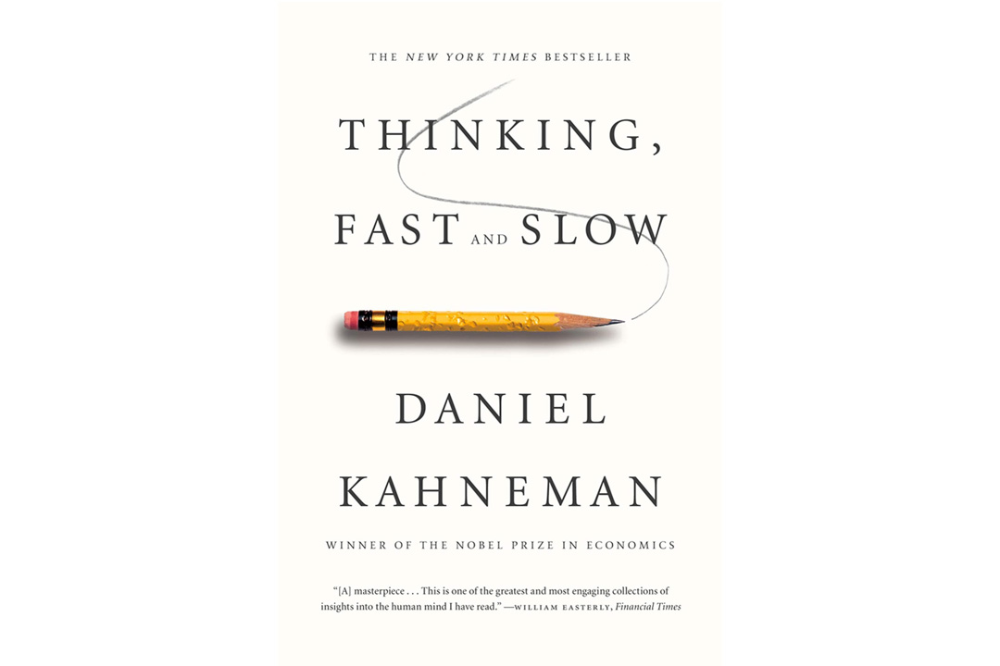

```{r}
#| eval: false
#| include: false

# Activate new profile
renv::activate(profile = "iib-risk")

# Install the needed packages
renv::install(
  "ggplot2",
  "dplyr",
  "knitr",
  "kableExtra",
  "rmarkdown",
  'knitr'
)

# Snapshot the packages
renv::snapshot(
  packages = c(  
    "ggplot2",
  "dplyr",
  "knitr",
  "kableExtra")
  )
```

```{r}
#| include: false
lock_path <- paste(here::here(), "renv/profiles/iib-risk/renv.lock", sep = "/")
renv::use(lockfile = lock_path)
```

```{r}
#| label: setup
#| include: false

library(ggplot2)
library(dplyr)
library(knitr)
library(kableExtra)

# Define colors
red_pink   = "#e64173"
turquoise  = "#20B2AA"
orange     = "#FFA500"
red        = "#fb6107"
blue       = "#181485"
navy       = "#150E37FF"
green      = "#8bb174"
yellow     = "#D8BD44"
purple     = "#6A5ACD"
slate      = "#314f4f"
```

# Ймовірність як інструмент

---

## ВИПАДКОВІ ПОДІЇ

🎲 **Випадкова подія** — це подія, яка в результаті експерименту може відбутися, а може й не відбутися.

- **Приклади в бізнесі:**
  - 📉 Отримання збитку компанією протягом місяця.
  - 💳 Відмова клієнта сплатити за відвантажений товар.
  - 🚚 Відмова постачальника виконати зобов'язання.

- **Позначення:**
  - Події позначаються великими літерами: $A, B, C$.
  - Ймовірність події $A$ позначається як $P(A)$.

---

## ВИЗНАЧЕННЯ ЙМОВІРНОСТІ

**Ймовірність** — це числовий показник можливості настання події, що вимірюється в діапазоні від 0 до 1.

-   $0 \le P(A) \le 1$

**Класичне визначення:**
Якщо існує $n$ рівноможливих елементарних подій, з яких $m_A$ сприяють настанню події $A$, то:

$$ P(A) = \frac{m_A}{n} $$

---

## ПРИКЛАД: ДВА ГРАЛЬНІ КУБИКИ {.tiny}

**Завдання:** Знайти ймовірність того, що при киданні двох кубиків сума очок буде **не більше 6** (тобто $\le 6$).

::: {.columns}
::: {.column width="60%"}
- **Загальна кількість результатів (n):**
  - Кожен кубик має 6 граней. Загальна кількість комбінацій: $6 \times 6 = 36$.
- **Кількість сприятливих результатів ($m_A$):**
  - Рахуємо комбінації, де сума $\le 6$:
    - **Сума 2:** (1,1) - 1
    - **Сума 3:** (1,2), (2,1) - 2
    - **Сума 4:** (1,3), (2,2), (3,1) - 3
    - **Сума 5:** (1,4), (2,3), (3,2), (4,1) - 4
    - **Сума 6:** (1,5), (2,4), (3,3), (4,2), (5,1) - 5
  - Всього: $1+2+3+4+5 = 15$.
:::
::: {.column width="40%"}
```{r}
#| label: dice-table
#| echo: false
#| fig-align: center
dice_data <- expand.grid(d1 = 1:6, d2 = 1:6)
dice_data$sum <- dice_data$d1 + dice_data$d2
dice_data$is_favorable <- ifelse(dice_data$sum <= 6, "Yes", "No")

ggplot(dice_data, aes(x = d1, y = d2, fill = is_favorable)) +
  geom_tile(color = "white", lwd = 1.5) +
  geom_text(aes(label = sum), color = "black", size = 6) +
  scale_fill_manual(values = c("Yes" = green, "No" = "grey90"), name = "Сума <= 6") +
  labs(x = "Кубик 1", y = "Кубик 2", title = "Карта сум двох кубиків") +
  theme_minimal(base_size = 14) +
  theme(legend.position = "bottom")
```
:::
:::

- **Ймовірність:** $P(A) = \frac{15}{36} = \frac{5}{12} \approx 0.417$

---

## Суб'єктивне визначення ймовірності

Коли не має експериментальних даних. 

Ось приклади суб'єктивних ймовірностей:

- експерт з інвестицій вважає, що ймовірність отримання прибутку протягом перших двох років інвестиційного проекту становить 6%;
- прогноз менеджера з маркетингу: ймовірність продажу 1000 одиниць товару у перший місяць після його появи на ринку дорівнює 30 %.


## АЛГЕБРА ПОДІЙ {.tiny}

```{mermaid}
%%| fig-align: center

graph TD
    subgraph "Операції з подіями"
        A["Сума (об'єднання) A ∪ B<br>Відбулася хоча б одна<br>з подій"]
        B["Добуток (перетин) A ∩ B<br>Відбулися обидві події<br>одночасно"]
    end
```

```{r}
#| label: fig-algebra-events
#| echo: false

# Load the required libraries
library(ggplot2)
library(sf)
library(ggpattern)
library(patchwork)

# --- 1. Define the Geometric Shapes (Circles) ---

# Define the center points for two sets, A and B
center_a <- st_point(c(1.0, 1.0))
center_b <- st_point(c(2.5, 1.0))

# Create circles by buffering the center points with a given radius.
# `nQuadSegs` increases the number of segments to make the circle smoother.
circle_a <- st_buffer(center_a, dist = 1.0, nQuadSegs = 50)
circle_b <- st_buffer(center_b, dist = 1.0, nQuadSegs = 50)

# Combine the two circles into a single 'sf' object for easier plotting
shapes_df <- st_as_sf(data.frame(id = c("A", "B")), geom = st_sfc(circle_a, circle_b))


# --- 2. Create the Union Plot (Left Side) ---

# This plot shows A + B (A ∪ B), where both sets are shaded.
plot_union <- ggplot() +
  # Use geom_sf_pattern to draw the circles with a hatched fill
  geom_sf_pattern(
    data = shapes_df,
    aes(geometry = geom),
    pattern = 'stripe',
    pattern_fill = '#1E8449',
    pattern_colour = '#1E8449',
    pattern_density = 0.4,
    pattern_spacing = 0.05,
    fill = '#D5F5E3',
    color = '#2980B9',
    linewidth = 1.2
  ) +
  # Add labels for sets A and B
  annotate("text", x = 1.0, y = 1.0, label = "A", size = 7, fontface = "bold") +
  annotate("text", x = 2.5, y = 1.0, label = "B", size = 7, fontface = "bold") +
  # Add the "A + B" label and pointers
  annotate("text", x = 1.75, y = 2.4, label = "A + B", size = 6) +
  annotate("segment", x = 1.4, y = 2.3, xend = 0.9, yend = 1.8) +
  annotate("segment", x = 2.1, y = 2.3, xend = 2.6, yend = 1.8) +
  # Use a coordinate system that fits the shapes without distortion
  coord_sf(xlim = c(-0.2, 3.7), ylim = c(-0.2, 2.7), expand = FALSE) +
  # Use a minimal theme
  theme_void() +
  theme(plot.background = element_rect(fill = "#F4F6F7", color = NA))


# --- 3. Create the Intersection Plot (Right Side) ---

# This plot shows AB (A ∩ B), where only the overlapping area is shaded.

# First, calculate the intersection polygon using a geometric operation from 'sf'
intersection_poly <- st_intersection(circle_a, circle_b)

# Find the center of the intersection to help position the label pointer
intersection_centroid <- st_centroid(intersection_poly)
intersection_coords <- st_coordinates(intersection_centroid)

plot_intersection <- ggplot() +
  # Draw the outlines of the full circles without any fill
  geom_sf(data = shapes_df, aes(geometry = geom), fill = NA, color = '#2980B9', linewidth = 1.2) +
  # Overlay the hatched intersection area
  geom_sf_pattern(
    data = intersection_poly,
    aes(geometry = geometry),
    pattern = 'stripe',
    pattern_fill = '#1E8449',
    pattern_colour = '#1E8449',
    pattern_density = 0.4,
    pattern_spacing = 0.05,
    fill = '#D5F5E3',
    color = '#2980B9',
    linewidth = 1.2
  ) +
  # Add labels for sets A and B
  annotate("text", x = 1.0, y = 1.0, label = "A", size = 7, fontface = "bold") +
  annotate("text", x = 2.5, y = 1.0, label = "B", size = 7, fontface = "bold") +
  # Add the "AB" label and an arrow pointing to the intersection
  annotate("text", x = 1.75, y = 2.0, label = "AB", size = 6) +
  annotate("segment",
           x = 1.75, y = 1.9,
           xend = intersection_coords[1], yend = intersection_coords[2] + 0.05,
           arrow = arrow(length = unit(0.25, "cm"))) +
  # Adjust coordinates and theme to match the first plot
  coord_sf(xlim = c(-0.2, 3.7), ylim = c(-0.2, 2.7), expand = FALSE) +
  theme_void() +
  theme(plot.background = element_rect(fill = "#F4F6F7", color = NA))


# --- 4. Combine the Two Plots Side-by-Side ---

# Use the 'patchwork' library to arrange the plots
final_plot <- plot_union + plot_intersection

# Display the final combined plot
final_plot
```


::: {.columns}
::: {.column}
**Приклад з кубиками:**

- Подія **A**: сума очок $\{4 \le \text{сума} \le 8\}$
- Подія **B**: сума очок $\{6 \le \text{сума} \le 10\}$

- **Сума (A ∪ B):** $\{4 \le \text{сума} \le 10\}$
- **Перетин (A ∩ B):** $\{6 \le \text{сума} \le 8\}$
:::
::: {.column}
**Несумісні події**

- Поява однієї виключає появу іншої ($A \cap B = \emptyset$).
- *Приклад:* "випав орел" і "випала решка" за одне кидання.

**Протилежна подія ($\bar{A}$)**

- Подія, яка полягає в тому, що $A$ не відбулася.
- $P(\bar{A}) = 1 - P(A)$
:::
:::

---

## ОСНОВНІ ФОРМУЛИ ЙМОВІРНОСТЕЙ {.smaller}

- **Додавання ймовірностей (для несумісних подій):**
  - $P(A \cup B) = P(A) + P(B)$

- **Додавання ймовірностей (для сумісних подій):**
  - $P(A \cup B) = P(A) + P(B) - P(A \cap B)$

- **Множення ймовірностей (для незалежних подій):**
  - $P(A \cap B) = P(A) \times P(B)$

- **Множення ймовірностей (для залежних подій):**
  - $P(A \cap B) = P(A) \times P(B|A)$, де $P(B|A)$ — умовна ймовірність події B за умови, що A вже відбулася.

---

## ФОРМУЛА ПОВНОЇ ЙМОВІРНОСТІ {.smaller}

🧠 **Ідея:** Дозволяє знайти ймовірність події $A$, яка може відбутися разом з однією з кількох несумісних "гіпотез" ($H_1, H_2, ..., H_n$), що утворюють повну групу.

$$ P(A) = P(H_1)P(A|H_1) + P(H_2)P(A|H_2) + \dots + P(H_n)P(A|H_n) $$
$$ P(A) = \sum_{i=1}^{n} P(H_i)P(A|H_i) $$

**Приклад:** Компанія купує комплектуючі у 3 постачальників. Треба знайти загальну ймовірність отримати бракований виріб.

- $H_1, H_2, H_3$ — гіпотези "виріб від постачальника 1, 2, 3".
- $A$ — подія "виріб виявився бракованим".

---

## ТЕОРЕМА БАЙЄСА: ОНОВЛЕННЯ ПЕРЕКОНАНЬ {.smaller}

💡 **Суть:** Дозволяє **переоцінити** ймовірність гіпотези ($H_k$) **після того**, як сталася подія $A$.

$$ P(H_k|A) = \frac{P(H_k) \times P(A|H_k)}{P(A)} $$

- $P(H_k)$ — **апріорна** ймовірність (досвід, початкова оцінка).
- $P(A|H_k)$ — **правдоподібність** (ймовірність спостерігати $A$, якщо гіпотеза $H_k$ вірна).
- $P(H_k|A)$ — **апостеріорна** ймовірність (оновлена оцінка після отримання нових даних).

--- 

## ТЕОРЕМА БАЙЄСА: SS Central America

{fig-alt="center"}

У 1988 році Томмі Томпсон використав Байєсівський пошук для знаходження затонулого у 1857 році корабля "SS Central America", який перевозив тонни золота. Він оновлював карту ймовірностей знаходження скарбу на основі невдалих спроб.

---

## ТЕОРЕМА БАЙЄСА: Бібліотекар чи Фермер? {.smaller}

::: {.columns}
::: {.column}
У нас є опис людини: боязкий та сором’язливий, він мало контактує з людьми та зовнішнім середовищем, він цінує порядок та приділяє багато уваги дрібницям.
Чим займається ця людина? 

> Він бібліотекар чи фермер?
:::
::: {.column}

:::
:::

---

## ТЕОРЕМА БАЙЄСА: Бібліотекар чи Фермер? {.smaller}

**Приклад:**

1. Співвідношення бібліотекарів до фермерів у світі за останніми оцінками 1 до 60. Але візьмемо 1 до 20, для прикладу.
2. Сформуємо репрезентативну вибірку: 10 бібліотекарів та 200 фермерів.
3. Припускаємо, що 40% (4 людини) бібліотекарів та 10% (20 людей) фермерів підходять під опис. 
4. Тоді ймовірність (апостеріорна):

$$
P(бібліотекар | опис) = 4 / (4 + 20) = 4 / 24 = 1 / 6 \approx 16.7\% \\
P(фермер | опис) = 20 / (4 + 20) = 20 / 24 = 5 / 6 \approx 83.3\%
$$


## ПРИКЛАД: ТЕОРЕМА БАЙЄСА {.tiny}

**Завдання:** На трьох лініях виготовляються мікросхеми. Відома продуктивність кожної лінії та ризик браку. Ви навмання взяли мікросхему, і вона виявилася бракованою. Яка ймовірність, що її виготовила **перша** лінія?

::: {.columns}
::: {.column width="40%"}
**Дані:**
```{r}
#| label: bayes-table
#| echo: false
bayes_df <- data.frame(
  "Номер лінії" = c(1, 2, 3, "**Всього**"),
  "Кількість" = c(400, 250, 350, 1000),
  "Ризик браку" = c("5%", "6%", "4%", "")
)
kable(bayes_df, col.names = c("Номер лінії", "Кількість, шт.", "Ризик браку")) |>
  kable_styling(bootstrap_options = c("striped", "hover"), full_width = T)
```
- **Подія A:** мікросхема бракована.
- **Гіпотези $H_1, H_2, H_3$**: мікросхема з лінії 1, 2, 3.
:::
::: {.column width="60%"}
**Крок 1: Апріорні ймовірності (досвід)**

- $P(H_1) = 400/1000 = 0.4$
- $P(H_2) = 250/1000 = 0.25$
- $P(H_3) = 350/1000 = 0.35$

**Крок 2: Повна ймовірність браку P(A)**

- $P(A) = P(H_1)P(A|H_1) + P(H_2)P(A|H_2) + P(H_3)P(A|H_3)$
- $P(A) = (0.4 \times 0.05) + (0.25 \times 0.06) + (0.35 \times 0.04)$
- $P(A) = 0.036 + 0.015 + 0.014 = 0.049$ (4.9%)
:::
:::

# Випадкові величини

---

## ТИПИ ВИПАДКОВИХ ВЕЛИЧИН

**Випадкова величина (ВВ)** — це величина, яка в результаті експерименту набуває певного числового значення.

::: {.columns}
::: {.column}
### 🔢 Дискретна ВВ (ДВВ)
Приймає скінченну або зліченну кількість значень.

- **Приклади:**
  - Кількість збиткових продуктів у портфелі.
  - Сума очок на кубиках.
  - Кількість відмов обладнання за місяць.

- **Задається:** Таблицею розподілу.
```
  X | x1 | x2 | ...
 ---|----|----|----
  P | p1 | p2 | ...
```
- **Властивість:** $\sum p_k = 1$
:::
::: {.column}
### 📈 Неперервна ВВ (НВВ)
Приймає будь-яке значення з певного інтервалу.

- **Приклади:**
  - Величина прибутку за квартал.
  - NPV інвестиційного проекту.
  - Час виконання задачі.

- **Задається:**
  - Функцією розподілу $F(x)$.
  - Щільністю розподілу $f(x)$.
:::
:::

---

## РОЗПОДІЛИ ВИПАДКОВИХ ВЕЛИЧИН

::: {.columns}
::: {.column}
### Рівномірний розподіл
Всі значення в інтервалі `[a, b]` є однаково ймовірними.
- **Використання:** Моделювання ситуацій з повною невизначеністю в межах діапазону.
- **Приклад:** Продажі за місяць очікуються в діапазоні від 2.5 до 3 млн грн. Яка ймовірність, що вони будуть вищими за 2.8 млн?

```{r}
#| label: uniform-dist
#| echo: false
#| fig-align: center
ggplot(data.frame(x = c(2, 4)), aes(x)) +
  stat_function(fun = dunif, args = list(min = 2.5, max = 3), geom = "area", fill = blue, alpha = 0.5) +
  labs(title = "Щільність рівномірного розподілу", x = "Продажі, млн грн", y = "f(x)") +
  theme_minimal(base_size = 14) +
  xlim(2, 4)
```
:::
::: {.column}
### Нормальний (Гауссів) розподіл
Найважливіший розподіл у статистиці. Описує безліч природних та економічних процесів.
- **Характеристики:** Симетричний, форма дзвону, визначається середнім ($\mu$) та стандартним відхиленням ($\sigma$).
- **Приклад:** Очікуваний дохід компанії — 6 млн дол. ($\mu=6$) зі стандартним відхиленням 0.6 млн ($\sigma=0.6$). Яка ймовірність отримати дохід нижче 5.5 млн?

```{r}
#| label: normal-dist
#| echo: false
#| fig-align: center
ggplot(data.frame(x = c(4, 8)), aes(x)) +
  stat_function(fun = dnorm, args = list(mean = 6, sd = 0.6), geom = "area", fill = turquoise, alpha = 0.7) +
  labs(title = "Щільність нормального розподілу", x = "Дохід, млн дол.", y = "f(x)") +
  theme_minimal(base_size = 14)
```
:::
:::

# 3. Числові характеристики

---

## МАТЕМАТИЧНЕ СПОДІВАННЯ (M(X) або E(X))

**Математичне сподівання (МС)** — це середньозважене значення всіх можливих значень випадкової величини. Це центр, навколо якого групуються значення.

-   **Для ДВВ:** $M(X) = \sum x_i p_i$

**Приклад: Лотерея**
- Випущено 100,000 квитків по 1 грн.
- Таблиця виграшів:
```{r}
#| label: lottery-table
#| echo: false
lottery_df <- data.frame(
  xi = c(5000, 1000, 100, 50, 10, 0),
  кількість = c(2, 8, 170, 350, 750, 98720)
)
lottery_df$pi <- lottery_df$кількість / sum(lottery_df$кількість)

kable(lottery_df[,c("xi", "pi")], col.names = c("Виграш (xi), грн", "Ймовірність (pi)"), digits = 5) |>
  kable_styling(bootstrap_options = "striped", full_width = FALSE)
```
- **Очікуваний виграш на 1 квиток:**
  - $M(X) = (5000 \times 0.00002) + (1000 \times 0.00008) + \dots + (0 \times 0.9872) = 0.6$ грн.
- **Очікуваний прибуток організатора:**
  - $1.00 \text{ грн (ціна)} - 0.60 \text{ грн (очікуваний виграш)} = 0.40$ грн/квиток.

---

## МІРИ ВІДХИЛЕННЯ: ДИСПЕРСІЯ ТА СТАНДАРТНЕ ВІДХИЛЕННЯ

**Дисперсія $D(X)$ або $Var(X)$** — середнє квадратичне відхилення значень ВВ від її математичного сподівання. Характеризує **розкид** значень.
- $D(X) = \sigma^2 = M[(X - M(X))^2]$

**Середнє квадратичне (стандартне) відхилення $\sigma(X)$ або $SD(X)$** — корінь з дисперсії. Має ту саму розмірність, що й сама ВВ, тому легше інтерпретується.
- $\sigma(X) = \sqrt{D(X)}$

**Властивість (для незалежних ВВ):** Дисперсія суми/різниці дорівнює сумі дисперсій.
- $D(X \pm Y) = D(X) + D(Y)$

---

## КОРЕЛЯЦІЯ ТА КОЕФІЦІЄНТ ВАРІАЦІЇ

::: {.columns}
::: {.column}
### 🔗 Кореляція ($\rho_{xy}$)
Показує **силу та напрям лінійного зв'язку** між двома випадковими величинами.
- $\rho \in [-1, 1]$
- **$\rho > 0$:** позитивна кореляція (зріст X пов'язаний зі зростом Y). *Приклад: доходи та витрати на рекламу.*
- **$\rho < 0$:** негативна кореляція (зріст X пов'язаний зі спадом Y). *Приклад: ціна товару та обсяг продажів.*
- **$\rho = 0$:** відсутність лінійного зв'язку.

**Важливо:** Кореляція впливає на дисперсію суми!
- $D(X \pm Y) = D(X) + D(Y) \pm 2\rho_{xy}\sigma_x\sigma_y$
:::
::: {.column}
### 📊 Коефіцієнт варіації (CV)
Відносний показник розкиду, що дозволяє порівнювати ризикованість активів з різними масштабами.
$$ CV = \frac{\sigma}{\mu} $$
- **Інтерпретація:** показує, який відсоток від середнього становить стандартне відхилення.
- **Застосування:** Порівняння ризику двох інвестиційних проектів.
  - Проект А: $\mu_A = 100, \sigma_A = 20 \implies CV_A = 20\%$
  - Проект Б: $\mu_B = 500, \sigma_B = 50 \implies CV_B = 10\%$
  - **Висновок:** Проект А є відносно більш ризикованим.
:::
:::

---

## ПРИКЛАД: ОЦІНКА РИЗИКУ ОПЕРАЦІЙНОГО ПРИБУТКУ

**Завдання:** Компанія має доходи (X) та витрати (Y). Потрібно оцінити ризик отримання операційного прибутку (Z = X - Y) нижче 0.5 млн дол.

**Дані:**
- Доходи (X): $M(X) = 4$ млн, $\sigma_X = 0.4$ млн.
- Витрати (Y): $M(Y) = 3$ млн, $\sigma_Y = 0.3$ млн.
- Коефіцієнт кореляції $\rho_{xy} = 0.4$.

**Рішення:**
1.  **Математичне сподівання прибутку Z:**
    -   $M(Z) = M(X) - M(Y) = 4 - 3 = 1$ млн.
2.  **Дисперсія прибутку Z (з урахуванням кореляції):**
    -   $D(Z) = D(X) + D(Y) - 2\rho_{xy}\sigma_x\sigma_y$
    -   $D(Z) = (0.4)^2 + (0.3)^2 - 2(0.4)(0.4)(0.3) = 0.16 + 0.09 - 0.096 = 0.154$
3.  **Стандартне відхилення прибутку Z:**
    -   $\sigma_Z = \sqrt{0.154} \approx 0.39$ млн.
4.  **Оцінка ризику (ймовірність P(Z < 0.5)):**
    -   Використовуємо функцію нормального розподілу (наприклад, в Excel):
    -   `=НОРМ.РАСП(0.5; 1; 0.39; 1)`
    -   Результат: $\approx 10.1\%$

**Висновок:** Ймовірність того, що операційний прибуток буде менше 0.5 млн, становить близько 10%.

# 4. Статистичний аналіз

---

## СТАТИСТИЧНЕ ОЦІНЮВАННЯ

Коли ми не знаємо теоретичних розподілів, ми можемо оцінити числові характеристики ризику на основі **історичних даних (вибірки)**.

**Приклад:** Аналіз доходів (X) та витрат (Y) компанії XGG за 20 періодів.
- Розрахунок в Excel/R/Python:
  - `СРЗНАЧ` (`AVERAGE`) для оцінки математичного сподівання.
  - `СТАНДОТКЛОН.В` (`STDEV.S`) для оцінки стандартного відхилення.
  - `КОРРЕЛ` (`CORREL`) для оцінки коефіцієнта кореляції.

- **Результати з прикладу:**
  - $\bar{x} = 7.15, s_x = 0.80$
  - $\bar{y} = 5.38, s_y = 0.39$
  - $r_{xy} = 0.06$

**Інтерпретація:** Дохід має значно більший розкид (волатильність), ніж витрати. Це може бути пов'язано з коливаннями цін на готову продукцію.

---

## ВІЗУАЛІЗАЦІЯ РОЗПОДІЛУ: ГІСТОГРАМА

**Гістограма** — це графічне представлення розподілу даних. Вона показує, як часто значення потрапляють у певні інтервали ("кишені" або "біни").

**Навіщо потрібна?**
-   Візуально оцінити форму розподілу (симетричний, скошений).
-   Виявити викиди (аномальні значення).
-   Перевірити припущення про нормальність розподілу.

```{r}
#| label: histogram-example
#| echo: false
#| fig-align: center
# Generate sample data similar to the example
set.seed(123)
y_data <- rnorm(20, mean = 5.38, sd = 0.39)
y_data_df <- data.frame(Y = y_data)

ggplot(y_data_df, aes(x = Y)) +
  geom_histogram(binwidth = 0.25, fill = turquoise, color = "white", boundary = 0) +
  labs(title = "Гістограма витрат компанії (Y)", x = "Витрати, млн грн", y = "Частота") +
  theme_minimal(base_size = 16)
```

---

## ВІЗУАЛІЗАЦІЯ ЗВ'ЯЗКУ: ДІАГРАМА РОЗСІЮВАННЯ

**Діаграма розсіювання (Scatter Plot)** — це графік, що показує зв'язок між двома змінними. Кожна точка відповідає парі значень (x, y).

**Навіщо потрібна?**
-   Візуально оцінити наявність, напрям та силу кореляції.
-   Ідентифікувати нелінійні зв'язки.
-   Додати лінію тренду для моделювання залежності.

```{r}
#| label: scatter-plot-example
#| echo: false
#| fig-align: center
set.seed(42)
x_vals <- rnorm(20, 7.15, 0.8)
y_vals <- 3.9674 + 0.2156 * x_vals + rnorm(20, 0, 0.4) # Simulate with correlation
xy_df <- data.frame(X = x_vals, Y = y_vals)

ggplot(xy_df, aes(x = X, y = Y)) +
  geom_point(color = blue, size = 3, alpha = 0.7) +
  geom_smooth(method = "lm", se = FALSE, color = red, linetype = "dashed") +
  labs(title = "Кореляція між доходами (X) та витратами (Y)",
       subtitle = "y = 0.2156x + 3.9674; R² ≈ 0.07",
       x = "Доходи, млн грн", y = "Витрати, млн грн") +
  theme_minimal(base_size = 16)
```


# Дякую за увагу! {.unnumbered .unlisted background-iframe=".02_files/libs/colored-particles/index.html"}

<br> <br>

 imiroshnychenko\@kse.org.ua

 [Data Mirosh](https://t.me/araprof)

 [\@ihormiroshnychenko](https://www.linkedin.com/in/ihormiroshnychenko/)

 [\@aranaur](https://github.com/Aranaur)

 [aranaur.rbind.io](https://aranaur.rbind.io)
