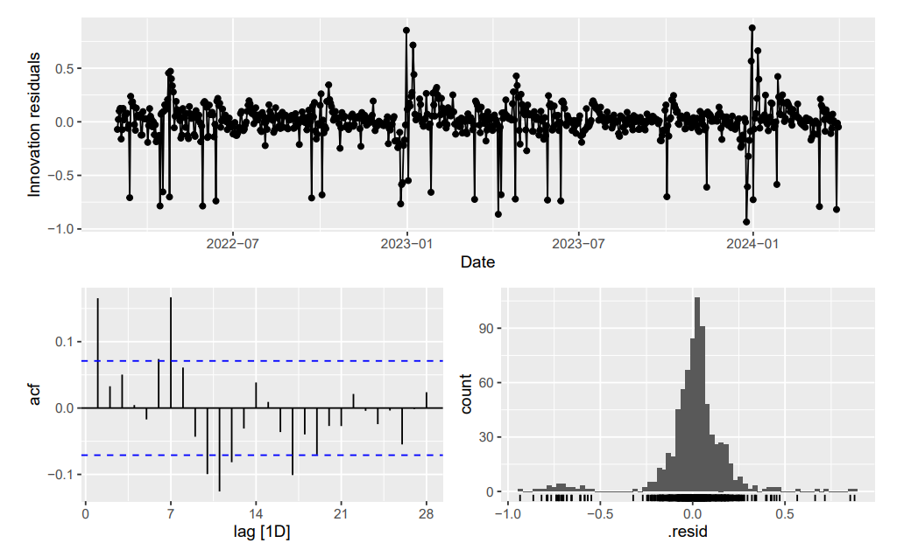

## Theoretical Concepts

*1. Compare and contrast the use of AIC and MSE for selecting a forecasting model. Explain the scenarios in which one criterion would be preferable to the other.*

::: question

  - The MSE on the training set only measures goodness of fit, not forecast accuracy.
  - The AIC is also a measure of goodness of fit on the training set, but includes a penalty for the number of parameters in the model.
:::

*2. Explain the specific role of the Ljung-Box test in the forecasting model building process. Is it useful for selecting the best model among several alternatives? Justify your answer.*

::: question
  - The Ljung-Box test is used to test whether the residuals from a model are white noise.
  - It should not be used to select a forecasting model.
  - If the residuals are not white noise, then the model is not capturing all the information in the data, and can potentially be improved.
:::

*3. It is often claimed that MAPE is better than RMSE for measuring forecast accuracy because it is easier to explain. Discuss the advantages and disadvantages of both metrics. Is MAPE always the superior choice?*

::: question
  - The MAPE is a percentage, so it is easier to interpret than the RMSE.
  - However, the MAPE may not make sense for the data, especially if the data contains zeros, small values, or negative values, or if the zero point is arbitrary.
  - The RMSE is scale-dependent so can’t be used to compare forecasts across different data sets, whereas the MAPE is scale-independent.
:::

*4. Do you agree with the statement: "STL is not useful for forecasting because it only provides a decomposition of the data"? Explain how the components from an STL decomposition can be effectively used to generate forecasts.*

::: question
  - STL is a decomposition method that separates a time series into trend, seasonal, and remainder
    components.
  - STL, on its own, is not a forecasting method.
  - However, STL is useful for forecasting because the decomposition can help us understand the
    data better.
  - STL can be coupled with a forecasting method applied to the seasonally adjusted data.
  - In this case, the seasonal component is usually forecast using the seasonal naive method, and then the seasonal component forecasts and seasonally adjusted forecasts can be added to obtain forecasts of the original data.
:::

## Data Analysis and Interpretation

*5. Your task is to interpret Figures 1 and 2 to describe daily public transport usage in Canberra. Pay close attention to the interesting patterns in both graphs, and explain how these patterns show the effects of Canberra's two major COVID-19 lockdowns, its four-term school year, and other holidays.*

::: question
  - There is strong weekly seasonality with lower boarding numbers on weekends, seen in Figure 1 but more clearly in Figure 2.
  - Fig 1 shows there is also some annual seasonality, with low boarding numbers at the end of the year and the beginning of the next year (summer holidays).
  - The two COVID-19 lockdowns are visible in the first half of 2020, and the second half of 2021.
:::

*6. Referring to the STL decomposition presented in Figure 3, please discuss the information contained within each panel. Explain the rationale for using a log transformation on the data. Furthermore, describe how the trend, seasonal, and remainder components have been influenced by COVID-19 lockdowns and public holidays.*

::: question
  - The top panel shows the transformed data, which is the log of the original data.
  - The next panels show the trend, weekly seasonality, annual seasonality and the remainder components.
  - The log transformation is used to stabilize the variance of the data.
  - The lockdowns are seen in the two large dips in the trend.
:::

*7. Your goal is to forecast daily passenger boardings for the next four weeks. Using the data from March 2022 onwards, consider each of the methods and models listed below. Briefly comment on whether each one is suitable for forecasting the next two weeks. You must justify your reasoning for each choice, as simply stating that a method is or isn't appropriate will not receive any marks.*

 
**Start your response by stating: suitable or not suitable.**

::: question
  
*a. Seasonal naïve method using weekly seasonality:*

  - Maybe suitable, but will miss the annual seasonality and holidays.

*b. Naïve method:*

  - Unsuitable. Won’t even capture weekly seasonality. 

*c. An STL decomposition on the log transformed data combined with an ETS to forecast the seasonally adjusted component, and seasonal naïve methods for both seasonal components:*

  - Might be suitable, but will miss holidays that do not have a fixed date.

*d. Holt-Winters method with damped trend and multiplicative weekly seasonality:*

  - Might be suitable, but will miss annual seasonality and holidays.

*e. ETS(A,N,A):*

  - Unsuitable. Seasonality is not additive. Also misses annual seasonality and holidays.

*f. ETS(M,A,M) with annual seasonality:*

  - Unsuitable. ETS won’t handle annual seasonality, and model doesn’t capture weekly seasonality.
:::

*8. Write down the equations for the ETS model, including the specific values of all model parameters provided in Figure 4.*

::: question
$$
\begin{align*}
y_t &= l_{t-1}s_{t-m}(1 + \varepsilon_t) \\
l_t &= l_{t-1}(1 + \alpha\varepsilon_t) \\
s_t &= s_{t-m}(1 + \gamma\varepsilon_t) \quad \varepsilon_t \sim N(0, \sigma^2)
\end{align*}
$$

where $\alpha = 0.208$, $\gamma = 0.0001$, $\sigma^2 = 0.0338$.
:::

## Residuals

*9. What features of the data has the model ignored?*

::: question
  - annual seasonality
  - holidays
:::

*10. What does the value of $\gamma$ tell you?*

::: question
  - seasonal pattern hardly changing over time.
:::

*11. Discuss what these tell you about the model?*

::: question

::: {.callout-caution collapse="true" icon="false"}
#### 🥺Sorry, I forgot to include graph 5 in the question.

{fig-align="center"}
:::

  - Significant serial correlation remaining in residuals.
  - Lots of outliers, probably associated with holidays.
  - Residuals are not normally distributed.
  - The model has not captured the holiday effects, or the time series dynamics in the data.
  - The model will give prediction intervals with incorrect coverage.
:::

*12. If you conducted a Ljung-Box test of the residuals using 14 lags, what do you think the p-value would be? Why?*

::: question
  - Close to zero
  - Due to significant serial correlation.
:::
