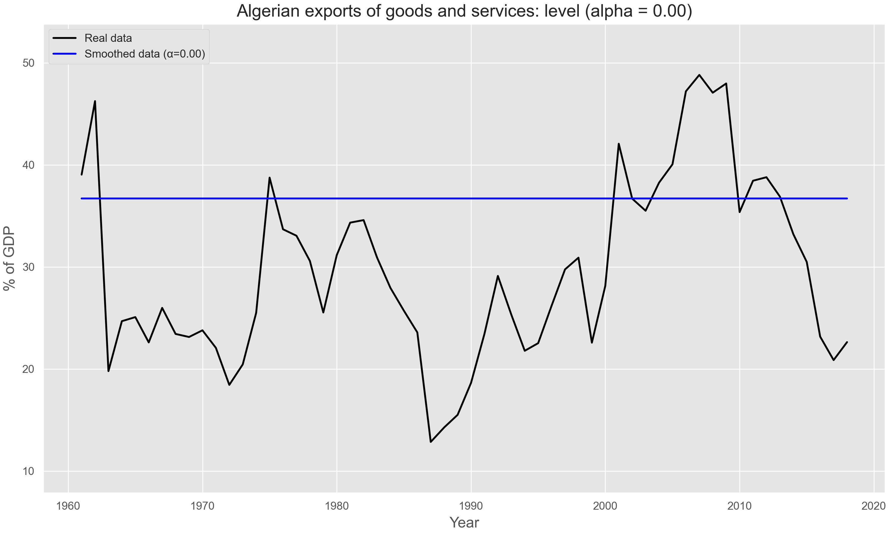
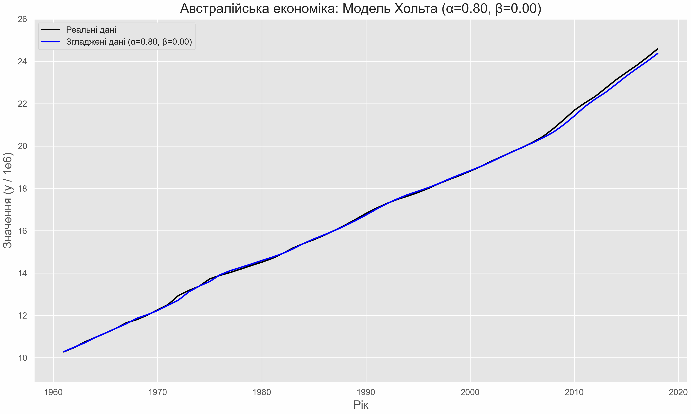
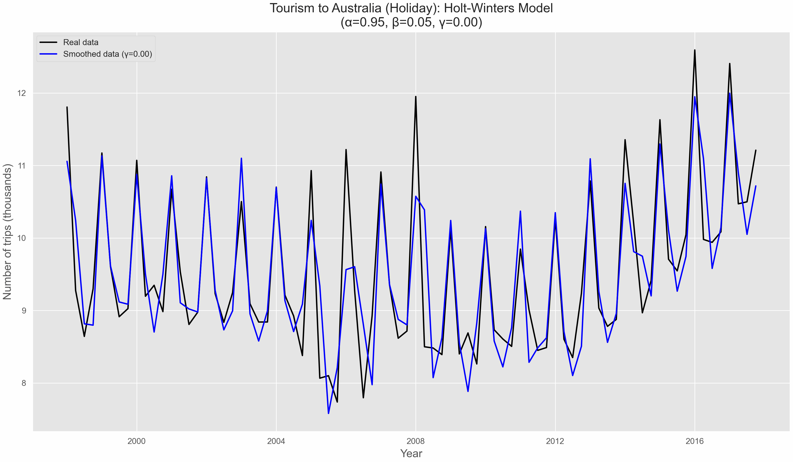

```{python}
#| label: setup
#| include: false

# Define colors
red_pink   = "#e64173"
turquoise  = "#20B2AA"
orange     = "#FFA500"
red        = "#fb6107"
blue       = "#181485"
navy       = "#150E37FF"
green      = "#8bb174"
yellow     = "#D8BD44"
purple     = "#6A5ACD"
slate      = "#314f4f"

import warnings
warnings.filterwarnings(
    "ignore",
    category=UserWarning,
    message=".*FigureCanvasAgg is non-interactive.*"
)
import numpy as np
np.set_printoptions(suppress=True)
np.random.seed(1)
import random
random.seed(1)
import pandas as pd
pd.set_option("max_colwidth", 100)
pd.set_option("display.precision", 3)
from utilsforecast.plotting import plot_series as plot_series_utils
import seaborn as sns
sns.set_style("whitegrid")
import matplotlib.pyplot as plt
plt.style.use("ggplot")
plt.rcParams.update({
    "figure.figsize": (8, 5),
    "figure.dpi": 100,
    "savefig.dpi": 300,
    "figure.constrained_layout.use": True,
    "axes.titlesize": 12,
    "axes.labelsize": 10,
    "xtick.labelsize": 9,
    "ytick.labelsize": 9,
    "legend.fontsize": 9,
    "legend.title_fontsize": 10,
})
import matplotlib as mpl
from cycler import cycler
mpl.rcParams['axes.prop_cycle'] = cycler(color=["#000000", "#4E4EFA"])
from fpppy.utils import plot_series

from functools import partial
from statsforecast import StatsForecast
from statsforecast.models import AutoETS
from statsmodels.tsa.seasonal import seasonal_decompose
from utilsforecast.evaluation import evaluate
from utilsforecast.losses import rmse, mae, mape, mase
from IPython.display import display, Markdown, Image

from great_tables import GT, md, html
```

# Simple Exponential Smoothing

## Simple methods

Time series $y_1, y_2, \ldots, y_T$.

::: {.callout-note icon="false"}
## Random walk forecast

$$
\hat{y}_{T+h|T} = y_T \quad h=1,2,\ldots
$$
:::

::: {.callout-note icon="false"}
## Average forecast

$$
\hat{y}_{T+h|T} = \frac{1}{T} \sum_{t=1}^{T} y_t \quad h=1,2,\ldots
$$
:::

- Want something in between these methods
- Most recent data should be more important

## Simple Exponential Smoothing  {.smaller}

::: {.callout-note icon="false"}
## Forecast equation

$$
\hat{y}_{T+h|T} = \alpha y_T + \alpha(1 - \alpha) \hat{y}_{T-1} + \alpha(1 - \alpha)^2 \hat{y}_{T-2} + \ldots \\ \text{where} \; 0 \leq \alpha \leq 1
$$
:::


```{python}
#| label: ses
#| fig-align: center

# Параметри
alpha = 0.7  # Коефіцієнт згладжування (можна змінювати від 0 до 1)
n_points = 5  # Кількість точок для відображення

# Часові кроки (залишаються 0, 1, 2, ... для позиціонування на графіку)
time_steps = np.arange(n_points)

# Часові індекси від найдавнішого до найновішого
time_indices_desc = range(n_points - 1, -1, -1) # Створює послідовність: 4, 3, 2, 1, 0

# Мітки для осі X в інвертованому порядку
labels = [f'T-{i}' if i > 0 else 'T' for i in time_indices_desc]

# Обчислення ваг в інвертованому порядку
weights = [alpha * (1 - alpha)**i for i in time_indices_desc]

# Генерація текстових міток для ваг (з формулами) в інвертованому порядку
weight_labels = []
for i in time_indices_desc:
    if i == 0:
        weight_labels.append(r'$\alpha$')
    elif i == 1:
        weight_labels.append(r'$\alpha(1-\alpha)$')
    else:
        # Використовуємо f-string для динамічної вставки степеня
        weight_labels.append(fr'$\alpha(1-\alpha)^{{{i}}}$')


# Створення графіка
fig, ax = plt.subplots(figsize=(10, 6))

# Побудова стовпчиків
markerline, stemlines, baseline = ax.stem(time_steps, weights, linefmt='C1-', markerfmt='C1x', basefmt='black')
plt.setp(stemlines, 'linewidth', 2)
plt.setp(markerline, 'markersize', 8)


# Побудова пунктирної лінії, що з'єднує верхівки
ax.plot(time_steps, weights, 'C1--', alpha=0.7)


# Налаштування вигляду графіка
ax.set_title('Weights of Observations in Exponential Smoothing', fontsize=16)
ax.set_xlabel('Time (t)', fontsize=12)
ax.set_ylabel('Weight', fontsize=12)
ax.set_xticks(time_steps)
ax.set_xticklabels(labels) # Використовуємо нові, інвертовані мітки
ax.set_ylim(bottom=0)
ax.set_xlim(left=-0.5, right=n_points - 0.5)


# Додавання міток ваг
for ts, w, label in zip(time_steps, weights, weight_labels):
    ax.text(ts + 0.1, w + 0.02, label, fontsize=12, color='C1')

plt.grid(axis='y', linestyle='--', alpha=0.6)
plt.show()
```

## Simple Exponential Smoothing {.smaller}

::: {.callout-note icon="false"}
## Forecast equation

$$
\hat{y}_{T+h|T} = \alpha y_T + \alpha(1 - \alpha) \hat{y}_{T-1} + \alpha(1 - \alpha)^2 \hat{y}_{T-2} + \ldots \\ \text{where} \; 0 \leq \alpha \leq 1
$$
:::

| Observation | α = 0.2 | α = 0.4 | α = 0.6 | α = 0.8 |
| :--- | :--- | :--- | :--- | :--- |
| y<sub>T</sub> | 0.2 | 0.4 | 0.6 | 0.8 |
| y<sub>T-1</sub> | 0.16 | 0.24 | 0.24 | 0.16 |
| y<sub>T-2</sub> | 0.128 | 0.144 | 0.096 | 0.032 |
| y<sub>T-3</sub> | 0.1024 | 0.0864 | 0.0384 | 0.0064 |
| y<sub>T-4</sub> | (0.2)(0.8)<sup>4</sup> | (0.4)(0.6)<sup>4</sup> | (0.6)(0.4)<sup>4</sup> | (0.8)(0.2)<sup>4</sup> |
| y<sub>T-5</sub> | (0.2)(0.8)<sup>5</sup> | (0.4)(0.6)<sup>5</sup> | (0.6)(0.4)<sup>5</sup> | (0.8)(0.2)<sup>5</sup> |

## Simple Exponential Smoothing {.smaller}

```{python}
#| eval: false

import pandas as pd
import numpy as np
import matplotlib.pyplot as plt
from statsmodels.tsa.api import SimpleExpSmoothing
import imageio
import os
import shutil

# --- 1. Завантаження даних ---
try:
    url = "https://docs.google.com/spreadsheets/d/1yGuAXs3DqA6sw_0ElO5m4-hSz3ESZPnrwrvk9Q1WnPk/edit?usp=sharing"
    gsheet_id = url.split("/d/")[1].split("/")[0]
    data_url = f"https://docs.google.com/spreadsheets/d/{gsheet_id}/export?format=csv"

    algeria_economy = pd.read_csv(data_url, parse_dates=["ds"])
    # Перейменуємо стовпці для зручності
    algeria_economy = algeria_economy.rename(columns={'ds': 'Year', 'y': 'Exports'})
    print("Дані успішно завантажено.")
except Exception as e:
    print(f"Помилка завантаження даних: {e}")
    # Створюємо фейкові дані, якщо завантаження не вдалося, щоб код все одно працював
    years = pd.to_datetime(pd.date_range(start='1960', end='2015', freq='A'))
    data = np.random.randn(len(years)).cumsum() + 30
    algeria_economy = pd.DataFrame({'Year': years, 'Exports': data})
    print("Створено демонстраційні дані для анімації.")


# --- 2. Налаштування анімації ---
frames_dir = 'frames'
gif_filename = 'slides/img/smoothing_animation.gif'

# Створюємо тимчасову папку для кадрів
if not os.path.exists(frames_dir):
    os.makedirs(frames_dir)

# Використовуємо стиль, схожий на зображення
plt.style.use('ggplot')

# --- 3. Генерація кадрів ---
alpha_values = np.arange(0, 1.01, 0.01)
filenames = []

print("Починається генерація кадрів для анімації...")
for i, alpha in enumerate(alpha_values):
    # Створюємо фігуру
    fig, ax = plt.subplots(figsize=(10, 6))

    # Обчислюємо експоненціальне згладжування
    model_fit = SimpleExpSmoothing(
        algeria_economy['Exports'], initialization_method="estimated"
    ).fit(smoothing_level=alpha, optimized=False)
    
    smoothed_values = model_fit.fittedvalues

    # Малюємо оригінальні дані
    ax.plot(algeria_economy['Year'], algeria_economy['Exports'], color='black', label='Real data')
    
    # Малюємо згладжені дані
    ax.plot(algeria_economy['Year'], smoothed_values, color='blue', label=f'Smoothed data (α={alpha:.2f})')

    # Налаштування графіка
    ax.set_title(f'Algerian exports of goods and services: level (alpha = {alpha:.2f})', fontsize=14)
    ax.set_xlabel('Year', fontsize=12)
    ax.set_ylabel('% of GDP', fontsize=12)
    ax.set_ylim(
        algeria_economy['Exports'].min() - 5, 
        algeria_economy['Exports'].max() + 5
    )
    ax.legend(loc='upper left')

    # Зберігаємо кадр
    filename = f"{frames_dir}/frame_{i:03d}.png"
    filenames.append(filename)
    plt.savefig(filename)
    plt.close(fig) # Закриваємо фігуру, щоб не використовувати пам'ять

print("Усі кадри згенеровано.")

# --- 4. Створення GIF ---
print(f"Створення GIF-файлу: {gif_filename}...")
with imageio.get_writer(gif_filename, mode='I', fps=10) as writer:
    for filename in filenames:
        image = imageio.imread(filename)
        writer.append_data(image)
print("GIF-файл успішно створено!")

# --- 5. Очищення ---
print("Видалення тимчасових файлів...")
shutil.rmtree(frames_dir)
print("Готово.")
```

{fig-align="center"}

## Simple Exponential Smoothing {.smaller}

::: {.callout-note icon="false"}
## Component form

- Forecast equation: $\hat{y}_{t+h|t} = \ell_t$
- Smoothing equation: $\ell_t = \alpha y_t + (1 - \alpha) \ell_{t-1}$
:::

- $\ell_t$ is the level (or the smoothed value) of the series at time $t$.
- $\hat{y}_{t+1|t} = \alpha y_t + (1 - \alpha) \hat{y}_{t|t-1}$
- $\hat{y}_{T+h|T} = \ell_T, \; h = 2, 3, \ldots$

. . .

Iterate to get exponentially weighted moving averages form.

::: {.callout-note icon="false"}
## Weighted form

$$
\hat{y}_{T+h|T} = \sum_{j=0}^{T-1} \alpha (1 - \alpha)^j y_{T-j} + (1 - \alpha)^T \ell_0
$$
:::

## Optimal Smoothing Parameter

- Need to choose $\alpha$ and $\ell_0$.
- Similarly to regression, choose optimal parameters by minimizing SSE:

$$
SSE = \sum_{t=1}^T (y_t - \hat{y}_{t|t-1})^2
$$

- Unlike regression, we do not have closed-form solutions for $\alpha$ and $\ell_0$ --- use numerical optimization techniques.

. . .

- For Algeria, the optimal parameters are $\hat{\alpha} = 0.84$ and $\hat{\ell_0} = 39.54$.

## Simple Exponential Smoothing

```{python}
#| label: algeria-smoothing-plot
#| fig-align: center

from statsmodels.tsa.api import SimpleExpSmoothing

url = "https://docs.google.com/spreadsheets/d/1yGuAXs3DqA6sw_0ElO5m4-hSz3ESZPnrwrvk9Q1WnPk/edit?usp=sharing"
gsheet_id = url.split("/d/")[1].split("/")[0]
data_url = f"https://docs.google.com/spreadsheets/d/{gsheet_id}/export?format=csv"

algeria_economy = pd.read_csv(data_url, parse_dates=["ds"])
    # Перейменуємо стовпці для зручності
algeria_economy = algeria_economy.rename(columns={'ds': 'Year', 'y': 'Exports'})

alpha = [0, 0.84, 1]

# plot original data vs smoothed data
plt.plot(algeria_economy['Year'], algeria_economy['Exports'], label='Original data', color='black')
for a in alpha:
    model_fit = SimpleExpSmoothing(
        algeria_economy['Exports'], initialization_method="estimated"
    ).fit(smoothing_level=a, optimized=False)
    smoothed_values = model_fit.fittedvalues
    plt.plot(algeria_economy['Year'], smoothed_values, label=f'α={a}', color=[red_pink, turquoise, green][alpha.index(a)])
plt.title('Simple Exponential Smoothing')
plt.xlabel('Year')
plt.ylabel('% of GDP')
plt.legend()
plt.show()
```

## Simple Exponential Smoothing

```{python}
url = "https://docs.google.com/spreadsheets/d/1yGuAXs3DqA6sw_0ElO5m4-hSz3ESZPnrwrvk9Q1WnPk/edit?usp=sharing"
gsheet_id = url.split("/d/")[1].split("/")[0]
data_url = f"https://docs.google.com/spreadsheets/d/{gsheet_id}/export?format=csv"

algeria_economy = pd.read_csv(data_url, parse_dates=["ds"])

sf = StatsForecast(
    models=[AutoETS(season_length=1, model="ANN", alias="SES")], freq="Y"
)

fc = sf.forecast(df=algeria_economy, h=5, level=[80, 95], fitted=True)

fitted_vals = sf.forecast_fitted_values()

ses = AutoETS(season_length=1, model="ANN", alias="SES")
ses = ses.fit(y=algeria_economy["y"].values)
params = np.round(ses.model_["fit"][0],4)

plot_series(
    algeria_economy,
    pd.concat([fc, fitted_vals.drop(
      ["y", "SES-lo-95", "SES-hi-95", "SES-lo-80", "SES-hi-80"], 
      axis=1)]),
    level=[80, 95], xlabel="Year [1Y]", ylabel="% of GDP",
    title="Exports: Algeria", rm_legend=False,
)
```

# Methods with trend

## Holt’s Linear Trend Model {.smaller}

::: {.callout-note icon="false"}
## Component form

- Forecast equation: $\hat{y}_{t+h|t} = \ell_t + h b_t$
- Smoothing equations:
  - Level: $\ell_t = \alpha y_t + (1 - \alpha)(\ell_{t-1} + b_{t-1})$
  - Trend: $b_t = \beta^*(\ell_t - \ell_{t-1}) + (1 - \beta^*)b_{t-1}$
:::

- Two smoothing parameters: $\alpha$ (level) and $\beta^*$ (trend) (both between 0 and 1)
- $\ell_t$ level: weighted average between $y_t$ and one-step ahead forecast for time $t$, ($\hat{y}_{t|t-1} = \ell_{t-1} + b_{t-1}$).
- $b_t$ slope: weighted average of ($\ell_{t} - \ell_{t-1}$) and $b_{t-1}$, current and previous estimates of slope.
- Choose $\alpha, \beta^*, \ell_0, b_0$ to minimize SSE.

## Exponential Smoothing: Trend/Slope

```{python}
url = "https://docs.google.com/spreadsheets/d/1c4pSNrplnINKQQx2s1H3wMwiL-uoKsTtMqKfnEz5cas/edit?usp=sharing"
gsheet_id = url.split("/d/")[1].split("/")[0]
data_url = f"https://docs.google.com/spreadsheets/d/{gsheet_id}/export?format=csv"

aus_economy = pd.read_csv(data_url, parse_dates=["ds"])
aus_economy["y"] = aus_economy["y"] / 1e6
```

```{python}
#| eval: false

import pandas as pd
import numpy as np
import matplotlib.pyplot as plt
from statsmodels.tsa.api import Holt # Імпортуємо модель Хольта
import imageio
import os
import shutil

# --- 1. Завантаження та підготовка даних ---
try:
    url = "https://docs.google.com/spreadsheets/d/1c4pSNrplnINKQQx2s1H3wMwiL-uoKsTtMqKfnEz5cas/edit?usp=sharing"
    gsheet_id = url.split("/d/")[1].split("/")[0]
    data_url = f"https://docs.google.com/spreadsheets/d/{gsheet_id}/export?format=csv"

    aus_economy = pd.read_csv(data_url, parse_dates=["ds"])
    # Застосовуємо трансформацію, як у вашому коді
    aus_economy["y"] = aus_economy["y"] / 1e6 
    print("Дані успішно завантажено.")
except Exception as e:
    print(f"Помилка завантаження даних: {e}")
    # Fallback до демонстраційних даних, якщо завантаження не вдалося
    years = pd.to_datetime(pd.date_range(start='1960', end='2020', freq='QS')) # Квартальні дані
    data = np.random.randn(len(years)).cumsum() * 0.005 + 0.1 # Масштаб y/1e6
    aus_economy = pd.DataFrame({'ds': years, 'y': data})
    print("Створено демонстраційні дані для анімації.")

# --- 2. Налаштування анімації ---
frames_dir = 'holt_frames' # Назва папки для кадрів
gif_filename = 'slides/img/holt_smoothing_animation.gif' # Назва GIF файлу

if not os.path.exists(frames_dir):
    os.makedirs(frames_dir)

plt.style.use('ggplot') # Використовуємо стиль ggplot

# --- 3. Генерація кадрів ---
# Фіксуємо alpha (smoothing_level) на високому значенні, щоб зосередитися на впливі beta
fixed_alpha = 0.8
beta_values = np.arange(0, 1.01, 0.01) # Beta від 0 до 1 з кроком 0.01
filenames = []

print("Починається генерація кадрів для анімації моделі Хольта...")
for i, beta in enumerate(beta_values):
    fig, ax = plt.subplots(figsize=(10, 6))

    # Створюємо та підганяємо модель Хольта
    # Встановлюємо optimized=False для ручного контролю alpha та beta
    model_fit = Holt(
        aus_economy['y'],
        initialization_method="estimated" # Надійний метод ініціалізації
    ).fit(
        smoothing_level=fixed_alpha,
        smoothing_trend=beta,
        optimized=False
    )
    
    smoothed_values = model_fit.fittedvalues

    # Малюємо оригінальні дані
    ax.plot(aus_economy['ds'], aus_economy['y'], color='black', label='Реальні дані')
    
    # Малюємо згладжені дані
    ax.plot(aus_economy['ds'], smoothed_values, color='blue', label=f'Згладжені дані (α={fixed_alpha:.2f}, β={beta:.2f})')

    # Налаштування графіка
    ax.set_title(f'Австралійська економіка: Модель Хольта (α={fixed_alpha:.2f}, β={beta:.2f})', fontsize=14)
    ax.set_xlabel('Рік', fontsize=12)
    ax.set_ylabel('Значення (y / 1e6)', fontsize=12) 
    
    # Встановлюємо ліміти осі Y з буфером
    y_min = aus_economy['y'].min()
    y_max = aus_economy['y'].max()
    ax.set_ylim(y_min - (y_max - y_min) * 0.1, y_max + (y_max - y_min) * 0.1)
    ax.legend(loc='upper left')

    # Зберігаємо кадр
    filename = f"{frames_dir}/frame_{i:03d}.png"
    filenames.append(filename)
    plt.savefig(filename)
    plt.close(fig) # Закриваємо фігуру для звільнення пам'яті

print("Усі кадри згенеровано.")

# --- 4. Створення GIF ---
print(f"Створення GIF-файлу: {gif_filename}...")
with imageio.get_writer(gif_filename, mode='I', fps=10) as writer:
    for filename in filenames:
        image = imageio.imread(filename)
        writer.append_data(image)
print("GIF-файл успішно створено!")

# --- 5. Очищення ---
print("Видалення тимчасових файлів...")
shutil.rmtree(frames_dir)
print("Готово.")
```

{fig-align="center"}

## Damped Trend Method

::: {.callout-note icon="false"}
## Component Form

$$
\begin{aligned} \hat{y}_{t+h \mid t} & =\ell_t+\left(\phi+\phi^2+\cdots+\phi^h\right) b_t \\ \ell_t & =\alpha y_t+(1-\alpha)\left(\ell_{t-1}+\phi b_{t-1}\right) \\ b_t & =\beta^*\left(\ell_t-\ell_{t-1}\right)+\left(1-\beta^*\right) \phi b_{t-1} .\end{aligned}
$$
:::

- Damping parameter $0<\phi<1$
- If $\phi=1$, the model reduces to the standard Holt's linear trend model.
- As $h \to \infty$, $\hat{y}_{T+h|T} \to \ell_T + \frac{\phi b_T}{1-\phi}$
- Short-term forecasts trended, long-run forecasts constant.

## Damped vs. Undamped

```{python}
sf = StatsForecast(
    models=[
        AutoETS(season_length=1, model="AAN", alias="Holt"),
        AutoETS(
            season_length=1,
            model="AAN",
            damped=True,
            phi=0.9,
            alias="Damped Holt's method",
        ),
    ],
    freq="YE",
)
fc = sf.forecast(df=aus_economy, h=15)
plot_series(aus_economy, fc, xlabel="Year [1Y]", ylabel="Millions", 
  title="Australian population", rm_legend=False)
```

# Methods with seasonality

## Holt-Winters’ additive method

::: {.callout-note icon="false"}
## Component Form

$$
\begin{aligned} \hat{y}_{t+h \mid t} & =\ell_t+h b_t+s_{t+h-m(k+1)} \\ \ell_t & =\alpha\left(y_t-s_{t-m}\right)+(1-\alpha)\left(\ell_{t-1}+b_{t-1}\right) \\ b_t & =\beta^*\left(\ell_t-\ell_{t-1}\right)+\left(1-\beta^*\right) b_{t-1} \\ s_t & =\gamma\left(y_t-\ell_{t-1}-b_{t-1}\right)+(1-\gamma) s_{t-m}\end{aligned}
$$
:::

- $k$ = integer part of $(h-1)/m$. Ensures estimates from the final year are used for forecasting.
- Parameters: $0<\alpha,\beta^*<1$, $0<\gamma<1-\alpha$. and $m$ = period of seasonality.

## Holt-Winters’ additive method

- Seasonal component is usually expressed as

$$
s_t = \gamma^* (y_t - \ell_t) + (1-\gamma^*) s_{t-m}
$$

- Substitute in $\ell_t$:

$$
s_t=\gamma^*(1-\alpha)\left(y_t-\ell_{t-1}-b_{t-1}\right)+\left[1-\gamma^*(1-\alpha)\right] s_{t-m}
$$

- We set $\gamma = \gamma^*(1-\alpha)$.

- The usual parameter restriction is $0 \leq \gamma^* \leq 1$, which translates to $0 \leq \gamma \leq 1-\alpha$.

## Exponential Smoothing: seasonality

```{python}
url = "https://docs.google.com/spreadsheets/d/1rNavG5fAbFCKzXr5hKMsppGhJB3yy3SmIDAOQguxKhA/edit?usp=sharing"
gsheet_id = url.split("/d/")[1].split("/")[0]
data_url = f"https://docs.google.com/spreadsheets/d/{gsheet_id}/export?format=csv"

tourism = pd.read_csv(data_url, parse_dates=["ds"])
aus_holidays = (
    tourism.query('Purpose == "Holiday"')
    .groupby(["Purpose", "ds"], as_index=False)["y"]
    .sum()
)
aus_holidays["y"] = aus_holidays["y"] / 1e3
aus_holidays.rename(columns={"Purpose": "unique_id"}, inplace=True)
```

```{python}
#| eval: false

import pandas as pd
import numpy as np
import matplotlib.pyplot as plt
from statsmodels.tsa.api import ExponentialSmoothing # Модель Хольта-Уінтерса
import imageio
import os
import shutil

# --- 1. Завантаження та підготовка даних ---
try:
    url = "https://docs.google.com/spreadsheets/d/1rNavG5fAbFCKzXr5hKMsppGhJB3yy3SmIDAOQguxKhA/edit?usp=sharing"
    gsheet_id = url.split("/d/")[1].split("/")[0]
    data_url = f"https://docs.google.com/spreadsheets/d/{gsheet_id}/export?format=csv"

    tourism = pd.read_csv(data_url, parse_dates=["ds"])
    aus_holidays = (
        tourism.query('Purpose == "Holiday"')
        .groupby(["Purpose", "ds"], as_index=False)["y"]
        .sum()
    )
    aus_holidays["y"] = aus_holidays["y"] / 1e3
    aus_holidays.rename(columns={"Purpose": "unique_id"}, inplace=True)
    print("Дані успішно завантажено.")
except Exception as e:
    print(f"Помилка завантаження даних: {e}")
    # Fallback до демонстраційних даних
    dates = pd.to_datetime(pd.date_range(start='1998', end='2018', freq='QS-OCT'))
    # Створюємо сезонний патерн (4 квартали)
    seasonal_pattern = np.array([10, 5, 8, 15]) 
    num_years = len(dates) // 4
    # Повторюємо патерн і додаємо тренд та шум
    data = np.tile(seasonal_pattern, num_years + 1)[:len(dates)] + np.linspace(0, 10, len(dates)) + np.random.randn(len(dates)) * 2
    aus_holidays = pd.DataFrame({'ds': dates, 'y': data})
    print("Створено демонстраційні сезонні дані для анімації.")

# --- 2. Налаштування анімації ---
frames_dir = 'hw_frames' # Назва папки для кадрів
gif_filename = 'slides/img/holt_winters_animation.gif' # Назва GIF файлу

if not os.path.exists(frames_dir):
    os.makedirs(frames_dir)

plt.style.use('ggplot')

# --- 3. Генерація кадрів ---
# Фіксуємо alpha і beta, щоб зосередитися на впливі gamma
fixed_alpha = 0.95
fixed_beta = 0.05
gamma_values = np.arange(0, 1.01, 0.01) # Gamma від 0 до 1 з кроком 0.01
filenames = []

print("Починається генерація кадрів для анімації моделі Хольта-Уінтерса...")
for i, gamma in enumerate(gamma_values):
    fig, ax = plt.subplots(figsize=(12, 7))

    # Створюємо та підганяємо модель Хольта-Уінтерса
    # trend='add' - адитивний тренд, seasonal='add' - адитивна сезонність
    # seasonal_periods=4, оскільки дані поквартальні
    model_fit = ExponentialSmoothing(
        aus_holidays['y'],
        trend='add',
        seasonal='add',
        seasonal_periods=4,
        initialization_method="estimated"
    ).fit(
        smoothing_level=fixed_alpha,
        smoothing_trend=fixed_beta,
        smoothing_seasonal=gamma,
        optimized=False
    )
    
    smoothed_values = model_fit.fittedvalues

    # Малюємо оригінальні дані
    ax.plot(aus_holidays['ds'], aus_holidays['y'], color='black', label='Real data')
    
    # Малюємо згладжені дані
    ax.plot(aus_holidays['ds'], smoothed_values, color='blue', 
            label=f'Smoothed data (γ={gamma:.2f})')

    # Налаштування графіка
    title = (
        f'Tourism to Australia (Holiday): Holt-Winters Model\n'
        f'(α={fixed_alpha:.2f}, β={fixed_beta:.2f}, γ={gamma:.2f})'
    )
    ax.set_title(title, fontsize=14)
    ax.set_xlabel('Year', fontsize=12)
    ax.set_ylabel('Number of trips (thousands)', fontsize=12)
    ax.legend(loc='upper left')

    # Зберігаємо кадр
    filename = f"{frames_dir}/frame_{i:03d}.png"
    filenames.append(filename)
    plt.savefig(filename)
    plt.close(fig)

print("Усі кадри згенеровано.")

# --- 4. Створення GIF ---
print(f"Створення GIF-файлу: {gif_filename}...")
with imageio.get_writer(gif_filename, mode='I', fps=10) as writer:
    for filename in filenames:
        image = imageio.imread(filename)
        writer.append_data(image)
print("GIF-файл успішно створено!")

# --- 5. Очищення ---
print("Видалення тимчасових файлів...")
shutil.rmtree(frames_dir)
print("Готово.")
```

{fig-align="center"}

## Holt-Winters’ multiplicative method

::: {.callout-note icon="false"}
## Component form

$$
\begin{aligned} \hat{y}_{t+h \mid t} & =\left(\ell_t+h b_t\right) s_{t+h-m}(k+1) \\ \ell_t & =\alpha \frac{y_t}{s_{t-m}}+(1-\alpha)\left(\ell_{t-1}+b_{t-1}\right) \\ b_t & =\beta^*\left(\ell_t-\ell_{t-1}\right)+\left(1-\beta^*\right) b_{t-1} \\ s_t & =\gamma \frac{y_t}{\left(\ell_{t-1}+b_{t-1}\right)}+(1-\gamma) s_{t-m}\end{aligned}
$$
:::

- $k$ is integer part of $(h - 1) / m$.
- Additive method: $s_t$ in absolute terms --- within each year $\sum s_i \approx 0$.
- Multiplicative method: $s_t$ in relative terms --- within each year $\sum s_i \approx m$.

## Holt-Winters’ multiplicative method {.tiny}

```{python}
#| fig-align: center
sf = StatsForecast(
    models=[
        AutoETS(season_length=4, model="AAA", alias="additive"),
        AutoETS(season_length=4, model="MAM", alias="multiplicative"),
    ],
    freq="QE",
)
fc = sf.forecast(df=aus_holidays, h=12, fitted=True)
sf = sf.fit(aus_holidays)
plot_series(aus_holidays, fc, 
  xlabel="Quarter", ylabel="Overnight trips (millions)", 
  title="Australian domestic tourism", rm_legend=False)
```

## Holt-Winters’ multiplicative method {.tiny}

```{python}
#| fig-align: center
add_fitted_model = sf.fitted_[0, 0].model_
mult_fitted_model = sf.fitted_[0, 1].model_
fig, axes = plt.subplots(5, 2, figsize=(8, 8*14/12), sharex=True)
axes[0,0].plot(aus_holidays["y"].values)
axes[0,0].set_title("ETS(A,A,A) decomposition \n Additive seasonality")
axes[0,0].set_ylabel("Trips")
axes[1,0].plot(add_fitted_model["states"][:, 0])
axes[1,0].set_ylabel("Level")
axes[2,0].plot(add_fitted_model["states"][:, 1])
axes[2,0].set_ylabel("Slope")
axes[3,0].plot(add_fitted_model["states"][:, 2])
axes[3,0].set_ylabel("Season")
axes[4,0].plot(add_fitted_model["residuals"])
axes[4,0].set_ylabel("Residual")
axes[0,1].plot(aus_holidays["y"].values)
axes[0,1].set_title("ETS(M,A,M) decomposition\n Multiplicative seasonality")
axes[0,1].set_ylabel("Trips")
axes[1,1].plot(mult_fitted_model["states"][:, 0])
axes[1,1].set_ylabel("Level")
axes[2,1].plot(mult_fitted_model["states"][:, 1])
axes[2,1].set_ylabel("Slope")
axes[3,1].plot(mult_fitted_model["states"][:, 2])
axes[3,1].set_ylabel("Season")
axes[4,1].plot(mult_fitted_model["residuals"])
axes[4,1].set_ylabel("Residual")
for ax in axes.flat:
    ax.grid(True)
plt.show()
```

## Holt-Winters’ Damped Method

$$
\begin{aligned} \hat{y}_{t+h \mid t} & =\left[\ell_t+\left(\phi+\phi^2+\cdots+\phi^h\right) b_t\right] s_{t+h-m(k+1)} \\ \ell_t & =\alpha\left(y_t / s_{t-m}\right)+(1-\alpha)\left(\ell_{t-1}+\phi b_{t-1}\right) \\ b_t & =\beta^*\left(\ell_t-\ell_{t-1}\right)+\left(1-\beta^*\right) \phi b_{t-1} \\ s_t & =\gamma \frac{y_t}{\left(\ell_{t-1}+\phi b_{t-1}\right)}+(1-\gamma) s_{t-m} .\end{aligned}
$$

## Holt-Winters with daily data

```{python}
url = "https://docs.google.com/spreadsheets/d/1jB4OuOmxwIKjcvT93kGFXt45VunJppcN9mMFtX5IBYQ/edit?usp=sharing"
gsheet_id = url.split("/d/")[1].split("/")[0]
data_url = f"https://docs.google.com/spreadsheets/d/{gsheet_id}/export?format=csv"

pedestrian = pd.read_csv(data_url, parse_dates=["ds"])
sth_cross_ped = (
    pedestrian.query(
        'ds >= "2016-07-01" and ds <= "2016-07-31" and \
          unique_id == "Southern Cross Station"'
    )
    .groupby(["unique_id", "ds"], as_index=False)["y"]
    .sum()
)
sth_cross_ped["y"] = sth_cross_ped["y"] / 1000
sf = StatsForecast(
    models=[AutoETS(season_length=7, model="MAM", 
      damped=True, alias="HW Damped")],
    freq="D",
)
fc = sf.forecast(df=sth_cross_ped, h=14, level=[80, 95])
plot_series(sth_cross_ped, fc, level=[80, 95], 
  xlabel="Date", ylabel="Pedestrians ('000)", 
  title="Daily traffic: Southern Cross", rm_legend=False)
```

# A taxonomy of methods

## Exponential Smoothing Methods {.smaller}

| Trend Component | Seasonal Component: N (None) | Seasonal Component: A (Additive) | Seasonal Component: M (Multiplicative) |
| :--- | :--- | :--- | :--- |
| N (None) | (N,N) | (N,A) | (N,M) |
| A (Additive) | (A,N) | (A,A) | (A,M) |
| A<sub>d</sub> (Additive damped) | (A<sub>d</sub>, N) | (A<sub>d</sub>, A) | (A<sub>d</sub>, M) |

| Short hand | Method |
| :--- | :--- |
| (N,N) | Simple exponential smoothing |
| (A,N) | Holt's linear method |
| (A<sub>d</sub>, N) | Additive damped trend method |
| (A,A) | Additive Holt-Winters' method |
| (A,M) | Multiplicative Holt-Winters' method |
| (A<sub>d</sub>, A) | Holt-Winters' damped method |

## Exponential Smoothing Methods {.tiny40}


| Trend | Seasonal \n N | Seasonal \n A | Seasonal \n M |
| :--- | :--- | :--- | :--- |
| **N** | $$ \hat{y}_{t+h|t} = \ell_t $$ \n $$ \ell_t = \alpha y_t + (1-\alpha)\ell_{t-1} $$ | $$ \hat{y}_{t+h|t} = \ell_t + s_{t+h-m(k+1)} $$ \n $$ \ell_t = \alpha(y_t - s_{t-m}) + (1-\alpha)\ell_{t-1} $$ \n $$ s_t = \gamma(y_t - \ell_{t-1}) + (1-\gamma)s_{t-m} $$ | $$ \hat{y}_{t+h|t} = \ell_t s_{t+h-m(k+1)} $$ \n $$ \ell_t = \alpha(y_t/s_{t-m}) + (1-\alpha)\ell_{t-1} $$ \n $$ s_t = \gamma(y_t/\ell_{t-1}) + (1-\gamma)s_{t-m} $$ |
| **A** | $$ \hat{y}_{t+h|t} = \ell_t + hb_t $$ \n $$ \ell_t = \alpha y_t + (1-\alpha)(\ell_{t-1} + b_{t-1}) $$ \n $$ b_t = \beta^*( \ell_t - \ell_{t-1}) + (1-\beta^*)b_{t-1} $$ | $$ \hat{y}_{t+h|t} = \ell_t + hb_t + s_{t+h-m(k+1)} $$ \n $$ \ell_t = \alpha(y_t - s_{t-m}) + (1-\alpha)(\ell_{t-1} + b_{t-1}) $$ \n $$ b_t = \beta^*(\ell_t - \ell_{t-1}) + (1-\beta^*)b_{t-1} $$ \n $$ s_t = \gamma(y_t - \ell_{t-1} - b_{t-1}) + (1-\gamma)s_{t-m} $$ | $$ \hat{y}_{t+h|t} = (\ell_t + hb_t)s_{t+h-m(k+1)} $$ \n $$ \ell_t = \alpha(y_t/s_{t-m}) + (1-\alpha)(\ell_{t-1} + b_{t-1}) $$ \n $$ b_t = \beta^*(\ell_t - \ell_{t-1}) + (1-\beta^*)b_{t-1} $$ \n $$ s_t = \gamma\left(\frac{y_t}{\ell_{t-1} + b_{t-1}}\right) + (1-\gamma)s_{t-m} $$ |
| **A<sub>d</sub>** | $$ \hat{y}_{t+h|t} = \ell_t + \phi_h b_t $$ \n $$ \ell_t = \alpha y_t + (1-\alpha)(\ell_{t-1} + \phi b_{t-1}) $$ \n $$ b_t = \beta^*(\ell_t - \ell_{t-1}) + (1-\beta^*)\phi b_{t-1} $$ | $$ \hat{y}_{t+h|t} = \ell_t + \phi_h b_t + s_{t+h-m(k+1)} $$ \n $$ \ell_t = \alpha(y_t - s_{t-m}) + (1-\alpha)(\ell_{t-1} + \phi b_{t-1}) $$ \n $$ b_t = \beta^*(\ell_t - \ell_{t-1}) + (1-\beta^*)\phi b_{t-1} $$ \n $$ s_t = \gamma(y_t - \ell_{t-1} - \phi b_{t-1}) + (1-\gamma)s_{t-m} $$ | $$ \hat{y}_{t+h|t} = (\ell_t + \phi_h b_t)s_{t+h-m(k+1)} $$ \n $$ \ell_t = \alpha(y_t/s_{t-m}) + (1-\alpha)(\ell_{t-1} + \phi b_{t-1}) $$ \n $$ b_t = \beta^*(\ell_t - \ell_{t-1}) + (1-\beta^*)\phi b_{t-1} $$ \n $$ s_t = \gamma\left(\frac{y_t}{\ell_{t-1} + \phi b_{t-1}}\right) + (1-\gamma)s_{t-m} $$ |

# Innovations state space models

## Models and Methods

::: {.callout-note icon="false"}
## Methods

- Algorithms that return point forecasts
:::

::: {.callout-note icon="false"}
## Models

- Generate same point forecasts but can also provide prediction intervals
- Two different models can return same point forecasts but have different forecast distributions
- Allow for "proper" model selection
:::

## ETS(A,N,N): SES with additive errors {.smaller}

::: {.callout-note icon="false"}
## Component form

- Forecast equations: $\hat{y}_{t+h|t} = \ell_t$
- Smoothing equations: $\ell_t = \alpha y_t + (1-\alpha)\ell_{t-1}$
:::

Forecast error: $e_t = y_t - \hat{y}_{t|t-1} = y_t - \ell_{t-1}$.

::: {.callout-note icon="false"}
## Error correction form

$$
\begin{aligned} y_t & =\ell_{t-1}+e_t \\ \ell_t & =\ell_{t-1}+\alpha\left(y_t-\ell_{t-1}\right) \\ & =\ell_{t-1}+\alpha e_t\end{aligned}
$$
:::

Specify probability distributions for $e_t$, we assume $e_t = \varepsilon_t \sim \operatorname{NID}(0, \sigma^2)$.

## ETS(A,N,N): SES with additive errors

- Measurement equation: $y_t = \ell_t + e_t$
- State equation: $\ell_t = \ell_{t-1} + \alpha\varepsilon_t$

where $\varepsilon_t \sim \operatorname{NID}(0, \sigma^2)$.

## ETS(A,N,N): SES with multiplicative errors {.smaller}

- Specify relative errors $\varepsilon_t = \frac{y_t - \hat{y}_{t|t-1}}{\hat{y}_{t|t-1}} \sim \operatorname{NID}(0, \sigma^2)$.
- Substituting $\hat{y}_{t|t-1} = \ell_{t-1}$ gives:

$\begin{aligned} y_t & =\ell_{t-1}+\ell_{t-1} \varepsilon_t \\ e_t & =y_t-\hat{y}_{t \mid t-1}=\ell_{t-1} \varepsilon_t\end{aligned}$

- Measurement equation: $y_t = \ell_{t-1}(1+\varepsilon_t)$
- State equation: $\ell_t = \ell_{t-1}(1+\alpha\varepsilon_t)$

Models with additive and multiplicative errors with the **same parameters** generate the **same point forecasts** but have [different prediction intervals]{.hi}.

## ETS(A,A,N): Holt’s linear method with additive errors {.smaller}

- $\varepsilon_t = y_t - \ell_{t-1} - b_{t-1} \sim \operatorname{NID}(0, \sigma^2)$.

$$
\begin{aligned} y_t & =\ell_{t-1}+b_{t-1}+\varepsilon_t \\ \ell_t & =\ell_{t-1}+b_{t-1}+\alpha \varepsilon_t \\ b_t & =b_{t-1}+\beta \varepsilon_t\end{aligned}
$$

where for simplicity we have set $\beta = \alpha\beta^*$.

## ETS(M,A,N): Holt’s linear method with multiplicative errors

$$
\varepsilon_t=\frac{y_t-\left(\ell_{t-1}+b_{t-1}\right)}{\left(\ell_{t-1}+b_{t-1}\right)}
$$

$$
\begin{aligned} y_t & =\left(\ell_{t-1}+b_{t-1}\right)\left(1+\varepsilon_t\right) \\ \ell_t & =\left(\ell_{t-1}+b_{t-1}\right)\left(1+\alpha \varepsilon_t\right) \\ b_t & =b_{t-1}+\beta\left(\ell_{t-1}+b_{t-1}\right) \varepsilon_t,\end{aligned}
$$

where again $\beta = \alpha\beta^*$ and $\varepsilon_t \sim \operatorname{NID}(0, \sigma^2)$.

## Other ETS models {.smaller}

[ADDITIVE ERROR MODELS]{.hi}

| Trend Component | N (None) | A (Additive) | M (Multiplicative) |
| :--- | :--- | :--- | :--- |
| **N** (None) | A,N,N | A,N,A | A,N,M |
| **A** (Additive) | A,A,N | A,A,A | A,A,M |
| **A<sub>d</sub>** (Additive damped) | A,A<sub>d</sub>,N | A,A<sub>d</sub>,A | A,A<sub>d</sub>,M |

[MULTIPLICATIVE ERROR MODELS]{.hi}

| Trend Component | N (None) | A (Additive) | M (Multiplicative) |
| :--- | :--- | :--- | :--- |
| **N** (None) | M,N,N | M,N,A | M,N,M |
| **A** (Additive) | M,A,N | M,A,A | M,A,M |
| **A<sub>d</sub>** (Additive damped) | M,A<sub>d</sub>,N | M,A<sub>d</sub>,A | M,A<sub>d</sub>,M |

## ADDITIVE ERROR MODELS {.tiny40}

| Trend | Seasonal \n N | Seasonal \n A | Seasonal \n M |
| :--- | :--- | :--- | :--- |
| **N** | $$ y_t = \ell_{t-1} + \varepsilon_t $$ \n $$ \ell_t = \ell_{t-1} + \alpha\varepsilon_t $$ | $$ y_t = \ell_{t-1} + s_{t-m} + \varepsilon_t $$ \n $$ \ell_t = \ell_{t-1} + \alpha\varepsilon_t $$ \n $$ s_t = s_{t-m} + \gamma\varepsilon_t $$ | $$ y_t = \ell_{t-1}s_{t-m} + \varepsilon_t $$ \n $$ \ell_t = \ell_{t-1} + \alpha\frac{\varepsilon_t}{s_{t-m}} $$ \n $$ s_t = s_{t-m} + \gamma\frac{\varepsilon_t}{\ell_{t-1}} $$ |
| **A** | $$ y_t = \ell_{t-1} + b_{t-1} + \varepsilon_t $$ \n $$ \ell_t = \ell_{t-1} + b_{t-1} + \alpha\varepsilon_t $$ \n $$ b_t = b_{t-1} + \beta\varepsilon_t $$ | $$ y_t = \ell_{t-1} + b_{t-1} + s_{t-m} + \varepsilon_t $$ \n $$ \ell_t = \ell_{t-1} + b_{t-1} + \alpha\varepsilon_t $$ \n $$ b_t = b_{t-1} + \beta\varepsilon_t $$ \n $$ s_t = s_{t-m} + \gamma\varepsilon_t $$ | $$ y_t = (\ell_{t-1} + b_{t-1})s_{t-m} + \varepsilon_t $$ \n $$ \ell_t = \ell_{t-1} + b_{t-1} + \alpha\frac{\varepsilon_t}{s_{t-m}} $$ \n $$ b_t = b_{t-1} + \beta\frac{\varepsilon_t}{s_{t-m}} $$ \n $$ s_t = s_{t-m} + \gamma\frac{\varepsilon_t}{\ell_{t-1} + b_{t-1}} $$ |
| **A<sub>d</sub>** | $$ y_t = \ell_{t-1} + \phi b_{t-1} + \varepsilon_t $$ \n $$ \ell_t = \ell_{t-1} + \phi b_{t-1} + \alpha\varepsilon_t $$ \n $$ b_t = \phi b_{t-1} + \beta\varepsilon_t $$ | $$ y_t = \ell_{t-1} + \phi b_{t-1} + s_{t-m} + \varepsilon_t $$ \n $$ \ell_t = \ell_{t-1} + \phi b_{t-1} + \alpha\varepsilon_t $$ \n $$ b_t = \phi b_{t-1} + \beta\varepsilon_t $$ \n $$ s_t = s_{t-m} + \gamma\varepsilon_t $$ | $$ y_t = (\ell_{t-1} + \phi b_{t-1})s_{t-m} + \varepsilon_t $$ \n $$ \ell_t = \ell_{t-1} + \phi b_{t-1} + \alpha\frac{\varepsilon_t}{s_{t-m}} $$ \n $$ b_t = \phi b_{t-1} + \beta\frac{\varepsilon_t}{s_{t-m}} $$ \n $$ s_t = s_{t-m} + \gamma\frac{\varepsilon_t}{\ell_{t-1} + \phi b_{t-1}} $$ |

## MULTIPLICATIVE ERROR MODELS {.tiny40}

| Trend | Seasonal \n N | Seasonal \n A | Seasonal \n M |
| :--- | :--- | :--- | :--- |
| **N** | $$ y_t = \ell_{t-1}(1 + \varepsilon_t) $$ \n $$ \ell_t = \ell_{t-1}(1 + \alpha\varepsilon_t) $$ | $$ y_t = (\ell_{t-1} + s_{t-m})(1 + \varepsilon_t) $$ \n $$ \ell_t = \ell_{t-1} + \alpha(\ell_{t-1} + s_{t-m})\varepsilon_t $$ \n $$ s_t = s_{t-m} + \gamma(\ell_{t-1} + s_{t-m})\varepsilon_t $$ | $$ y_t = \ell_{t-1}s_{t-m}(1 + \varepsilon_t) $$ \n $$ \ell_t = \ell_{t-1}(1 + \alpha\varepsilon_t) $$ \n $$ s_t = s_{t-m}(1 + \gamma\varepsilon_t) $$ |
| **A** | $$ y_t = (\ell_{t-1} + b_{t-1})(1 + \varepsilon_t) $$ \n $$ \ell_t = (\ell_{t-1} + b_{t-1})(1 + \alpha\varepsilon_t) $$ \n $$ b_t = b_{t-1} + \beta(\ell_{t-1} + b_{t-1})\varepsilon_t $$ | $$ y_t = (\ell_{t-1} + b_{t-1} + s_{t-m})(1 + \varepsilon_t) $$ \n $$ \ell_t = \ell_{t-1} + b_{t-1} + \alpha(\ell_{t-1} + b_{t-1} + s_{t-m})\varepsilon_t $$ \n $$ b_t = b_{t-1} + \beta(\ell_{t-1} + b_{t-1} + s_{t-m})\varepsilon_t $$ \n $$ s_t = s_{t-m} + \gamma(\ell_{t-1} + b_{t-1} + s_{t-m})\varepsilon_t $$ | $$ y_t = (\ell_{t-1} + b_{t-1})s_{t-m}(1 + \varepsilon_t) $$ \n $$ \ell_t = (\ell_{t-1} + b_{t-1})(1 + \alpha\varepsilon_t) $$ \n $$ b_t = b_{t-1} + \beta(\ell_{t-1} + b_{t-1})\varepsilon_t $$ \n $$ s_t = s_{t-m}(1 + \gamma\varepsilon_t) $$ |
| **A<sub>d</sub>** | $$ y_t = (\ell_{t-1} + \phi b_{t-1})(1 + \varepsilon_t) $$ \n $$ \ell_t = (\ell_{t-1} + \phi b_{t-1})(1 + \alpha\varepsilon_t) $$ \n $$ b_t = \phi b_{t-1} + \beta(\ell_{t-1} + \phi b_{t-1})\varepsilon_t $$ | $$ y_t = (\ell_{t-1} + \phi b_{t-1} + s_{t-m})(1 + \varepsilon_t) $$ \n $$ \ell_t = \ell_{t-1} + \phi b_{t-1} + \alpha(\ell_{t-1} + \phi b_{t-1} + s_{t-m})\varepsilon_t $$ \n $$ b_t = \phi b_{t-1} + \beta(\ell_{t-1} + \phi b_{t-1} + s_{t-m})\varepsilon_t $$ \n $$ s_t = s_{t-m} + \gamma(\ell_{t-1} + \phi b_{t-1} + s_{t-m})\varepsilon_t $$ | $$ y_t = (\ell_{t-1} + \phi b_{t-1})s_{t-m}(1 + \varepsilon_t) $$ \n $$ \ell_t = (\ell_{t-1} + \phi b_{t-1})(1 + \alpha\varepsilon_t) $$ \n $$ b_t = \phi b_{t-1} + \beta(\ell_{t-1} + \phi b_{t-1})\varepsilon_t $$ \n $$ s_t = s_{t-m}(1 + \gamma\varepsilon_t) $$ |

# Estimation and model selection

## Estimating ETS models

*   Smoothing parameters $\alpha, \beta, \gamma$ and $\phi$, and the initial states $\ell_0, b_0, s_0, s_{-1}, \dots, s_{-m+1}$ are estimated by maximising the “likelihood” = the probability of the data arising from the specified model.
*   For models with additive errors equivalent to minimising SSE.
*   For models with multiplicative errors, [not]{.hi} equivalent to minimising SSE.

## Innovations state space models {.smaller}

Let $\mathbf{x}_t = (\ell_t, b_t, s_t, s_{t-1}, \dots, s_{t-m+1})$ and $\varepsilon_t \stackrel{\text{iid}}{\sim} N(0, \sigma^2)$.

$$
y_t = \underbrace{h(\mathbf{x}_{t-1})}_{\mu_t} + \underbrace{k(\mathbf{x}_{t-1})\varepsilon_t}_{e_t}
$$
$$
\mathbf{x}_t = f(\mathbf{x}_{t-1}) + g(\mathbf{x}_{t-1})\varepsilon_t
$$

- Additive errors
$$
k(\mathbf{x}_{t-1}) = 1. \qquad y_t = \mu_t + \varepsilon_t.
$$

- Multiplicative errors
$$
k(\mathbf{x}_{t-1}) = \mu_t. \qquad y_t = \mu_t(1 + \varepsilon_t).
$$
$$
\varepsilon_t = (y_t - \mu_t)/\mu_t \text{ is relative error.}
$$

## Innovations state space models {.smaller}

Estimation

$$
L^*(\theta, \mathbf{x}_0) = T \log \left(\sum_{t=1}^{T} \varepsilon_t^2\right) + 2 \sum_{t=1}^{T} \log |k(\mathbf{x}_{t-1})|
$$
$$
= -2 \log(\text{Likelihood}) + \text{constant}
$$

*   Estimate parameters $\theta = (\alpha, \beta, \gamma, \phi)$ and initial states $\mathbf{x}_0 = (\ell_0, b_0, s_0, s_{-1}, \dots, s_{-m+1})$ by minimizing $L^*$.

## Parameter restrictions {.smaller}

**Usual region**

*   Traditional restrictions in the methods $0 < \alpha, \beta^*, \gamma^*, \phi < 1$ (equations interpreted as weighted averages).
*   In models we set $\beta = \alpha\beta^*$ and $\gamma = (1-\alpha)\gamma^*$.
*   Therefore $0 < \alpha < 1$, $0 < \beta < \alpha$ and $0 < \gamma < 1-\alpha$.
*   $0.8 < \phi < 0.98$ — to prevent numerical difficulties.

**Admissible region**

*   To prevent observations in the distant past having a continuing effect on current forecasts.
*   Usually (but not always) less restrictive than *traditional region*.
*   For example for ETS(A,N,N):
    *traditional* $0 < \alpha < 1$ while *admissible* $0 < \alpha < 2$.

## Model selection {.smaller}

- Akaike's Information Criterion
$$
\text{AIC} = -2 \log(L) + 2k
$$
where $L$ is the likelihood and $k$ is the number of parameters & initial states estimated in the model.

- Corrected AIC
$$
\text{AIC}_c = \text{AIC} + \frac{2k(k+1)}{T-k-1}
$$
which is the AIC corrected (for small sample bias).

- Bayesian Information Criterion
$$
\text{BIC} = \text{AIC} + k[\log(T) - 2].
$$

## Some unstable models

*   Some of the combinations of (Error, Trend, Seasonal) can lead to numerical difficulties; see equations with [division by a state]{.hi}.
*   These are: ETS(A,N,M), ETS(A,A,M), ETS(A,A<sub>d</sub>,M).
*   Models with [multiplicative errors]{.hi} are useful for [strictly positive data]{.hi}, but are not numerically stable with data containing zeros or negative values. In that case only the [six fully additive models]{.hi} will be applied.

## Example: Domestic holiday tourist visitor nights in Australia

```{python}
#| echo: true
autoets = AutoETS(season_length=4)
autoets = autoets.fit(y=aus_holidays["y"].values)
autoets.model_["method"]
```

$$
\begin{aligned} y_t & =\ell_{t-1} s_{t-m}\left(1+\epsilon_t\right) \\ \ell_t & =\ell_{t-1}\left(1+\alpha \epsilon_t\right) \\ s_t & =s_{t-m}\left(1+\gamma \epsilon_t\right)\end{aligned}
$$

```{python}
params = np.round(autoets.model_["fit"][0], 4)
print("Optimal parameters:")
print("alpha:", params[0])
print("gamma:", params[1])
print("Initial level for series:", params[2])
print("Initial seasonal components:", params[3:len(params)])
```

## Example: Graphical representation

```{python}
#| fig-align: center
fig, axes = plt.subplots(4, 1, sharex=True)
axes[0].plot(aus_holidays["y"].values)
axes[0].set_title("ETS(M,N,M) decomposition \n\n"
  "Trips = (lag(level,1)+lag(season,4))*(1+residuals)")
axes[0].set_ylabel("Trips")
axes[1].plot(autoets.model_["states"][:,0])
axes[1].set_ylabel("Level")
axes[2].plot(autoets.model_["states"][:,1])
axes[2].set_ylabel("Season")
axes[3].plot(autoets.model_["residuals"])
axes[3].set_ylabel("Remainder")
plt.show()
```

## Example: Regular vs Innovation residuals

```{python}
#| fig-align: center
fig, axes = plt.subplots(2, 1, sharex=True)
axes[0].plot(autoets.model_["residuals"])
axes[0].set_ylabel("Innovation residuals")
axes[1].plot(autoets.model_["actual_residuals"])
axes[1].set_ylabel("Regular residuals")
axes[1].set_xlabel("Quarter")
plt.show()
```

# Forecasting with ETS

## Forecasting with ETS

**Traditional point forecasts:** iterate the equations for $t = T+1, T+2, \dots, T+h$ and set all $\varepsilon_t = 0$ for $t > T$.

*   Point forecasts for ETS(A,*,*) are identical to ETS(M,*,*) if the parameters are the same.

## Example: ETS(A,A,N)

$$
\begin{aligned}
y_{T+1} &= \ell_T + b_T + \varepsilon_{T+1} \\
\hat{y}_{T+1|T} &= \ell_T + b_T \\
y_{T+2} &= \ell_{T+1} + b_{T+1} + \varepsilon_{T+2} \\
&= (\ell_T + b_T + \alpha\varepsilon_{T+1}) + (b_T + \beta\varepsilon_{T+1}) + \varepsilon_{T+2} \\
\hat{y}_{T+2|T} &= \ell_T + 2b_T
\end{aligned}
$$

etc.

## Example: ETS(M,A,N)

$$
\begin{aligned}
y_{T+1} &= (\ell_T + b_T)(1 + \varepsilon_{T+1}) \\
\hat{y}_{T+1|T} &= \ell_T + b_T. \\
y_{T+2} &= (\ell_{T+1} + b_{T+1})(1 + \varepsilon_{T+2}) \\
&= \{ (\ell_T + b_T)(1 + \alpha\varepsilon_{T+1}) + [b_T + \beta(\ell_T + b_T)\varepsilon_{T+1}] \} (1 + \varepsilon_{T+2}) \\
\hat{y}_{T+2|T} &= \ell_T + 2b_T
\end{aligned}
$$

etc.

## Prediction intervals

Can only be generated using the models.

*   The prediction intervals will **differ** between models with *additive* and *multiplicative* errors.
*   **Exact formulae** for some models.
*   More general to simulate future sample paths, conditional on the last estimate of the states, and to obtain prediction intervals from the percentiles of these simulated future paths.

## Prediction intervals {.smaller}

$$
\hat{y}_{T+h|T} \pm c\sigma_h
$$

| Model | Forecast variance: $\sigma_h^2$ |
| :--- | :--- |
| (A,N,N) | $\sigma_h^2 = \sigma^2(1 + \alpha^2(h-1))$ |
| (A,A,N) | $\sigma_h^2 = \sigma^2[1 + (h-1)\{\alpha^2 + \alpha\beta h + \frac{1}{6}\beta^2h(2h-1)\}]$ |
| (A,A<sub>d</sub>,N) | $\sigma_h^2 = \sigma^2[1 + \alpha^2(h-1) + \frac{\beta\phi h}{(1-\phi)^2}\{2\alpha(1-\phi) + \beta\phi\} - \frac{\beta\phi(1-\phi^h)}{(1-\phi)^2(1-\phi^2)}\{2\alpha(1-\phi^2) + \beta\phi(1+2\phi-\phi^h)\}]$ |
| (A,N,A) | $\sigma_h^2 = \sigma^2[1 + \alpha^2(h-1) + \gamma k(2\alpha+\gamma)]$ |
| (A,A,A) | $\sigma_h^2 = \sigma^2[1 + (h-1)\{\alpha^2 + \alpha\beta h + \frac{1}{6}\beta^2h(2h-1)\} + \gamma k\{2\alpha + \gamma + \beta m(k+1)\}]$ |
| (A,A<sub>d</sub>,A) | $\sigma_h^2 = \sigma^2\left[1 + \alpha^2(h-1) + \gamma k(2\alpha+\gamma) + \frac{\beta\phi h}{(1-\phi)^2}\{2\alpha(1-\phi) + \beta\phi\} - \frac{\beta\phi(1-\phi^h)}{(1-\phi)^2(1-\phi^2)}\{2\alpha(1-\phi^2) + \beta\phi(1+2\phi-\phi^h)\} + \frac{2\beta\gamma\phi}{(1-\phi)(1-\phi^m)}\{k(1-\phi^m) - \phi^m(1-\phi^{mk})\}\right]$ |

## Example: Australian domestic overnight trips

```{python}
#| echo: true
#| fig-align: center

sf = StatsForecast(models=[AutoETS(season_length=4)], freq="Q")
fc = sf.forecast(df=aus_holidays, h=8, level=[80, 95])
plot_series(aus_holidays, fc, level=[80, 95], 
  xlabel="Quarter", ylabel="Overnight trips (millions)", 
  title="Australian domestic tourism", rm_legend=False)
```

# Questions? {.unnumbered .unlisted background-iframe=".05_files/libs/colored-particles/index.html"}

<br><br>

 [Course materials](https://teaching.kse.org.ua/course/view.php?id=3416)

 imiroshnychenko\@kse.org.ua

 [@araprof](https://t.me/araprof)

 [@datamirosh](https://www.youtube.com/@datamirosh)

 [\@ihormiroshnychenko](https://www.linkedin.com/in/ihormiroshnychenko/)

 [\@aranaur](https://github.com/Aranaur)

 [aranaur.rbind.io](https://aranaur.rbind.io)
