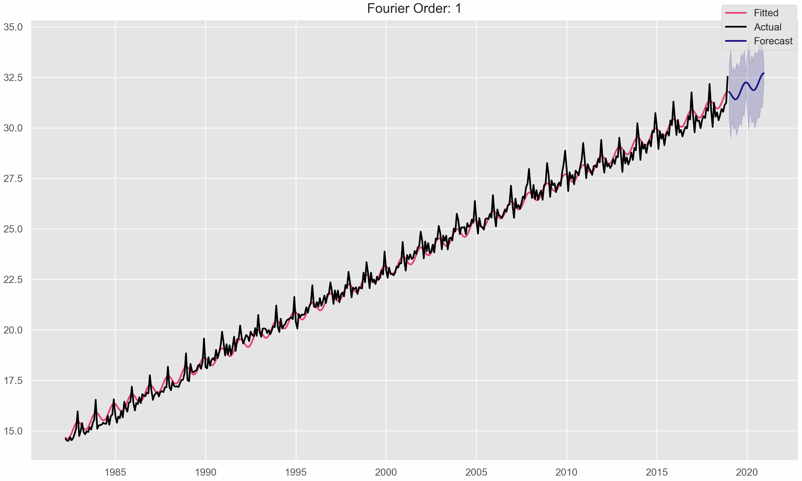

```{python}
#| label: setup
#| include: false

# Define colors
red_pink   = "#e64173"
turquoise  = "#20B2AA"
orange     = "#FFA500"
red        = "#fb6107"
blue       = "#181485"
navy       = "#150E37FF"
green      = "#8bb174"
yellow     = "#D8BD44"
purple     = "#6A5ACD"
slate      = "#314f4f"

import warnings
warnings.filterwarnings(
    "ignore",
    category=UserWarning,
    message=".*FigureCanvasAgg is non-interactive.*"
)
import numpy as np
np.set_printoptions(suppress=True)
np.random.seed(1)
import random
random.seed(1)
import pandas as pd
pd.set_option("max_colwidth", 100)
pd.set_option("display.precision", 3)
from utilsforecast.plotting import plot_series as plot_series_utils
import seaborn as sns
sns.set_style("whitegrid")
import matplotlib.pyplot as plt
plt.style.use("ggplot")
plt.rcParams.update({
    "figure.figsize": (8, 5),
    "figure.dpi": 100,
    "savefig.dpi": 300,
    "figure.constrained_layout.use": True,
    "axes.titlesize": 12,
    "axes.labelsize": 10,
    "xtick.labelsize": 9,
    "ytick.labelsize": 9,
    "legend.fontsize": 9,
    "legend.title_fontsize": 10,
})
import matplotlib as mpl
from cycler import cycler
mpl.rcParams['axes.prop_cycle'] = cycler(color=["#000000", "#4E4EFA"])
from fpppy.utils import plot_series

from scipy import stats
from itertools import combinations
from functools import partial
from typing import Optional
from sklearn.metrics import r2_score
from mlforecast import MLForecast
from mlforecast.utils import PredictionIntervals
from utilsforecast.feature_engineering import fourier, pipeline
from statsmodels.graphics.tsaplots import plot_acf
from statsmodels.stats.diagnostic import acorr_ljungbox
from scipy.stats import pearsonr
from fpppy.models import LinearRegression
from mlforecast import MLForecast

def plot_diagnostics(
  forecaster,
  model: Optional[str] = None,
  n_lags: int = None,
  target_col: str = "y",
  id_col: str = "unique_id",
  time_col: str = "ds",
):
  # Plot first model only if no model spec is given
  if model is None:
    model = list(forecaster.models.keys())[0]
  fitted_values = forecaster.forecast_fitted_values()
  insample_forecasts = fitted_values[model]
  residuals = fitted_values[target_col] - insample_forecasts
  fig = plt.figure()
  ax1 = fig.add_subplot(2, 2, (1, 2))
  ax1.plot(fitted_values[time_col], residuals, marker="o")
  ax1.set_title("Residuals")
  ax1.set_ylabel("Residuals")
  ax2 = fig.add_subplot(2, 2, 3)
  plot_acf(
    residuals.dropna(), ax=ax2, zero=False, lags=n_lags,
    bartlett_confint=False, auto_ylims=True
  )
  ax2.set_xlabel("lag [1Q]")
  ax2.set_ylabel("ACF")
  ax3 = fig.add_subplot(2, 2, 4)
  ax3.hist(residuals, bins=20)
  ax3.set_title("Histogram")
  ax3.set_xlabel("Residuals")
  ax3.set_ylabel("Frequency")
  plt.show()

def adj_r2_score(y, y_hat, T, k):
  r2 = r2_score(y, y_hat)
  adj_r2 = 1 - (1 - r2) * (T - 1) / (T - k - 1)
  return adj_r2
def aic_score(y, y_hat, T, k):
  sse = np.sum((y - y_hat) ** 2)
  aic = T * np.log(sse / T) + 2 * (k + 2)
  return aic
def aicc_score(y, y_hat, T, k):
  aic = aic_score(y, y_hat, T, k)
  aicc = aic + (2 * (k + 2) * (k + 3)) / (T - k - 3)
  return aicc
def bic_score(y, y_hat, T, k):
  sse = np.sum((y - y_hat) ** 2)
  bic = T * np.log(sse / T) + (k + 2) * np.log(T)
  return bic
def cv_score(mf, df, model, target_col, n_windows, h):
  cv_predictions = mf.cross_validation(
    df, fitted=True, n_windows=n_windows, h=h, static_features=[]
  )
  cv_score = np.mean(
    np.sum((cv_predictions[target_col] - cv_predictions[model]) ** 2)
  )
  return cv_score
```

# The linear model

## Multiple regression and forecasting

$$
y_t = \beta_0 + \beta_1 x_{1t} + \beta_2 x_{2t} + \ldots + \beta_k x_{kt} + \epsilon_t
$$

- $y_t$: the dependent variable (the value we want to predict)
- $x_{1t}, x_{2t}, \ldots, x_{kt}$: the independent variables (the predictors)
- $\beta_0, \beta_1, \ldots, \beta_k$: the coefficients (parameters) to be estimated
- $\epsilon_t$: the error term (the difference between the predicted and actual values)

## Example: US consumption and income

```{python}
#| fig-align: center
url = "https://docs.google.com/spreadsheets/d/1p6EpX6OehJ7LVvvmD1_g12xvRm9LhRgokB3oiLT0zUE/edit?usp=sharing"
gsheet_id = url.split("/d/")[1].split("/")[0]
data_url = f"https://docs.google.com/spreadsheets/d/{gsheet_id}/export?format=csv"

us_change = pd.read_csv(data_url, parse_dates=["ds"])

mf = MLForecast(models=LinearRegression(), freq="QS-OCT")
mf.fit(us_change, fitted=True, static_features=[]).forecast_fitted_values()
# Plot
fig, ax = plt.subplots()
ax.plot(us_change["ds"], us_change["Income"], label="Income", color=red_pink)
ax.plot(us_change["ds"], us_change["y"], label="Consumption", color=blue)
ax.set_xlabel("Quarter [1Q]")
ax.set_ylabel("% change")
ax.legend()
plt.show()
```


## Example: US consumption and income

```{python}
#| fig-align: center
def print_regression_summary_from_model(model):
  X = model._X.values.astype(float)
  y = model._y
  residuals = model._residuals

  n, p = X.shape
  X_design = np.hstack([np.ones((n, 1)), X])
  df = n - p - 1

  res_summary = np.percentile(residuals, [0, 25, 50, 75, 100])
  print("#> Residuals:")
  print(f"#>     Min      1Q  Median      3Q     Max ")
  print(f"#> {res_summary[0]:7.4f} {res_summary[1]:7.4f} "
        f"{res_summary[2]:7.4f} {res_summary[3]:7.4f} "
        f"{res_summary[4]:7.4f}\n")

  coef = np.insert(model.coef_, 0, model.intercept_)
  rss = np.sum(residuals ** 2)
  mse = rss / df
  var_beta = mse * np.linalg.inv(X_design.T @ X_design).diagonal()
  se_beta = np.sqrt(var_beta)
  t_stats = coef / se_beta
  p_values = 2 * (1 - stats.t.cdf(np.abs(t_stats), df))

  print("#> Coefficients:")
  print(f"#> {'':>13} {'Estimate':>9} {'Std. Error':>11} {'t value':>9} "
        f"{'Pr(>|t|)':>9}")
  names = ['(Intercept)'] + model._var_names
  for name, est, se, t, p in zip(names, coef, se_beta, t_stats, p_values):
    stars = (
      '***' if p < 0.001 else
      '**' if p < 0.01 else
      '*' if p < 0.05 else
      '.' if p < 0.1 else
      ''
    )
    print(f"#> {name:>13} {est:9.4f} {se:11.4f} {t:9.2f} {p:9.3g} "
          f"{stars}")
  print("---")
  print("Signif. codes:  0 '***' 0.001 '**' 0.01 '*' 0.05 '.' 0.1 ' ' 1")

  r_squared = model.score(X, y)
  adj_r_squared = 1 - (1 - r_squared) * (n - 1) / df
  f_stat = (r_squared / p) / ((1 - r_squared) / df)
  f_pval = 1 - stats.f.cdf(f_stat, p, df)

  print(f"\nResidual standard error: {np.sqrt(mse):.3f} "
        f"on {df} degrees of freedom")
  print(f"Multiple R-squared: {r_squared:.3f},   "
        f"Adjusted R-squared: {adj_r_squared:.3f}")
  print(f"F-statistic: {f_stat:.1f} on {p} and {df} DF, "
        f"p-value: {f_pval:.3g}")

print_regression_summary_from_model(mf.models_['LinearRegression'])
```

## Example: US consumption and income

```{python}
#| fig-align: center
fig, axes = plt.subplots(nrows=3, ncols=1, sharex=True)
sns.lineplot(data=us_change, x="ds", y="Production", ax=axes[0],
  color="#D55F03", label="Production")
sns.lineplot(data=us_change, x="ds", y="Savings", ax=axes[1],
  color="#569CC6", label="Savings")
sns.lineplot(data=us_change, x="ds", y="Unemployment", ax=axes[2],
  color="#13A076", label="Unemployment")
for ax in axes:
  ax.set_ylabel("")
  ax.set_xlabel("")
fig.supxlabel("% change")
fig.supylabel("Quarter")
plt.show()
```

## Example: US consumption and income

```{python}
#| fig-align: center
plot_df = us_change[["y", "Income", "Production", "Savings",
  "Unemployment"]].copy()
plot_df = plot_df.rename(columns={'y': 'Consumption'})
def corrfunc(x, y, **kws):
  r, pvalue = pearsonr(x, y)
  ax = plt.gca()
  ax.annotate(
    f"Corr: {r:.3f}{'***' if pvalue < 0.05 else ''}",
    xy=(0.5, 0.5),
    xycoords="axes fraction",
    ha="center",
    va="center",
  )
g = sns.PairGrid(plot_df)
g.map_diag(sns.histplot)
g.map_upper(corrfunc)
g.map_lower(sns.scatterplot)
g.add_legend()
# Remove default axis labels
g.set(xlabel="")
# Move y-axis labels to the top
for i, col in enumerate(plot_df.columns):
  g.axes[0, i].set_title(col)
plt.show()
```

## Assumptions

- $\varepsilon_t$ have zero mean.
- $\varepsilon_t$ are uncorrelated.

It is useful to also have $\varepsilon_t \sim \mathcal{N}(0, \sigma^2)$.

## OLS

$$
\sum_{t=1}^T \varepsilon_t^2 = \sum_{t=1}^T (y_t - \beta_0 - \beta_1 x_{1t} - \dots - \beta_k x_{kt})^2
$$

```{python}
mf = MLForecast(models=LinearRegression(), freq="QS-OCT")
mf.fit(us_change, fitted=True, static_features=[])
print_regression_summary_from_model(mf.models_['LinearRegression'])
```

## Fitted values

```{python}
#| fig-align: center
plot_series(us_change, mf.forecast_fitted_values().drop(columns="y"),
            xlabel="Quarter",
            ylabel="",
            title="Percent change is US consumption expenditure",
            rm_legend=False)
```

## Fitted vs Actual

```{python}
#| fig-align: center
fig, ax = plt.subplots()
insample_forecasts = mf.forecast_fitted_values()["LinearRegression"]
ax.scatter(us_change["y"], insample_forecasts, c="k")
ax.axline((0, 0), (1, 1))
ax.set_xlabel("Data (actual values)")
ax.set_ylabel("Fitted (predictd values)")
ax.set_title("Percent change in US consumption expenditure")
plt.show()
```

## Goodness of Fit

Coefficient of determination

$$
R^2 = \frac{\sum_{t=1}^T (y_t - \hat{y}_t)^2}{\sum_{t=1}^T (y_t - \bar{y})^2}
$$

Standard error

$$
\hat{\sigma} = \sqrt{\frac{1}{T - k - 1} \sum_{t=1}^T e_t^2}
$$

## Plot diagnostics

```{python}
#| fig-align: center
plot_diagnostics(forecaster=mf, n_lags=22)
```

```{python}
residuals = mf.models_["LinearRegression"]._residuals
acorr_ljungbox(residuals, lags=[10])
```

## Residual plots against predictors

```{python}
#| fig-align: center
fig, ax = plt.subplots(nrows=2, ncols=2)
ax[0, 0].scatter(us_change["Income"], residuals)
ax[0, 0].set_title("Income")
ax[0, 1].scatter(us_change["Production"], residuals)
ax[0, 1].set_title("Production")
ax[1, 0].scatter(us_change["Savings"], residuals)
ax[1, 0].set_title("Savings")
ax[1, 1].scatter(us_change["Unemployment"], residuals)
ax[1, 1].set_title("Unemployment")
fig.supylabel("Residuals")
plt.show()
```

# Features

## Trend

$$
y_t = \beta_0 + \beta_1 t + \varepsilon_t
$$

where $t = 1, 2, \ldots, T$

- Strong assumption of linearity and that trend will continue

## Dummy variables

::: {.columns}
::: {.column}
| Variable      | dummy                       |
|---------------|-----------------------------------|
| Yes           | 1                                 |
| No            | 0                                 |
| No            | 0                                 |
| Yes           | 1                                 |
| Yes           | 1                                 |
:::
::: {.column}
| Day | d1 | d2 | d3 | d4 |
|-----|----|----|----|----|
| Mon | 1  | 0  | 0  | 0  |
| Tue | 0  | 1  | 0  | 0  |
| Wed | 0  | 0  | 1  | 0  |
| Thu | 0  | 0  | 0  | 1  |
| Fri | 0  | 0  | 0  | 0  |
| Mon | 1  | 0  | 0  | 0  |
| Tue | 0  | 1  | 0  | 0  |
| Wed | 0  | 0  | 1  | 0  |
| Thu | 0  | 0  | 0  | 1  |
| Fri | 0  | 0  | 0  | 0  |
:::
:::

## Uses of dummy variables {.smaller}

**Seasonal dummies**

- For quarterly data: use 3 dummies
- For monthly data: use 11 dummies
- For daily data: use 6 dummies
- What to do with weekly data?

**Outliers**

- If there is an outlier in the data, you can use dummy variables to account for it.

**Holidays**

- For daily data: if it is public holiday, dummy = 1, else dummy = 0

## Beer production

```{python}
#| fig-align: center
url = "https://docs.google.com/spreadsheets/d/10Y3HqO91-87jSvxmmxuTlAlbKyD67pZ9hWP8RIp7JSE/edit?usp=sharing"
gsheet_id = url.split("/d/")[1].split("/")[0]
data_url = f"https://docs.google.com/spreadsheets/d/{gsheet_id}/export?format=csv"

# Read data
aus_production = pd.read_csv(data_url,
  parse_dates=[1])
recent_production = aus_production.query(
    "unique_id == 'Beer' and ds >= '1992-01-01'"
).reset_index(drop=True)

plot_series(recent_production,
            xlabel="Quarter [1Q]",
            ylabel="Megalitres",
            title="Australian quarterly beer production")
```

$$
y_t = \beta_0 + \beta_1 t + \beta_2 d_{2,t} + \beta_3 d_{3,t} + \beta_4 d_{4,t} + \varepsilon_t
$$

- $d_{i,t} = 1$ if $t$ is in the $i$-th period, $0$ otherwise.

## Beer production

```{python}
#| fig-align: center
from utilsforecast.feature_engineering import trend
fit_beer = recent_production.copy()
# Add trend
fit_beer, _ = trend(fit_beer, freq="QS-DEC")
# Add quarterly indicators
quarter = pd.get_dummies(fit_beer.ds.dt.quarter, prefix="Quarter",
  drop_first=True)
fit_beer = fit_beer.join(quarter)
mf = MLForecast(models=LinearRegression(), freq="QS-DEC")
mf.fit(fit_beer, fitted=True, static_features=[])
insample_forecasts = mf.forecast_fitted_values()["LinearRegression"]
residuals = mf.models_["LinearRegression"]._residuals
print_regression_summary_from_model(mf.models_['LinearRegression'])
```

## Beer production

```{python}
#| fig-align: center
plot_series(
  df = fit_beer,
  forecasts_df = mf.forecast_fitted_values().drop(columns="y"),
  xlabel = "Quarter",
  ylabel = "Megalitres",
  title = "Australian quarterly beer production",
  rm_legend = False
)
```

## Beer production

```{python}
#| fig-align: center
fig, ax = plt.subplots()
sc = ax.scatter(
    mf.forecast_fitted_values()["y"],
    insample_forecasts,
    label="Fitted",
    c=fit_beer["ds"].dt.quarter,
)
ax.axline((0, 0), slope=1)
ax.set_xlim(370, 550)
ax.set_ylim(370, 550)
ax.set_xlabel("Actual values")
ax.set_ylabel("Fitted")
ax.set_title("Australian quarterly beer production")
ax.legend(*sc.legend_elements())
plt.show()
```

## Beer production

```{python}
#| fig-align: center
plot_diagnostics(forecaster=mf, n_lags=22)
```

## Intervention variables

- **Spikes**: use dummy variables to indicate the presence of a spike in the data.
- **Steps**: use dummy variables to indicate the presence of a step change in the data.
- **Change of slope**: use dummy variables to indicate the presence of a change in the slope of the data.

## Holidays

**For monthly data:**

- **Christmas**: dummy = 1 if date is December 25, else dummy = 0
- **Easter**: dummy = 1 if date is Easter Sunday, else dummy = 0
- **Ramadan**: dummy = 1 if date is in Ramadan, else dummy = 0
- **Chinese New Year**: dummy = 1 if date is in Chinese New Year, else dummy = 0

## Distributed lags

Lagged values of a predictor.

$$x_1 = \text{ads for previous month}$$

$$x_2 = \text{ads for two months ago}$$

$$x_m = \text{ads for m months ago}$$

## Fourier series {.smaller}

Periodic seasonality can be modeled using Fourier series.

::: {.columns}
::: {.column}
$$
s_k(t) = \sin(\frac{2\pi kt}{m})
$$
:::
::: {.column}
$$
c_k(t) = \cos(\frac{2\pi kt}{m})
$$
:::
:::

$$
y_t = a + bt + \sum_{k=1}^{K} \left( \alpha_k s_k(t) + \beta_k c_k(t) \right) + \varepsilon_t
$$

- Every periodic function can be approximated by sums of sine and cosine functions for large enough $K$.
- Choose $K$ by minimizing AICc.
- The maximum allowed is $K = m / 2$

## Fourier series

```{python}
fourier_beer = recent_production.copy()
# Add trend
fourier_beer, _ = trend(fourier_beer, freq="QS-DEC")
# Add fourier
fourier_beer, _ = fourier(fourier_beer, freq="QS-DEC", k=2, season_length=4)
mf = MLForecast(models=LinearRegression(), freq="QS-DEC")
mf.fit(fourier_beer, fitted=True, static_features=[])
insample_forecasts = mf.forecast_fitted_values()["LinearRegression"]
residuals = mf.models_["LinearRegression"]._residuals
print_regression_summary_from_model(mf.models_['LinearRegression'])
```

## Fourier series






## TSLM + Trend + Fourier

```{python}
#| eval: false
from coreforecast.scalers import boxcox, boxcox_lambda
url = "https://docs.google.com/spreadsheets/d/1nXrDE4Sevc6z8pW7SH255eAI3OO6HAby2Y6RPTnS4Yw/edit?usp=sharing"
gsheet_id = url.split("/d/")[1].split("/")[0]
data_url = f"https://docs.google.com/spreadsheets/d/{gsheet_id}/export?format=csv"

data = pd.read_csv(data_url, parse_dates=["Month"]).rename(columns={"Turnover": "y", "Month": "ds", "Series ID": "unique_id"}).query("unique_id == 'A3349335T'").drop(columns=['State', 'Industry'])

# box-cox transformation
optim_lambda = boxcox_lambda(data["y"].to_numpy(), method="loglik",
    season_length=12)
data["y"] = boxcox(data["y"].to_numpy(), optim_lambda)
```

```{python}
#| eval: false
features = [
  trend,
  partial(fourier, season_length=12, k=2),
]
fit_data_with_predictors, future_predictors = pipeline(
  data, features=features, freq="MS", h=24,
)
mf = MLForecast(models=LinearRegression(), freq="MS")
mf.fit(
  fit_data_with_predictors,
  static_features=[],
  prediction_intervals=PredictionIntervals(n_windows=12, h=24),
  fitted=True
)
fitted_values = mf.forecast_fitted_values()["LinearRegression"]
forecasts = mf.predict(h=24, X_df=future_predictors, level=[80, 95])

fig, ax = plt.subplots()
ax.plot(fit_data_with_predictors["ds"], fitted_values, label="Fitted", color=red_pink)
ax.plot(fit_data_with_predictors["ds"], fit_data_with_predictors["y"], label="Actual")
ax.plot(forecasts["ds"], forecasts["LinearRegression"], label="Forecast", color=blue)
ax.fill_between(forecasts["ds"], forecasts["LinearRegression-lo-95"], forecasts["LinearRegression-hi-95"], alpha=0.2, color=blue)
fig.legend()
fig.show()
```

```{python}
#| eval: false
from functools import partial
import os
import imageio

frames_dir = "frames"
if not os.path.exists(frames_dir):
    os.makedirs(frames_dir)

filenames = []

for k in range(1, 7):
    print(f"Generating frame for k={k}...")
    features = [
        trend,
        partial(fourier, season_length=12, k=k),
    ]
    fit_data_with_predictors, future_predictors = pipeline(
        data, features=features, freq="MS", h=24,
    )
    mf = MLForecast(models=LinearRegression(), freq="MS")
    mf.fit(
        fit_data_with_predictors,
        static_features=[],
        prediction_intervals=PredictionIntervals(n_windows=12, h=24),
        fitted=True
    )
    fitted_values = mf.forecast_fitted_values()["LinearRegression"]
    forecasts = mf.predict(h=24, X_df=future_predictors, level=[80, 95])

    fig, ax = plt.subplots(figsize=(10, 6))
    ax.plot(fit_data_with_predictors["ds"], fitted_values, label="Fitted", color=red_pink)
    ax.plot(fit_data_with_predictors["ds"], fit_data_with_predictors["y"], label="Actual")
    ax.plot(forecasts["ds"], forecasts["LinearRegression"], label="Forecast", color=blue)
    ax.fill_between(forecasts["ds"], forecasts["LinearRegression-lo-95"], forecasts["LinearRegression-hi-95"], alpha=0.2, color=blue)
    ax.set_title(f"Fourier Order: {k}")
    fig.legend()
    filename = f"frames/frame_k_{k}.png"
    filenames.append(filename)
    fig.savefig(filename)
    plt.close(fig)
```

```{python}
#| eval: false
print("Creating GIF...")
with imageio.get_writer('forecast_animation.gif', mode='I', fps=1) as writer:
    for filename in filenames:
        image = imageio.imread(filename)
        writer.append_data(image)
print("GIF created successfully: forecast_animation.gif")
```

{fig-align="center"}

## Beer production

```{python}
#| echo: true
#| output-location: slide
fit_beer = recent_production.copy()
features = [
  trend,
  partial(fourier, season_length=4, k=1),
]
fit_beer_with_predictors, future_predictors = pipeline(
  fit_beer, features=features, freq="QS-DEC", h=8,
)
mf = MLForecast(models=LinearRegression(), freq="QS-DEC")
mf.fit(
  fit_beer_with_predictors,
  static_features=[],
  prediction_intervals=PredictionIntervals(n_windows=4, h=8),
)
forecasts = mf.predict(h=8, X_df=future_predictors, level=[80, 95])
plot_series(
  df=fit_beer, forecasts_df=forecasts, level=[80, 95],
  xlabel="Quarter", ylabel="megalitres",
  title="Forecasts of beer production using regression",
  rm_legend=False
)
```


# Questions? {.unnumbered .unlisted background-iframe=".06_files/libs/colored-particles/index.html"}

<br><br>

 [Course materials](https://teaching.kse.org.ua/course/view.php?id=3416)

 imiroshnychenko\@kse.org.ua

 [@araprof](https://t.me/araprof)

 [@datamirosh](https://www.youtube.com/@datamirosh)

 [\@ihormiroshnychenko](https://www.linkedin.com/in/ihormiroshnychenko/)

 [\@aranaur](https://github.com/Aranaur)

 [aranaur.rbind.io](https://aranaur.rbind.io)
