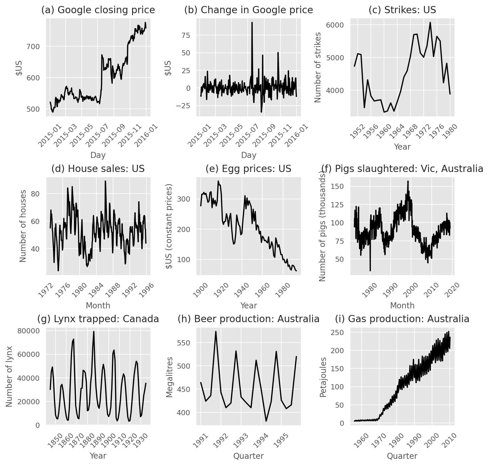
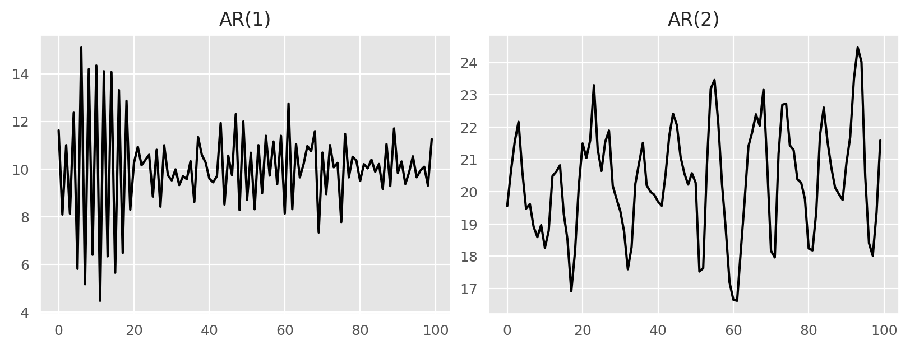
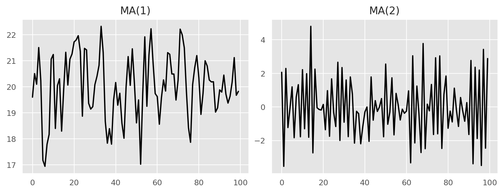

```{python}
#| label: setup
#| include: false

# Define colors
red_pink   = "#e64173"
turquoise  = "#20B2AA"
orange     = "#FFA500"
red        = "#fb6107"
blue       = "#181485"
navy       = "#150E37FF"
green      = "#8bb174"
yellow     = "#D8BD44"
purple     = "#6A5ACD"
slate      = "#314f4f"

import warnings
warnings.filterwarnings(
    "ignore",
    category=UserWarning,
    message=".*FigureCanvasAgg is non-interactive.*"
)
import os
os.environ["NIXTLA_ID_AS_COL"] = "true"
import numpy as np
np.set_printoptions(suppress=True)
np.random.seed(1)
import random
random.seed(1)
import pandas as pd
pd.set_option("max_colwidth", 100)
pd.set_option("display.precision", 3)
from utilsforecast.plotting import plot_series as plot_series_utils
import seaborn as sns
sns.set_style("whitegrid")
import matplotlib.pyplot as plt
plt.style.use("ggplot")
plt.rcParams.update({
    "figure.figsize": (8, 5),
    "figure.dpi": 100,
    "savefig.dpi": 300,
    "figure.constrained_layout.use": True,
    "axes.titlesize": 12,
    "axes.labelsize": 10,
    "xtick.labelsize": 9,
    "ytick.labelsize": 9,
    "legend.fontsize": 9,
    "legend.title_fontsize": 10,
})
import matplotlib as mpl
from cycler import cycler
mpl.rcParams['axes.prop_cycle'] = cycler(color=["#000000", "#4E4EFA"])
from fpppy.utils import plot_series

from IPython.display import Image
from typing import Optional
from utilsforecast.losses import rmse, mae, smape
from statsmodels.graphics.tsaplots import plot_acf, plot_pacf
from statsmodels.stats.diagnostic import acorr_ljungbox
from statsmodels.tsa.stattools import kpss
from statsforecast.models import AutoETS
from statsforecast.arima import ndiffs, nsdiffs
```

# Stationarity and differencing

## Stationarity {.smaller}

> If $y_t$ is [stationary time series]{.hi}, then all $s$, the distribution of $(y_t, \dots, y_{t+s})$ does not depend on $t$.

. . .

```{python}
#| label: stationarity
#| fig-align: center

import matplotlib.pyplot as plt
import numpy as np
from scipy.ndimage import gaussian_filter1d

# --- DATA GENERATION ---
np.random.seed(73)  # Fixed seed for reproducibility
points = 300
x = np.linspace(0, 100, points)

# Create a random walk and smooth it to resemble the signal in the image
noise = np.random.randn(points)
# Cumulative sum creates the "walk", gaussian filter smooths it out
y = gaussian_filter1d(np.cumsum(noise), sigma=5)

# Normalize y to fit nicely in the chart (keep it positive)
y = y - y.min() + 10

# --- PLOTTING ---
fig, ax = plt.subplots(figsize=(10, 5), facecolor='white')
ax.set_facecolor('white')

# 1. Plot the Blue Signal
ax.plot(x, y, color=blue, linewidth=2.5)

# 2. Define the Intervals (The Orange Parts)
# We pick two ranges of x roughly matching the image
intervals = [
    (15, 40),  # First interval (start x, end x)
    (65, 90)   # Second interval
]

orange_color = orange
# Define a height for the markers (slightly above the max signal)
marker_height = y.max() + 5

for (start, end) in intervals:
    # A. Vertical Lines
    # Draw lines from y=0 up to marker_height
    ax.vlines(x=start, ymin=0, ymax=marker_height, 
              colors=orange_color, linestyles='solid', linewidth=2)
    ax.vlines(x=end, ymin=0, ymax=marker_height, 
              colors=orange_color, linestyles='solid', linewidth=2)
    
    # B. Double-headed Arrow (<->)
    # We use annotate to draw an arrow between the two vertical lines
    ax.annotate(
        '', 
        xy=(start, marker_height), xytext=(end, marker_height),
        arrowprops=dict(arrowstyle='<->', color=orange_color, lw=2)
    )
    
    # C. The "s" Label
    mid_point = (start + end) / 2
    ax.text(mid_point, marker_height + 1, 's', 
            fontsize=16, color=orange_color, 
            ha='center', va='bottom', fontweight='bold')

# --- AXIS STYLING ---
# Remove the standard box border
ax.spines['top'].set_visible(False)
ax.spines['right'].set_visible(False)
ax.spines['left'].set_visible(False)  # We will draw custom axes
ax.spines['bottom'].set_visible(False)

# Turn off the ticks/numbers
ax.set_xticks([])
ax.set_yticks([])

# Set limits with some padding
ax.set_xlim(-5, 105)
ax.set_ylim(0, marker_height + 10)

# Draw Custom Axes with Arrows (Blue)
# Y-Axis
ax.annotate('', xy=(0, marker_height + 5), xytext=(0, 0),
            arrowprops=dict(arrowstyle='->', color=blue, lw=2))

# X-Axis
ax.annotate('', xy=(102, 0), xytext=(-2, 0),
            arrowprops=dict(arrowstyle='->', color=blue, lw=2))

# Label the t-axis
ax.text(102, -5, 't', fontsize=18, color=blue, ha='center')

plt.tight_layout()
plt.show()
```

## Stationarity

> If $y_t$ is [stationary time series]{.hi}, then all $s$, the distribution of $(y_t, \dots, y_{t+s})$ does not depend on $t$.

A [stationary series]{.hi} is:

- roughly horizontal (no trend)
- constant variance
- no patterns predictable in the long-term (no seasonality)

## Stationarity or not

{fig-align="center"}

## Stationarity

> If $y_t$ is [stationary time series]{.hi}, then all $s$, the distribution of $(y_t, \dots, y_{t+s})$ does not depend on $t$.

- Transformations can help to [stabilize variance]{.hi}.
- For ARIMA modelling, we also need to [stabilize the mean]{.hi}.

## Non-stationarity in the mean

Identifying non-stationarity in the mean:

- Time series [plots]{.hi}
- The ACF of [stationary]{.hi} data **drops to zero relatively quickly**.
- The ACF of [non-stationary]{.hi} data **decreases more slowly**.
- For [non-stationary]{.hi} data, the value of **$r_1$ is often large and positive**.

## Example: Google stock price

::: {.columns}
::: {.column}
```{python}
url = "https://docs.google.com/spreadsheets/d/1t5ZT0wHdunWVflzwp_vL-qRjRBlAleH4WJ23mL44cWA/edit?usp=sharing"
gsheet_id = url.split("/d/")[1].split("/")[0]
data_url = f"https://docs.google.com/spreadsheets/d/{gsheet_id}/export?format=csv"

gafa_stock = pd.read_csv(data_url, parse_dates=['ds'])

google = gafa_stock.query(
  "unique_id == 'GOOG_Close' and ds.dt.year == 2015"
).reset_index()

plot_series(google, title="Google Closing Stock Price", xlabel="Date [!]", ylabel="Price")
```
:::
::: {.column}

```{python}
#| layout-nrow: 2
google['y_diff'] = google['y'].diff().dropna()

plot_series(google, target_col='y_diff', title="Changes in Google Closing Stock Price", xlabel="Date [!]", ylabel="Price Change")

plot_series(google, target_col='y_diff', title="Changes in Google Closing Stock Price", xlabel="Date [!]", ylabel="Price Change")
```
:::
:::

## Example: Google stock price

```{python}
#| fig-align: center
fig = plt.figure(figsize = (8, 3))
gs = fig.add_gridspec(1, 2)
ax1 = fig.add_subplot(gs[0, 0])
ax2 = fig.add_subplot(gs[0, 1])

plot_acf(
  google["y"], ax=ax1, zero=False,
  title="Google closing stock price",
  bartlett_confint=False, auto_ylims=True
)
plot_acf(
  google["y"].diff()[1:],
  ax=ax2, zero=False,
  title="Changes in Google closing stock price",
  bartlett_confint=False, auto_ylims=True
)
plt.show()
```

## Differencing

- Differencing helps to [stabilize the mean]{.hi}.
- The differenced series is the [change]{.hi} in the original series: $y_{t}' = y_t - y_{t-1}$
- The first difference series will have [only $T-1$ observations]{.hi}.

## Second-order differencing

- Second-order differencing is the differencing of the differenced series:

$$
\begin{align*}
y_{t}'' &= y_{t}' - y_{t-1}' \\
&= (y_t - y_{t-1}) - (y_{t-1} - y_{t-2}) \\
&= y_t - 2y_{t-1} + y_{t-2}
\end{align*}
$$

- $y_{t}''$ will have [only $T-2$ observations]{.hi}.
- In practice, higher-order differencing is rarely used.

## Seasonal differencing

- [Seasonal differencing]{.hi} is the differencing of the series at a specific seasonal lag:

$$
y_{t}' = y_{t} - y_{t-m}
$$

where $m$ is the seasonal period.

## Example: Drugs Sales

```{python}
#| fig-align: center
url = "https://docs.google.com/spreadsheets/d/1HqWRMOGNTJB006NL7n12pjGCZIKKTbW0MZpvXEOgFxs/edit?usp=sharing"
gsheet_id = url.split("/d/")[1].split("/")[0]
data_url = f"https://docs.google.com/spreadsheets/d/{gsheet_id}/export?format=csv"

pbs = pd.read_csv(data_url, parse_dates=["Month"])
pbs = pbs.rename(columns={"Month": "ds"})
pbs = pbs.query("ATC2 == 'H02'").reset_index(drop=True)
pbs = pbs.groupby(["ds"])["Cost"].sum().reset_index()
pbs = pbs.rename(columns={"Cost": "Sales"})
pbs["Log sales"] = np.log(pbs["Sales"])
pbs["Annual change in log sales"] = pbs["Log sales"].diff(periods=12)
pbs["Doubly differenced log sales"] = pbs["Annual change in log sales"].diff(periods=12)
pbs["Annual change + first difference"] = pbs["Annual change in log sales"].diff(periods=1)

pbs = pbs.set_index(["ds"]).stack().reset_index()
pbs = pbs.rename(columns={"level_1": "unique_id", 0: "y"})
pbs = pbs.sort_values(by=["unique_id", "ds"], ascending=[False, True]).reset_index(
  drop=True
)

plot_series(pbs, ids=["Sales"], title="Drug Sales", xlabel="Month [1M]", ylabel="Cost")
```

## Example: Drugs Sales [Log Scale]{.hi} {.tiny}

```{python}
plot_series(pbs, ids=["Log sales"], title="Log Drug Sales", xlabel="Month [1M]", ylabel="Log Scale")
```

## Example: Drugs Sales [Annual Differenced]{.hi} {.tiny}

```{python}
plot_series(pbs, ids=["Annual change in log sales"], title="Differenced Log Drug Sales", xlabel="Month [1M]", ylabel="Log Scale")
```

## Example: Drugs Sales [Doubly Differenced]{.hi} {.tiny}

```{python}
plot_series(pbs, ids=["Doubly differenced log sales"], title="Doubly Differenced Log Drug Sales", xlabel="Month [1M]", ylabel="Log Scale")
```

## Example: Drugs Sales [Annual and First Differenced]{.hi} {.tiny}

```{python}
plot_series(pbs, ids=["Annual change + first difference"], title="Annual and First Differenced Log Drug Sales", xlabel="Month [1M]", ylabel="Log Scale")
```

## Example: Drugs Sales {.smaller}

- Seasonal differencing can help to remove seasonal patterns from the data.
- Remaining non-stationary patterns can be addressed with additional differencing.

If $y_{t}' = y_t - y_{t-12}$ denotes the seasonal difference, then twice differencing can be applied as follows:

$$
\begin{align*}
y_{t}'' &= y_{t}' - y_{t-1}' \\
&= (y_t - y_{t-12}) - (y_{t-1} - y_{t-13}) \\
&= y_t - y_{t-1} - y_{t-12} + y_{t-13}
\end{align*}
$$

## Seasonal Differencing

When both seasonal and first differencing are applied:

- It makes [no difference which is done first]{.hi} --- the result will be the same.
- If seasonality is strong, it is often [better to apply seasonal differencing first]{.hi}: sometimes the resulting series will be stationary and there will be no need for further differencing.

## Interpretation

- First differencing removes linear trends from the data: change between [one observation and the next]{.hi}.
- Seasonal differencing removes seasonal patterns from the data: change between [one season and the next]{.hi}.

But taking lag 3 differences for yearly data, results in model which cannot be sensibly interpreted.

# Unit Root Tests

## Unit Root Tests

Statistical test to determine the required order of differencing.

1. Augmented Dickey-Fuller (ADF) test: null hypothesis is that the data are [non-stationary]{.hi} and non-seasonal.
2. Kwiatkowski-Phillips-Schmidt-Shin (KPSS) test: null hypothesis is that the data are [stationary]{.hi} and non-seasonal.
3. Other tests available for seasonal data.

## KPSS Test {.smaller}

```{python}
#| echo: true
from statsmodels.tsa.stattools import kpss
```

::: {.columns}
::: {.column}
```{python}
#| echo: true
#| code-fold: false
goog_kpss_stat, goog_kpss_pvalue, _, _ = kpss(google["y"], nlags = 5)
print(f"kpss_stat: {goog_kpss_stat:.3f}")
print(f"kpss_pvalue: {goog_kpss_pvalue:.2f}")
```
:::
::: {.column}
```{python}
#| echo: true
#| code-fold: false
goog_kpss_stat, goog_kpss_pvalue, _, _ = kpss(google["y_diff"].dropna(), nlags = 5)
print(f"kpss_stat: {goog_kpss_stat:.3f}")
print(f"kpss_pvalue: {goog_kpss_pvalue:.2f}")
```
:::
:::

Use `ndiffs` from `statsforecast.arima` to determine the required order of differencing.

```{python}
#| echo: true
#| code-fold: false
ndiffs(google["y"].values)
```

## Automatically selecting differences

STL decomposition: $y_t = T_t + S_t + R_t$

Seasonal strength $F_s = max(0, 1 - \frac{\text{Var}(R_t)}{\text{Var}(S_t + R_t)})$

If $F_s > 0.64$, do one seasonal differencing.

# Backshift notation

## Backshift notation {.smaller}

A very useful notational device is the backward shift operator $B$, defined as:

$$
B y_t = y_{t-1}
$$

In other words, the backward shift operator $B$ shifts the time series [back by one period]{.hi}.

Two applications of $B$ to $y_t$ [shift the data back two periods]{.hi}:

$$
B(B y_t) = B^2 y_t = y_{t-2}
$$

For monthly data, if we wish to take differences at the seasonal level, we can use the notation:

$$
B^{12} y_t = y_{t-12}
$$

## Backshift notation

The backward shift operator is convenient for describing the process of [differencing]{.hi}.

A **first-order** difference can be written as

$$
y'_t = y_t - y_{t-1} = y_t - B y_t = (1 - B)y_t
$$

Similarly, if **second-order** differences (i.e., first differences of first differences) have to be computed, then:

$$
y''_t = y_t - 2y_{t-1} + y_{t-2} = (1 - B)^2 y_t
$$

## Backshift notation

- Second-order difference is denoted $(1 - B)^2$.
- *Second-[order]{.hi} difference* is not the same as a *second difference*, which would be denoted $1 - B^2$.
- In general, a $d$th-order difference can be written as

$$
(1 - B)^d y_t
$$

- A seasonal difference followed by a first difference can be written as

$$
(1 - B)(1 - B^m)y_t
$$

## Backshift notation

The "backshift" notation is convenient because the terms can be multiplied together to see the combined effect.

$$
\begin{aligned}
(1 - B)(1 - B^m)y_t &= (1 - B - B^m + B^{m+1})y_t \\
&= y_t - y_{t-1} - y_{t-m} + y_{t-m-1}.
\end{aligned}
$$

For monthly data, $m = 12$ and we obtain the same result as earlier.

# Autoregressive models

## Autoregressive model - AR($p$)

$$
y_t = c + \phi_1 y_{t-1} + \phi_2 y_{t-2} + \dots + \phi_p y_{t-p} + \varepsilon_t,
$$

where $\varepsilon_t$ is white noise. This is a multiple regression with [lagged values]{.hi} of $y_t$ as predictors.

## Autoregressive model - AR($p$) {.smaller}

{fig-align="center"}

::: {.columns}
::: {.column}
$$
y_t = 18 - 0.8 y_{t-1} + \varepsilon_t
$$
:::
::: {.column}
$$
y_t = 8 + 1.3 y_{t-1} - 0.7 y_{t-2} + \varepsilon_t
$$
:::
:::

## AR(1) model

$$
y_t = \phi_1 y_{t-1} + \varepsilon_t
$$

- When $\phi_1 = 0$, $y_t$ is [equivalent to a WN]{.hi} (White Noise).
- When $\phi_1 = 1$, $y_t$ is [equivalent to a RW]{.hi} (Random Walk).
- We require $|\phi_1| < 1$ for stationarity. The closer $\phi_1$ is to the bounds the more the process wanders above or below its unconditional mean (zero in this case).
- When $\phi_1 < 0$, $y_t$ tends to [oscillate between positive and negative values]{.hi}.

## AR(1) model w/ constant

$$
y_t = c + \phi_1 y_{t-1} + \varepsilon_t
$$

- When $\phi_1 = 0$ and $c = 0$, $y_t$ is equivalent to a WN;
- When $\phi_1 = 1$ and $c = 0$, $y_t$ is equivalent to a RW.
- When $\phi_1 = 1$ and $c \neq 0$, $y_t$ is equivalent to a constant plus a RW with drift.

## AR(1) model w/ constant

$$
y_t = c + \phi_1 y_{t-1} + \varepsilon_t
$$

- $c$ is related to the mean of $y_t$.
- Let $\mu = E[y_t]$ be the mean of the process. Then:

$$
\mu = c + \phi_1 \mu \implies \mu(1 - \phi_1) = c \implies \mu = \frac{c}{1 - \phi_1}, \quad \text{for } |\phi_1| < 1.
$$

## Stationarity conditions

We normally restrict autoregressive models to stationary data, and then some constraints on the values of the parameters are required.

- For $p=1$: $-1 < \phi_1 < 1$.
- For $p=2$:

$$
-1 < \phi_2 < 1 \qquad \phi_2 + \phi_1 < 1 \qquad \phi_2 - \phi_1 < 1.
$$

- More complicated conditions hold for $p \ge 3$.
- Estimation software takes care of this.

# Moving Average Models

## Moving Average model - MA($q$)

$$
y_t = c + \varepsilon_t + \theta_1\varepsilon_{t-1} + \theta_2\varepsilon_{t-2} + \dots + \theta_q\varepsilon_{t-q},
$$

where $\varepsilon_t$ is white noise. This is a multiple regression with [past errors]{.hi} as predictors.

::: {.callout-important}
*Don't confuse this with moving average smoothing!*
:::

## Moving Average model - MA($q$) {.smaller}

{fig-align="center"}

::: {.columns}
::: {.column}
$$
y_t = 20 + \varepsilon_t + 0.8\varepsilon_{t-1}
$$
:::
::: {.column}
$$
y_t = \varepsilon_t - \varepsilon_{t-1} + 0.8\varepsilon_{t-2}
$$
:::
:::

## MA($\infty$) models

It is possible to write any stationary AR($p$) process as an MA($\infty$) process.

**Example: AR(1)**

$$
\begin{aligned}
y_t &= \phi_1 y_{t-1} + \varepsilon_t \\
    &= \phi_1(\phi_1 y_{t-2} + \varepsilon_{t-1}) + \varepsilon_t \\
    &= \phi_1^2 y_{t-2} + \phi_1 \varepsilon_{t-1} + \varepsilon_t \\
    &= \phi_1^3 y_{t-3} + \phi_1^2 \varepsilon_{t-2} + \phi_1 \varepsilon_{t-1} + \varepsilon_t \\
    &\dots
\end{aligned}
$$

Provided $-1 < \phi_1 < 1$.

## Invertibility

- Any MA($q$) process can be written as an AR($\infty$) process if we impose some constraints on the MA parameters.
- Then the MA model is called "invertible".
- For $q = 1$: $-1 < \theta_1 < 1$.
- For $q = 2$: $-1 < \theta_2 < 1 \qquad \theta_2 + \theta_1 > -1 \qquad \theta_1 - \theta_2 < 1$.
- More complicated conditions hold for $q \ge 3$.
- Estimation software takes care of this.

# Non-seasonal ARIMA models

## ARIMA models

- **AR**: autoregressive (lagged observations as inputs)
- **I**: integrated (differencing to make series stationary)
- **MA**: moving average (lagged errors as inputs)

> An ARIMA model is rarely interpretable in terms of visible data structures like trend and seasonality. But it can capture a huge range of time series patterns.

## ARMA vs ARIMA {.smaller}

Autoregressive Moving Average models

$$
\begin{aligned}
y_t &= c + \phi_1 y_{t-1} + \dots + \phi_p y_{t-p} \\
    &\quad + \theta_1 \varepsilon_{t-1} + \dots + \theta_q \varepsilon_{t-q} + \varepsilon_t.
\end{aligned}
$$

- Predictors include both [lagged values of $y_t$]{.hi} and [lagged errors]{.hi}.
- Conditions on AR coefficients ensure stationarity.
- Conditions on MA coefficients ensure invertibility.

Autoregressive Integrated Moving Average models

- Combine ARMA model with [differencing]{.hi}
- $(1 - B)^d y_t$ follows an ARMA model.

## ARIMA($p, d, q$) model

- **AR:** $p =$ order of the autoregressive part
- **I:** $d =$ degree of first differencing involved
- **MA:** $q =$ order of the moving average part

<br>

- White noise model: ARIMA(0,0,0)
- Random walk: ARIMA(0,1,0) with no constant
- Random walk with drift: ARIMA(0,1,0) with const.
- AR($p$): ARIMA($p,0,0$)
- MA($q$): ARIMA($0,0,q$)

## Backshift notation for ARIMA {.smaller}

- ARMA model:

$$
\begin{aligned}
y_t &= c + \phi_1 B y_t + \dots + \phi_p B^p y_t + \varepsilon_t + \theta_1 B \varepsilon_t + \dots + \theta_q B^q \varepsilon_t \\
\text{or} \quad (1 &- \phi_1 B - \dots - \phi_p B^p)y_t = c + (1 + \theta_1 B + \dots + \theta_q B^q)\varepsilon_t
\end{aligned}
$$

- ARIMA(1,1,1) model:

$$
\underset{\substack{\uparrow \\ \text{AR(1)}}}{(1 - \phi_1 B)} \quad
\underset{\substack{\uparrow \\ \text{First} \\ \text{difference}}}{(1 - B)y_t} \quad = \quad c + 
\underset{\substack{\uparrow \\ \text{MA(1)}}}{(1 + \theta_1 B)\varepsilon_t}
$$

Expand: $y_t = c + y_{t-1} + \phi_1 y_{t-1} + \phi_1 y_{t-2} + \theta_1 \varepsilon_{t-1} + \varepsilon_t$

## Example: Egyptian exports

```{python}
#| fig-align: center
url = "https://docs.google.com/spreadsheets/d/1wrSjwahn_OCY6JcS6Bumxu9ucuzGX1eN2yeQTIVhF3c/edit?usp=sharing"
gsheet_id = url.split("/d/")[1].split("/")[0]
data_url = f"https://docs.google.com/spreadsheets/d/{gsheet_id}/export?format=csv"

global_economy = pd.read_csv(data_url, parse_dates=[2])
global_economy = global_economy.rename(columns={"Exports": "y"})
egyptian_economy = \
  global_economy.query("Code == 'EGY'").reset_index(drop=True)

plot_series(egyptian_economy, xlabel="Year [1Y]", ylabel="% of GDP", 
  title="Egyptian exports")
```

## Example: Egyptian exports

```{python}
from statsforecast import StatsForecast
from statsforecast.models import AutoARIMA
from statsforecast.arima import ARIMASummary
from copy import deepcopy

models = [AutoARIMA(allowmean=True)]
sf = StatsForecast(models=models, freq="A", n_jobs=-1)
sf.fit(df=egyptian_economy[["ds", "y", "unique_id"]])

print(ARIMASummary(sf.fitted_[0, 0].model_))
coefs = deepcopy(sf.fitted_[0, 0].model_['coef'])
coefs["mean"] = coefs.pop("intercept")
coefs = {k: round(v, 2) for k, v in coefs.items()}
print(f"Coefficients: {coefs}")
print(f"sigma^2     : {sf.fitted_[0, 0].model_['sigma2']:.3f}")
print(f"loglik      : {sf.fitted_[0, 0].model_['loglik']:.2f}")
print(f"aic         : {sf.fitted_[0, 0].model_['aic']:.2f}")
print(f"aicc        : {sf.fitted_[0, 0].model_['aicc']:.2f}")
print(f"bic         : {sf.fitted_[0, 0].model_['bic']:.2f}")
```

ARIMA(2,0,1): 

$$
y_t = c + 1.68 y_{t-1} -0.80 y_{t-2} - 0.69 \varepsilon_{t-1} + \varepsilon_t
$$

where $c = 20.18 \times (1 - 1.68 + 0.8) = 2.43$; $\varepsilon_t \sim N(0, \sigma)$ and $\sigma = \sqrt{8.046} = 2.837$

## Example: Egyptian exports

```{python}
#| fig-align: center

import scipy.stats as stats

result=sf.fitted_[0,0].model_
residual = pd.DataFrame(result.get("residuals"), columns=["residual Model"])

fig, axs = plt.subplots(nrows=2, ncols=2)

# plot[1,1]
residual.plot(ax=axs[0,0])
axs[0,0].set_title("Residuals");

# plot
sns.distplot(residual, ax=axs[0,1]);
axs[0,1].set_title("Density plot - Residual");

# plot
stats.probplot(residual["residual Model"], dist="norm", plot=axs[1,0])
axs[1,0].set_title('Plot Q-Q')

# plot
plot_acf(residual, lags=35, ax=axs[1,1],color=red_pink, zero=False)
axs[1,1].set_title("Autocorrelation");

plt.show();
```

## Example: Egyptian exports

```{python}
#| fig-align: center

levels = [80, 95]
forecasts = sf.predict(h=10, level=levels)
plot_series(
  df=egyptian_economy[["ds", "y", "unique_id"]], 
  forecasts_df=forecasts, level=levels,
  xlabel="Year [1Y]", ylabel="% of GDP", title="Egyptian exports", 
  rm_legend=False,
)
```

## Understanding ARIMA models

- If $c = 0$ and $d = 0$, the long-term forecasts will go to zero.
- If $c = 0$ and $d = 1$, the long-term forecasts will go to a non-zero constant.
- If $c = 0$ and $d = 2$, the long-term forecasts will follow a straight line.
- If $c \neq 0$ and $d = 0$, the long-term forecasts will go to the mean of the data.
- If $c \neq 0$ and $d = 1$, the long-term forecasts will follow a straight line.
- If $c \neq 0$ and $d = 2$, the long-term forecasts will follow a quadratic trend.

## Understanding ARIMA models {.smaller}

**Forecast variance and $d$**

- The higher the value of $d$, the more rapidly the prediction intervals increase in size.
- For $d = 0$, the long-term forecast standard deviation will go to the standard deviation of the historical data.

**Cyclic behaviour**

- For cyclic forecasts, $p \ge 2$ and some restrictions on coefficients are required.
- If $p = 2$, we need $\phi_1^2 + 4\phi_2 < 0$. Then average cycle of length

$$
\frac{2\pi}{\arccos\left( \frac{-\phi_1(1 - \phi_2)}{4\phi_2} \right)}.
$$

## Partial autocorrelations {.smaller}

[Partial autocorrelations]{.hi} measure relationship between $y_t$ and $y_{t-k}$, when the effects of other time lags — $1, 2, 3, \dots, k-1$ --- are removed.

> $\alpha_k = k$th partial autocorrelation coefficient
>
> $= \text{equal to the estimate of } \phi_k \text{ in regression:}$
>
> $$
> y_t = c + \phi_1 y_{t-1} + \phi_2 y_{t-2} + \dots + \phi_k y_{t-k} + \varepsilon_t.
> $$

- Varying number of terms on RHS gives $\alpha_k$ for different values of $k$.
- $\alpha_1 = \rho_1$
- same critical values of $\pm 1.96/\sqrt{T}$ as for ACF.
- Last significant $\alpha_k$ indicates the order of an AR model.

## Egyptian exports

::: {.columns}
::: {.column}
```{python}
#| fig-align: center
from matplotlib.ticker import MaxNLocator
fig, ax = plt.subplots(figsize=(8, 3))
plot_acf(
  egyptian_economy["y"], lags=20, zero=False,
  bartlett_confint=False, ax=ax, auto_ylims=True
)
ax.xaxis.set_major_locator(MaxNLocator(integer=True))
plt.show()
```
:::
::: {.column}

```{python}
#| fig-align: center
fig, ax = plt.subplots(figsize=(8, 3))
fig = plot_pacf(
  egyptian_economy["y"], lags=20, zero=False,
  ax=ax, auto_ylims=True
)
ax.xaxis.set_major_locator(MaxNLocator(integer=True))
plt.show()
```
:::
:::

## Egyptian exports: ARIMA(4, 0, 0)

```{python}
from statsforecast.models import ARIMA
models = [ARIMA(order=(4, 0, 0))]
sf = StatsForecast(models=models, freq="Y", n_jobs=-1)
sf.fit(df=egyptian_economy[["ds", "y", "unique_id"]])

print(ARIMASummary(sf.fitted_[0, 0].model_))
coefs = deepcopy(sf.fitted_[0, 0].model_['coef'])
coefs["mean"] = coefs.pop("intercept")
coefs = {k: round(v, 3) for k, v in coefs.items()}
print(f"Coefficients: {coefs}")
print(f"sigma^2     : {sf.fitted_[0, 0].model_['sigma2']:.2f}")
print(f"loglik      : {sf.fitted_[0, 0].model_['loglik']:.2f}")
print(f"aic         : {sf.fitted_[0, 0].model_['aic']:.2f}")
print(f"aicc        : {sf.fitted_[0, 0].model_['aicc']:.2f}")
print(f"bic         : {sf.fitted_[0, 0].model_['bic']:.2f}")
```

## Egyptian exports: ARIMA(4, 0, 0)

```{python}
#| fig-align: center

import scipy.stats as stats

result=sf.fitted_[0,0].model_
residual = pd.DataFrame(result.get("residuals"), columns=["residual Model"])

fig, axs = plt.subplots(nrows=2, ncols=2)

# plot[1,1]
residual.plot(ax=axs[0,0])
axs[0,0].set_title("Residuals");

# plot
sns.distplot(residual, ax=axs[0,1]);
axs[0,1].set_title("Density plot - Residual");

# plot
stats.probplot(residual["residual Model"], dist="norm", plot=axs[1,0])
axs[1,0].set_title('Plot Q-Q')

# plot
plot_acf(residual, lags=35, ax=axs[1,1],color=red_pink, zero=False)
axs[1,1].set_title("Autocorrelation");

plt.show();
```

## Egyptian exports: ARIMA(4, 0, 0)

```{python}
#| fig-align: center

levels = [80, 95]
forecasts = sf.predict(h=10, level=levels)
plot_series(
  df=egyptian_economy[["ds", "y", "unique_id"]], 
  forecasts_df=forecasts, level=levels,
  xlabel="Year [1Y]", ylabel="% of GDP", title="Egyptian exports", 
  rm_legend=False,
)
```

## ACF and PACF interpretation

**AR(1)**

$$
\begin{aligned}
\rho_k &= \phi_1^k \qquad \text{for } k = 1, 2, \dots; \\
\alpha_1 &= \phi_1 \qquad \alpha_k = 0 \quad \text{for } k = 2, 3, \dots.
\end{aligned}
$$

So we have an AR(1) model when

- autocorrelations exponentially decay
- there is a single significant partial autocorrelation.

## ACF and PACF interpretation

**AR($p$)**

- ACF dies out in an exponential or damped sine-wave manner
- PACF has all zero spikes beyond the $p$th spike

So we have an AR($p$) model when

- the ACF is exponentially decaying or sinusoidal
- there is a significant spike at lag $p$ in PACF, but none beyond $p$

## ACF and PACF interpretation

**MA(1)**

$$
\begin{aligned}
\rho_1 &= \frac{\theta_1}{1 + \theta_1^2} \qquad \rho_k = 0 \quad \text{for } k = 2, 3, \dots; \\
\alpha_k &= - \frac{(-\theta_1)^k}{1 + \theta_1^2 + \dots + \theta_1^{2k}}
\end{aligned}
$$

So we have an MA(1) model when

- the PACF is exponentially decaying and
- there is a single significant spike in ACF

## ACF and PACF interpretation

**MA($q$)**

- PACF dies out in an exponential or damped sine-wave manner
- ACF has all zero spikes beyond the $q$th spike

So we have an MA($q$) model when

- the PACF is exponentially decaying or sinusoidal
- there is a significant spike at lag $q$ in ACF, but none beyond $q$

# Estimation and order selection

## Maximum likelihood estimation

Having identified the model order, we need to estimate the parameters $c, \phi_1, \dots, \phi_p, \theta_1, \dots, \theta_q$.

- MLE is very similar to least squares estimation obtained by minimizing
$$
\sum_{t=1}^T e_t^2
$$

- The `AutoARIMA()` function allows MLE estimation.
- Non-linear optimization must be used in either case.
- Different software will give different estimates.

## Information criteria {.smaller}

[Akaike's Information Criterion (AIC):]{.hi}

$$
\text{AIC} = -2 \log(L) + 2(p + q + k + 1),
$$

where $L$ is the likelihood of the data, $k = 1$ if $c \neq 0$ and $k = 0$ if $c = 0$.

[Corrected AIC:]{.hi}

$$
\text{AICc} = \text{AIC} + \frac{2(p + q + k + 1)(p + q + k + 2)}{T - p - q - k - 2}.
$$

[Bayesian Information Criterion:]{.hi}

$$
\text{BIC} = \text{AIC} + [\log(T) - 2](p + q + k + 1).
$$

> Good models are obtained by minimizing either the AIC, AICc or BIC.

# ARIMA modelling in `statsforecast`

## Traditional modelling procedure for ARIMA models {.smaller}

1.  [Plot]{.hi} the data. Identify any unusual observations.
2.  If necessary, [transform]{.hi} the data (using a Box-Cox transformation) to stabilize the variance.
3.  If the data are non-stationary: take first [differences]{.hi} of the data until the data are stationary.
4.  Examine the [ACF/PACF]{.hi}: Is an AR($p$) or MA($q$) model appropriate?
5.  Try your chosen [model(s)]{.hi}, and use the AICc to search for a better model.
6.  Check the [residuals]{.hi} from your chosen model by plotting the ACF of the residuals, and doing a portmanteau test of the residuals. If they do not look like white noise, try a modified model.
7.  Once the residuals look like white noise, calculate [forecasts]{.hi}.

## Automatic modelling procedure with `AutoARIMA()` {.smaller}

1.  [Plot]{.hi} the data. Identify any unusual observations.
2.  If necessary, [transform]{.hi} the data (using a Box-Cox transformation) to stabilize the variance.
3.  Use `ARIMA` to automatically select a model.
<br><br>
6.  Check the [residuals]{.hi} from your chosen model by plotting the ACF of the residuals, and doing a portmanteau test of the residuals. If they do not look like white noise, try a modified model.
7.  Once the residuals look like white noise, calculate [forecasts]{.hi}.

---

```{dot}
//| echo: false
//| code-fold: false
// | fig-width: 1000px
// | fig-height: 750px
digraph ARIMA_Procedure {
    // General settings for layout and font
    graph [fontname="Fira Code", splines=ortho, nodesep=0.6, ranksep=0.5];
    node [fontname="Fira Code", fontsize=10, style="filled"];
    edge [fontname="Fira Code", fontsize=10];

    // Define styles
    // Purple Steps (Rounded Rectangles)
    node [shape=box, style="filled,rounded", fillcolor="#d0d0ff", width=2.5, height=0.8];
    Step1 [label="1. Plot the data."];
    Step2 [label="2. Box-Cox transformation?"];
    Step3 [label="3. Difference?"];
    Step4 [label="4. ACF/PACF"];
    Step5 [label="5. Build model(s)\nand use the AICc"];
    StepAuto [label="Use AutoARIMA( )"];
    Step6 [label="6. Check the residuals"];
    Step7 [label="7. Calculate forecasts."];

    // Pink Ovals (Process Selection)
    node [shape=ellipse, fillcolor="#ffcccc", width=2, height=0.8];
    ManualSel [label="Select model\norder yourself."];
    AutoSel [label="Use automated\nalgorithm."];

    // Diamond Decision
    node [shape=diamond, fillcolor="#d0d0ff", width=2.5, height=1.5];
    Decision [label="Do the residuals look\nlike white noise?"];

    // Relationships
    Step1 -> Step2;
    
    // Split
    Step2 -> ManualSel;
    Step2 -> AutoSel;

    // Left Branch
    ManualSel -> Step3;
    Step3 -> Step4;
    Step4 -> Step5;
    Step5 -> Step6;

    // Right Branch
    AutoSel -> StepAuto;
    StepAuto -> Step6;

    // Check and Loop
    Step6 -> Decision;
    Decision -> Step7 [label="yes"];
    
    // The Loop back (forcing the line to go left then up)
    Decision -> Step4 [constraint=false, xlabel="no"];
}
```

## Example: Central African Republic exports

```{python}
caf_economy = global_economy.query("Code == 'CAF'").reset_index(drop=True)
plot_series(caf_economy, xlabel="Year [1Y]", ylabel="% of GDP", 
  title="Central African Republic exports")
```

## Example: Central African Republic exports

```{python}
#| fig-align: center
difference_caf_economy = caf_economy["y"].diff()[1:]
fig = plt.figure()
gs = fig.add_gridspec(2, 2)
ax1 = fig.add_subplot(gs[0, :])
ax2 = fig.add_subplot(gs[1, 0])
ax3 = fig.add_subplot(gs[1, 1])
ax1.plot(difference_caf_economy, marker="o")
ax1.set_ylabel("difference(Exports)")
ax1.set_xlabel("Year")
plot_acf(
  difference_caf_economy, ax2, zero=False,
  bartlett_confint=False, auto_ylims=True
)
plot_pacf(
  difference_caf_economy, ax3, zero=False,
  auto_ylims=True
)
ax3.xaxis.set_major_locator(MaxNLocator(integer=True))
ax2.xaxis.set_major_locator(MaxNLocator(integer=True))
plt.show()
```

## Example: Central African Republic exports {.smaller}

```{python}
models = [
  ARIMA(order=(2, 1, 0), alias="arima210"),
  ARIMA(order=(0, 1, 3), alias="arima013"),
  AutoARIMA(alias="stepwise"),
  AutoARIMA(stepwise=False, alias="search"),
]
sf = StatsForecast(models=models, freq="A", n_jobs=-1)
sf.fit(df=caf_economy[["ds", "y", "unique_id"]])
summaries = []
for model in sf.fitted_[0]:
  summary_model = {
    "model": model,
    "Orders": ARIMASummary(model.model_),
    "sigma2": model.model_["sigma2"],
    "loglik": model.model_["loglik"],
    "aic": model.model_["aic"],
    "aicc": model.model_["aicc"],
    "bic": model.model_["bic"],
  }
  summaries.append(summary_model)
pd.DataFrame(sorted(summaries, key=lambda d: d["aicc"]))
```

## How does `AutoARIMA()` work?

::: {.callout-note icon=false appearance="default"}
## A non-seasonal ARIMA process

$$
\phi(B)(1-B)^d y_t = c + \theta(B)\varepsilon_t
$$

Need to select appropriate orders $d, p, q$, and whether to include the intercept $c$.
:::

**Hyndman and Khandakar (JSS, 2008) algorithm:**

- Select no. differences $d$ via KPSS test.
- Select $p, q$ and $c$ by minimising AICc.
- Use stepwise search to traverse model space.

## How does `AutoARIMA()` work? {.smaller}

::: {.callout-note icon=false appearance="default"}
$$
\text{AICc} = -2 \log(L) + 2(p+q+k+1) \left[1 + \frac{(p+q+k+2)}{T-p-q-k-2}\right].
$$
where $L$ is the maximised likelihood fitted to the *differenced data*, $k=1$ if $c \neq 0$ and $k=0$ otherwise.
:::

. . .

**Step 1:** Select current model (with smallest AICc) from:
<br>&nbsp;&nbsp;&nbsp;&nbsp;ARIMA(2, $d$, 2), ARIMA(0, $d$, 0), ARIMA(1, $d$, 0), ARIMA(0, $d$, 1)

. . .

**Step 2:** Consider variations of current model:

- vary one of $p, q$, from current model by $\pm 1$;
- $p, q$ both vary from current model by $\pm 1$;
- Include/exclude $c$ from current model.

Model with lowest AICc becomes current model.

**Repeat Step 2 until no lower AICc can be found.**

---

```{python}
#| fig-align: center
#| echo: false
import matplotlib.pyplot as plt
import matplotlib.patches as patches

def plot_arima_step(step_idx, all_steps_data):
    """
    Функція для малювання одного кроку процесу AutoARIMA.
    """
    fig, ax = plt.subplots(figsize=(6, 5))
    
    # Налаштування сітки (p, q) від 0 до 6
    max_grid = 7
    
    # 1. Малюємо фонові сірі точки
    for p in range(max_grid):
        for q in range(max_grid):
            ax.scatter(q, p, c='lightgrey', s=150, zorder=1) # Світло-сірий фон

    # Кольори для кожного кроку (помаранчевий, синій, зелений, рожевий)
    colors = [orange, blue, turquoise, red_pink]
    
    # 2. Проходимо по всіх кроках до поточного включно
    for i in range(step_idx + 1):
        data = all_steps_data[i]
        color = colors[i]
        
        # Малюємо точки цього кроку
        q_vals = [pt[1] for pt in data['points']]
        p_vals = [pt[0] for pt in data['points']]
        ax.scatter(q_vals, p_vals, c=color, s=150, label=f'step {i+1}', zorder=3)
        
        # Малюємо стрілки (якщо це не перший крок)
        if 'source' in data:
            start_p, start_q = data['source']
            for target_p, target_q in data['points']:
                # Малюємо стрілку від джерела до нових точок
                ax.annotate("", 
                            xy=(target_q, target_p), 
                            xytext=(start_q, start_p),
                            arrowprops=dict(arrowstyle="->", color=color, lw=2, shrinkA=5, shrinkB=5),
                            zorder=2)

    # 3. Малюємо чорні кола навколо "найкращих" моделей (обраних на попередніх етапах і поточному)
    # Збираємо всі "best" з відображених кроків
    for i in range(step_idx + 1):
        if 'best' in all_steps_data[i]:
            best_p, best_q = all_steps_data[i]['best']
            # Малюємо чорне коло
            circle = patches.Circle((best_q, best_p), 0.35, linewidth=2, edgecolor='black', facecolor='none', zorder=4)
            ax.add_patch(circle)

    # Налаштування осей
    ax.set_xlim(-0.5, max_grid - 0.5)
    ax.set_ylim(max_grid - 0.5, -0.5) # Інвертуємо Y, щоб 0 був зверху (як на слайді)
    
    # Переміщення підписів осей нагору
    ax.xaxis.tick_top()
    ax.xaxis.set_label_position('top') 
    
    ax.set_xlabel('q', fontsize=14, loc='left')
    ax.set_ylabel('p', fontsize=14, rotation=0, loc='top')
    
    # Прибираємо зайві рамки (spines)
    ax.spines['right'].set_visible(False)
    ax.spines['bottom'].set_visible(False)
    ax.spines['left'].set_color('lightgrey')
    ax.spines['top'].set_color('lightgrey')
    ax.spines['left'].set_alpha(0.3)
    ax.spines['top'].set_alpha(0.3)
    ax.set_facecolor('white')
    plt.grid(color='lightgrey')

    # Легенда
    handles, labels = ax.get_legend_handles_labels()
    # Показуємо легенду тільки для наявних кроків
    ax.legend(handles, labels, title='step', loc='center right', bbox_to_anchor=(1.25, 0.5), frameon=False, title_fontsize=12)

    plt.tight_layout()
    plt.show()

# --- ДАНІ ДЛЯ ВІДТВОРЕННЯ СЛАЙДІВ ---

# Визначаємо координати точок (p, q) для кожного кроку на основі ваших зображень
steps_data = [
    # Крок 1 (Помаранчевий)
    {
        'points': [(0,0), (0,1), (1,0), (2,2)], 
        'best': (2,2) 
    },
    # Крок 2 (Синій)
    {
        'source': (2,2), # Звідки йдуть стрілки
        'points': [(1,1), (1,2), (1,3), (2,1), (2,3), (3,1), (3,2), (3,3)],
        'best': (3,3)
    },
    # Крок 3 (Зелений)
    {
        'source': (3,3),
        'points': [(2,4), (3,4), (4,4), (4,3), (4,2)], # Наближено до картинки
        'best': (4,2)
    },
    # Крок 4 (Рожевий)
    {
        'source': (4,2),
        'points': [(4,1), (5,1), (5,2), (5,3)], # Сусіди (4,2)
        'best': (4,2) # Найкраща точка не змінилася, алгоритм зупиняється
    }
]

plot_arima_step(0, steps_data)
```

---

```{python}
#| fig-align: center
#| echo: false
plot_arima_step(1, steps_data)
```

---

```{python}
#| fig-align: center
#| echo: false
plot_arima_step(2, steps_data)
```

---

```{python}
#| fig-align: center
#| echo: false
plot_arima_step(3, steps_data)
```

## Example: Central African Republic exports

```{python}
#| fig-align: center
forecasts = sf.forecast(
  df=caf_economy[["ds", "y", "unique_id"]], 
  h=10, fitted=True, level=[80, 95]
)
fitted_values = sf.forecast_fitted_values()
insample_forecasts = fitted_values["search"]
residuals = fitted_values["y"] - insample_forecasts

fig = plt.figure()
gs = fig.add_gridspec(2, 2)
ax1 = fig.add_subplot(gs[0, :])
ax2 = fig.add_subplot(gs[1, 0])
ax3 = fig.add_subplot(gs[1, 1])
ax1.plot(caf_economy["ds"], residuals, marker="o")
ax1.set_ylabel("Innovation Residuals")
ax1.set_xlabel("Year")

plot_acf(
  residuals, ax2, zero=False,
  bartlett_confint=False, auto_ylims=True
)
ax3.hist(residuals, bins=20)
ax3.set_ylabel("count")
ax3.set_xlabel("residuals")
ax2.xaxis.set_major_locator(MaxNLocator(integer=True))
plt.show()
```

## Portmanteau tests of residuals for ARIMA models {.smaller}

With ARIMA models, more accurate portmanteau tests obtained if degrees of freedom are adjusted to take account of number of parameters in the model.

- Use $\ell - K$ degrees of freedom, where $K = p + q =$ number of AR and MA parameters in the model.
- `dof` argument in `ljung_box()`.

```{python}
ljung_box = acorr_ljungbox(residuals, lags=[10], model_df=3)
ljung_box
```

## Example: Central African Republic exports

```{python}
plot_series(
  df=caf_economy,
  forecasts_df=forecasts.reset_index()[
    [
      "unique_id", "ds", "search",
      "search-lo-80", "search-lo-95",
      "search-hi-80", "search-hi-95",
    ]
  ],
  level=[80, 95],
  xlabel="Year", ylabel="Exports", title="Central African Republic exports",
  rm_legend=False,
)
```

# Forecasting

## Point forecasts

1.  Rearrange ARIMA equation so $y_t$ is on LHS.
2.  Rewrite equation by replacing $t$ by $T + h$.
3.  On RHS, replace future observations by their forecasts, future errors by zero, and past errors by corresponding residuals.

Start with $h = 1$. Repeat for $h = 2, 3, \dots$.

## Point forecasts {.smaller}

- ARIMA(3,1,1) forecasts: [Step 1]{.hi}

::: {.callout-note appearance="default" icon=false}
$$
(1 - \hat{\phi}_1B - \hat{\phi}_2B^2 - \hat{\phi}_3B^3)(1 - B)y_t = (1 + \hat{\theta}_1B)\varepsilon_t,
$$
:::

$$
\left[1 - \hat{\phi}_1B - \hat{\phi}_2B^2 - \hat{\phi}_3B^3 - B + \hat{\phi}_1B^2 + \hat{\phi}_2B^3 + \hat{\phi}_3B^4\right] y_t = (1 + \hat{\theta}_1B)\varepsilon_t
$$

$$
\left[1 - (1 + \hat{\phi}_1)B + (\hat{\phi}_1 - \hat{\phi}_2)B^2 + (\hat{\phi}_2 - \hat{\phi}_3)B^3 + \hat{\phi}_3B^4\right] y_t = (1 + \hat{\theta}_1B)\varepsilon_t
$$

$$
y_t - (1 + \hat{\phi}_1)y_{t-1} + (\hat{\phi}_1 - \hat{\phi}_2)y_{t-2} + (\hat{\phi}_2 - \hat{\phi}_3)y_{t-3} + \hat{\phi}_3y_{t-4} = \varepsilon_t + \hat{\theta}_1\varepsilon_{t-1}
$$

$$
y_t = (1 + \hat{\phi}_1)y_{t-1} - (\hat{\phi}_1 - \hat{\phi}_2)y_{t-2} - (\hat{\phi}_2 - \hat{\phi}_3)y_{t-3} - \hat{\phi}_3y_{t-4} + \varepsilon_t + \hat{\theta}_1\varepsilon_{t-1}
$$

## Point forecasts (h=1) {.smaller}

::: {.callout-note appearance="default" icon=false}
$$
y_t = (1 + \hat{\phi}_1)y_{t-1} - (\hat{\phi}_1 - \hat{\phi}_2)y_{t-2} - (\hat{\phi}_2 - \hat{\phi}_3)y_{t-3} - \hat{\phi}_3y_{t-4} + \varepsilon_t + \hat{\theta}_1\varepsilon_{t-1}
$$
:::

- ARIMA(3,1,1) forecasts: [Step 2]{.hi}

$$
y_{T+1} = (1 + \hat{\phi}_1)y_{T} - (\hat{\phi}_1 - \hat{\phi}_2)y_{T-1} - (\hat{\phi}_2 - \hat{\phi}_3)y_{T-2} - \hat{\phi}_3y_{T-3} + \varepsilon_{T+1} + \hat{\theta}_1\varepsilon_{T}
$$

- ARIMA(3,1,1) forecasts: [Step 3]{.hi}

$$
\hat{y}_{T+1|T} = (1 + \hat{\phi}_1)y_{T} - (\hat{\phi}_1 - \hat{\phi}_2)y_{T-1} - (\hat{\phi}_2 - \hat{\phi}_3)y_{T-2} - \hat{\phi}_3y_{T-3} + \hat{\theta}_1 e_{T}
$$

## Point forecasts (h=2) {.smaller}

::: {.callout-note appearance="default" icon=false}
$$
y_t = (1 + \hat{\phi}_1)y_{t-1} - (\hat{\phi}_1 - \hat{\phi}_2)y_{t-2} - (\hat{\phi}_2 - \hat{\phi}_3)y_{t-3} - \hat{\phi}_3y_{t-4} + \varepsilon_t + \hat{\theta}_1\varepsilon_{t-1}
$$
:::

- ARIMA(3,1,1) forecasts: [Step 2]{.hi}

$$
y_{T+2} = (1 + \hat{\phi}_1)y_{T+1} - (\hat{\phi}_1 - \hat{\phi}_2)y_{T} - (\hat{\phi}_2 - \hat{\phi}_3)y_{T-1} - \hat{\phi}_3y_{T-2} + \varepsilon_{T+2} + \hat{\theta}_1\varepsilon_{T+1}
$$

- ARIMA(3,1,1) forecasts: [Step 3]{.hi}

$$
\hat{y}_{T+2|T} = (1 + \hat{\phi}_1)\hat{y}_{T+1|T} - (\hat{\phi}_1 - \hat{\phi}_2)y_{T} - (\hat{\phi}_2 - \hat{\phi}_3)y_{T-1} - \hat{\phi}_3y_{T-2}
$$

## Prediction intervals {.smaller}

Assuming $\varepsilon_t \sim N(0, \sigma^2)$

::: {.callout-note icon=false}
## 95% prediction interval

$$
\hat{y}_{T+h|T} \pm 1.96 \sqrt{v_{T+h|T}}
$$
where $v_{T+h|T}$ is estimated forecast variance.
:::

- $v_{T+1|T} = \hat{\sigma}^2$ for all ARIMA models
- Multi-step prediction intervals for ARIMA(0,0,$q$):
$$
y_t = \varepsilon_t + \sum_{i=1}^q \hat{\theta}_i \varepsilon_{t-i}.
$$
$$
v_{T+h|T} = \hat{\sigma}^2 \left[ 1 + \sum_{i=1}^{h-1} \hat{\theta}_i^2 \right], \qquad \text{for } h = 2, 3, \dots
$$

- Other models have different structures for prediction intervals.

## Prediction intervals {.smaller}

- Prediction intervals [increase in size with forecast horizon]{.hi}.
- Prediction intervals can be [difficult to calculate by hand]{.hi}.
- Calculations assume residuals are [uncorrelated]{.hi} and [normally distributed]{.hi}.
- Prediction intervals tend to be too narrow.
  - the [uncertainty in the parameter estimates]{.hi} has not been accounted for.
  - [model uncertainty]{.hi} has not been accounted for.
  - the ARIMA model assumes [historical patterns will not change]{.hi} during the forecast period.
  - the ARIMA model assumes [uncorrelated future errors]{.hi}.

# Seasonal ARIMA models

## Seasonal ARIMA models

$$
\begin{array}{lcc}
\hline
\text{ARIMA} & \underbrace{(p, d, q)} & \underbrace{(P, D, Q)_m} \\
             & \uparrow & \uparrow \\
             & \text{Non-seasonal part} & \text{Seasonal part} \\
             & \text{of the model} & \text{of the model} \\
\hline
\end{array}
$$

where $m =$ number of observations per year.

## Seasonal ARIMA models

E.g., ARIMA$(1, 1, 1)(1, 1, 1)_4$ model (without constant)

$$
\underbrace{(1 - \phi_1 B)}_{\substack{\text{Non-seasonal} \\ \text{AR(1)}}}
\underbrace{(1 - \Phi_1 B^4)}_{\substack{\text{Seasonal} \\ \text{AR(1)}}}
\underbrace{(1 - B)}_{\substack{\text{Non-seasonal} \\ \text{difference}}}
\underbrace{(1 - B^4)}_{\substack{\text{Seasonal} \\ \text{difference}}}
y_t =
\underbrace{(1 + \theta_1 B)}_{\substack{\text{Non-seasonal} \\ \text{MA(1)}}}
\underbrace{(1 + \Theta_1 B^4)}_{\substack{\text{Seasonal} \\ \text{MA(1)}}}
\varepsilon_t
$$

## Seasonal ARIMA models

E.g., ARIMA(1, 1, 1)(1, 1, 1)$_4$ model (without constant)

$$
(1 - \phi_1B)(1 - \Phi_1B^4)(1 - B)(1 - B^4)y_t = (1 + \theta_1B)(1 + \Theta_1B^4)\varepsilon_t.
$$

All the factors can be multiplied out and the general model written as follows:

$$
\begin{aligned}
y_t &= (1 + \phi_1)y_{t-1} - \phi_1y_{t-2} + (1 + \Phi_1)y_{t-4} \\
    &\quad - (1 + \phi_1 + \Phi_1 + \phi_1\Phi_1)y_{t-5} + (\phi_1 + \phi_1\Phi_1)y_{t-6} \\
    &\quad - \Phi_1y_{t-8} + (\Phi_1 + \phi_1\Phi_1)y_{t-9} - \phi_1\Phi_1y_{t-10} \\
    &\quad + \varepsilon_t + \theta_1\varepsilon_{t-1} + \Theta_1\varepsilon_{t-4} + \theta_1\Theta_1\varepsilon_{t-5}.
\end{aligned}
$$

## Seasonal ARIMA models

The seasonal part of an AR or MA model will be seen in the seasonal lags of the PACF and ACF.

[ARIMA(0,0,0)(0,0,1)$_{12}$ will show:]{.hi}

- a spike at lag 12 in the ACF but no other significant spikes.
- The PACF will show exponential decay in the seasonal lags; that is, at lags 12, 24, 36, ...

[ARIMA(0,0,0)(1,0,0)$_{12}$ will show:]{.hi}

- exponential decay in the seasonal lags of the ACF
- a single significant spike at lag 12 in the PACF.

## How does `AutoARIMA()` work for seasonal models?

::: {.callout-note icon=false appearance="default"}
## A seasonal ARIMA process

$$
\Phi(B)\phi(B)(1 - B)^d(1 - B)^D y_t = c + \Theta(B)\theta(B)\varepsilon_t
$$

Need to select appropriate orders $d, D, p, q, P, Q$, and whether to include the intercept $c$.
:::

[Hyndman and Khandakar (JSS, 2008) algorithm:]{.hi}

- Select no. differences $d$ via KPSS test and $D$ using seasonal strength.
- Select $p, q, P, Q$ and $c$ by minimising AICc.
- Use stepwise search to traverse model space.

## Example: US leisure employment

```{python}
#| fig-align: center
url = "https://docs.google.com/spreadsheets/d/1ZWRHFzMVH14Nn-nzLyOqREcS9S_aesZdkA3uKD5I3p0/edit?usp=sharing"
gsheet_id = url.split("/d/")[1].split("/")[0]
data_url = f"https://docs.google.com/spreadsheets/d/{gsheet_id}/export?format=csv"

us_employment = pd.read_csv(
  data_url, parse_dates=["ds"]
)
leisure = us_employment.query(
  "unique_id == 'Leisure and Hospitality' and ds.dt.year > 2000"
).reset_index(drop=True)
leisure["y"] /= 1000
plot_series(leisure, xlabel="Month [1M]", 
  ylabel="Number of people (millions)", 
  title="US employment: leisure and hospitality")
```

## Example: US leisure employment

```{python}
#| fig-align: center
leisure_difference = leisure["y"].diff(12)[12:]
fig = plt.figure()
gs = fig.add_gridspec(2, 2)
ax1 = fig.add_subplot(gs[0, :])
ax2 = fig.add_subplot(gs[1, 0])
ax3 = fig.add_subplot(gs[1, 1])
ax1.plot(leisure_difference, marker="o")
ax1.set_ylabel("difference(Exports)")
ax1.set_xlabel("Year")
plot_acf(
  leisure_difference, ax2, zero=False, lags=24, 
  bartlett_confint=False, auto_ylims=True
)
plot_pacf(
  leisure_difference, ax3, zero=False, lags=24,
  auto_ylims=True
)
plt.show()
```

## Example: US leisure employment

```{python}
#| fig-align: center
leisure_double_difference = leisure_difference.diff()[1:]
fig = plt.figure()
gs = fig.add_gridspec(2, 2)
ax1 = fig.add_subplot(gs[0, :])
ax2 = fig.add_subplot(gs[1, 0])
ax3 = fig.add_subplot(gs[1, 1])
ax1.plot(leisure_double_difference, marker="o")
ax1.set_ylabel("difference(Exports)")
ax1.set_xlabel("Year")
plot_acf(
  leisure_double_difference, ax2, zero=False, lags=24,
  bartlett_confint=False, auto_ylims=True
)
plot_pacf(
  leisure_double_difference, ax3, zero=False, lags=24,
  auto_ylims=True
)
plt.show()
```

## Example: US leisure employment {.smaller}

```{python}
models = [
  ARIMA(order=(0, 1, 2), seasonal_order=(0, 1, 1), 
    season_length=12, alias="arima012011"),
  ARIMA(order=(2, 1, 0), seasonal_order=(0, 1, 1), 
    season_length=12, alias="arima210011"),
  AutoARIMA(stepwise=False, approximation=False, 
    alias="auto", season_length=12),
]
sf = StatsForecast(models=models, freq="MS", n_jobs=-1)
sf.fit(df=leisure[["ds", "y", "unique_id"]])
summaries = []
for model in sf.fitted_[0]:
  summary_model = {
    "model": model,
    "Orders": ARIMASummary(model.model_),
    "sigma2": model.model_["sigma2"],
    "loglik": model.model_["loglik"],
    "aic": model.model_["aic"],
    "aicc": model.model_["aicc"],
    "bic": model.model_["bic"],
  }
  summaries.append(summary_model)
pd.DataFrame(sorted(summaries, key=lambda d: d["aicc"]))
```

## Example: US leisure employment

```{python}
#| fig-align: center
forecasts = sf.forecast(
  df=leisure[["ds", "y", "unique_id"]], h=36, fitted=True, level=[80, 95]
)
fitted_values = sf.forecast_fitted_values()
insample_forecasts = fitted_values["auto"]
residuals = fitted_values["y"] - insample_forecasts

fig = plt.figure()
gs = fig.add_gridspec(2, 2)
ax1 = fig.add_subplot(gs[0, :])
ax2 = fig.add_subplot(gs[1, 0])
ax3 = fig.add_subplot(gs[1, 1])
ax1.plot(leisure["ds"], residuals, marker="o")
ax1.set_ylabel("Innovation Residuals")
ax1.set_xlabel("Year")
plot_acf(
  residuals, ax2, zero=False,
  bartlett_confint=False, auto_ylims=True
)
ax3.hist(residuals, bins=20)
ax3.set_ylabel("count")
ax3.set_xlabel("residuals")
plt.show()
```

## Example: US leisure employment

```{python}
#| code-fold: false
ljung_box = acorr_ljungbox(residuals, lags=[24], model_df=4)
ljung_box
```

## Example: US leisure employment

```{python}
#| fig-align: center
plot_series(
  df=leisure,
  forecasts_df=forecasts.reset_index()[
    [
      "unique_id", "ds", "auto",
      "auto-lo-80", "auto-lo-95",
      "auto-hi-80", "auto-hi-95",
    ]
  ],
  level=[80, 95], rm_legend=False,
  xlabel="Month [1M]", ylabel="Number of people (millions)", 
  title="US employment: leisure and hospitality"
)
```

## Example: Drug Sales

```{python}
#| fig-align: center
url = "https://docs.google.com/spreadsheets/d/1HqWRMOGNTJB006NL7n12pjGCZIKKTbW0MZpvXEOgFxs/edit?usp=sharing"
gsheet_id = url.split("/d/")[1].split("/")[0]
data_url = f"https://docs.google.com/spreadsheets/d/{gsheet_id}/export?format=csv"

pbs = pd.read_csv(data_url, parse_dates=["Month"])
pbs = pbs.rename(columns={"Month": "ds"})
pbs = pbs.query("ATC2 == 'H02'").reset_index(drop=True)
pbs["Cost"] /= 1e6
pbs = pbs.groupby(["ds"])["Cost"].sum().reset_index()
pbs["Log(cost)"] = np.log(pbs["Cost"])
pbs["unique_id"] = "Corticosteroid drug scripts (H02)"
pbs = pbs.set_index(["ds", "unique_id"]).stack().reset_index()
pbs.columns = ["ds", "drug_type", "unique_id", "y"]
pbs = pbs.drop(columns="drug_type")
_, axes = plt.subplots(ncols=1, nrows=2, figsize=(8, 7))
fig = plot_series_utils(pbs, ax=axes)
for ax in fig.axes:
  ax.tick_params(axis='both')
  if ax.get_legend():
    ax.get_legend().remove()
  for label in ax.get_xticklabels():
    label.set_rotation(0)
fig.legends = []
fig.axes[1].set_xlabel("Month")
fig.suptitle("Corticosteroid drug scripts (H02)", x=0.525)
fig
```

## Example: Drug Sales

```{python}
#| fig-align: center
log_cost = pbs.query("unique_id == 'Log(cost)'").reset_index(drop=True)
difference_log_cost = log_cost["y"].diff(12)[12:]

fig = plt.figure()
gs = fig.add_gridspec(2, 2)
ax1 = fig.add_subplot(gs[0, :])
ax2 = fig.add_subplot(gs[1, 0])
ax3 = fig.add_subplot(gs[1, 1])
ax1.plot(difference_log_cost, marker="o")
ax1.set_ylabel("difference(log(Cost))")
ax1.set_xlabel("Year")

plot_acf(
  difference_log_cost, ax2, zero=False,
  bartlett_confint=False, auto_ylims=True
)
plot_pacf(
  difference_log_cost, ax3, zero=False,
  auto_ylims=True
)
plt.show()
```

## Example: Drug Sales

- Choose $D=1$ and $d=0$.
- Spikes in PACF at lags 12 and 24 suggest seasonal AR(2) term.
- Spikes in PACF suggests possible non-seasonal AR(3) term.
- Initial candidate model: ARIMA(3,0,0)(2,1,0)$_{12}$.

## Example: Drug Sales {.smaller}

```{python}
models = [
  ARIMA(order=(3, 0, 0), seasonal_order=(2, 1, 0), season_length=12, 
    alias="arima300210"),
  ARIMA(order=(3, 0, 1), seasonal_order=(2, 1, 0), season_length=12, 
    alias="arima301210"),
  ARIMA(order=(3, 0, 2), seasonal_order=(2, 1, 0), season_length=12, 
    alias="arima302210"),
  ARIMA(order=(3, 0, 1), seasonal_order=(1, 1, 0), season_length=12, 
    alias="arima301110"),
  ARIMA(order=(3, 0, 1), seasonal_order=(0, 1, 1), season_length=12, 
    alias="arima301011"),
  ARIMA(order=(3, 0, 1), seasonal_order=(0, 1, 2), season_length=12, 
    alias="arima301012"),
  ARIMA(order=(3, 0, 1), seasonal_order=(1, 1, 1), season_length=12, 
    alias="arima301111"),
  AutoARIMA(season_length=12, stepwise=False, alias="auto_arima")
]
sf = StatsForecast(models=models, freq="M", n_jobs=-1)
sf.fit(df=log_cost)
summaries = []
for model in sf.fitted_[0]:
  summary_model = {
    "model": model,
    "Orders": ARIMASummary(model.model_),
    "aicc": model.model_["aicc"],
  }
  summaries.append(summary_model)
sorted_summaries = pd.DataFrame(sorted(summaries, key=lambda d: d["aicc"]))
sorted_summaries.sort_values("aicc", ascending=True)
```

## Example: Drug Sales

::: {.columns}
::: {.column}
ARIMA(3,0,1)(0,1,2)$_{12}$
```{python}
#| fig-align: center
forecasts = sf.forecast(df=log_cost, h=24, fitted=True, level=[80, 95])
fitted_values = sf.forecast_fitted_values()
insample_forecasts = fitted_values["arima301012"]
residuals = fitted_values["y"] - insample_forecasts

fig = plt.figure()
gs = fig.add_gridspec(2, 2)
ax1 = fig.add_subplot(gs[0, :])
ax2 = fig.add_subplot(gs[1, 0])
ax3 = fig.add_subplot(gs[1, 1])
ax1.plot(log_cost["ds"], residuals, marker="o")
ax1.set_ylabel("Innovation Residuals")
ax1.set_xlabel("Year")
plot_acf(
  residuals, ax2, zero=False, lags=36,
  bartlett_confint=False, auto_ylims=True
)
ax3.hist(residuals, bins=20)
ax3.set_ylabel("count")
ax3.set_xlabel("residuals")
plt.show()
```
:::
::: {.column}
AutoARIMA(2,1,1)(0,1,2)$_{12}$
```{python}
#| fig-align: center
forecasts = sf.forecast(df=log_cost, h=24, fitted=True, level=[80, 95])
fitted_values = sf.forecast_fitted_values()
insample_forecasts = fitted_values["auto_arima"]
residuals = fitted_values["y"] - insample_forecasts

fig = plt.figure()
gs = fig.add_gridspec(2, 2)
ax1 = fig.add_subplot(gs[0, :])
ax2 = fig.add_subplot(gs[1, 0])
ax3 = fig.add_subplot(gs[1, 1])
ax1.plot(log_cost["ds"], residuals, marker="o")
ax1.set_ylabel("Innovation Residuals")
ax1.set_xlabel("Year")
plot_acf(
  residuals, ax2, zero=False, lags=36,
  bartlett_confint=False, auto_ylims=True
)
ax3.hist(residuals, bins=20)
ax3.set_ylabel("count")
ax3.set_xlabel("residuals")
plt.show()
```
:::
:::

## Example: Drug Sales

::: {.columns}
::: {.column}
ARIMA(3,0,1)(0,1,2)$_{12}$
```{python}
forecasts = sf.forecast(df=log_cost, h=24, fitted=True, level=[80, 95])
fitted_values = sf.forecast_fitted_values()
insample_forecasts = fitted_values["arima301012"]
residuals = fitted_values["y"] - insample_forecasts
ljung_box = acorr_ljungbox(residuals, lags=[36], model_df=6)
ljung_box
```
:::
::: {.column}
AutoARIMA(2,1,1)(0,1,2)$_{12}$
```{python}
forecasts = sf.forecast(df=log_cost, h=24, fitted=True, level=[80, 95])
fitted_values = sf.forecast_fitted_values()
insample_forecasts = fitted_values["auto_arima"]
residuals = fitted_values["y"] - insample_forecasts
ljung_box = acorr_ljungbox(residuals, lags=[36], model_df=5)
ljung_box
```
:::
:::

## Example: Drug Sales

::: {.columns}
::: {.column}
ARIMA(3,0,1)(0,1,2)$_{12}$
```{python}
arima_cols = [
  "arima301012",
  "arima301012-lo-80",
  "arima301012-lo-95",
  "arima301012-hi-80",
  "arima301012-hi-95",
]
original_fcst = forecasts.reset_index()[
  ["ds", "unique_id",] + arima_cols
]
for col in arima_cols:
  original_fcst[col] = np.exp(original_fcst[col])
plot_series(
  df = log_cost.assign(y = lambda df: np.exp(df["y"])),
  forecasts_df = original_fcst,
  level = [80, 95],
  xlabel = "Month", ylabel = "$AU (millions)",
  title = "Corticosteroid drug scripts (H02) sales",
  rm_legend = False,
)
```
:::
::: {.column}
AutoARIMA(2,1,1)(0,1,2)$_{12}$
```{python}
arima_cols = [
  "auto_arima",
  "auto_arima-lo-80",
  "auto_arima-lo-95",
  "auto_arima-hi-80",
  "auto_arima-hi-95",
]
original_fcst = forecasts.reset_index()[
  ["ds", "unique_id",] + arima_cols
]
for col in arima_cols:
  original_fcst[col] = np.exp(original_fcst[col])
plot_series(
  df = log_cost.assign(y = lambda df: np.exp(df["y"])),
  forecasts_df = original_fcst,
  level = [80, 95],
  xlabel = "Month", ylabel = "$AU (millions)",
  title = "Corticosteroid drug scripts (H02) sales",
  rm_legend = False,
)
```
:::
:::

## Test set evaluation {.tiny}

|    | model       | Orders                  | rmse  |
|---:|:------------|:------------------------|:------|
|  0 | arima302210 | ARIMA(3,0,2)(2,1,0)[12] | 0.242 |
|  1 | arima301210 | ARIMA(3,0,1)(2,1,0)[12] | 0.242 |
|  2 | arima300210 | ARIMA(3,0,0)(2,1,0)[12] | 0.242 |
|  3 | arima301012 | ARIMA(3,0,1)(0,1,2)[12] | 0.244 |
|  4 | arima213011 | ARIMA(2,1,3)(0,1,1)[12] | 0.245 |
|  5 | arima214011 | ARIMA(2,1,4)(0,1,1)[12] | 0.246 |
|  6 | arima212011 | ARIMA(2,1,2)(0,1,1)[12] | 0.246 |
|  7 | arima211011 | ARIMA(2,1,1)(0,1,1)[12] | 0.246 |
|  8 | arima210011 | ARIMA(2,1,0)(0,1,1)[12] | 0.247 |
|  9 | arima210010 | ARIMA(2,1,0)(0,1,0)[12] | 0.249 |
| 10 | arima303011 | ARIMA(3,0,3)(0,1,1)[12] | 0.249 |
| 11 | arima302011 | ARIMA(3,0,2)(0,1,1)[12] | 0.251 |
| 12 | arima301011 | ARIMA(3,0,1)(0,1,1)[12] | 0.251 |
| 13 | arima301111 | ARIMA(3,0,1)(1,1,1)[12] | 0.251 |
| 14 | arima301110 | ARIMA(3,0,1)(1,1,0)[12] | 0.261 |
| 15 | arima210110 | ARIMA(2,1,0)(1,1,0)[12] | 0.262 |

# ARIMA vs. ETS

## ARIMA vs ETS

- Myth that ARIMA models are more general than exponential smoothing.
- Linear exponential smoothing models all special cases of ARIMA models.
- Non-linear exponential smoothing models have no equivalent ARIMA counterparts.
- Many ARIMA models have no exponential smoothing counterparts.
- ETS models all non-stationary.

## ARIMA vs ETS

```{python}
#| echo: false
#| fig-align: center

import matplotlib.pyplot as plt
from matplotlib_venn import venn2, venn2_circles

# Налаштування розміру фігури
fig, ax = plt.subplots(figsize=(12, 8))

# --- Кольори ---
color_ets_outline = orange   # Темно-помаранчевий
color_ets_fill    = '#FEE6CE'   # Дуже світлий помаранчевий
color_arima_outline = blue # Темно-синій
color_arima_fill    = '#DEEBF7' # Дуже світлий блакитний
color_intersection = '#C0C0C0'  # Сірий для перетину

# --- Створення діаграми ---
# subsets=(Area_A, Area_B, Intersection)
# Ми беремо (10, 10, 5) для гарної візуальної пропорції
v = venn2(subsets=(10, 10, 5), set_labels=None, ax=ax)

# --- 1. Очищення стандартних цифр (10, 5, 10) ---
for text in v.subset_labels:
    text.set_text("")

# --- 2. Стилізація заливки (Patches) ---
# Ліве коло (ETS)
v.get_patch_by_id('10').set_color(color_ets_fill)
v.get_patch_by_id('10').set_alpha(1.0)

# Праве коло (ARIMA)
v.get_patch_by_id('01').set_color(color_arima_fill)
v.get_patch_by_id('01').set_alpha(1.0)

# Перетин
v.get_patch_by_id('11').set_color(color_intersection)
v.get_patch_by_id('11').set_alpha(0.5)

# --- 3. Малювання контурів (Circles) ---
c = venn2_circles(subsets=(10, 10, 5), linestyle='solid', linewidth=4, ax=ax)
c[0].set_edgecolor(color_ets_outline) 
c[1].set_edgecolor(color_arima_outline)

# --- 4. Додавання тексту вручну ---
# Координати підбираються експериментально для (10, 10, 5)
# Центр лівого кола приблизно x=-0.45
# Центр правого кола приблизно x=0.45
# Центр перетину x=0

# --- ТЕКСТ ETS (Зліва) ---
plt.text(-0.4, 0.30, "Combination\nof components", 
         ha='center', va='center', fontsize=13, fontweight='bold', color=color_ets_outline)

plt.text(-0.5, 0.0, "9 ETS models with\nmultiplicative errors", 
         ha='center', va='center', fontsize=12, color=color_ets_outline)

plt.text(-0.35, -0.30, "3 ETS models with\nadditive errors and\nmultiplicative\nseasonality", 
         ha='center', va='center', fontsize=12, color=color_ets_outline)

# --- ТЕКСТ ARIMA (Справа) ---
plt.text(0.35, 0.30, "Modelling\nautocorrelations", 
         ha='center', va='center', fontsize=13, fontweight='bold', color=color_arima_outline)

# Використовуємо LaTeX для символу нескінченності
plt.text(0.5, 0.0, r"Potentially $\infty$ models", 
         ha='center', va='center', fontsize=12, color=color_arima_outline)

plt.text(0.4, -0.25, "All stationary models\nMany large models", 
         ha='center', va='center', fontsize=12, color=color_arima_outline)

# --- ТЕКСТ ПЕРЕТИНУ ---
plt.text(0, 0, "6 fully additive\nETS models", 
         ha='center', va='center', fontsize=12, color='#555555') # Темно-сірий текст

# --- 5. Заголовки ---
# Розміщуємо їх над колами
plt.text(-0.55, 0.5, "ETS models", fontsize=20, fontweight='bold', color=color_ets_outline, ha='center')
plt.text(0.55, 0.5, "ARIMA models", fontsize=20, fontweight='bold', color=color_arima_outline, ha='center')

# --- Фінальні налаштування ---
plt.axis('off')  # Прибрати осі
ax.set_xlim(-1.1, 1.1) # Трохи розширити межі, щоб текст не обрізався
ax.set_ylim(-0.6, 0.8)

plt.tight_layout()
plt.show()
```

## Equivalence {.smaller}

| ETS model | ARIMA model | Parameters |
|:---|:---|:---|
| ETS(A,N,N) | ARIMA(0,1,1) | $\theta_1 = \alpha - 1$ |
| ETS(A,A,N) | ARIMA(0,2,2) | $\theta_1 = \alpha + \beta - 2$ <br> $\theta_2 = 1 - \alpha$ |
| ETS(A,A$_d$,N) | ARIMA(1,1,2) | $\phi_1 = \phi$ <br> $\theta_1 = \alpha + \phi\beta - 1 - \phi$ <br> $\theta_2 = (1 - \alpha)\phi$ |
| ETS(A,N,A) | ARIMA(0,1,$m$)(0,1,0)$_m$ | |
| ETS(A,A,A) | ARIMA(0,1,$m+1$)(0,1,0)$_m$ | |
| ETS(A,A$_d$,A) | ARIMA(1,0,$m+1$)(0,1,0)$_m$ | |

## `AutoARIMA()` vs `AutoETS()` [Trend data]{.hi}

```{python}
url = "https://docs.google.com/spreadsheets/d/1c4pSNrplnINKQQx2s1H3wMwiL-uoKsTtMqKfnEz5cas/edit?usp=sharing"
gsheet_id = url.split("/d/")[1].split("/")[0]
data_url = f"https://docs.google.com/spreadsheets/d/{gsheet_id}/export?format=csv"

aus_economy = pd.read_csv(data_url, parse_dates=["ds"])
aus_economy["y"] /= 1e6

models = [AutoARIMA(), AutoETS()]
sf = StatsForecast(models=models, freq="A", n_jobs=-1)
cv_forecasts = sf.cross_validation(h=1, n_windows=10, df=aus_economy)
error_metrics = [rmse, mae, smape]
errors = pd.DataFrame()
for error_metric in error_metrics:
  error = error_metric(cv_forecasts.reset_index(), 
    models=["AutoARIMA", "AutoETS"])
  error.rename(index={0: error_metric.__name__}, inplace=True)
  errors = pd.concat((errors, error))
errors.drop(columns="unique_id").T
```

## `AutoARIMA()` vs `AutoETS()` [Trend data]{.hi}

```{python}
#| fig-align: center
models = [AutoARIMA()]
sf = StatsForecast(models=models, freq="A", n_jobs=-1)
forecasts = sf.forecast(h=5, df=aus_economy, level=[80, 95])
plot_series(
  aus_economy, forecasts, level=[80, 95], max_insample_length=20,
  xlabel="Year", ylabel="People (millions)",
  title="Australian population",
  rm_legend=False,
)
```

## `AutoARIMA()` vs `AutoETS()` [Seasonal data]{.hi}

```{python}
#| fig-align: center
url = "https://docs.google.com/spreadsheets/d/1IfqpCIO9uSxaSvSJUjTQ0WgpSs8NFyCk1GOHw7ghWUo/edit?usp=sharing"
gsheet_id = url.split("/d/")[1].split("/")[0]
data_url = f"https://docs.google.com/spreadsheets/d/{gsheet_id}/export?format=csv"

aus_production = pd.read_csv(
  data_url, parse_dates=["ds"]
)
cement = aus_production.query("ds.dt.year >= 1988")[["ds", "Cement"]]
cement.insert(0, "unique_id", "Cement")
cement.rename(columns={"Cement": "y"}, inplace=True)

cement_train = cement.query("ds.dt.year < 2008").reset_index(drop=True)

plot_series(cement_train, title="Cement Production", xlabel="Year", ylabel="Production")
```

## `AutoARIMA()` vs `AutoETS()` [Seasonal data]{.hi}

::: {.columns}
::: {.column}
AutoARIMA
```{python}
arima_models = [AutoARIMA(season_length=4, allowdrift=True)]
arima_sf = StatsForecast(models=arima_models, freq="Q", n_jobs=-1)
arima_sf.fit(df=cement_train)
forecasts = arima_sf.forecast(df=cement_train, h=10, fitted=True)
fitted_values = arima_sf.forecast_fitted_values()
arima_residuals = fitted_values["y"] - fitted_values["AutoARIMA"]

coefs = deepcopy(arima_sf.fitted_[0, 0].model_['coef'])
coefs = {k: round(v, 3) for k, v in coefs.items()}
print(ARIMASummary(arima_sf.fitted_[0, 0].model_))
print(f"Coefficients: {coefs}")
print(f"sigma^2     : {arima_sf.fitted_[0, 0].model_['sigma2']:.2f}")
print(f"loglik      : {arima_sf.fitted_[0, 0].model_['loglik']:.2f}")
print(f"aic         : {arima_sf.fitted_[0, 0].model_['aic']:.2f}")
print(f"aicc        : {arima_sf.fitted_[0, 0].model_['aicc']:.2f}")
print(f"bic         : {arima_sf.fitted_[0, 0].model_['bic']:.2f}")
```
:::
::: {.column}
AutoETS
```{python}
ets_models = [AutoETS(season_length=4)]
ets_sf = StatsForecast(models=ets_models, freq="Q", n_jobs=-1)
ets_sf.fit(df=cement_train)
forecasts = ets_sf.forecast(df=cement_train, h=10, fitted=True)
fitted_values = ets_sf.forecast_fitted_values()
ets_residuals = fitted_values["y"] - fitted_values["AutoETS"]

print(f"sigma^2     : {ets_sf.fitted_[0, 0].model_['sigma2']:.4f}")
print(f"loglik      : {ets_sf.fitted_[0, 0].model_['loglik']:.2f}")
print(f"aic         : {ets_sf.fitted_[0, 0].model_['aic']:.2f}")
print(f"aicc        : {ets_sf.fitted_[0, 0].model_['aicc']:.2f}")
print(f"bic         : {ets_sf.fitted_[0, 0].model_['bic']:.2f}")
```
:::
:::


## `AutoARIMA()` vs `AutoETS()` [Seasonal data]{.hi}

::: {.columns}
::: {.column}
AutoARIMA
```{python}
#| code-fold: false
ljung_box = acorr_ljungbox(arima_residuals, lags=[16], model_df=5)
ljung_box
```
:::
::: {.column}
AutoETS
```{python}
#| code-fold: false
ljung_box = acorr_ljungbox(ets_residuals, lags=[16], model_df=5)
ljung_box
```
:::
:::

## `AutoARIMA()` vs `AutoETS()` [Seasonal data]{.hi}

::: {.columns}
::: {.column}
AutoARIMA

```{python}
fig = plt.figure()
gs = fig.add_gridspec(2, 2)
ax1 = fig.add_subplot(gs[0, :])
ax2 = fig.add_subplot(gs[1, 0])
ax3 = fig.add_subplot(gs[1, 1])
ax1.plot(cement_train["ds"], arima_residuals, marker="o")
ax1.set_ylabel("Innovation Residuals")
ax1.set_xlabel("Year")
plot_acf(
  arima_residuals, ax2, zero=False,
  bartlett_confint=False, auto_ylims=True
)
ax3.hist(arima_residuals, bins=20)
ax3.set_ylabel("count")
ax3.set_xlabel("residuals")
ax2.xaxis.set_major_locator(MaxNLocator(integer=True))
plt.show()
```
:::
::: {.column}
AutoETS

```{python}
fig = plt.figure()
gs = fig.add_gridspec(2, 2)
ax1 = fig.add_subplot(gs[0, :])
ax2 = fig.add_subplot(gs[1, 0])
ax3 = fig.add_subplot(gs[1, 1])
ax1.plot(cement_train["ds"], ets_residuals, marker="o")
ax1.set_ylabel("Innovation Residuals")
ax1.set_xlabel("Year")
plot_acf(
  ets_residuals, ax2, zero=False,
  bartlett_confint=False, auto_ylims=True
)
ax3.hist(ets_residuals, bins=20)
ax3.set_ylabel("count")
ax3.set_xlabel("residuals")
ax2.xaxis.set_major_locator(MaxNLocator(integer=True))
plt.show()
```
:::
:::

## `AutoARIMA()` vs `AutoETS()` [Seasonal data]{.hi}

```{python}
#| code-fold: false

models = [AutoARIMA(season_length=4), AutoETS(season_length=4)]
sf = StatsForecast(models=models, freq="Q", n_jobs=-1)
cv_forecasts = sf.cross_validation(h=10, n_windows=1, df=cement)

error_metrics = [rmse, mae, smape]
errors = pd.DataFrame()
for error_metric in error_metrics:
  error = error_metric(cv_forecasts.reset_index(), 
    models=["AutoARIMA", "AutoETS"])
  error.rename(index={0: error_metric.__name__}, inplace=True)
  errors = pd.concat((errors, error))
errors.drop(columns="unique_id").T
```

## `AutoARIMA()` vs `AutoETS()` [Seasonal data]{.hi}

::: {.columns}
::: {.column}
AutoARIMA
```{python}
models = [AutoARIMA(season_length=4)]
sf = StatsForecast(models=models, freq="Q", n_jobs=-1)
forecasts = sf.forecast(h=12, df=cement, level=[80, 95])

plot_series(
  cement, forecasts, level=[80, 95],
  xlabel="Quarter", ylabel="Tonnes ('000)",
  title="Cement production in Australia",
  rm_legend=False,
)
```
:::
::: {.column}
AutoETS
```{python}
models = [AutoETS(season_length=4)]
sf = StatsForecast(models=models, freq="Q", n_jobs=-1)
forecasts = sf.forecast(h=12, df=cement, level=[80, 95])

plot_series(
  cement, forecasts, level=[80, 95],
  xlabel="Quarter", ylabel="Tonnes ('000)",
  title="Cement production in Australia",
  rm_legend=False,
)
```
:::
:::

# Questions? {.unnumbered .unlisted background-iframe=".07_files/libs/colored-particles/index.html"}

<br><br>

 [Course materials](https://teaching.kse.org.ua/course/view.php?id=3416)

 [imiroshnychenko\@kse.org.ua](mailto:imiroshnychenko@kse.org.ua)

 [@araprof](https://t.me/araprof)

 [@datamirosh](https://www.youtube.com/@datamirosh)

 [\@ihormiroshnychenko](https://www.linkedin.com/in/ihormiroshnychenko/)

 [\@aranaur](https://github.com/Aranaur)

 [aranaur.rbind.io](https://aranaur.rbind.io)
