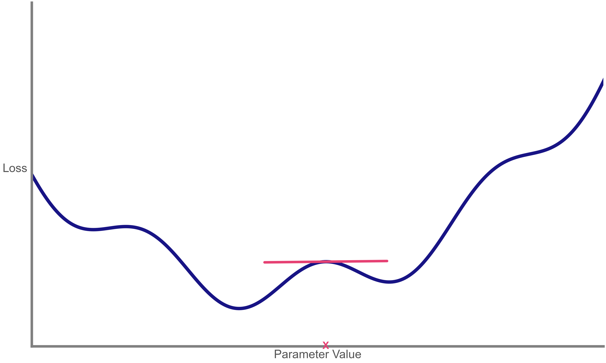
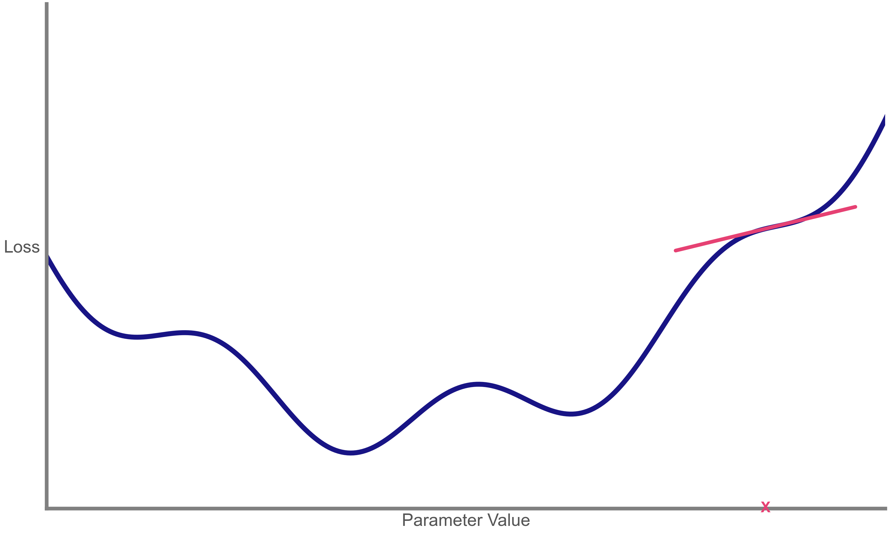
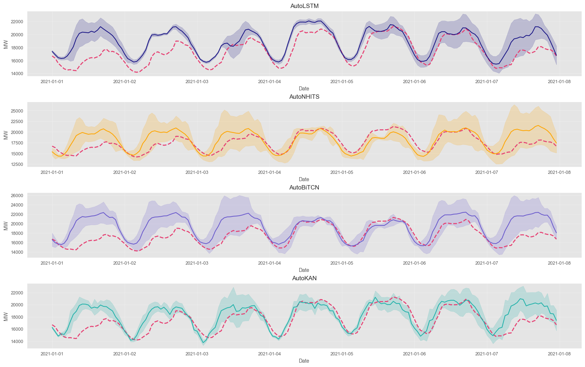

```{python}
#| label: setup
#| include: false

# --- 1. System & Warnings ---
import os
import warnings
import random

# Suppress warnings
warnings.filterwarnings("ignore")
warnings.filterwarnings("ignore", category=UserWarning, message=".*FigureCanvasAgg is non-interactive.*")

# Environment variables
os.environ["NIXTLA_ID_AS_COL"] = "true"

# --- 2. Data Science Stack ---
import numpy as np
import pandas as pd
import matplotlib as mpl
import matplotlib.pyplot as plt
import matplotlib.patches as patches
import matplotlib.path as mpath
import matplotlib.lines as mlines
import matplotlib.animation as animation
import seaborn as sns
from cycler import cycler

# Statistics & ML
import statsmodels.api as sm
from sklearn.linear_model import LinearRegression
from sklearn.neural_network import MLPRegressor

# --- 3. Forecasting & Deep Learning ---
from utilsforecast.plotting import plot_series as plot_series_utils
from utilsforecast.evaluation import evaluate
from utilsforecast.losses import mape
from mlforecast.utils import PredictionIntervals

# NeuralForecast
from neuralforecast import NeuralForecast
from neuralforecast.models import (
    MLP, NHITS, BiTCN, RNN, DeepAR, TimeLLM, 
    LSTM, KAN
)
from neuralforecast.losses.pytorch import DistributionLoss, MSE
from neuralforecast.auto import (
    AutoNHITS, AutoLSTM, AutoBiTCN, AutoKAN
)

# Custom / Course Utils (якщо fpppy є локальною бібліотекою курсу)
try:
    from fpppy.utils import plot_series
except ImportError:
    # Fallback if library is missing
    pass 

# --- 4. Configuration ---
# Seeds for reproducibility
np.random.seed(1)
random.seed(1)

# Pandas options
pd.set_option("max_colwidth", 100)
pd.set_option("display.precision", 3)

# Plotting Style
sns.set_style("whitegrid")
plt.style.use("ggplot")
plt.rcParams.update({
    "figure.figsize": (8, 5),
    "figure.dpi": 100,
    "savefig.dpi": 300,
    "figure.constrained_layout.use": True,
    "axes.titlesize": 12,
    "axes.labelsize": 10,
    "xtick.labelsize": 9,
    "ytick.labelsize": 9,
    "legend.fontsize": 9,
    "legend.title_fontsize": 10,
})

# Colors definition
red_pink   = "#e64173"
turquoise  = "#20B2AA"
orange     = "#FFA500"
red        = "#fb6107"
blue       = "#181485"
navy       = "#150E37FF"
green      = "#8bb174"
yellow     = "#D8BD44"
purple     = "#6A5ACD"
slate      = "#314f4f"

mpl.rcParams['axes.prop_cycle'] = cycler(color=["#000000", "#4E4EFA"])
```

# From Autoregression to Neural Networks

## The Foundation: AR(p) Revisited

Recall from **Lecture 07**: An Autoregressive Model of order $p$, **AR(p)**, forecasts the variable of interest using a linear combination of past values.

$$ y_t = c + \phi_1 y_{t-1} + \phi_2 y_{t-2} + \dots + \phi_p y_{t-p} + \varepsilon_t $$

::: {.callout-note appearance="simple"}
### Key Components
- **$y_{t-i}$**: The "Lags" (Past observations).
- **$\phi_i$**: The "Coefficients" (Weights).
- **$c$**: The "Intercept" (Bias).
- **$\varepsilon_t$**: White noise (Error).
:::

## AR(1) Visualized: Linearity

Let's generate a simple AR(1) process: $y_t = 18 - 0.8 y_{t-1} + \varepsilon_t$.
Notice the strictly **linear** relationship between $y_t$ and $y_{t-1}$.

```{python}
#| label: ar1-plot
#| fig-align: center

# Generate AR(1) Data
n = 200
y = np.zeros(n)
y[0] = 0
c = 18
phi = -0.8
# Noise is handled by random.normal inside loop, but we seeded globally

for t in range(1, n):
    y[t] = c + phi * y[t-1] + np.random.normal(0, 5)

# Create DataFrame for plotting
df = pd.DataFrame({'y_t': y[1:], 'y_t-1': y[:-1]})

# Plot
plt.figure(figsize=(10, 5))
sns.regplot(x='y_t-1', y='y_t', data=df, 
            scatter_kws={'alpha':0.6}, line_kws={'color':'red'})
plt.title(f'Autoregression implies Linearity\nCorrelation: {df.corr().iloc[0,1]:.2f}')
plt.show()
```

## AR(p) as a Network Structure

If we visualize the equation $y_t = c + \sum \phi_i y_{t-i}$, it looks suspiciously like a **Single Layer Perceptron** (without a non-linear activation function).

::: {.columns}
::: {.column width="40%"}
**AR equation:**
$$ \hat{y}_t = c + \phi_1 y_{t-1} + \phi_2 y_{t-2} $$
:::

::: {.column width="60%"}
```{mermaid}
graph LR
    subgraph Input_Layer [Input Layer: Lags]
    L1(y<sub>t-1</sub>)
    L2(y<sub>t-2</sub>)
    B(1)
    end

    subgraph Output_Node [Output Node]
    S((Σ))
    end

    L1 -- "φ<sub>1</sub>" --> S
    L2 -- "φ<sub>2</sub>" --> S
    B -- "c (bias)" --> S
    
    S --> Out(y<sub>t</sub>)

    style Input_Layer fill:#f9f9f9,stroke:#333,stroke-width:2px
    style S fill:#ffcccc,stroke:#333,stroke-width:2px
```
:::
:::

## The Rosetta Stone: Time Series vs. DL

Since you are taking the **Deep Learning** course, let's translate the terminology.

| Time Series (AR) | Deep Learning (NN) |
|:---:|:---:|
| **Lags** ($y_{t-1}, y_{t-2}$) | **Input Features** ($x_1, x_2$) |
| **Coefficients** ($\phi_i$) | **Weights** ($w_i$) |
| **Intercept** ($c$) | **Bias** ($b$) |
| **Forecast** ($\hat{y}_t$) | **Prediction** ($\hat{y}$) |
| **Linear Model** | **No Activation** (Linear) |

::: {.fragment .fade-up}
**Conclusion:** A simple linear regression on time series lags is equivalent to a **Neural Network with 0 hidden layers**.
:::

## NNAR: Neural Network Autoregression

To move from ARIMA to "AI", we simply add **Hidden Layers** and **Non-linear Activations** (like Sigmoid or ReLU).

This allows the model to capture **non-linear dependencies** (e.g., saturation effects, complex cycles).

**Architecture NNAR(p, k):**

*   **$p$**: Number of lags (Inputs).
*   **$k$**: Number of neurons in the hidden layer.

## NNAR Architecture Visualized

**NNAR(2, 2):** 2 Lags, 2 Hidden Neurons.
$$ y_t = f(\text{Network}(y_{t-1}, y_{t-2})) $$

```{mermaid}
%%| echo: false
graph LR
    subgraph Inputs
    I1("y<sub>t-1</sub>")
    I2("y<sub>t-2</sub>")
    end

    subgraph Hidden_Layer [Hidden Layer<br>ReLU/Sigmoid]
    H1(("h<sub>1</sub>"))
    H2(("h<sub>2</sub>"))
    end

    subgraph Output
    O(("y<sub>t</sub>"))
    end

    I1 --> H1
    I1 --> H2
    I2 --> H1
    I2 --> H2

    H1 --> O
    H2 --> O

    style Hidden_Layer fill:#e1f5fe,stroke:#01579b
    style Output fill:#fff3e0,stroke:#e65100
```

## Non-linear Autoregression Example

Let's see what happens when the relationship is **not** linear (e.g., $y_t = \sin(y_{t-1})$). A standard AR model fails here, but a Neural Network adapts.

```{python}
#| label: nnar-demo
#| echo: true
#| fig-align: center

# Generate Non-linear Data: y_t = sin(y_{t-1}) * 4 + noise
x_range = np.linspace(-3, 3, 100).reshape(-1, 1)
y_nonlinear = np.sin(x_range) * 4 + np.random.normal(0, 0.2, (100, 1))

# Fit Models
# 1. Linear (AR equivalent)
lin_reg = LinearRegression().fit(x_range, y_nonlinear)

# 2. Neural Net (MLP)
mlp = MLPRegressor(hidden_layer_sizes=(10,10), activation='tanh', max_iter=2000, random_state=42)
mlp.fit(x_range, y_nonlinear.ravel())

# Plot
plt.figure(figsize=(10, 5))
plt.scatter(x_range, y_nonlinear, color='gray', label='Data (Non-linear)', alpha=0.5)
plt.plot(x_range, lin_reg.predict(x_range), color='red', linestyle='--', label='AR (Linear) Fit', linewidth=2)
plt.plot(x_range, mlp.predict(x_range), color='blue', label='NNAR (Non-linear) Fit', linewidth=2)
plt.xlabel("y(t-1)")
plt.ylabel("y(t)")
plt.legend()
plt.title("Why we need Neural Networks: Capturing Non-linearity")
plt.show()
```

## Summary: From AR to MLP {.smaller}

1.  **Feed-Forward Networks (MLP)** applied to time series are essentially **Non-linear Autoregressive Models**.
2.  They treat time simply as a set of features (lags).
3.  **Limitations:**
    *   Fixed input window size (cannot handle variable length history easily).
    *   No concept of "sequence" or "time flow" — inputs are treated as independent features.
    *   "Stateless" (no memory of previous internal states).

::: {.callout-important}
**Next Up:** How do we introduce "Memory" and handle sequences properly? Enter **Recurrent Neural Networks (RNNs)**.
:::

# Recurrent Neural Networks (RNNs)

## The Problem with Feed-Forward (MLP)

In the previous section, we treated time series as a fixed set of features:
$$ y_t = f(y_{t-1}, y_{t-2}, y_{t-3}) $$

**The "Stateless" Problem:**

1.  **Fixed Input:** What if we want to use 50 days of history? The input layer becomes huge.
2.  **No Order:** If we shuffle the inputs $y_{t-1}$ and $y_{t-2}$, a standard dense layer just learns new weights. It doesn't inherently understand *sequence*.
3.  **No Memory:** The network forgets everything once the prediction is made.

## The Solution: A Feedback Loop

**Idea:** What if the network could pass information to *itself* in the future?

We introduce a **Hidden State ($h_t$)** — a vector representing the "context" or "memory" of the sequence up to time $t$.

::: {.columns}
::: {.column width="40%"}
**The Concept:**
Input $x_t$ goes in, passes through the hidden layer, and the output of the hidden layer loops back to be used for the next step.
:::

::: {.column width="60%"}

```{mermaid}
%%| echo: false
graph LR
    %% -- Styles --
    classDef blue stroke:#0077be,stroke-width:2px,fill:white,color:black;
    classDef green stroke:#2ca02c,stroke-width:2px,fill:white,color:black;
    classDef plain fill:none,stroke:none,color:black;
    
    %% -- Nodes --
    Input[Input]:::blue
    
    %% Using subgraphs or labeled nodes to mimic the w1/box structure
    W1["w1<br/>[ x 1.8 ]"]:::blue
    
    Sum(sum):::plain
    
    B1["b1<br/>[ + 0.0 ]"]:::blue
    
    %% Representing the ReLU graph as a distinct node
    ReLU["Activation<br/>__/"]:::blue
    
    W3["w3<br/>[ x 1.1 ]"]:::green
    
    B2["b2<br/>[ + 0.0 ]"]:::green
    
    Output[Output]:::green
    
    W2["w2<br/>[ x -0.5 ]"]:::blue

    %% -- Connections --
    Input --> W1 
    W1 --> Sum 
    Sum --> B1 
    B1 --> ReLU
    ReLU --> W3 
    W3 --> B2 
    B2 --> Output
    
    %% The Recurrent Loop
    ReLU --> W2
    W2 --> Sum
    
    %% Styling the loop link to be blue
    linkStyle 7,8 stroke:#005580,stroke-width:2px,fill:none;
    linkStyle 0,1,2,3 stroke:#0077be,stroke-width:2px;
    linkStyle 4,5,6 stroke:#2ca02c,stroke-width:2px;
```
:::
:::

## The Concept

```{mermaid}
%%| echo: false
graph LR
    %% -- Styles --
    classDef blue stroke:#0077be,stroke-width:2px,fill:white,color:black;
    classDef green stroke:#2ca02c,stroke-width:2px,fill:white,color:black;
    classDef plain fill:none,stroke:none,color:black;
    
    %% -- Nodes --
    Input[Input]:::blue
    
    %% Using subgraphs or labeled nodes to mimic the w1/box structure
    W1["w1<br/>[ x 1.8 ]"]:::blue
    
    Sum(sum):::plain
    
    B1["b1<br/>[ + 0.0 ]"]:::blue
    
    %% Representing the ReLU graph as a distinct node
    ReLU["Activation<br/>__/"]:::blue
    
    W3["w3<br/>[ x 1.1 ]"]:::green
    
    B2["b2<br/>[ + 0.0 ]"]:::green
    
    Output[Output]:::green
    
    W2["w2<br/>[ x -0.5 ]"]:::blue

    %% -- Connections --
    Input --> W1 
    W1 --> Sum 
    Sum --> B1 
    B1 --> ReLU
    ReLU --> W3 
    W3 --> B2 
    B2 --> Output
    
    %% The Recurrent Loop
    ReLU --> W2
    W2 --> Sum
    
    %% Styling the loop link to be blue
    linkStyle 7,8 stroke:#005580,stroke-width:2px,fill:none;
    linkStyle 0,1,2,3 stroke:#0077be,stroke-width:2px;
    linkStyle 4,5,6 stroke:#2ca02c,stroke-width:2px;
```

## Two Time Steps

```{mermaid}
%%| echo: false
graph LR
    %% -- СТИЛІ --
    classDef blue stroke:#0077be,stroke-width:2px,fill:white,color:black;
    classDef green stroke:#2ca02c,stroke-width:2px,fill:white,color:black;
    classDef plain fill:none,stroke:none,color:black;
    %% Стиль для "неактивних" (минулих) елементів - сірий колір
    classDef faded stroke:#cccccc,stroke-width:2px,fill:white,color:#cccccc;
    classDef border fill:none,stroke:#d4d4aa,stroke-width:1px,color:black;

    %% ==========================================
    %% 1. ROW: YESTERDAY (Top)
    %% ==========================================
    subgraph Day1 [Yesterday]
        direction LR
        D1_In[Input]:::blue
        D1_W1["w1<br/>[ x 1.8 ]"]:::blue
        D1_Sum(sum):::plain
        D1_B1["b1<br/>[ + 0.0 ]"]:::blue
        D1_Y["y1<br/>__/"]:::blue
        
        %% Сірі (Faded) елементи (оскільки це минулий крок)
        D1_W3["w3<br/>[ x 1.1 ]"]:::faded
        D1_B2["b2<br/>[ + 0.0 ]"]:::faded
        D1_Out["Predicted Value<br/>for Today"]:::faded
        
        %% Зв'язки рядка 1 (Індекси 0-6)
        D1_In --> D1_W1 --> D1_Sum --> D1_B1 --> D1_Y
        D1_Y --> D1_W3 --> D1_B2 --> D1_Out
    end

    %% Вага між рядком 1 та 2
    W2["w2<br/>[ x -0.5 ]"]:::blue

    %% ==========================================
    %% 2. ROW: TODAY (Bottom)
    %% ==========================================
    subgraph Day2 [Today]
        direction LR
        D2_In[Input]:::blue
        D2_W1["w1<br/>[ x 1.8 ]"]:::blue
        D2_Sum(sum):::plain
        D2_B1["b1<br/>[ + 0.0 ]"]:::blue
        D2_Y["y2<br/>__/"]:::blue
        
        %% Активні (Зелені) елементи (поточний прогноз)
        D2_W3["w3<br/>[ x 1.1 ]"]:::green
        D2_B2["b2<br/>[ + 0.0 ]"]:::green
        D2_Out["Predicted Value<br/>for Tomorrow"]:::green

        %% Зв'язки рядка 2 (Індекси 7-13)
        D2_In --> D2_W1 --> D2_Sum --> D2_B1 --> D2_Y
        D2_Y --> D2_W3 --> D2_B2 --> D2_Out
    end

    %% ==========================================
    %% РЕКУРЕНТНІ ЗВ'ЯЗКИ ТА ВИРІВНЮВАННЯ
    %% ==========================================

    %% Петля зворотного зв'язку (Індекси 14-15)
    D1_Y --> W2
    W2 --> D2_Sum

    %% Невидиме вирівнювання (Індекс 16)
    D1_In ~~~ D2_In

    %% ==========================================
    %% НАЛАШТУВАННЯ КОЛЬОРІВ ЛІНІЙ
    %% ==========================================
    class Day1,Day2 border
    
    %% 1. СИНІ ЛІНІЇ (Вхід -> Активація) для обох рядків
    %% Рядок 1: 0,1,2,3 | Рядок 2: 7,8,9,10
    linkStyle 0,1,2,3,7,8,9,10 stroke:#0077be,stroke-width:2px;

    %% 2. СІРІ ЛІНІЇ (Активація -> Вихід) для Yesterday
    %% Рядок 1: 4,5,6
    linkStyle 4,5,6 stroke:#cccccc,stroke-width:2px;

    %% 3. ЗЕЛЕНІ ЛІНІЇ (Активація -> Вихід) для Today
    %% Рядок 2: 11,12,13
    linkStyle 11,12,13 stroke:#2ca02c,stroke-width:2px;

    %% 4. РЕКУРЕНТНА ПЕТЛЯ (Світло-синя дуга між шарами)
    %% Зв'язки через W2: 14,15
    linkStyle 14,15 stroke:#0099ff,stroke-width:2px;

    %% Приховати лінію вирівнювання (16)
    linkStyle 16 stroke-width:0px;
```

## Three Time Steps

```{mermaid}
%%| echo: false
graph LR
    %% -- СТИЛІ --
    classDef blue stroke:#0077be,stroke-width:2px,fill:white,color:black;
    classDef green stroke:#2ca02c,stroke-width:2px,fill:white,color:black;
    classDef plain fill:none,stroke:none,color:black;
    %% Стиль для "неактивних" (минулих) елементів - сірий колір
    classDef faded stroke:#cccccc,stroke-width:2px,fill:white,color:#cccccc;
    classDef border fill:none,stroke:#d4d4aa,stroke-width:1px,color:black;

    %% ==========================================
    %% 1. ROW: DAY BEFORE YESTERDAY
    %% ==========================================
    subgraph Day1 [Day Before Yesterday]
        direction LR
        D1_In[Input]:::blue
        D1_W1["w1<br/>[ x 1.8 ]"]:::blue
        D1_Sum(sum):::plain
        D1_B1["b1<br/>[ + 0.0 ]"]:::blue
        D1_Y["y1<br/>__/"]:::blue
        
        %% Сірі (Faded) елементи
        D1_W3["w3<br/>[ x 1.1 ]"]:::faded
        D1_B2["b2<br/>[ + 0.0 ]"]:::faded
        D1_Out["Predicted Value<br/>for Yesterday"]:::faded
        
        %% Зв'язки рядка 1 (Індекси 0-6)
        D1_In --> D1_W1 --> D1_Sum --> D1_B1 --> D1_Y
        D1_Y --> D1_W3 --> D1_B2 --> D1_Out
    end

    %% Вага між рядком 1 та 2
    W2_1["w2<br/>[ x -0.5 ]"]:::blue

    %% ==========================================
    %% 2. ROW: YESTERDAY
    %% ==========================================
    subgraph Day2 [Yesterday]
        direction LR
        D2_In[Input]:::blue
        D2_W1["w1<br/>[ x 1.8 ]"]:::blue
        D2_Sum(sum):::plain
        D2_B1["b1<br/>[ + 0.0 ]"]:::blue
        D2_Y["y2<br/>__/"]:::blue
        
        %% Сірі (Faded) елементи
        D2_W3["w3<br/>[ x 1.1 ]"]:::faded
        D2_B2["b2<br/>[ + 0.0 ]"]:::faded
        D2_Out["Predicted Value<br/>for Today"]:::faded

        %% Зв'язки рядка 2 (Індекси 7-13)
        D2_In --> D2_W1 --> D2_Sum --> D2_B1 --> D2_Y
        D2_Y --> D2_W3 --> D2_B2 --> D2_Out
    end

    %% Вага між рядком 2 та 3
    W2_2["w2<br/>[ x -0.5 ]"]:::blue

    %% ==========================================
    %% 3. ROW: TODAY
    %% ==========================================
    subgraph Day3 [Today]
        direction LR
        D3_In[Input]:::blue
        D3_W1["w1<br/>[ x 1.8 ]"]:::blue
        D3_Sum(sum):::plain
        D3_B1["b1<br/>[ + 0.0 ]"]:::blue
        D3_Y["y3<br/>__/"]:::blue
        
        %% Активні (Зелені) елементи
        D3_W3["w3<br/>[ x 1.1 ]"]:::green
        D3_B2["b2<br/>[ + 0.0 ]"]:::green
        D3_Out["Predicted Value<br/>for Tomorrow"]:::green

        %% Зв'язки рядка 3 (Індекси 14-20)
        D3_In --> D3_W1 --> D3_Sum --> D3_B1 --> D3_Y
        D3_Y --> D3_W3 --> D3_B2 --> D3_Out
    end

    %% ==========================================
    %% РЕКУРЕНТНІ ЗВ'ЯЗКИ ТА ВИРІВНЮВАННЯ
    %% ==========================================

    %% Петлі зворотного зв'язку (Індекси 21-24)
    D1_Y --> W2_1
    W2_1 --> D2_Sum
    
    D2_Y --> W2_2
    W2_2 --> D3_Sum

    %% Невидиме вирівнювання (Індекси 25-26)
    D1_In ~~~ D2_In ~~~ D3_In

    %% ==========================================
    %% НАЛАШТУВАННЯ КОЛЬОРІВ ЛІНІЙ
    %% ==========================================
    class Day1,Day2,Day3 border
    
    %% 1. СИНІ ЛІНІЇ (Вхід -> Активація) для всіх рядків
    linkStyle 0,1,2,3,7,8,9,10,14,15,16,17 stroke:#0077be,stroke-width:2px;

    %% 2. СІРІ ЛІНІЇ (Активація -> Вихід) для минулих днів
    linkStyle 4,5,6,11,12,13 stroke:#cccccc,stroke-width:2px;

    %% 3. ЗЕЛЕНІ ЛІНІЇ (Активація -> Вихід) для поточного дня
    linkStyle 18,19,20 stroke:#2ca02c,stroke-width:2px;

    %% 4. РЕКУРЕНТНІ ПЕТЛІ (Світло-сині дуги)
    linkStyle 21,22,23,24 stroke:#0099ff,stroke-width:2px;

    %% Приховати лінії вирівнювання
    linkStyle 25,26 stroke-width:0px;
```

## Unrolling the RNN {.smaller}

To understand how it trains, we **unroll** the loop over time steps.
This transforms the RNN into a deep network where layers represent **time**, not depth.

```{mermaid}
%%| echo: false
graph LR
    %% -- Styles --
    classDef blue stroke:#0077be,stroke-width:2px,fill:white,color:black;
    classDef green stroke:#2ca02c,stroke-width:2px,fill:white,color:black;
    classDef plain fill:none,stroke:none,color:black;
    
    %% -- Nodes --
    Input[Input]:::blue
    
    %% Using subgraphs or labeled nodes to mimic the w1/box structure
    W1["w1"]:::blue
    
    Sum(sum):::plain
    
    B1["b1"]:::blue
    
    %% Representing the ReLU graph as a distinct node
    ReLU["Activation<br/>__/"]:::blue
    
    W3["w3"]:::green
    
    B2["b2"]:::green
    
    Output[Output]:::green
    
    W2["w2"]:::blue

    %% -- Connections --
    Input --> W1 
    W1 --> Sum 
    Sum --> B1 
    B1 --> ReLU
    ReLU --> W3 
    W3 --> B2 
    B2 --> Output
    
    %% The Recurrent Loop
    ReLU --> W2
    W2 --> Sum
    
    %% Styling the loop link to be blue
    linkStyle 7,8 stroke:#005580,stroke-width:2px,fill:none;
    linkStyle 0,1,2,3 stroke:#0077be,stroke-width:2px;
    linkStyle 4,5,6 stroke:#2ca02c,stroke-width:2px;
```

::: {.callout-important}
### Key Concept: Shared Weights and Biases
Notice that the weight matrix **$w_h$** is **exactly the same** at every time step. We are learning *one* rule for how memory evolves.

Similarly, the bias vector **$b$** is also shared across time steps.
:::

## Commonly used activation functions


```{python}
#| include: false
import matplotlib.pyplot as plt
import numpy as np

# Налаштування стилю графіків для імітації "математичних" осей
def plot_activation(ax, x, y, color, title=None):
    ax.plot(x, y, color=color, linewidth=3)
    
    # Прибираємо верхню та праву межі
    ax.spines['top'].set_visible(False)
    ax.spines['right'].set_visible(False)
    
    # Переміщуємо ліву та нижню межі у центр (0,0)
    ax.spines['left'].set_position('zero')
    ax.spines['bottom'].set_position('zero')
    
    # Додаємо стрілочки на кінцях осей (імітація)
    ax.plot(1, 0, ">k", transform=ax.get_yaxis_transform(), clip_on=False)
    ax.plot(0, 1, "^k", transform=ax.get_xaxis_transform(), clip_on=False)
    
    # Сітка та налаштування
    ax.grid(False)
    
    # Додаткові налаштування тіків, щоб текст не налізав на графік
    ax.tick_params(axis='both', which='major', labelsize=8)

# Функція для генерації окремого графіку та збереження його (для вставки в таблицю)
# Але в Quarto зручніше використовувати layout. 
# Нижче ми використаємо підхід з Matplotlib subplots для візуальної єдності.
```

::: columns
::: {.column width="33%"}
**Sigmoid**

$$g(z) = \frac{1}{1+e^{-z}}$$

```{python}
#| echo: false
#| fig-height: 3
#| fig-width: 3

x = np.linspace(-4, 4, 100)
y = 1 / (1 + np.exp(-x))

fig, ax = plt.subplots()
plot_activation(ax, x, y, color='#5D9BD2') # Soft Blue
ax.set_yticks([0, 0.5, 1])
ax.set_xticks([-4, 0, 4])
ax.set_ylim(-0.1, 1.1)
plt.show()
```
:::

::: {.column width="33%"}
**Tanh**

$$g(z) = \frac{e^z - e^{-z}}{e^z + e^{-z}}$$

```{python}
#| echo: false
#| fig-height: 3
#| fig-width: 3

x = np.linspace(-4, 4, 100)
y = np.tanh(x)

fig, ax = plt.subplots()
plot_activation(ax, x, y, color='#6BC4BC') # Teal
ax.set_yticks([-1, 0, 1])
ax.set_xticks([-4, 0, 4])
ax.set_ylim(-1.1, 1.1)
plt.show()
```
:::

::: {.column width="34%"}
**RELU**

$$g(z) = \max(0, z)$$

```{python}
#| echo: false
#| fig-height: 3
#| fig-width: 3

x = np.linspace(-1.5, 1.5, 100)
y = np.maximum(0, x)

fig, ax = plt.subplots()
plot_activation(ax, x, y, color='#F9C851') # Yellow/Orange
ax.set_yticks([0, 1])
ax.set_xticks([0, 1])
ax.set_ylim(-0.5, 1.5)
ax.set_xlim(-1.5, 1.5)
plt.show()
```
:::
:::

## Many-to-One Forecasting {.smaller}

In Time Series forecasting, we typically use a **Many-to-One** architecture.
We process a window of history (Sequence), ignore intermediate outputs, and use the **final hidden state** to predict the next value.

```{mermaid}
%%| echo: false
graph LR
    x1(x<sub>t-2</sub>) --> h1((h))
    x2(x<sub>t-1</sub>) --> h2((h))
    x3(x<sub>t</sub>) --> h3((h))
    
    h1 --> h2
    h2 --> h3
    h3 --> y(y<sub>t+1</sub>)

    style y fill:#ffcc00,stroke:#333,stroke-width:2px
    style h3 fill:#99ff99,stroke:#333
```

1.  Feed `[Day 1, Day 2, Day 3]` sequentially.
2.  Accumulate context in $h$.
3.  Predict `Day 4` using only the final state.

## The Problem: Vanishing/Exploding Gradients {.smaller}

::: {.columns}
::: {.column}
The Vanishing/Exploding Gradients problem has to do with the weight along the squiggle that we copy each time we unroll the RNN. 

If the weights are small (vanishing gradients), the signal diminishes quickly. If the weights are large (exploding gradients), the signal grows uncontrollably.

::: {.callout-note}
We're going to ignore the other weights and biases in the RNN for simplicity.
:::
:::
::: {.column}
```{python}
#| echo: false
import matplotlib.pyplot as plt
import matplotlib.patches as patches
import matplotlib.path as mpath

def draw_faded_rnn():
    # Налаштування фігури
    fig, ax = plt.subplots(figsize=(6, 6)) # Трохи вища, щоб вмістити 5 блоків комфортно
    ax.set_xlim(-1, 9)
    ax.set_ylim(-1, 10)
    ax.axis('off')

    # Константи
    NUM_STEPS = 5
    BOX_SIZE = 1.2
    VERTICAL_SPACING = 2.2
    
    # Координати X
    X_INPUT = 0
    X_HIDDEN = 4
    X_OUTPUT = 8
    
    # Кольори (підібрані під скріншот)
    # "Faded" - бліді кольори для входу/виходу
    COLOR_BLUE_FADED = '#BFE6F7'   
    COLOR_BLUE_STRONG = '#4CA9F0'  # Яскравий синій (центр + рекурсія)
    COLOR_GREEN_FADED = '#C3EBC5'  # Блідий зелений (вихідна стрілка)
    COLOR_GREEN_BORDER = '#8CDC8C' # Трохи темніший для рамки виходу
    COLOR_GREY = '#999999'
    COLOR_AXIS = '#D0D0D0'

    for i in range(NUM_STEPS):
        # Y координата (малюємо зверху вниз)
        y_center = (NUM_STEPS - 1 - i) * VERTICAL_SPACING
        
        # --- 1. INPUT (Ліворуч, Блідий) ---
        rect_in = patches.Rectangle(
            (X_INPUT - BOX_SIZE/2, y_center - BOX_SIZE/2), 
            BOX_SIZE, BOX_SIZE, 
            linewidth=3, edgecolor=COLOR_BLUE_FADED, facecolor='white', zorder=10
        )
        ax.add_patch(rect_in)

        # Стрілка Input -> Hidden (Блідо-блакитна)
        arrow_in = patches.FancyArrowPatch(
            (X_INPUT + BOX_SIZE/2, y_center), 
            (X_HIDDEN - BOX_SIZE/2, y_center),
            arrowstyle='-|>,head_width=0.4,head_length=0.8', 
            mutation_scale=20, color=COLOR_BLUE_FADED, linewidth=3, zorder=5
        )
        ax.add_patch(arrow_in)

        # --- 2. HIDDEN / ACTIVATION (Центр, Яскравий) ---
        rect_hidden = patches.Rectangle(
            (X_HIDDEN - BOX_SIZE/2, y_center - BOX_SIZE/2), 
            BOX_SIZE, BOX_SIZE, 
            linewidth=3, edgecolor=COLOR_BLUE_STRONG, facecolor='white', zorder=10
        )
        ax.add_patch(rect_hidden)

        # --- Графік ReLU всередині ---
        # Координати всередині квадрата
        h_left = X_HIDDEN - BOX_SIZE/2 + 0.15
        h_right = X_HIDDEN + BOX_SIZE/2 - 0.15
        h_bottom = y_center - BOX_SIZE/2 + 0.15
        h_top = y_center + BOX_SIZE/2 - 0.15
        h_mid_x = X_HIDDEN
        h_mid_y = y_center - 0.2

        # Осі (сірі)
        ax.plot([h_mid_x, h_mid_x], [h_bottom, h_top], color=COLOR_AXIS, linewidth=2, zorder=11)
        ax.plot([h_left, h_right], [h_mid_y, h_mid_y], color=COLOR_AXIS, linewidth=2, zorder=11)
        
        # Засічки на осях
        ax.plot([h_mid_x-0.05, h_mid_x], [h_mid_y + 0.3, h_mid_y + 0.3], color=COLOR_AXIS, linewidth=2, zorder=11)
        ax.plot([h_mid_x-0.05, h_mid_x], [h_mid_y + 0.6, h_mid_y + 0.6], color=COLOR_AXIS, linewidth=2, zorder=11)
        ax.plot([h_mid_x + 0.3, h_mid_x + 0.3], [h_mid_y, h_mid_y - 0.05], color=COLOR_AXIS, linewidth=2, zorder=11)
        ax.plot([h_mid_x - 0.3, h_mid_x - 0.3], [h_mid_y, h_mid_y - 0.05], color=COLOR_AXIS, linewidth=2, zorder=11)

        # Лінія ReLU (Жирна сіра)
        ax.plot([h_left, h_mid_x], [h_mid_y, h_mid_y], color=COLOR_GREY, linewidth=4, zorder=12)
        ax.plot([h_mid_x, h_right], [h_mid_y, h_top], color=COLOR_GREY, linewidth=4, zorder=12)

        # --- 3. OUTPUT (Праворуч, Блідо-зелений) ---
        rect_out = patches.Rectangle(
            (X_OUTPUT - BOX_SIZE/2, y_center - BOX_SIZE/2), 
            BOX_SIZE, BOX_SIZE, 
            linewidth=3, edgecolor=COLOR_GREEN_BORDER, facecolor='white', zorder=10
        )
        ax.add_patch(rect_out)

        # Стрілка Hidden -> Output (Блідо-зелена)
        arrow_out = patches.FancyArrowPatch(
            (X_HIDDEN + BOX_SIZE/2, y_center), 
            (X_OUTPUT - BOX_SIZE/2, y_center),
            arrowstyle='-|>,head_width=0.4,head_length=0.8', 
            mutation_scale=20, color=COLOR_GREEN_FADED, linewidth=3, zorder=5
        )
        ax.add_patch(arrow_out)

        # --- 4. RECURRENT CONNECTION (Яскраво-синя петля) ---
        if i < NUM_STEPS - 1:
            next_y_center = (NUM_STEPS - 1 - (i + 1)) * VERTICAL_SPACING
            
            # Точки для кривої Безьє
            # Початок: правий край поточного квадрата
            start_pt = (X_HIDDEN + BOX_SIZE/2, y_center)
            # Кінець: лівий край наступного квадрата (трохи зміщений, щоб стрілка входила красиво)
            end_pt = (X_HIDDEN - BOX_SIZE/2 + 0.1, next_y_center + 0.2)
            
            # Контрольні точки для сильного S-вигину
            # C1 тягне сильно вправо
            c1 = (X_HIDDEN + BOX_SIZE/2 + 2.5, y_center)
            # C2 тягне сильно вліво (під наступний блок), створюючи петлю
            c2 = (X_HIDDEN - BOX_SIZE/2 - 1.5, next_y_center + 0.5)

            # Малюємо лінію
            verts = [start_pt, c1, c2, end_pt]
            codes = [mpath.Path.MOVETO, mpath.Path.CURVE4, mpath.Path.CURVE4, mpath.Path.CURVE4]
            path = mpath.Path(verts, codes)
            
            patch_curve = patches.PathPatch(path, facecolor='none', edgecolor=COLOR_BLUE_STRONG, linewidth=3, zorder=4)
            ax.add_patch(patch_curve)
            
            # Додаємо наконечник стрілки в кінці шляху
            ax.annotate('', xy=end_pt, xytext=c2,
                        arrowprops=dict(arrowstyle='-|>,head_width=0.4,head_length=0.8', 
                                        color=COLOR_BLUE_STRONG, lw=0),
                        zorder=5)
            
            # --- Текст W2 ---
            # Розміщуємо текст приблизно посередині між рядками, зміщений вправо
            text_x = X_HIDDEN + 1.8
            text_y = (y_center + next_y_center) / 2
            ax.text(text_x, text_y, r'$\mathbf{w_2}$', fontsize=14, fontweight='bold', color='black', zorder=20)

    plt.tight_layout()
    plt.show()

draw_faded_rnn()
```
:::
:::

## Exploding Gradients {.smaller}

::: {.columns}
::: {.column}
In our example, if $w_2 > 1$, the gradients will grow exponentially.

- Let's say we have a sequence of length 5.
- The gradient at the output layer will be multiplied by $w_2$ four times (once for each time step back).
- If $w_2 = 2$

$$
\begin{align*}
\text{Input}_1 \times 2^4 &= \text{Input}_1 \times 16 \\
&= \text{Input}_1 \times w_2^{\text{n.unroll}}
\end{align*}
$$

What happens if we increase the sequence length?

:::
::: {.column}
```{python}
#| echo: false
import matplotlib.pyplot as plt
import matplotlib.patches as patches
import matplotlib.path as mpath

def draw_rnn_with_multipliers(value = "x 2"):
    # Налаштування фігури
    fig, ax = plt.subplots(figsize=(6, 6))
    ax.set_xlim(-2, 9)
    ax.set_ylim(-1, 11)
    ax.axis('off')

    # Константи
    NUM_STEPS = 5
    BOX_SIZE = 1.2
    VERTICAL_SPACING = 2.4
    
    # Координати X
    X_INPUT = 0
    X_HIDDEN = 4
    X_OUTPUT = 8
    
    # Кольори
    COLOR_BLUE_STRONG = '#4CA9F0'
    COLOR_BLUE_FADED = '#D6EAF8'  # Дуже блідий синій
    COLOR_GREEN_TEXT = '#2ca02c'
    COLOR_GREEN_FADED = '#C3EBC5'
    COLOR_GREY = '#999999'
    COLOR_GREY_FADED = '#E0E0E0'
    COLOR_AXIS = '#D0D0D0'

    for i in range(NUM_STEPS):
        y_center = (NUM_STEPS - 1 - i) * VERTICAL_SPACING
        
        # Логіка прозорості:
        # Останній блок (i=4) - faded
        # Верхній блок (i=0) - Input активний
        is_last = (i == NUM_STEPS - 1)
        is_first = (i == 0)

        # Визначаємо стилі для Hidden блоку
        hidden_border = COLOR_BLUE_FADED if is_last else COLOR_BLUE_STRONG
        hidden_graph_color = COLOR_GREY_FADED if is_last else COLOR_GREY
        hidden_axis_color = '#EEEEEE' if is_last else COLOR_AXIS

        # --- 1. INPUT BOXES ---
        if is_first:
            # Верхній блок - Широкий і активний
            rect_in = patches.Rectangle(
                (X_INPUT - 1.0, y_center - BOX_SIZE/2), # Ширший вліво
                2.2, BOX_SIZE, # Ширина 2.2
                linewidth=3, edgecolor=COLOR_BLUE_STRONG, facecolor='white', zorder=10
            )
            ax.add_patch(rect_in)
            ax.text(X_INPUT + 0.1, y_center, r'Input$_1$', fontsize=16, ha='center', va='center')
            
            # Активна стрілка
            arrow_in = patches.FancyArrowPatch(
                (X_INPUT + 1.2, y_center), (X_HIDDEN - BOX_SIZE/2, y_center),
                arrowstyle='-|>,head_width=0.4,head_length=0.8', 
                mutation_scale=20, color=COLOR_BLUE_STRONG, linewidth=3, zorder=5
            )
        else:
            # Інші блоки - Квадратні і бліді
            rect_in = patches.Rectangle(
                (X_INPUT - BOX_SIZE/2, y_center - BOX_SIZE/2), 
                BOX_SIZE, BOX_SIZE, 
                linewidth=3, edgecolor=COLOR_BLUE_FADED, facecolor='white', zorder=10
            )
            ax.add_patch(rect_in)
            
            # Бліда стрілка
            arrow_in = patches.FancyArrowPatch(
                (X_INPUT + BOX_SIZE/2, y_center), (X_HIDDEN - BOX_SIZE/2, y_center),
                arrowstyle='-|>,head_width=0.4,head_length=0.8', 
                mutation_scale=20, color=COLOR_BLUE_FADED, linewidth=3, zorder=5
            )
        ax.add_patch(arrow_in)


        # --- 2. HIDDEN / RELU BOX ---
        rect_hidden = patches.Rectangle(
            (X_HIDDEN - BOX_SIZE/2, y_center - BOX_SIZE/2), 
            BOX_SIZE, BOX_SIZE, 
            linewidth=3, edgecolor=hidden_border, facecolor='white', zorder=10
        )
        ax.add_patch(rect_hidden)

        # Графік всередині
        h_left = X_HIDDEN - BOX_SIZE/2 + 0.15
        h_right = X_HIDDEN + BOX_SIZE/2 - 0.15
        h_bottom = y_center - BOX_SIZE/2 + 0.15
        h_top = y_center + BOX_SIZE/2 - 0.15
        h_mid_x = X_HIDDEN
        h_mid_y = y_center - 0.2

        # Осі
        ax.plot([h_mid_x, h_mid_x], [h_bottom, h_top], color=hidden_axis_color, linewidth=2, zorder=11)
        ax.plot([h_left, h_right], [h_mid_y, h_mid_y], color=hidden_axis_color, linewidth=2, zorder=11)
        # ReLU лінія
        ax.plot([h_left, h_mid_x], [h_mid_y, h_mid_y], color=hidden_graph_color, linewidth=4, zorder=12)
        ax.plot([h_mid_x, h_right], [h_mid_y, h_top], color=hidden_graph_color, linewidth=4, zorder=12)

        # --- 3. OUTPUT BOXES (Всі бліді) ---
        rect_out = patches.Rectangle(
            (X_OUTPUT - BOX_SIZE/2, y_center - BOX_SIZE/2), 
            BOX_SIZE, BOX_SIZE, 
            linewidth=3, edgecolor=COLOR_GREEN_FADED, facecolor='white', zorder=10
        )
        ax.add_patch(rect_out)
        
        arrow_out = patches.FancyArrowPatch(
            (X_HIDDEN + BOX_SIZE/2, y_center), (X_OUTPUT - BOX_SIZE/2, y_center),
            arrowstyle='-|>,head_width=0.4,head_length=0.8', 
            mutation_scale=20, color=COLOR_GREEN_FADED, linewidth=3, zorder=5
        )
        ax.add_patch(arrow_out)

        # --- 4. RECURRENT CONNECTION (PETLIA) ---
        # Малюємо тільки якщо є наступний елемент
        if i < NUM_STEPS - 1:
            next_y_center = (NUM_STEPS - 1 - (i + 1)) * VERTICAL_SPACING
            
            # Bezier Curve
            start_pt = (X_HIDDEN + BOX_SIZE/2, y_center)
            end_pt = (X_HIDDEN - BOX_SIZE/2 + 0.1, next_y_center + 0.2)
            c1 = (X_HIDDEN + BOX_SIZE/2 + 2.0, y_center) # Тягнемо вправо
            c2 = (X_HIDDEN - BOX_SIZE/2 - 1.0, next_y_center + 0.8) # Тягнемо вліво і вгору

            verts = [start_pt, c1, c2, end_pt]
            codes = [mpath.Path.MOVETO, mpath.Path.CURVE4, mpath.Path.CURVE4, mpath.Path.CURVE4]
            path = mpath.Path(verts, codes)
            
            # Стрілка завжди яскрава, навіть якщо вказує на блідий блок
            patch_curve = patches.PathPatch(path, facecolor='none', edgecolor=COLOR_BLUE_STRONG, linewidth=3, zorder=4)
            ax.add_patch(patch_curve)
            
            # Наконечник стрілки
            ax.annotate('', xy=end_pt, xytext=c2,
                        arrowprops=dict(arrowstyle='-|>,head_width=0.4,head_length=0.8', 
                                        color=COLOR_BLUE_STRONG, lw=0), zorder=5)
            
            # --- BOX "x 2" ---
            # Знаходимо координати для боксу (приблизно в нижній третині між шарами)
            box_x = X_HIDDEN + 1.2
            box_y = next_y_center + 0.8 
            
            # Малюємо білий прямокутник з синьою рамкою
            box_w, box_h = 0.8, 0.5
            rect_mult = patches.Rectangle(
                (box_x, box_y), box_w, box_h,
                linewidth=1.5, edgecolor=COLOR_BLUE_STRONG, facecolor='white', zorder=20
            )
            ax.add_patch(rect_mult)
            
            # Текст "x 2" (зелений)
            ax.text(box_x + box_w/2, box_y + box_h/2, value, 
                    fontsize=12, fontweight='bold', color=COLOR_GREEN_TEXT, 
                    ha='center', va='center', zorder=21)
            
            # Текст "w2" (чорний, праворуч від боксу)
            ax.text(box_x + box_w + 0.1, box_y + box_h/2 - 0.05, r'$\mathbf{w_2}$', 
                    fontsize=14, color='black', ha='left', va='center', zorder=21)

    plt.tight_layout()
    plt.show()

draw_rnn_with_multipliers()
```
:::
:::

## Exploding Gradients

$$
\frac{d S S R}{d w_1}=\frac{d S S R}{d \text { Predicted }} \times \frac{d \text { Predicted }}{d y_2} \times \frac{d y_2}{d x_2} \times \color{red}{\frac{d x_2}{d w_1}}+\ldots
$$

$$
\color{red}{\frac{d x_2}{d w_1}}=\frac{d}{d w_1} \text{Input}_1 \times{w_1} \times \color{red}{w_2{ }^{50}} \ldots
$$

It hard to takes small steps to find the optimal weights and biases.

## Exploding Gradients

```{python}
#| eval: false
#| echo: false
import numpy as np
import matplotlib.pyplot as plt
import matplotlib.animation as animation
from matplotlib.patches import FancyArrowPatch

# --- 1. Налаштування функції втрат ---
# Використовуємо функцію, яка має локальні мінімуми та круті стінки
def loss_function(x):
    # f(x) = 0.5*x^2 + 2*sin(1.5*x) -> створює "хвилясту" чашу
    return 0.3 * x**2 + 2 * np.sin(1.5 * x)

def gradient(x):
    # Похідна f'(x) = 0.6*x + 3*cos(1.5*x)
    return 0.6 * x + 3 * np.cos(1.5 * x)

# --- 2. Параметри симуляції ---
start_x = 1.2      # Початкова точка (локальний горб)
learning_rate = 2    # ВЕЛИКИЙ learning rate для провокації вибуху
steps = 100          # Кількість кроків анімації

# Розрахунок історії кроків
history = []
current_x = start_x
for i in range(steps):
    grad = gradient(current_x)
    y_val = loss_function(current_x)
    history.append({'x': current_x, 'y': y_val, 'grad': grad})
    
    # Крок градієнтного спуску: x_new = x_old - lr * gradient
    current_x = current_x - learning_rate * grad

# --- 3. Налаштування графіка ---
fig, ax = plt.subplots(figsize=(10, 6))
x_range = np.linspace(-10, 10, 400)
y_range = loss_function(x_range)

# Стилізація під ваш приклад
ax.set_xlim(-6, 8)
ax.set_ylim(-5, 25)
ax.spines['top'].set_visible(False)
ax.spines['right'].set_visible(False)
ax.spines['left'].set_linewidth(3)
ax.spines['bottom'].set_linewidth(3)
ax.spines['left'].set_color('gray')
ax.spines['bottom'].set_color('gray')
ax.set_xticks([]) # Прибрати цифри
ax.set_yticks([])
ax.set_ylabel("Loss", fontsize=14, rotation=0, labelpad=20)
ax.set_xlabel("Parameter Value", fontsize=14)
ax.set_facecolor('white')

# Малюємо основну криву (синя)
ax.plot(x_range, y_range, color=blue, linewidth=4, zorder=1)

# Списки для об'єктів анімації
lines = []
crosses = []

# --- 4. Функція оновлення анімації ---
def update(frame):
    # Очищаємо попередні "активні" елементи, але залишаємо сліди (ghosting)
    for line in lines:
        line.remove()
    for cross in crosses:
        cross.remove()
    lines.clear()
    crosses.clear()
    
    # Малюємо історію (попередні кроки напівпрозорими)
    for i in range(frame + 1):
        step_data = history[i]
        x0 = step_data['x']
        y0 = step_data['y']
        grad0 = step_data['grad']
        
        # Логіка прозорості (останній крок - яскравий, старі - бліді)
        alpha = 0.2 if i < frame else 1.0
        
        # 1. Малюємо дотичну (Tangent Line) - Червона
        # Рівняння дотичної: y - y0 = m(x - x0) => y = m(x - x0) + y0
        tangent_range = 1.5 # Довжина лінії
        x_tan = np.linspace(x0 - tangent_range, x0 + tangent_range, 10)
        y_tan = grad0 * (x_tan - x0) + y0
        
        line, = ax.plot(x_tan, y_tan, color=red_pink, linewidth=3, alpha=alpha, zorder=2)
        lines.append(line)
        
        # 2. Малюємо Хрестик (X) на осі - Червоний
        # Малюємо 'X' як текст, тому що це простіше стилізувати під малюнок
        cross = ax.text(x0, -5, 'X', color=red_pink, fontsize=12,
                        fontweight='bold', alpha=alpha, ha='center', va='center', zorder=3)
        crosses.append(cross)
        
    return lines + crosses

# --- 5. Створення та збереження GIF ---
ani = animation.FuncAnimation(fig, update, frames=len(history), interval=800, blit=False)

# Збереження
output_filename = "slides/img/exploding_gradients.gif"
ani.save(output_filename, writer='pillow', fps=1.5)

print(f"Анімацію збережено як {output_filename}")
plt.close()
```

{fig-align="center"}

## Vanishing Gradients {.smaller}

::: {.columns}
::: {.column}
One way to prevent vanishing gradients would be to limit $w_2$ to values $< 1$.

However, this is not a complete solution. If $w_2$ is too small, the network may not learn effectively.

- If $w_2 = 0.5$

$$
\begin{align*}
\text{Input}_1 \times w_2^{\text{n.unroll}} &= \text{Input}_1 \times 0.5^{50} \\
&= \text{Input}_1 \times \frac{1}{2^{50}} \\
&= \text{Input}_1 \times \frac{1}{1125899906842624} \\
&\approx \text{Input}_1 \times 8.88 \times 10^{-15}
\end{align*}
$$

:::
::: {.column}

```{python}
#| echo: false

draw_rnn_with_multipliers(value = "x 0.5")
```
:::
:::

## Vanishing Gradients

```{python}
#| eval: false
#| echo: false
import numpy as np
import matplotlib.pyplot as plt
import matplotlib.animation as animation
from matplotlib.patches import FancyArrowPatch

# --- 1. Налаштування функції втрат ---
# Використовуємо функцію, яка має локальні мінімуми та круті стінки
def loss_function(x):
    # f(x) = 0.5*x^2 + 2*sin(1.5*x) -> створює "хвилясту" чашу
    return 0.3 * x**2 + 2 * np.sin(1.5 * x)

def gradient(x):
    # Похідна f'(x) = 0.6*x + 3*cos(1.5*x)
    return 0.6 * x + 3 * np.cos(1.5 * x)

# --- 2. Параметри симуляції ---
start_x = 6      # Початкова точка (локальний горб)
learning_rate = 0.5  
steps = 25          # Кількість кроків анімації

# Розрахунок історії кроків
history = []
current_x = start_x
for i in range(steps):
    grad = gradient(current_x)
    y_val = loss_function(current_x)
    history.append({'x': current_x, 'y': y_val, 'grad': grad})
    
    # Крок градієнтного спуску: x_new = x_old - lr * gradient
    current_x = current_x - learning_rate * grad

# --- 3. Налаштування графіка ---
fig, ax = plt.subplots(figsize=(10, 6))
x_range = np.linspace(-10, 10, 400)
y_range = loss_function(x_range)

# Стилізація під ваш приклад
ax.set_xlim(-6, 8)
ax.set_ylim(-5, 25)
ax.spines['top'].set_visible(False)
ax.spines['right'].set_visible(False)
ax.spines['left'].set_linewidth(3)
ax.spines['bottom'].set_linewidth(3)
ax.spines['left'].set_color('gray')
ax.spines['bottom'].set_color('gray')
ax.set_xticks([]) # Прибрати цифри
ax.set_yticks([])
ax.set_ylabel("Loss", fontsize=14, rotation=0, labelpad=20)
ax.set_xlabel("Parameter Value", fontsize=14)
ax.set_facecolor('white')

# Малюємо основну криву (синя)
ax.plot(x_range, y_range, color=blue, linewidth=4, zorder=1)

# Списки для об'єктів анімації
lines = []
crosses = []

# --- 4. Функція оновлення анімації ---
def update(frame):
    # Очищаємо попередні "активні" елементи, але залишаємо сліди (ghosting)
    for line in lines:
        line.remove()
    for cross in crosses:
        cross.remove()
    lines.clear()
    crosses.clear()
    
    # Малюємо історію (попередні кроки напівпрозорими)
    for i in range(frame + 1):
        step_data = history[i]
        x0 = step_data['x']
        y0 = step_data['y']
        grad0 = step_data['grad']
        
        # Логіка прозорості (останній крок - яскравий, старі - бліді)
        alpha = 0.2 if i < frame else 1.0
        
        # 1. Малюємо дотичну (Tangent Line) - Червона
        # Рівняння дотичної: y - y0 = m(x - x0) => y = m(x - x0) + y0
        tangent_range = 1.5 # Довжина лінії
        x_tan = np.linspace(x0 - tangent_range, x0 + tangent_range, 10)
        y_tan = grad0 * (x_tan - x0) + y0
        
        line, = ax.plot(x_tan, y_tan, color=red_pink, linewidth=3, alpha=alpha, zorder=2)
        lines.append(line)
        
        # 2. Малюємо Хрестик (X) на осі - Червоний
        # Малюємо 'X' як текст, тому що це простіше стилізувати під малюнок
        cross = ax.text(x0, -5, 'X', color=red_pink, fontsize=12,
                        fontweight='bold', alpha=alpha, ha='center', va='center', zorder=3)
        crosses.append(cross)
        
    return lines + crosses

# --- 5. Створення та збереження GIF ---
ani = animation.FuncAnimation(fig, update, frames=len(history), interval=800, blit=False)

# Збереження
output_filename = "slides/img/vanishing_gradients.gif"
ani.save(output_filename, writer='pillow', fps=1.5)

print(f"Анімацію збережено як {output_filename}")
plt.close()
```

{fig-align="center"}

## Summary: RNN Pros & Cons {.smaller}

| Pros | Cons |
|:---|:---|
| **Variable Length:** Can process inputs of any length (technically). | **Short-term Memory:** Due to vanishing gradients, standard RNNs struggle to link events far apart (e.g., season last year impacting today). |
| **Model Size:** Parameters do not increase with input length (Shared Weights). | **Computation:** Sequential processing is hard to parallelize (slow training). |
| **Context:** Captures "what happened before" naturally. | **Exploding Gradients:** Can lead to unstable training. |

::: {.fragment}
**Question:** How do we create a "Super Highway" for gradients to flow from the past to the present without vanishing?
**Answer:** The **Long Short-Term Memory (LSTM)** Network.
:::

# Long Short-Term Memory (LSTM) networks

## The Core Idea: Two Types of Memory {.smaller}

Standard RNNs have a "Goldfish memory" (Short-term only).
**LSTMs** introduce a second memory stream to solve this.

::: {.columns}
::: {.column width="50%"}
**1. Hidden State ($h_t$):**

*   [**Short-term**]{style="color:#4CA9F0;"} / Working memory.
*   Highly volatile.
*   Used for immediate predictions.

**2. Cell State ($C_t$):**

*   [**Long-term memory**]{style="color:#2ca02c;"}.
*   The "Conveyor Belt" or "Super Highway".
*   Runs straight down the entire chain with only minor linear interactions.
:::

::: {.column width="50%"}
```{python}
#| echo: false
import matplotlib.pyplot as plt
import matplotlib.patches as patches
import matplotlib.path as mpath

def draw_attention_rnn():
    # Налаштування полотна
    fig, ax = plt.subplots(figsize=(6, 6))
    ax.set_xlim(-2.5, 9.5) # Розширили межі для довгих назв
    ax.set_ylim(-1, 10)
    ax.axis('off')

    # Константи
    NUM_STEPS = 5
    BOX_SIZE = 1.2
    VERTICAL_SPACING = 2.2
    
    # Координати колонок
    X_INPUT = 0
    X_HIDDEN = 4
    X_OUTPUT = 8
    
    # Кольори
    COLOR_BLUE_STRONG = '#4CA9F0'
    COLOR_BLUE_FADED = '#D6EAF8' # Дуже світлий
    COLOR_GREEN_STRONG = '#2ca02c'
    COLOR_GREEN_FADED = '#E5F5E0' # Дуже світлий зелений
    COLOR_GREY = '#999999'
    COLOR_GREY_FADED = '#E0E0E0'
    COLOR_AXIS = '#D0D0D0'

    # Координати фінального (нижнього) блоку Output для стрілок
    final_y_center = (NUM_STEPS - 1 - 4) * VERTICAL_SPACING # i=4
    final_output_top = final_y_center + BOX_SIZE/2

    for i in range(NUM_STEPS):
        # Y координата (малюємо зверху вниз: i=0 це верх)
        y_center = (NUM_STEPS - 1 - i) * VERTICAL_SPACING
        
        # --- ЛОГІКА "АКТИВНОСТІ" ---
        # Визначаємо, які блоки яскраві, а які бліді, згідно з картинкою
        # Input: 0 (Long Ago), 3 (Yesterday), 4 (Today) - Активні
        is_input_active = (i == 0) or (i == 3) or (i == 4)
        
        # Output: Тільки останній (i=4) активний (Tomorrow)
        is_output_active = (i == NUM_STEPS - 1)
        
        # Hidden: Всі активні (сині)
        
        # --- 1. INPUT BLOCK ---
        in_color = COLOR_BLUE_STRONG if is_input_active else COLOR_BLUE_FADED
        in_face = 'white' # Завжди білий фон
        in_text_color = 'black' if is_input_active else '#DDDDDD'
        
        # Малюємо вхід
        # Для активних робимо прямокутник трохи ширшим під текст
        rect_w = 2.0 if is_input_active else BOX_SIZE
        rect_x = X_INPUT - rect_w/2 if is_input_active else X_INPUT - BOX_SIZE/2
        
        rect_in = patches.Rectangle(
            (rect_x, y_center - BOX_SIZE/2), 
            rect_w, BOX_SIZE, 
            linewidth=3, edgecolor=in_color, facecolor=in_face, zorder=10
        )
        ax.add_patch(rect_in)
        
        # Текстові мітки
        label = ""
        if i == 0: label = "Long Ago"
        elif i == 3: label = "Yesterday"
        elif i == 4: label = "Today"
        
        if label:
            ax.text(X_INPUT, y_center, label, fontsize=14, ha='center', va='center', color='black', fontweight='normal')

        # Стрілка Input -> Hidden
        arrow_in = patches.FancyArrowPatch(
            (rect_x + rect_w, y_center), (X_HIDDEN - BOX_SIZE/2, y_center),
            arrowstyle='-|>,head_width=0.4,head_length=0.8', 
            mutation_scale=20, color=in_color, linewidth=3, zorder=5
        )
        ax.add_patch(arrow_in)

        # --- 2. HIDDEN BLOCK (ReLU) ---
        # Всі Hidden блоки активні на картинці
        rect_hidden = patches.Rectangle(
            (X_HIDDEN - BOX_SIZE/2, y_center - BOX_SIZE/2), 
            BOX_SIZE, BOX_SIZE, 
            linewidth=3, edgecolor=COLOR_BLUE_STRONG, facecolor='white', zorder=10
        )
        ax.add_patch(rect_hidden)

        # Графік всередині
        h_left = X_HIDDEN - BOX_SIZE/2 + 0.15
        h_right = X_HIDDEN + BOX_SIZE/2 - 0.15
        h_bottom = y_center - BOX_SIZE/2 + 0.15
        h_top = y_center + BOX_SIZE/2 - 0.15
        h_mid_x = X_HIDDEN
        h_mid_y = y_center - 0.2

        ax.plot([h_mid_x, h_mid_x], [h_bottom, h_top], color=COLOR_AXIS, linewidth=2, zorder=11)
        ax.plot([h_left, h_right], [h_mid_y, h_mid_y], color=COLOR_AXIS, linewidth=2, zorder=11)
        ax.plot([h_left, h_mid_x], [h_mid_y, h_mid_y], color=COLOR_GREY, linewidth=4, zorder=12)
        ax.plot([h_mid_x, h_right], [h_mid_y, h_top], color=COLOR_GREY, linewidth=4, zorder=12)

        # --- 3. RECURRENT CONNECTION (Blue Loop) ---
        # Малюємо до наступного кроку
        if i < NUM_STEPS - 1:
            next_y_center = (NUM_STEPS - 1 - (i + 1)) * VERTICAL_SPACING
            
            # Bezier Curve logic
            start_pt = (X_HIDDEN + BOX_SIZE/2, y_center)
            end_pt = (X_HIDDEN - BOX_SIZE/2 + 0.1, next_y_center + 0.2)
            c1 = (X_HIDDEN + BOX_SIZE/2 + 2.0, y_center) 
            c2 = (X_HIDDEN - BOX_SIZE/2 - 1.0, next_y_center + 0.8) 

            verts = [start_pt, c1, c2, end_pt]
            codes = [mpath.Path.MOVETO, mpath.Path.CURVE4, mpath.Path.CURVE4, mpath.Path.CURVE4]
            path = mpath.Path(verts, codes)
            
            patch_curve = patches.PathPatch(path, facecolor='none', edgecolor=COLOR_BLUE_STRONG, linewidth=3, zorder=4)
            ax.add_patch(patch_curve)
            ax.annotate('', xy=end_pt, xytext=c2,
                        arrowprops=dict(arrowstyle='-|>,head_width=0.4,head_length=0.8', 
                                        color=COLOR_BLUE_STRONG, lw=0), zorder=5)

        # --- 4. OUTPUT BLOCK ---
        out_color = COLOR_GREEN_STRONG if is_output_active else COLOR_GREEN_FADED
        
        # Якщо активний - робимо ширшим для "Tomorrow"
        out_w = 2.4 if is_output_active else BOX_SIZE
        out_rect_x = X_OUTPUT - out_w/2 if is_output_active else X_OUTPUT - BOX_SIZE/2

        rect_out = patches.Rectangle(
            (out_rect_x, y_center - BOX_SIZE/2), 
            out_w, BOX_SIZE, 
            linewidth=3, edgecolor=out_color, facecolor='white', zorder=10
        )
        ax.add_patch(rect_out)
        
        if is_output_active:
            ax.text(X_OUTPUT, y_center, "Tomorrow", fontsize=14, ha='center', va='center', color='black')
        
        # Звичайна горизонтальна стрілка (Hidden -> Output)
        # Малюємо її блідою для всіх, крім останнього, або зеленою для останнього
        arrow_std_color = COLOR_GREEN_STRONG if is_output_active else COLOR_GREEN_FADED
        arrow_out = patches.FancyArrowPatch(
            (X_HIDDEN + BOX_SIZE/2, y_center), (out_rect_x, y_center),
            arrowstyle='-|>,head_width=0.4,head_length=0.8', 
            mutation_scale=20, color=arrow_std_color, linewidth=3, zorder=5
        )
        ax.add_patch(arrow_out)

        # --- 5. ATTENTION / SKIP CONNECTIONS (Big Green Arcs) ---
        # Від кожного минулого Hidden до фінального Output (Top side)
        if i < NUM_STEPS - 1:
            # Точка виходу: права сторона поточного Hidden
            start_att = (X_HIDDEN + BOX_SIZE/2, y_center + 0.2) # трохи вище центру
            # Точка входу: верхня грань фінального Output
            # Зміщуємо трохи вліво/вправо щоб стрілки не злипалися в одну точку
            offset_x = (i - 1.5) * 0.15 # невеликий розкид
            end_att = (X_OUTPUT + offset_x, final_output_top)
            
            # Використовуємо 'angle3' стиль для красивої дуги (Horizontal exit, Vertical entry)
            # angleA=0 (виходимо праворуч), angleB=90 (входимо вертикально зверху)
            arrow_att = patches.FancyArrowPatch(
                start_att, end_att,
                connectionstyle=f"angle3,angleA=0,angleB=90",
                arrowstyle='-|>,head_width=0.4,head_length=0.8', 
                mutation_scale=20, color=COLOR_GREEN_STRONG, linewidth=3, zorder=20
            )
            ax.add_patch(arrow_att)

    plt.tight_layout()
    plt.show()

draw_attention_rnn()
```
:::
:::

## LSTM 

```{python}
#| echo: false
#| fig-align: center
import matplotlib.pyplot as plt
import matplotlib.patches as patches
import matplotlib.lines as mlines
import numpy as np

def draw_lstm_robust():
    # --- НАЛАШТУВАННЯ ---
    fig, ax = plt.subplots(figsize=(16, 9))
    ax.set_xlim(-1, 25)
    ax.set_ylim(-4, 11)
    ax.axis('off')

    # --- КОЛЬОРИ ---
    C_PINK = '#C71585'     # MediumVioletRed
    C_GREEN = '#008000'    # Green
    C_GREY = '#808080'     # Grey
    C_BLUE = '#1E90FF'     # DodgerBlue
    C_ORANGE = '#FF8C00'   # DarkOrange
    
    # Фони
    BG_BLUE = '#E6F3FF'
    BG_GREEN = '#E6FFE6'
    BG_ORANGE = '#FFF5E6'
    BG_PURPLE = '#F3E6FF'
    BG_RED = '#FFE6E6'

    # Рамки зон
    Z_BLUE = '#1E90FF'
    Z_GREEN = '#228B22'
    Z_ORANGE = '#FFA500'
    Z_PURPLE = '#9370DB'
    Z_RED = '#DC143C'

    # --- КООРДИНАТИ ---
    X_COLS = [3, 8, 13, 18, 22] 
    
    Y_INPUT_BOX = -4.0
    Y_GREY_LINE = -1.0
    Y_PINK_LINE = 0.5
    Y_SUM = 2.5
    Y_ACT = 5.5
    Y_TOP = 10.5
    Y_TOP_ACT = 8.0 # Tanh у верхній зоні

    BOX_SZ = 2.0

    # --- ФУНКЦІЇ МАЛЮВАННЯ (БЕЗПЕЧНІ) ---

    def draw_dotted_zone(x, w, h_top, bg, border):
        y_bot = Y_GREY_LINE - 0.5
        h = h_top - y_bot
        rect = patches.Rectangle((x - w/2, y_bot), w, h,
                                 linewidth=2, linestyle=':', edgecolor=border, facecolor=bg, zorder=0)
        ax.add_patch(rect)

    def draw_activation_box(x, y, type='sigmoid', border_color='black'):
        rect = patches.Rectangle((x - BOX_SZ/2, y - BOX_SZ/2), BOX_SZ, BOX_SZ, 
                                 linewidth=3, edgecolor=border_color, facecolor='white', zorder=10)
        ax.add_patch(rect)
        
        # Осі
        ax.plot([x, x], [y - BOX_SZ/2 + 0.2, y + BOX_SZ/2 - 0.2], color='#DDDDDD', lw=1.5, zorder=11)
        ax.plot([x - BOX_SZ/2 + 0.2, x + BOX_SZ/2 - 0.2], [y - 0.2, y - 0.2], color='#DDDDDD', lw=1.5, zorder=11)
        
        # Графік
        tx = np.linspace(x - BOX_SZ/2 + 0.3, x + BOX_SZ/2 - 0.3, 50)
        if type == 'sigmoid':
            norm_x = (tx - x) * 4
            ty = 1 / (1 + np.exp(-norm_x))
            ty = (ty * (BOX_SZ - 0.8)) + (y - 0.2) 
        else: # Tanh
            norm_x = (tx - x) * 4
            ty = np.tanh(norm_x)
            ty = (ty * (BOX_SZ/2 - 0.3)) + (y - 0.2)
            
        ax.plot(tx, ty, color='black', lw=3, zorder=12)

    def draw_arrow_straight(x1, y1, x2, y2, color, lw=3):
        """Звичайна пряма стрілка"""
        ax.annotate('', xy=(x2, y2), xytext=(x1, y1),
                    arrowprops=dict(arrowstyle='->', color=color, lw=lw, mutation_scale=20),
                    zorder=5)

    def draw_L_arrow(x1, y1, x2, y2, color, mid_axis='x'):
        """
        Малює стрілку літерою Г (L-shape). 
        mid_axis='x': спочатку горизонтально до x2, потім вертикально до y2.
        mid_axis='y': спочатку вертикально до y2, потім горизонтально до x2.
        Це замінює connectionstyle="angle...", який викликав помилку.
        """
        if mid_axis == 'x':
            mid_pt = (x2, y1)
        else:
            mid_pt = (x1, y2)
            
        # Малюємо лінію (кутик)
        ax.plot([x1, mid_pt[0], x2], [y1, mid_pt[1], y2], color=color, lw=3, zorder=5)
        # Малюємо наконечник в кінці
        # Додаємо мікро-зміщення, щоб стрілка коректно орієнтувалася
        dx = x2 - mid_pt[0]
        dy = y2 - mid_pt[1]
        ax.annotate('', xy=(x2, y2), xytext=(x2 - dx*0.001, y2 - dy*0.001),
                    arrowprops=dict(arrowstyle='->', color=color, lw=3, mutation_scale=20),
                    zorder=6)

    # --- 1. ЗОНИ ---
    for i, bg, bdr in zip(range(4), [BG_BLUE, BG_GREEN, BG_ORANGE, BG_PURPLE], [Z_BLUE, Z_GREEN, Z_ORANGE, Z_PURPLE]):
        draw_dotted_zone(X_COLS[i], 3.5, 10.0, bg, bdr)
    
    # Рожева зона
    rect_pink = patches.Rectangle((X_COLS[4] - 2.0, Y_SUM - 1.0), 4.0, 8.5,
                                  linewidth=2, linestyle=':', edgecolor=Z_RED, facecolor=BG_RED, zorder=0)
    ax.add_patch(rect_pink)

    # --- 2. INPUT ---
    in_sz = 2.0
    rect_in = patches.Rectangle((X_COLS[0] - in_sz/2, Y_INPUT_BOX), in_sz, in_sz,
                                linewidth=3, edgecolor='#0077be', facecolor='white', zorder=10)
    ax.add_patch(rect_in)
    ax.text(X_COLS[0], Y_INPUT_BOX - 0.5, "Input", ha='center', fontsize=12)
    
    # Сірі лінії
    ax.plot([X_COLS[0], X_COLS[0]], [Y_INPUT_BOX + in_sz, Y_GREY_LINE], color=C_GREY, lw=3, zorder=2)
    ax.plot([X_COLS[0], X_COLS[3]], [Y_GREY_LINE, Y_GREY_LINE], color=C_GREY, lw=3, zorder=2)
    
    for i in range(4):
        draw_arrow_straight(X_COLS[i], Y_GREY_LINE, X_COLS[i], Y_SUM - 0.2, C_GREY)

    # --- 3. PINK LINE (Hidden State) ---
    # Початок
    draw_arrow_straight(0, Y_PINK_LINE, 1.5, Y_PINK_LINE, C_PINK)
    
    current_x = 0
    gap = 0.3
    # Малюємо горизонтальну лінію з розривами
    for i in range(4):
        x_target = X_COLS[i] - gap
        ax.plot([current_x, x_target], [Y_PINK_LINE, Y_PINK_LINE], color=C_PINK, lw=3, zorder=3)
        
        # Відгалуження до Sum (L-shape: Left -> Up)
        # Використовуємо draw_L_arrow з mid_axis='x' (але тут x1 > x2 трохи, тому це працює як кутик)
        # Нам треба: (x_target-0.5, Y_PINK) -> (x_target-0.5, Y_SUM) -> (X_COLS, Y_SUM) - ні, простіше.
        # Просто Г-подібна: вгору потім вправо? На схемі: вліво потім вгору.
        
        # Реалізуємо "коліно" як на схемі:
        x_elbow = x_target - 0.5
        # Горизонтальна частина відгалуження (від лінії трохи назад)
        # ax.plot([x_target, x_elbow], [Y_PINK_LINE, Y_PINK_LINE], color=C_PINK, lw=3) 
        # Вертикальна до sum
        draw_L_arrow(x_elbow, Y_PINK_LINE, X_COLS[i] - 0.2, Y_SUM - 0.2, C_PINK, mid_axis='y') # Спочатку вгору, потім вправо
        
        current_x = X_COLS[i] + gap
        
    ax.plot([current_x, 24], [Y_PINK_LINE, Y_PINK_LINE], color=C_PINK, lw=3, zorder=3)
    draw_arrow_straight(23.5, Y_PINK_LINE, 24, Y_PINK_LINE, C_PINK)

    # --- 4. SUM NODES ---
    for i in range(4):
        ax.text(X_COLS[i], Y_SUM, "sum", fontweight='bold', ha='center', va='center', fontsize=10, zorder=20)
        draw_arrow_straight(X_COLS[i], Y_SUM + 0.3, X_COLS[i], Y_ACT - BOX_SZ/2 - 0.1, C_GREY)

    # --- 5. ACTIVATION BOXES ---
    # 0,1,3 - Sigmoid (Blue), 2 - Tanh (Orange)
    types = ['sigmoid', 'sigmoid', 'tanh', 'sigmoid']
    colors = [C_BLUE, C_BLUE, C_ORANGE, C_BLUE]
    for i in range(4):
        draw_activation_box(X_COLS[i], Y_ACT, types[i], colors[i])
        
    # Верхній Tanh (5-й блок) - Orange
    draw_activation_box(X_COLS[4], Y_TOP_ACT, 'tanh', C_ORANGE)

    # --- 6. TOP GREEN LINE (Cell State) ---
    draw_arrow_straight(0, Y_TOP, 1.5, Y_TOP, C_GREEN)
    
    # До першого множення
    ax.plot([0, X_COLS[0] - 0.5], [Y_TOP, Y_TOP], color=C_GREEN, lw=3, zorder=4)
    ax.text(X_COLS[0], Y_TOP, r'$\times$', fontsize=20, fontweight='bold', ha='center', va='center', zorder=20)
    
    # До суми
    x_mid_sum = (X_COLS[1] + X_COLS[2]) / 2
    ax.plot([X_COLS[0] + 0.5, x_mid_sum - 0.6], [Y_TOP, Y_TOP], color=C_GREEN, lw=3, zorder=4)
    draw_arrow_straight(X_COLS[0] + 0.5, Y_TOP, X_COLS[0] + 2.5, Y_TOP, C_GREEN)
    
    ax.text(x_mid_sum, Y_TOP, "sum", fontweight='bold', ha='center', va='center', 
            bbox=dict(facecolor='white', edgecolor='none', pad=2), zorder=20)
            
    # До кінця
    ax.plot([x_mid_sum + 0.6, 24], [Y_TOP, Y_TOP], color=C_GREEN, lw=3, zorder=4)
    draw_arrow_straight(23.5, Y_TOP, 24, Y_TOP, C_GREEN) # Стрілка в кінці

    # --- 7. CONNECTIONS (Гейти) ---
    
    # Block 1 (Forget Gate): Sigmoid -> Multiply
    draw_arrow_straight(X_COLS[0], Y_ACT + BOX_SZ/2, X_COLS[0], Y_TOP - 0.2, C_BLUE)
    
    # Block 2 (Input Gate 1): Sigmoid -> Middle Multiply
    # L-shape: Right then Up (але стрілка входить горизонтально) -> Straight horizontal arrow
    draw_arrow_straight(X_COLS[1] + BOX_SZ/2, Y_ACT, x_mid_sum - 0.3, Y_ACT, C_BLUE)
    
    # Block 3 (Input Gate 2): Tanh -> Middle Multiply
    draw_arrow_straight(X_COLS[2] - BOX_SZ/2, Y_ACT, x_mid_sum + 0.3, Y_ACT, C_ORANGE)
    
    # Middle Multiply -> Up to Sum
    ax.text(x_mid_sum, Y_ACT, r'$\times$', fontsize=20, fontweight='bold', ha='center', va='center', zorder=20)
    draw_arrow_straight(x_mid_sum, Y_ACT + 0.3, x_mid_sum, Y_TOP - 0.3, C_GREEN)
    
    # --- 8. OUTPUT GATE LOGIC (Права частина) ---
    
    # Розгалуження зеленої лінії вниз у верхній Tanh
    # Використовуємо L-arrow: Start on Green Line -> Down -> Into Top of Tanh
    x_branch = X_COLS[4] - 1.5
    # Відгалуження від лінії (візуально)
    draw_L_arrow(x_branch, Y_TOP, X_COLS[4] - 1, Y_TOP_ACT + 0.1, C_GREEN, mid_axis='y') # Down then Right? No.
    # # Мануально:
    # ax.plot([x_branch, x_branch], [Y_TOP, Y_TOP_ACT], color=C_GREEN, lw=3) # Вниз
    # draw_arrow_straight(x_branch, Y_TOP_ACT, X_COLS[4] - BOX_SZ/2 - 0.1, Y_TOP_ACT, C_GREEN) # Вправо в блок
    
    # Верхній Tanh -> Вниз до фінального множення
    draw_arrow_straight(X_COLS[4], Y_TOP_ACT - BOX_SZ/2, X_COLS[4], Y_SUM + 0.3, C_ORANGE)
    
    # Block 4 (Output Sigmoid) -> Фінальне множення
    # L-shape: Right then Down
    draw_L_arrow(X_COLS[3] + BOX_SZ/2, Y_ACT, X_COLS[4] - 0.3, Y_SUM, C_BLUE, mid_axis='x')
    
    # Фінальне множення
    ax.text(X_COLS[4], Y_SUM, r'$\times$', fontsize=20, fontweight='bold', ha='center', va='center', zorder=20)
    
    # Результат -> Вниз на вихід
    draw_arrow_straight(X_COLS[4], Y_SUM - 0.3, X_COLS[4], Y_PINK_LINE + 0.3, C_PINK)

    plt.tight_layout()
    plt.show()

draw_lstm_robust()
```

## The Tools: Sigmoid

::: {.columns}
::: {.column}
$$
f(x) = \frac{1}{1 + e^{x}}
$$

$$
f(10) = \frac{1}{1 + e^{10}} \approx 0.99995
$$

$$
f(-5) = \frac{1}{1 + e^{(-5)}} \approx 0.00669
$$
:::
::: {.column}

```{python}
#| echo: false
#| fig-align: center
import matplotlib.pyplot as plt
import matplotlib.patches as patches
import numpy as np

# 1. Дані
x = np.linspace(-6, 6, 300)
y = 1 / (1 + np.exp(-x))

# 2. Налаштування фігури
fig, ax = plt.subplots(figsize=(6, 6))

# --- ШАР 1 (Задній план): Сірі осі ---
# Переміщуємо ліву та нижню вісь у центр
ax.spines['left'].set_position('center')
ax.spines['bottom'].set_position(('data', 0))

# Прибираємо верхню та праву "стандартні" осі
ax.spines['top'].set_visible(False)
ax.spines['right'].set_visible(False)

# Налаштовуємо колір та товщину осей
spine_color = '#CCCCCC'  # Світло-сірий
ax.spines['left'].set_color(spine_color)
ax.spines['bottom'].set_color(spine_color)
ax.spines['left'].set_linewidth(3)
ax.spines['bottom'].set_linewidth(3)
ax.set_facecolor('white')

# ВАЖЛИВО: Відправляємо осі на задній план
ax.spines['left'].set_zorder(1)
ax.spines['bottom'].set_zorder(1)

# --- ШАР 2 (Передній план): Графік ---
# Малюємо криву з вищим zorder, щоб вона перекривала осі
ax.plot(x, y, color='black', linewidth=6, zorder=3)

# --- ШАР 3: Синя рамка ---
# Створюємо прямокутник, який слугуватиме рамкою
# transform=ax.transAxes означає, що координати (0,0) - це лівий нижній кут графіка,
# а (1,1) - правий верхній.
blue_border = patches.Rectangle(
    (0, 0), 1, 1, 
    transform=ax.transAxes, 
    linewidth=4, 
    edgecolor='#0088FF',  # Яскраво-синій
    facecolor='none',     # Прозорий фон
    zorder=5              # Рамка поверх усього (або можна поставити 2, щоб графік вилазив)
)
ax.add_patch(blue_border)

# --- Налаштування позначок (Ticks) ---
# Вісь Y: тільки "1"
ax.set_yticks([1])
ax.set_yticklabels(['1'], fontsize=16, color='black')

# Вісь X: прибираємо підписи, залишаємо риски
ax.set_xticks([-4, -2, 2, 4])
ax.set_xticklabels([])

# Налаштування вигляду рисок
ax.tick_params(axis='both', colors=spine_color, width=3, length=8, zorder=1)

# Обмеження області (трішки відступаємо, щоб рамка виглядала гарно)
ax.set_ylim(-0.15, 1.2)
ax.set_xlim(-6.5, 6.5)

# Прибираємо зайві відступи навколо картинки
plt.tight_layout()
plt.show()
```
:::
:::

## The Tools: Tanh

::: {.columns}
::: {.column}
$$
f(x) = \frac{e^{x} - e^{-x}}{e^{x} + e^{-x}} = \tanh(x)
$$

$$
f(2) = \frac{e^{2} - e^{-2}}{e^{2} + e^{-2}} \approx 0.9640
$$

$$
f(-5) = \frac{e^{-5} - e^{5}}{e^{-5} + e^{5}} \approx -0.99991
$$
:::
::: {.column}
```{python}
#| echo: false
#| fig-align: center
import matplotlib.pyplot as plt
import matplotlib.patches as patches
import numpy as np

# 1. Дані
x = np.linspace(-6, 6, 300)
y = np.tanh(x)

# 2. Налаштування фігури
fig, ax = plt.subplots(figsize=(6, 6))

# --- ШАР 1 (Задній план): Сірі осі ---
# Переміщуємо ліву та нижню вісь у центр
ax.spines['left'].set_position('center')
ax.spines['bottom'].set_position(('data', 0))

# Прибираємо верхню та праву "стандартні" осі
ax.spines['top'].set_visible(False)
ax.spines['right'].set_visible(False)

# Налаштовуємо колір та товщину осей
spine_color = '#CCCCCC'  # Світло-сірий
ax.spines['left'].set_color(spine_color)
ax.spines['bottom'].set_color(spine_color)
ax.spines['left'].set_linewidth(3)
ax.spines['bottom'].set_linewidth(3)
ax.set_facecolor('white')

# ВАЖЛИВО: Відправляємо осі на задній план
ax.spines['left'].set_zorder(1)
ax.spines['bottom'].set_zorder(1)

# --- ШАР 2 (Передній план): Графік ---
# Малюємо криву з вищим zorder, щоб вона перекривала осі
ax.plot(x, y, color='black', linewidth=6, zorder=3)

# --- ШАР 3: Синя рамка ---
# Створюємо прямокутник, який слугуватиме рамкою
# transform=ax.transAxes означає, що координати (0,0) - це лівий нижній кут графіка,
# а (1,1) - правий верхній.
blue_border = patches.Rectangle(
    (0, 0), 1, 1, 
    transform=ax.transAxes, 
    linewidth=4, 
    edgecolor='#FF8C00',  # Яскраво-оранжевий
    facecolor='none',     # Прозорий фон
    zorder=5              # Рамка поверх усього (або можна поставити 2, щоб графік вилазив)
)
ax.add_patch(blue_border)

# --- Налаштування позначок (Ticks) ---
# Вісь Y: тільки "1" та "-1"
ax.set_yticks([1, -1])
ax.set_yticklabels(['1', '-1'], fontsize=16, color='black')

# Вісь X: прибираємо підписи, залишаємо риски
ax.set_xticks([-4, -2, 2, 4])
ax.set_xticklabels([])

# Налаштування вигляду рисок
ax.tick_params(axis='both', colors=spine_color, width=3, length=8, zorder=1)

# Обмеження області (трішки відступаємо, щоб рамка виглядала гарно)
ax.set_ylim(-1.2, 1.2)
ax.set_xlim(-6.5, 6.5)

# Прибираємо зайві відступи навколо картинки
plt.tight_layout()
plt.show()
```
:::
:::

## LSTM {.smaller}

::: {.columns}
::: {.column}
- [**Green line**]{style="color:#008000;"}: **Cell state**, $C_t$, [Long-term memory]{style="color:#008000;"}
    + The lack of weights allow to flow through a series of unrolled units without causing the gradient to **explode** or **vanish**.
- [**Pink line**]{style="color:#C71585;"}: **Hidden state**, $h_t$, [Short-term memory]{style="color:#C71585;"}
:::
::: {.column}

```{python}
#| echo: false
#| fig-align: center
import matplotlib.pyplot as plt
import matplotlib.patches as patches
import matplotlib.lines as mlines
import numpy as np

def draw_lstm_robust():
    # --- НАЛАШТУВАННЯ ---
    fig, ax = plt.subplots(figsize=(16, 9))
    ax.set_xlim(-1, 25)
    ax.set_ylim(-4, 11)
    ax.axis('off')

    # --- КОЛЬОРИ ---
    C_PINK = '#C71585'     # MediumVioletRed
    C_GREEN = '#008000'    # Green
    C_GREY = '#808080'     # Grey
    C_BLUE = '#1E90FF'     # DodgerBlue
    C_ORANGE = '#FF8C00'   # DarkOrange
    
    # Кольори для коробок з числами
    C_BOX_GREEN = '#32CD32' # LimeGreen (для верхніх та нижніх)
    C_BOX_CYAN = '#00CED1'  # DarkTurquoise (для бічних)
    
    # Фони
    BG_BLUE = '#E6F3FF'
    BG_GREEN = '#E6FFE6'
    BG_ORANGE = '#FFF5E6'
    BG_PURPLE = '#F3E6FF'
    BG_RED = '#FFE6E6'

    # Рамки зон
    Z_BLUE = '#1E90FF'
    Z_GREEN = '#228B22'
    Z_ORANGE = '#FFA500'
    Z_PURPLE = '#9370DB'
    Z_RED = '#DC143C'

    # --- КООРДИНАТИ ---
    X_COLS = [3, 8, 13, 18, 22] 
    
    Y_INPUT_BOX = -4.0
    Y_GREY_LINE = -1.0
    Y_PINK_LINE = 0.5
    Y_SUM = 2.5
    Y_ACT = 5.5
    Y_TOP = 10.5
    Y_TOP_ACT = 8.0 

    BOX_SZ = 2.0

    # --- ФУНКЦІЇ МАЛЮВАННЯ ---

    def draw_dotted_zone(x, w, h_top, bg, border):
        y_bot = Y_GREY_LINE - 0.5
        h = h_top - y_bot
        rect = patches.Rectangle((x - w/2, y_bot), w, h,
                                 linewidth=2, linestyle=':', edgecolor=border, facecolor=bg, zorder=0)
        ax.add_patch(rect)

    def draw_activation_box(x, y, type='sigmoid', border_color='black'):
        rect = patches.Rectangle((x - BOX_SZ/2, y - BOX_SZ/2), BOX_SZ, BOX_SZ, 
                                 linewidth=3, edgecolor=border_color, facecolor='white', zorder=10)
        ax.add_patch(rect)
        
        # Осі
        ax.plot([x, x], [y - BOX_SZ/2 + 0.2, y + BOX_SZ/2 - 0.2], color='#DDDDDD', lw=1.5, zorder=11)
        ax.plot([x - BOX_SZ/2 + 0.2, x + BOX_SZ/2 - 0.2], [y - 0.2, y - 0.2], color='#DDDDDD', lw=1.5, zorder=11)
        
        # Графік
        tx = np.linspace(x - BOX_SZ/2 + 0.3, x + BOX_SZ/2 - 0.3, 50)
        if type == 'sigmoid':
            norm_x = (tx - x) * 4
            ty = 1 / (1 + np.exp(-norm_x))
            ty = (ty * (BOX_SZ - 0.8)) + (y - 0.2) 
        else: # Tanh
            norm_x = (tx - x) * 4
            ty = np.tanh(norm_x)
            ty = (ty * (BOX_SZ/2 - 0.3)) + (y - 0.2)
            
        ax.plot(tx, ty, color='black', lw=3, zorder=12)

    def draw_arrow_straight(x1, y1, x2, y2, color, lw=3):
        ax.annotate('', xy=(x2, y2), xytext=(x1, y1),
                    arrowprops=dict(arrowstyle='->', color=color, lw=lw, mutation_scale=20),
                    zorder=5)

    def draw_L_arrow(x1, y1, x2, y2, color, mid_axis='x'):
        if mid_axis == 'x':
            mid_pt = (x2, y1)
        else:
            mid_pt = (x1, y2)
        dx = x2 - mid_pt[0]
        dy = y2 - mid_pt[1]
        ax.plot([x1, mid_pt[0], x2], [y1, mid_pt[1], y2], color=color, lw=3, zorder=5)
        ax.annotate('', xy=(x2, y2), xytext=(x2 - dx*0.001, y2 - dy*0.001),
                    arrowprops=dict(arrowstyle='->', color=color, lw=3, mutation_scale=20),
                    zorder=6)
                    
    def draw_coeff_box(x, y, text, color):
        """Малює білу коробку з кольоровим текстом і рамкою"""
        ax.text(x, y, text, 
                color=color, 
                fontweight='bold', 
                fontsize=12, 
                ha='center', 
                va='center',
                bbox=dict(boxstyle="square,pad=0.2", 
                          edgecolor=color, 
                          facecolor='white', 
                          linewidth=2),
                zorder=25)

    # --- 1. ЗОНИ ---
    for i, bg, bdr in zip(range(4), [BG_BLUE, BG_GREEN, BG_ORANGE, BG_PURPLE], [Z_BLUE, Z_GREEN, Z_ORANGE, Z_PURPLE]):
        draw_dotted_zone(X_COLS[i], 3.5, 10.0, bg, bdr)
    
    # Рожева зона
    rect_pink = patches.Rectangle((X_COLS[4] - 2.0, Y_SUM - 1.0), 4.0, 8.5,
                                  linewidth=2, linestyle=':', edgecolor=Z_RED, facecolor=BG_RED, zorder=0)
    ax.add_patch(rect_pink)

    # --- 2. INPUT ---
    in_sz = 2.0
    rect_in = patches.Rectangle((X_COLS[0] - in_sz/2, Y_INPUT_BOX), in_sz, in_sz,
                                linewidth=3, edgecolor='#0077be', facecolor='white', zorder=10)
    ax.add_patch(rect_in)
    ax.text(X_COLS[0], Y_INPUT_BOX - 0.5, "Input", ha='center', fontsize=12)
    
    ax.plot([X_COLS[0], X_COLS[0]], [Y_INPUT_BOX + in_sz, Y_GREY_LINE], color=C_GREY, lw=3, zorder=2)
    ax.plot([X_COLS[0], X_COLS[3]], [Y_GREY_LINE, Y_GREY_LINE], color=C_GREY, lw=3, zorder=2)
    
    for i in range(4):
        draw_arrow_straight(X_COLS[i], Y_GREY_LINE, X_COLS[i], Y_SUM - 0.2, C_GREY)

    # --- 3. PINK LINE (Hidden State) ---
    draw_arrow_straight(0, Y_PINK_LINE, 1.5, Y_PINK_LINE, C_PINK)
    current_x = 0
    gap = 0.3
    for i in range(4):
        x_target = X_COLS[i] - gap
        ax.plot([current_x, x_target], [Y_PINK_LINE, Y_PINK_LINE], color=C_PINK, lw=3, zorder=3)
        x_elbow = x_target - 0.5
        draw_L_arrow(x_elbow, Y_PINK_LINE, X_COLS[i] - 0.2, Y_SUM - 0.2, C_PINK, mid_axis='y')
        current_x = X_COLS[i] + gap
        
    ax.plot([current_x, 24], [Y_PINK_LINE, Y_PINK_LINE], color=C_PINK, lw=3, zorder=3)
    draw_arrow_straight(23.5, Y_PINK_LINE, 24, Y_PINK_LINE, C_PINK)

    # --- 4. SUM NODES ---
    for i in range(4):
        ax.text(X_COLS[i], Y_SUM, "sum", fontweight='bold', ha='center', va='center', fontsize=10, zorder=20)
        draw_arrow_straight(X_COLS[i], Y_SUM + 0.3, X_COLS[i], Y_ACT - BOX_SZ/2 - 0.1, C_GREY)

    # --- 5. ACTIVATION BOXES ---
    types = ['sigmoid', 'sigmoid', 'tanh', 'sigmoid']
    colors = [C_BLUE, C_BLUE, C_ORANGE, C_BLUE]
    for i in range(4):
        draw_activation_box(X_COLS[i], Y_ACT, types[i], colors[i])
    draw_activation_box(X_COLS[4], Y_TOP_ACT, 'tanh', C_ORANGE)

    # --- 6. TOP GREEN LINE (Cell State) ---
    draw_arrow_straight(0, Y_TOP, 1.5, Y_TOP, C_GREEN)
    ax.plot([0, X_COLS[0] - 0.5], [Y_TOP, Y_TOP], color=C_GREEN, lw=3, zorder=4)
    ax.text(X_COLS[0], Y_TOP, r'$\times$', fontsize=20, fontweight='bold', ha='center', va='center', zorder=20)
    x_mid_sum = (X_COLS[1] + X_COLS[2]) / 2
    ax.plot([X_COLS[0] + 0.5, x_mid_sum - 0.6], [Y_TOP, Y_TOP], color=C_GREEN, lw=3, zorder=4)
    draw_arrow_straight(X_COLS[0] + 0.5, Y_TOP, X_COLS[0] + 2.5, Y_TOP, C_GREEN)
    ax.text(x_mid_sum, Y_TOP, "sum", fontweight='bold', ha='center', va='center', 
            bbox=dict(facecolor='white', edgecolor='none', pad=2), zorder=20)
    ax.plot([x_mid_sum + 0.6, 24], [Y_TOP, Y_TOP], color=C_GREEN, lw=3, zorder=4)
    draw_arrow_straight(23.5, Y_TOP, 24, Y_TOP, C_GREEN)

    # --- 7. CONNECTIONS ---
    draw_arrow_straight(X_COLS[0], Y_ACT + BOX_SZ/2, X_COLS[0], Y_TOP - 0.2, C_BLUE)
    draw_arrow_straight(X_COLS[1] + BOX_SZ/2, Y_ACT, x_mid_sum - 0.3, Y_ACT, C_BLUE)
    draw_arrow_straight(X_COLS[2] - BOX_SZ/2, Y_ACT, x_mid_sum + 0.3, Y_ACT, C_ORANGE)
    ax.text(x_mid_sum, Y_ACT, r'$\times$', fontsize=20, fontweight='bold', ha='center', va='center', zorder=20)
    draw_arrow_straight(x_mid_sum, Y_ACT + 0.3, x_mid_sum, Y_TOP - 0.3, C_GREEN)
    
    # --- 8. OUTPUT GATE LOGIC ---
    x_branch = X_COLS[4] - 1.5
    draw_L_arrow(x_branch, Y_TOP, X_COLS[4] - 1, Y_TOP_ACT + 0.1, C_GREEN, mid_axis='y')
    draw_arrow_straight(X_COLS[4], Y_TOP_ACT - BOX_SZ/2, X_COLS[4], Y_SUM + 0.3, C_ORANGE)
    draw_L_arrow(X_COLS[3] + BOX_SZ/2, Y_ACT, X_COLS[4] - 0.3, Y_SUM, C_BLUE, mid_axis='x')
    ax.text(X_COLS[4], Y_SUM, r'$\times$', fontsize=20, fontweight='bold', ha='center', va='center', zorder=20)
    draw_arrow_straight(X_COLS[4], Y_SUM - 0.3, X_COLS[4], Y_PINK_LINE + 0.3, C_PINK)

    # --- 9. КОЕФІЦІЄНТИ (Ваги та зміщення) ---
    # Дані з картинки
    biases = ["+ 1.62", "+ 0.62", "+ -0.32", "+ 0.59"]
    hidden_weights = ["x 2.70", "x 2.00", "x 1.41", "x 4.38"]
    input_weights = ["x 1.63", "x 1.65", "x 0.94", "x -0.19"]

    for i in range(4):
        # 1. Верхній зелений бокс (Bias) - над sum
        # Розміщуємо посередині між sum і графіком
        draw_coeff_box(X_COLS[i], Y_SUM + 1.2, biases[i], C_BOX_GREEN)
        
        # 2. Боковий блакитний бокс (Hidden Weight) - зліва від sum
        # Трохи лівіше від точки входу рожевої стрілки
        draw_coeff_box(X_COLS[i] - 1.3, Y_SUM - 0.5, hidden_weights[i], C_BOX_CYAN)
        
        # 3. Нижній зелений бокс (Input Weight) - внизу на сірій лінії
        # Трохи вище за сіру лінію
        draw_coeff_box(X_COLS[i], Y_GREY_LINE + 0.8, input_weights[i], C_BOX_GREEN)

    plt.tight_layout()
    plt.show()

draw_lstm_robust()
```
:::
:::

## Forget Gate: inpute = 1 {.smaller}

::: {.columns}
::: {.column}
```{python}
#| echo: false
import matplotlib.pyplot as plt
import matplotlib.patches as patches
import numpy as np

def draw_forget_gate(input_val=1):
    """
    Малює діаграму Forget Gate LSTM з розрахованими значеннями.
    
    Parameters:
    input_val (float): Вхідне значення (Input). За замовчуванням -10 (як на картинці).
    """
    
    # --- 1. МАТЕМАТИКА ---
    # Константи з картинки
    h_prev = 1.0       # Short-Term Memory
    c_prev = 2.0       # Long-Term Memory
    
    w_input = 1.63     # Вага входу
    w_hidden = 2.70    # Вага прихованого стану
    bias = 1.62        # Зміщення
    
    # Розрахунок
    val_from_input = input_val * w_input
    val_from_hidden = h_prev * w_hidden
    sum_val = val_from_input + val_from_hidden + bias
    
    # Сигмоїда
    sigmoid_out = 1 / (1 + np.exp(-sum_val))
    
    # Фінальний результат
    final_memory = c_prev * sigmoid_out

    # --- 2. НАЛАШТУВАННЯ ГРАФІКА ---
    fig, ax = plt.subplots(figsize=(8, 8))
    ax.set_xlim(-4, 10)
    ax.set_ylim(-5, 12)
    ax.axis('off')
    
    # Кольори
    C_GREEN_LINE = '#2CA02C'   # Насичений зелений
    C_PINK_LINE = '#C71585'    # Малиновий
    C_BLUE_BORDER = '#1E90FF'  # Блакитний
    C_GREY_LINE = '#808080'
    C_TEXT_GREEN = '#228B22'   # Темно-зелений для тексту ваг
    
    # Координати
    X_CENTER = 3.0
    Y_INPUT = -4
    Y_STM = 0
    Y_SUM = 2.0
    Y_BIAS = 4.5
    Y_SIGMOID = 5.5
    Y_SIGMOID_OUT = 8.5
    Y_LTM = 10.5
    
    # --- ДОПОМІЖНІ ФУНКЦІЇ ---
    
    def draw_box_with_text(x, y, val, color, label=None, size=1.5, bg='white'):
        """Малює квадратні коробки значень (Input, STM, LTM)"""
        # Перетворюємо число в гарний рядок
        if isinstance(val, (int, float)):
            txt = f"{val:g}" # видаляє зайві нулі, якщо це ціле
            if abs(val - round(val)) < 0.001 and val != 0: 
                 txt = f"{int(round(val))}"
            elif val == 0:
                 txt = "0" if abs(val) < 1e-5 else f"{val:.1f}"
        else:
            txt = str(val)

        rect = patches.Rectangle((x - size/2, y - size/2), size, size, 
                                 linewidth=3, edgecolor=color, facecolor=bg, zorder=10)
        ax.add_patch(rect)
        ax.text(x, y, txt, ha='center', va='center', fontsize=20, fontweight='bold', color='black', zorder=11)
        
        if label:
            ax.text(x, y - size/2 - 0.4, label, ha='center', va='top', 
                    fontsize=14, fontweight='bold', color=color, zorder=11)

    def draw_weight_box(x, y, text, border_color):
        """Малює прямокутні коробки для ваг (+ 1.62 і т.д.)"""
        ax.text(x, y, text, 
                color=C_TEXT_GREEN, fontweight='bold', fontsize=14, ha='center', va='center',
                bbox=dict(boxstyle="square,pad=0.3", edgecolor=border_color, facecolor='white', linewidth=2),
                zorder=15)

    def draw_sigmoid_graph(x, y, size=2.5):
        """Малює коробку з графіком сигмоїди"""
        # Рамка
        rect = patches.Rectangle((x - size/2, y - size/2), size, size, 
                                 linewidth=3, edgecolor='#5CACEE', facecolor='white', zorder=5)
        ax.add_patch(rect)
        # Осі всередині
        ax.plot([x, x], [y - size/2 + 0.2, y + size/2 - 0.2], color='#DDDDDD', lw=2, zorder=6)
        ax.plot([x - size/2 + 0.2, x + size/2 - 0.2], [y - 0.7, y - 0.7], color='#DDDDDD', lw=2, zorder=6)
        # Крива
        tx = np.linspace(-4, 4, 50)
        ty = 1 / (1 + np.exp(-tx))
        # Масштабування кривої під розмір коробки
        plot_x = x + (tx / 4) * (size/2 - 0.5)
        plot_y = (y - 0.7) + (ty * (size - 0.8))
        ax.plot(plot_x, plot_y, color='black', lw=4, zorder=7)

    # --- 1. ФОНОВА ЗОНА (Блакитна) ---
    zone_rect = patches.Rectangle((X_CENTER - 2.0, Y_STM - 1.5), 4.0, 10.0, 
                                  linewidth=2, linestyle=':', edgecolor='#1E90FF', facecolor='#E6F3FF', zorder=0)
    ax.add_patch(zone_rect)

    # --- 2. ЛІНІЇ ТА З'ЄДНАННЯ ---
    
    # 2.1 Input (знизу вгору)
    ax.plot([X_CENTER, X_CENTER], [Y_INPUT, Y_STM], color=C_GREY_LINE, lw=4, zorder=1) # Input -> Grey Line
    ax.plot([X_CENTER, X_CENTER], [Y_STM, Y_SUM-0.2], color=C_GREY_LINE, lw=4, zorder=1) # Grey Line -> Sum
    ax.annotate('', xy=(X_CENTER, Y_SUM-0.1), xytext=(X_CENTER, Y_SUM-0.5),
                arrowprops=dict(arrowstyle='->', color=C_GREY_LINE, lw=4, mutation_scale=25), zorder=2)

    # 2.2 Short-Term Memory (зліва направо -> вгору)
    # Горизонтальна лінія
    ax.plot([-3, X_CENTER+0.2], [Y_STM, Y_STM], color=C_PINK_LINE, lw=4, zorder=1)
    # "Коліно" вгору до суми
    # Відгалуження L-подібне
    ax.plot([X_CENTER - 1.5, X_CENTER - 1.5], [Y_STM, Y_STM], color=C_PINK_LINE, lw=4, zorder=1) # Точка відриву
    ax.annotate('', xy=(X_CENTER - 0.2, Y_SUM - 0.1), xytext=(X_CENTER - 1.5, Y_STM),
                arrowprops=dict(arrowstyle='->', connectionstyle="angle,angleA=0,angleB=90,rad=0", 
                                color=C_PINK_LINE, lw=4, mutation_scale=25), zorder=2)

    # 2.3 Sum -> Sigmoid
    ax.annotate('', xy=(X_CENTER, Y_SIGMOID - 1.3), xytext=(X_CENTER, Y_SUM + 0.5),
                arrowprops=dict(arrowstyle='->', color=C_GREY_LINE, lw=4, mutation_scale=25), zorder=2)

    # 2.4 Sigmoid -> Multiplier (Blue Arrow)
    ax.annotate('', xy=(X_CENTER, Y_LTM - 0.3), xytext=(X_CENTER, Y_SIGMOID_OUT + 0.8),
                arrowprops=dict(arrowstyle='->', color=C_BLUE_BORDER, lw=4, mutation_scale=25), zorder=2)

    # 2.5 Long-Term Memory (Green Line Top)
    ax.annotate('', xy=(X_CENTER - 0.3, Y_LTM), xytext=(-1.5, Y_LTM),
                arrowprops=dict(arrowstyle='->', color=C_GREEN_LINE, lw=4, mutation_scale=25), zorder=2)
    ax.plot([X_CENTER + 0.3, 6], [Y_LTM, Y_LTM], color=C_GREEN_LINE, lw=4, zorder=1)

    # --- 3. ВУЗЛИ (КОРОБКИ ЗНАЧЕНЬ) ---
    
    # Input Box
    draw_box_with_text(X_CENTER, Y_INPUT, input_val, '#0072B2', size=2.0)
    ax.text(X_CENTER, Y_INPUT + 1.3, "Input", ha='center', fontsize=16)

    # Short-Term Memory Box
    draw_box_with_text(-3, Y_STM, h_prev, C_PINK_LINE, size=1.8)
    ax.text(-3, Y_STM - 1.5, "Short-\nTerm\nMemory", ha='center', va='top', 
            fontsize=16, fontweight='bold', color=C_PINK_LINE)

    # Long-Term Memory Box (Input)
    draw_box_with_text(0, Y_LTM, c_prev, C_GREEN_LINE, size=1.8)
    ax.text(0, Y_LTM + 1.2, "Long-Term\nMemory", ha='center', va='bottom', 
            fontsize=16, fontweight='bold', color=C_GREEN_LINE)

    # Long-Term Memory Box (Result)
    # Форматуємо результат: якщо дуже близький до 0, пишемо 0
    res_text = 0 if abs(final_memory) < 0.01 else round(final_memory, 2)
    draw_box_with_text(6, Y_LTM, res_text, C_GREEN_LINE, size=1.8)

    # Sigmoid Output Box (Result %)
    sig_text = f"{sigmoid_out:.3f}"
    draw_box_with_text(X_CENTER, Y_SIGMOID_OUT, sig_text, C_BLUE_BORDER, size=1.5)
    ax.text(X_CENTER - 1.2, Y_SIGMOID_OUT, "% Long-Term\nTo Remember", 
            ha='right', va='center', fontsize=14, fontweight='bold', color='#006699')

    # --- 4. ФУНКЦІОНАЛЬНІ ЕЛЕМЕНТИ ---
    
    # Sum Node
    ax.text(X_CENTER, Y_SUM, "sum", fontsize=16, fontweight='bold', ha='center', va='center', zorder=5)
    
    # Multiplication Node
    ax.text(X_CENTER, Y_LTM, r'$\times$', fontsize=24, fontweight='bold', ha='center', va='center', zorder=5)

    # Sigmoid Graph
    draw_sigmoid_graph(X_CENTER, Y_SIGMOID)

    # --- 5. ВАГИ ТА ЗМІЩЕННЯ (Labels) ---
    
    # Input Weight (на сірій лінії)
    draw_weight_box(X_CENTER, Y_INPUT + 2.5, f"x {w_input}", '#5CACEE')
    
    # Hidden Weight (на рожевій лінії)
    draw_weight_box(X_CENTER - 1.5, Y_SUM - 1.0, f"x {w_hidden:.2f}", '#5CACEE')
    
    # Bias (над сумою)
    draw_weight_box(X_CENTER, Y_SUM + 1.2, f"+ {bias}", '#5CACEE')

    plt.tight_layout()
    plt.show()

# Виклик функції з значенням як на картинці (-10)
# Ви можете змінити це значення, наприклад draw_forget_gate(0) або draw_forget_gate(5)
draw_forget_gate()
```
:::
::: {.column}
$$
(\color{#C71585}{\boxed{1}} \times 2.7) + (\color{#0072B2}{\boxed{1}} \times 1.63) + 1.62 = 5.95
$$

$$
f(x) = \frac{\exp(x)}{1 + \exp(x)}
$$

$$
f(5.95) = \frac{\exp(5.95)}{1 + \exp(5.95)} \approx \color{#1E90FF}{\boxed{0.997}}
$$

$$
\color{#228B22}{\boxed{2}} \times 0.997 = \color{#228B22}{\boxed{1.994}}
$$

This unit reduces long-term memory by a little bit.
:::
:::

## Forget Gate: input = -10 {.smaller}

::: {.columns}
::: {.column}
```{python}
#| echo: false
#| fig-align: center
draw_forget_gate(-10)
```
:::
::: {.column}
$$
(\color{#C71585}{\boxed{1}} \times 2.7) + (\color{#0072B2}{\boxed{-10}} \times 1.63) + 1.62 = -12.01
$$

$$
f(x) = \frac{\exp(x)}{1 + \exp(x)}
$$

$$
f(-12.01) = \frac{\exp(-12.01)}{1 + \exp(-12.01)} \approx \color{#1E90FF}{\boxed{0.000006}}
$$

$$
\color{#228B22}{\boxed{2}} \times 0.000006 = \color{#228B22}{\boxed{0.000012}}
$$

This time long-term memory would be forgotten.

::: {.callout-note icon="false" appearance="simple"}
$$ f_t = \sigma(W_f \cdot [h_{t-1}, x_t] + b_f) $$

This unit determines what percentage of long-term memory should be **remembered/forgotten**.
:::

:::
:::

## The Input Gate (Update): Input = 1 {.tiny}

::: {.columns}
::: {.column}
```{python}
#| echo: false
#| fig-align: center

import matplotlib.pyplot as plt
import matplotlib.patches as patches
import numpy as np

def draw_input_update(input_val=1.0):
    """
    Малює етап оновлення пам'яті LSTM (Input Gate + Candidate Memory).
    Включає "примарну" зону Forget Gate зліва.
    """
    
    # --- 1. МАТЕМАТИКА ТА КОНСТАНТИ ---
    h_prev = 1.0        # Short-Term Memory
    c_start = 2.0       # Початкова пам'ять
    forget_rate = 0.997 # Результат попереднього кроку (з картинки)
    
    # Forget Gate (вже обчислено на попередньому кроці, беремо як константу для відображення)
    c_after_forget = c_start * forget_rate # ~1.99
    
    # Input Gate (Green Zone)
    w_ig_in = 1.65
    w_ig_h = 2.00
    b_ig = 0.62
    sum_ig = (input_val * w_ig_in) + (h_prev * w_ig_h) + b_ig
    out_ig = 1 / (1 + np.exp(-sum_ig)) # Sigmoid
    
    # Candidate Memory (Orange Zone)
    w_cand_in = 0.94
    w_cand_h = 1.41
    b_cand = -0.32
    sum_cand = (input_val * w_cand_in) + (h_prev * w_cand_h) + b_cand
    out_cand = np.tanh(sum_cand) # Tanh
    
    # Final Calculation
    mem_to_add = out_ig * out_cand
    c_final = c_after_forget + mem_to_add

    # --- 2. НАЛАШТУВАННЯ ГРАФІКА ---
    fig, ax = plt.subplots(figsize=(14, 10))
    ax.set_xlim(-1, 16)
    ax.set_ylim(-5, 13)
    ax.axis('off')
    
    # Кольори
    C_GREEN_LINE = '#2CA02C'   # ForestGreen
    C_PINK_LINE = '#C71585'    # MediumVioletRed
    C_GREY_LINE = '#808080'
    
    C_ZONE_GREEN_BG = '#E6FFE6'
    C_ZONE_GREEN_BDR = '#32CD32'
    
    C_ZONE_ORANGE_BG = '#FFF5E6'
    C_ZONE_ORANGE_BDR = '#FF8C00'
    
    C_GHOST = '#D3D3D3' # LightGrey для неактивної зони
    
    # Координати
    X_FORGET = 2.0
    X_INPUT = 7.0
    X_CAND = 12.0
    
    Y_INPUT = -4
    Y_STM = 0
    Y_SUM = 3.5
    Y_ACT = 7.0   # Activation graphs
    Y_OUT_VAL = 9.0 # Values after activation
    Y_TOP = 11.0  # Long-Term Memory Line
    
    # --- ДОПОМІЖНІ ФУНКЦІЇ ---
    
    def draw_box(x, y, text, color, bg='white', size=1.5, alpha=1.0, font_color='black'):
        rect = patches.Rectangle((x - size/2, y - size/2), size, size, 
                                 linewidth=3, edgecolor=color, facecolor=bg, alpha=alpha, zorder=10)
        ax.add_patch(rect)
        ax.text(x, y, text, ha='center', va='center', fontsize=16, 
                fontweight='bold', color=font_color, alpha=alpha, zorder=11)

    def draw_weight(x, y, text, color, alpha=1.0):
        ax.text(x, y, text, 
                color=color, fontweight='bold', fontsize=12, ha='center', va='center', alpha=alpha,
                bbox=dict(boxstyle="square,pad=0.3", edgecolor=color, facecolor='white', linewidth=2, alpha=alpha),
                zorder=15)

    def draw_graph_box(x, y, type='sigmoid', border_color='black', alpha=1.0):
        # Рамка
        size = 2.5
        rect = patches.Rectangle((x - size/2, y - size/2), size, size, 
                                 linewidth=3, edgecolor=border_color, facecolor='white', alpha=alpha, zorder=5)
        ax.add_patch(rect)
        
        # Осі
        ax.plot([x, x], [y - size/2 + 0.2, y + size/2 - 0.2], color='#DDDDDD', lw=2, alpha=alpha, zorder=6)
        
        # Крива
        tx = np.linspace(-4, 4, 50)
        scale_x = (size/2 - 0.4)
        
        if type == 'sigmoid':
            ty = 1 / (1 + np.exp(-tx))
            plot_y = (y - 0.7) + (ty * (size - 0.8)) # base + value * height
            ax.plot([x - size/2 + 0.2, x + size/2 - 0.2], [y - 0.7, y - 0.7], color='#DDDDDD', lw=2, alpha=alpha, zorder=6)
        else: # tanh
            ty = np.tanh(tx)
            plot_y = (y - 0.2) + (ty * (size/2 - 0.4)) # center + value * half_height
            ax.plot([x - size/2 + 0.2, x + size/2 - 0.2], [y - 0.2, y - 0.2], color='#DDDDDD', lw=2, alpha=alpha, zorder=6)

        plot_x = x + (tx / 4) * scale_x
        ax.plot(plot_x, plot_y, color='black', lw=4, alpha=alpha, zorder=7)

    # --- 1. ЗОНИ (Backgrounds) ---
    
    # 1.1 Forget Zone (Ghosted)
    rect_ghost = patches.Rectangle((X_FORGET - 1.8, Y_STM - 1.0), 3.6, 10.5,
                                   linewidth=2, linestyle=':', edgecolor=C_GHOST, facecolor='none', zorder=0)
    ax.add_patch(rect_ghost)
    
    # 1.2 Input Zone (Green)
    rect_green = patches.Rectangle((X_INPUT - 2.0, Y_STM - 1.0), 4.0, 10.5,
                                   linewidth=2, linestyle=':', edgecolor=C_ZONE_GREEN_BDR, facecolor=C_ZONE_GREEN_BG, zorder=0)
    ax.add_patch(rect_green)
    
    # 1.3 Candidate Zone (Orange)
    rect_orange = patches.Rectangle((X_CAND - 2.0, Y_STM - 1.0), 4.0, 10.5,
                                    linewidth=2, linestyle=':', edgecolor=C_ZONE_ORANGE_BDR, facecolor=C_ZONE_ORANGE_BG, zorder=0)
    ax.add_patch(rect_orange)

    # --- 2. ГОЛОВНІ ЛІНІЇ (Main Lines) ---
    
    # 2.1 Short-Term Memory (Pink)
    ax.plot([-1, 15], [Y_STM, Y_STM], color=C_PINK_LINE, lw=4, zorder=1)
    ax.text(-1, Y_STM, "1", ha='center', va='center', fontsize=20, fontweight='bold', 
            bbox=dict(edgecolor=C_PINK_LINE, facecolor='white', linewidth=3))
    ax.text(-1, -1.5, "Short-\nTerm\nMemory", ha='center', va='top', fontsize=14, fontweight='bold', color=C_PINK_LINE)

    # 2.2 Input (Grey)
    ax.plot([X_INPUT, X_INPUT], [Y_INPUT, Y_STM], color=C_GREY_LINE, lw=4, zorder=1)
    ax.plot([X_INPUT, X_CAND], [Y_INPUT + 1.5, Y_INPUT + 1.5], color=C_GREY_LINE, lw=4, zorder=1) # Horizontal split
    ax.plot([X_CAND, X_CAND], [Y_INPUT + 1.5, Y_STM], color=C_GREY_LINE, lw=4, zorder=1)
    
    draw_box(X_INPUT, Y_INPUT, f"{int(input_val)}", '#0072B2', size=2.0)
    ax.text(X_INPUT, Y_INPUT + 1.3, "Input", ha='center', fontsize=14)

    # 2.3 Long-Term Memory (Green Top)
    ax.plot([-1, 16], [Y_TOP, Y_TOP], color=C_GREEN_LINE, lw=4, zorder=1)
    
    # --- 3. FORGET GATE (GHOSTED) ---
    # Малюємо все світло-сірим, щоб показати, що це минулий крок
    draw_graph_box(X_FORGET, Y_ACT, 'sigmoid', C_GHOST, alpha=0.3)
    ax.text(X_FORGET, Y_SUM, "sum", color=C_GHOST, fontweight='bold', ha='center', zorder=2)
    draw_weight(X_FORGET, Y_SUM+1.2, "+ 1.62", C_GHOST, alpha=0.3)
    draw_weight(X_FORGET, Y_STM+1.5, "x 2.70", C_GHOST, alpha=0.3)
    draw_weight(X_FORGET, Y_STM-1.5, "x 1.63", C_GHOST, alpha=0.3)
    draw_box(X_FORGET, Y_OUT_VAL, f"{forget_rate}", '#0099FF', alpha=0.3, size=1.4) # Blue box faded
    ax.text(X_FORGET-1, Y_OUT_VAL, "% Long-Term\nTo Remember", ha='right', va='center', color='#006699', fontsize=10, alpha=0.5, fontweight='bold')
    
    # Top Line values (Ghosted part)
    draw_box(X_FORGET, Y_TOP, f"{int(c_start)}", C_GREEN_LINE, size=1.6)
    ax.text(X_FORGET, Y_TOP+1.2, "Long-Term\nMemory", ha='center', color=C_GREEN_LINE, fontweight='bold')
    ax.text(X_FORGET + 1.5, Y_TOP, r'$\times$', fontsize=20, color='black', ha='center', va='center')
    draw_box(X_FORGET + 3.0, Y_TOP, f"{c_after_forget}", C_GREEN_LINE, size=1.6)

    # --- 4. INPUT GATE (GREEN ACTIVE) ---
    
    # Connections
    # From STM
    ax.plot([X_INPUT, X_INPUT], [Y_STM, Y_SUM-0.5], color=C_GREY_LINE, lw=4, zorder=1)
    ax.annotate('', xy=(X_INPUT, Y_SUM-0.2), xytext=(X_INPUT, Y_SUM-1.0), arrowprops=dict(arrowstyle='->', color=C_GREY_LINE, lw=4, mutation_scale=20))
    # From Pink line
    ax.annotate('', xy=(X_INPUT-0.3, Y_SUM-0.3), xytext=(X_INPUT-1.5, Y_STM), 
                arrowprops=dict(arrowstyle='->', connectionstyle="angle,angleA=0,angleB=90,rad=0", color=C_PINK_LINE, lw=4, mutation_scale=20))
    
    # Sum & Graph
    ax.text(X_INPUT, Y_SUM, "sum", fontweight='bold', fontsize=14, ha='center', zorder=5)
    ax.annotate('', xy=(X_INPUT, Y_ACT-1.5), xytext=(X_INPUT, Y_SUM+0.4), arrowprops=dict(arrowstyle='->', color=C_GREY_LINE, lw=5, mutation_scale=20))
    draw_graph_box(X_INPUT, Y_ACT, 'sigmoid', '#0099FF')
    
    # Weights
    draw_weight(X_INPUT, Y_SUM+1.2, f"+ {b_ig}", C_ZONE_GREEN_BDR)
    draw_weight(X_INPUT-1.3, Y_STM+0.8, f"x {w_ig_h:.2f}", C_ZONE_GREEN_BDR)
    draw_weight(X_INPUT, Y_STM-1.5, f"x {w_ig_in}", C_ZONE_GREEN_BDR)
    
    # Output Value
    # Image shows "1.0" heavily rounded, let's show calculated value rounded to 2 digits or 1.0 if close
    val_disp_ig = 1.0 if out_ig > 0.99 else round(out_ig, 2)
    draw_box(X_INPUT + 1.5, Y_ACT, f"{val_disp_ig}", '#0099FF', size=1.3)
    ax.text(X_INPUT, Y_ACT + 1.5, "% Potential Memory\nTo Remember", ha='center', color=C_ZONE_GREEN_BDR, fontweight='bold', fontsize=12)

    # --- 5. CANDIDATE MEMORY (ORANGE ACTIVE) ---
    
    # Connections
    ax.plot([X_CAND, X_CAND], [Y_STM, Y_SUM-0.5], color=C_GREY_LINE, lw=4, zorder=1)
    ax.annotate('', xy=(X_CAND, Y_SUM-0.2), xytext=(X_CAND, Y_SUM-1.0), arrowprops=dict(arrowstyle='->', color=C_GREY_LINE, lw=4, mutation_scale=20))
    ax.annotate('', xy=(X_CAND-0.3, Y_SUM-0.3), xytext=(X_CAND-1.5, Y_STM), 
                arrowprops=dict(arrowstyle='->', connectionstyle="angle,angleA=0,angleB=90,rad=0", color=C_PINK_LINE, lw=4, mutation_scale=20))

    # Sum & Graph
    ax.text(X_CAND, Y_SUM, "sum", fontweight='bold', fontsize=14, ha='center', zorder=5)
    ax.annotate('', xy=(X_CAND, Y_ACT-1.5), xytext=(X_CAND, Y_SUM+0.4), arrowprops=dict(arrowstyle='->', color=C_GREY_LINE, lw=5, mutation_scale=20))
    draw_graph_box(X_CAND, Y_ACT, 'tanh', C_ZONE_ORANGE_BDR)
    
    # Weights
    draw_weight(X_CAND, Y_SUM+1.2, f"+ {b_cand}", C_ZONE_GREEN_BDR) # Note: image uses green text for weights here too
    draw_weight(X_CAND-1.3, Y_STM+0.8, f"x {w_cand_h}", C_ZONE_GREEN_BDR)
    draw_weight(X_CAND, Y_STM-1.5, f"x {w_cand_in}", C_ZONE_GREEN_BDR)
    
    # Output Value
    val_disp_cand = round(out_cand, 2)
    draw_box(X_CAND - 1.6, Y_ACT, f"{val_disp_cand}", C_ZONE_ORANGE_BDR, size=1.3)
    ax.text(X_CAND, Y_ACT + 1.5, "Potential Long-\nTerm Memory", ha='center', color=C_ZONE_ORANGE_BDR, fontweight='bold', fontsize=12)

    # --- 6. COMBINATION & UPDATE ---
    
    # Multiplication Node (X)
    X_MULT = (X_INPUT + X_CAND) / 2 - 0.5 # Between Input and Cand
    Y_MULT = Y_ACT
    
    ax.text(X_MULT, Y_MULT, r'$\times$', fontsize=20, fontweight='bold', ha='center', va='center')
    
    # Arrows to Multiply
    # From Input Gate box
    ax.annotate('', xy=(X_MULT - 0.3, Y_MULT), xytext=(X_INPUT + 1.8 + 0.65, Y_MULT), 
                arrowprops=dict(arrowstyle='->', connectionstyle="angle,angleA=0,angleB=90,rad=0", color='#0099FF', lw=4, mutation_scale=20))
    # From Candidate box
    ax.annotate('', xy=(X_MULT + 0.3, Y_MULT), xytext=(X_CAND - 1.6 - 0.65, Y_MULT), 
                arrowprops=dict(arrowstyle='->', color=C_ZONE_ORANGE_BDR, lw=4, mutation_scale=20))
    
    # Result of Multiply
    final_add_val = round(val_disp_ig * val_disp_cand, 2)
    draw_box(X_MULT + 0.5, Y_MULT + 2.0, f"{final_add_val}", C_GREEN_LINE, size=1.3)
    ax.annotate('', xy=(X_MULT, Y_MULT + 1.3), xytext=(X_MULT, Y_MULT + 0.3), 
                 arrowprops=dict(arrowstyle='-', color='black', lw=3))
    
    # Arrow Up to Main Line Sum
    X_MAIN_SUM = X_MULT + 0.5
    ax.text(X_MAIN_SUM, Y_TOP, "sum", fontsize=14, fontweight='bold', ha='center', va='center', 
            bbox=dict(facecolor='white', edgecolor='none', pad=2), zorder=20)

    ax.annotate('', xy=(X_MAIN_SUM, Y_TOP - 0.5), xytext=(X_MULT + 0.5, Y_MULT + 2.7), 
                arrowprops=dict(arrowstyle='->', color=C_GREEN_LINE, lw=4, mutation_scale=25))
    
    # Final Memory Box
    draw_box(X_MAIN_SUM + 2.5, Y_TOP, f"{round(c_final, 2)}", C_GREEN_LINE, size=1.8)
    ax.text(X_MAIN_SUM + 2.5, Y_TOP + 1.3, "New Long-Term\nMemory", ha='center', color=C_GREEN_LINE, fontweight='bold', fontsize=14)
    
    # Main line arrow continuation
    ax.annotate('', xy=(X_MAIN_SUM - 0.5, Y_TOP), xytext=(X_FORGET + 3.8, Y_TOP), 
                arrowprops=dict(arrowstyle='->', color=C_GREEN_LINE, lw=4, mutation_scale=20))


    plt.tight_layout()
    plt.show()

# Виклик функції з Input = 1 (як на картинці)
draw_input_update(1)
```
:::
::: {.column}
>"What new information are we going to store in the Cell State?"

This happens in two parts:

1.  [**Sigmoid layer:**]{style="color:#2CA02C;"} Decides **how much** of each component to keep.
2.  [**Tanh layer:**]{style="color:#FF9E29;"} Creates a vector of **new candidate values** that could be added to the state.

$$ C_t = \underbrace{f_t * C_{t-1}}_{\text{Old filtered}} + \underbrace{i_t * \tilde{C}_t}_{\text{New info}} $$

::: {.callout-note}
## Crucial for Gradients
Notice the **addition (+)** operation. In calculus, the derivative of a sum is the sum of derivatives. This allows gradients to flow even if $f_t$ is small!
:::
:::
:::

## The Input Gate (Update): Input = -10 {.tiny}

```{python}
#| echo: false
#| fig-align: center
draw_input_update(-10)
```

## The Output Gate {.tiny}

```{python}
#| echo: false
#| fig-align: center
import matplotlib.pyplot as plt
import matplotlib.patches as patches
import numpy as np

def draw_corrected_lstm():
    """
    Виправлена схема LSTM:
    1. Суцільні сірі стрілки.
    2. However Input box is outside the Forget Gate zone.
    3. Added Multiplication and Result (0.97) for the Memory Update.
    """
    
    # --- 1. ДАНІ ---
    vals = {
        'forget': "0.997",
        'input': "1.0",
        'cand': "0.97",
        'mul_res': "0.97", # New: Result of Input * Cand
        'output': "0.99",
        'ltm_mid': "1.994",
        'ltm_new': "2.95",
        'stm_new': "0.99"
    }

    # --- 2. НАЛАШТУВАННЯ ---
    fig, ax = plt.subplots(figsize=(24, 12))
    ax.set_xlim(-2, 26)
    ax.set_ylim(-6, 14)
    ax.axis('off')
    
    # Кольори
    C_LTM = '#2CA02C'     # Green
    C_STM = '#C71585'     # Pink
    C_INPUT = '#808080'   # Grey
    
    # Zones
    Z_FORGET = ('#6495ED', '#F0F8FF') 
    Z_INPUT  = ('#90EE90', '#F5FFF5') 
    Z_CAND   = ('#FFA500', '#FFFAF0') 
    Z_OUTPUT = ('#9370DB', '#F3E5F5') 
    Z_FINAL  = ('#C71585', '#FFF0F5') 
    
    # Coordinates
    X_COLS = [2.5, 7.5, 12.0, 17.5, 22.0] 
    
    # Y Levels
    Y_INPUT_BOX = -4.5
    Y_INPUT_BUS = -2.5
    Y_STM_LINE = 0
    Y_SUM = 3.5
    Y_ACT = 7.0
    Y_LTM_LINE = 12.0

    # --- 3. HELPER FUNCTIONS ---
    def draw_box_text(x, y, text, ec, fc='white', size=1.5, fontsize=14, fontcolor='black', lw=3):
        rect = patches.Rectangle((x - size/2, y - size/2), size, size, 
                                 linewidth=lw, edgecolor=ec, facecolor=fc, zorder=20)
        ax.add_patch(rect)
        ax.text(x, y, text, ha='center', va='center', fontsize=fontsize, fontweight='bold', color=fontcolor, zorder=21)

    def draw_weight(x, y, text, color):
        ax.text(x, y, text, color=color, fontweight='bold', fontsize=11, ha='center', va='center',
                bbox=dict(boxstyle="square,pad=0.2", edgecolor=color, facecolor='white', linewidth=2), zorder=25)

    def draw_graph(x, y, type='sigmoid', color='black'):
        w, h = 2.5, 2.5
        rect = patches.Rectangle((x - w/2, y - h/2), w, h, linewidth=3, edgecolor=color, facecolor='white', zorder=15)
        ax.add_patch(rect)
        # Axes
        ax.plot([x, x], [y - h/2 + 0.2, y + h/2 - 0.2], color='#DDD', lw=2, zorder=16)
        if type == 'sigmoid':
             ax.plot([x - w/2 + 0.2, x + w/2 - 0.2], [y-0.8, y-0.8], color='#DDD', lw=2, zorder=16)
        else:
             ax.plot([x - w/2 + 0.2, x + w/2 - 0.2], [y, y], color='#DDD', lw=2, zorder=16)
        
        tx = np.linspace(-4, 4, 50)
        scale_x = (w/2 - 0.4)
        if type == 'sigmoid':
             ty = 1 / (1 + np.exp(-tx))
             plot_y = (y - 0.8) + (ty * (h - 0.8))
        else: 
             ty = np.tanh(tx)
             plot_y = y + (ty * (h/2 - 0.4))

        ax.plot(x + (tx/4)*scale_x, plot_y, color='black', lw=4, zorder=17)

    def draw_arrow(x1, y1, x2, y2, color, style='->', lw=3, curv=0, connection=None, zorder=10):
        if connection is None:
            if curv: connection = f"arc3,rad={curv}"
            elif x1 == x2 or y1 == y2: connection = "arc3"
            else: connection = "angle,angleA=0,angleB=90,rad=0"
             
        ax.annotate('', xy=(x2, y2), xytext=(x1, y1), 
                    arrowprops=dict(arrowstyle=style, connectionstyle=connection, color=color, lw=lw, mutation_scale=20),
                    zorder=zorder)

    # --- 4. ZONES (Standardized Size) ---
    zone_specs = [
        (X_COLS[0], Z_FORGET), (X_COLS[1], Z_INPUT),
        (X_COLS[2], Z_CAND), (X_COLS[3], Z_OUTPUT), (X_COLS[4], Z_FINAL)
    ]
    
    for xc, (bd, bg) in zone_specs:
        # Всі зони однакові (крім останньої трохи ширшої)
        w_rect = 4.5 if xc == X_COLS[4] else 4.0
        # Rect from y=-1.5 to 11.5 (Standard height)
        # This leaves the Input Box (-4.5) outside
        rect = patches.Rectangle((xc - w_rect/2, -1.5), w_rect, 13.0, linewidth=2, linestyle=':', edgecolor=bd, facecolor=bg, zorder=0)
        ax.add_patch(rect)

    # --- 5. MAIN BUS LINES ---
    
    # Input Box (Outside Zones)
    draw_box_text(X_COLS[0], Y_INPUT_BOX, "1", '#0072B2', size=1.8, fontsize=16)
    ax.text(X_COLS[0], Y_INPUT_BOX + 1.2, "Input", ha='center', fontsize=12)
    
    # Input Grey Bus Logic
    ax.plot([X_COLS[0], X_COLS[0]], [Y_INPUT_BOX + 0.9, Y_INPUT_BUS], color=C_INPUT, lw=4, zorder=1)
    ax.plot([X_COLS[0], X_COLS[3]], [Y_INPUT_BUS, Y_INPUT_BUS], color=C_INPUT, lw=4, zorder=1)
    
    # STM (Pink) Line - High Z-Order to cover grey lines if needed, or see logic below
    # We want Grey lines to pass BEHIND Pink line.
    draw_arrow(-1, Y_STM_LINE, 26, Y_STM_LINE, C_STM, lw=4, zorder=20)
    
    # STM Box
    draw_box_text(0, 0, "1", C_STM, size=1.8, fontsize=18)
    ax.text(0, -1.5, "Short-\nTerm\nMemory", ha='center', va='top', color=C_STM, fontweight='bold')

    # LTM (Green) Line
    draw_arrow(-1, Y_LTM_LINE, 26, Y_LTM_LINE, C_LTM, lw=4, zorder=20)
    # LTM Box
    draw_box_text(0, Y_LTM_LINE, "2", C_LTM, size=1.8, fontsize=18)
    ax.text(0, Y_LTM_LINE + 1.5, "Long-Term\nMemory", ha='center', color=C_LTM, fontweight='bold')


    # --- 6. GATES ---
    
    gates = [
        (0, "% Long-Term\nTo Remember", "+ 1.62", "x 1.63", "x 2.70", vals['forget'], 'sigmoid', '#0099FF'),
        (1, "% Potential Memory\nTo Remember", "+ 0.62", "x 1.65", "x 2.00", vals['input'], 'sigmoid', '#0099FF'),
        (2, "Potential Long-\nTerm Memory", "+ -0.32", "x 0.94", "x 1.41", vals['cand'], 'tanh', Z_CAND[0]),
        (3, "% Potential Memory\nTo Remember", "+ 0.59", "x -0.19", "x 4.38", vals['output'], 'sigmoid', '#0099FF')
    ]

    for i, title, b_txt, wi_txt, wh_txt, res, g_type, g_col in gates:
        xc = X_COLS[i]
        
        # 1. CONTINUOUS GREY ARROW (Input)
        # Draws from Bus (-2.5) up to Sum (3.5)
        # Z-order 5 is lower than Pink Line (20), so it goes behind.
        ax.plot([xc, xc], [Y_INPUT_BUS, Y_SUM-0.5], color=C_INPUT, lw=3, zorder=5) 
        draw_arrow(xc, Y_SUM-1.0, xc, Y_SUM-0.2, C_INPUT, lw=3, zorder=5)

        # 2. Pink Branch (STM)
        draw_arrow(xc-1.5, Y_STM_LINE, xc-0.2, Y_SUM-0.2, C_STM, lw=3, zorder=21)

        # Weights
        draw_weight(xc, Y_STM_LINE - 1.8, wi_txt, Z_INPUT[0]) 
        draw_weight(xc-0.8, Y_STM_LINE + 1.0, wh_txt, Z_INPUT[0])
        draw_weight(xc, Y_SUM + 1.2, b_txt, Z_INPUT[0])
        
        # Sum & Graph
        ax.text(xc, Y_SUM, "sum", fontweight='bold', ha='center', zorder=25)
        draw_arrow(xc, Y_SUM+0.5, xc, Y_ACT-1.5, C_INPUT, lw=4, zorder=5)
        draw_graph(xc, Y_ACT, g_type, g_col)
        ax.text(xc, Y_ACT + 2.0, title, ha='center', color=Z_OUTPUT[0] if i==3 else Z_FORGET[0] if i==0 else Z_INPUT[0] if i==1 else Z_CAND[0], fontweight='bold', fontsize=10)
        
        # Result Box Positioning
        bx, by = xc + 1.2, Y_ACT - 1.0
        if i == 2: bx, by = xc - 1.2, Y_ACT 
        if i == 3: bx, by = xc + 1.4, Y_ACT - 1.2
        
        draw_box_text(bx, by, res, 'black' if i==1 else g_col, size=1.2, fontsize=12, lw=2)
        
        # SPECIAL ARROW ROUTING
        if i == 0: # Forget
            ax.text(xc + 1.5, Y_LTM_LINE, r'$\times$', fontsize=20, ha='center', va='center')
            draw_arrow(bx, by+0.6, xc + 1.5, Y_LTM_LINE - 0.3, '#0099FF', lw=3)
        elif i == 3: # Output
            draw_arrow(bx+0.6, by, X_COLS[4]-0.4, Y_SUM + 1.0, '#0099FF', lw=4, connection="angle,angleA=0,angleB=90,rad=0")

    # --- 7. NEW MEMORY UPDATE LOGIC (Center) ---
    
    # Center between Input(1) and Cand(2)
    X_CENTER = (X_COLS[1] + X_COLS[2]) / 2
    
    # 1. Arrows from Input Box(Right) and Cand Box(Left) to Center
    # Input Gate box coords
    bx_in, by_in = X_COLS[1] + 1.2, Y_ACT - 1.0
    # Cand Gate box coords
    bx_cand, by_cand = X_COLS[2] - 1.2, Y_ACT
    
    # Intersection Point (Multiply)
    Y_MUL_CENTER = Y_ACT - 0.5
    ax.text(X_CENTER, Y_MUL_CENTER, r'$\times$', fontsize=24, ha='center', va='center', fontweight='bold')
    
    # Arrows to X
    draw_arrow(bx_in + 0.6, by_in, X_CENTER - 0.3, Y_MUL_CENTER, '#0099FF', lw=3)
    draw_arrow(bx_cand - 0.6, by_cand, X_CENTER + 0.3, Y_MUL_CENTER, Z_CAND[0], lw=3)
    
    # 2. Result Box (0.97) ABOVE Multiply
    draw_box_text(X_CENTER, Y_MUL_CENTER + 1.5, vals['mul_res'], C_LTM, size=1.3, lw=3)
    
    # Arrow from X to Box
    draw_arrow(X_CENTER, Y_MUL_CENTER + 0.3, X_CENTER, Y_MUL_CENTER + 0.9, 'black', lw=2)
    
    # 3. Arrow from Box UP to LTM Sum
    draw_arrow(X_CENTER, Y_MUL_CENTER + 2.1, X_CENTER, Y_LTM_LINE - 0.5, C_LTM, lw=4)
    
    # 4. SUM on LTM Line
    ax.text(X_CENTER, Y_LTM_LINE, "sum", ha='center', va='center', fontweight='bold', bbox=dict(fc='white', ec='none'), zorder=25)
    
    
    # --- 8. REST OF LTM LINE & FINAL OUTPUT ---
    
    # LTM Boxes
    draw_box_text(X_COLS[0] + 3.0, Y_LTM_LINE, vals['ltm_mid'], C_LTM, size=1.6)
    draw_box_text(X_COLS[3]-2.0, Y_LTM_LINE, vals['ltm_new'], C_LTM, size=1.8, fc='white')
    ax.text(X_COLS[3]-2.0, Y_LTM_LINE+1.5, "New Long-Term\nMemory", ha='center', color=C_LTM, fontweight='bold')
    
    # Right Side Output
    xc_final = X_COLS[4]
    y_tanh_res = 9.0
    
    draw_arrow(xc_final, Y_LTM_LINE, xc_final, y_tanh_res + 1.5, C_LTM, lw=3)
    ax.text(xc_final, y_tanh_res + 2.0, "Potential Short-\nTerm Memory", ha='center', color=C_STM, fontweight='bold', fontsize=10)
    
    draw_graph(xc_final, y_tanh_res, 'tanh', Z_CAND[0])
    draw_box_text(xc_final, Y_ACT, "0.99", Z_CAND[0], size=1.2, lw=2)
    
    y_final_mul = Y_SUM + 1.0
    ax.text(xc_final, y_final_mul, r'$\times$', fontsize=24, ha='center')
    draw_arrow(xc_final, Y_ACT - 0.6, xc_final, y_final_mul + 0.3, Z_CAND[0], lw=4)
    
    draw_box_text(xc_final, Y_STM_LINE + 1.5, vals['stm_new'], C_STM, size=1.6, lw=3)
    draw_arrow(xc_final, y_final_mul - 0.3, xc_final, Y_STM_LINE + 2.4, C_STM, lw=3)
    
    draw_arrow(xc_final, Y_STM_LINE + 0.7, xc_final + 2.0, Y_STM_LINE, C_STM, lw=4, curv=-0.5)
    ax.text(xc_final, Y_STM_LINE - 2.0, "New Short-\nTerm\nMemory", ha='center', color=C_STM, fontweight='bold')

    plt.tight_layout()
    plt.show()

draw_corrected_lstm()
```

## The Output Gate {.smaller}

> "What should we output as the prediction and Short-Term memory?"

The output is a filtered version of our Cell State.

1.  We run a sigmoid gate ($o_t$) to decide what parts of the Cell State to output.
2.  We put the Cell State through $\tanh$ (to push values to be between -1 and 1).
3.  Multiply them.

$$ h_t = o_t * \tanh(C_t) $$

This $h_t$ is passed to the next time step AND used for the prediction $\hat{y}_t$.

## LSTM pipeline {.tiny}

```{python}
#| echo: false
#| fig-align: center

import matplotlib.pyplot as plt
import matplotlib.patches as patches
import numpy as np

def draw_lstm_unrolled_precise():
    """
    Малює розгорнуту LSTM мережу, точно відтворюючи структуру референсу:
    - 4 кроки (Day 1 - Day 4)
    - Повна відсутність прозорості (всі кольори насичені)
    - Внутрішня структура: 4 гейти + 1 вихідна активація
    - Шина даних (сіра) знизу, LTM (зелена) зверху, STM (рожева) вихід
    """
    
    # --- ДАНІ ---
    days = ["Day 1", "Day 2", "Day 3", "Day 4"]
    inputs = [1, 0.5, 0.25, 1]
    
    # Значення у квадратах між комірками
    ltm_vals = [0, 0.5, 0.9, 1.5, 2.4]
    stm_vals = [0, 0.3, 0.6, 0.9, 1.0]

    # --- КОНФІГУРАЦІЯ ---
    fig, ax = plt.subplots(figsize=(24, 9))
    ax.set_xlim(-2, 28)
    ax.set_ylim(-3, 8)
    ax.axis('off')
    
    # Кольори (як на референсі)
    C_LTM = '#32CD32'     # Яскравий зелений (LimeGreen)
    C_STM = '#C71585'     # MediumVioletRed
    C_INPUT = '#0072B2'   # Синій для входу
    C_BUS = '#808080'     # Сіра шина даних
    C_CELL_BG = '#F2F2F2' # Світло-сірий фон комірки
    C_CELL_BORDER = '#D0D0D0'
    
    # Кольори гейтів (контури)
    G_FORGET = '#1E90FF' # Blue dashed
    G_INPUT  = '#32CD32' # Green dashed
    G_CAND   = '#FFA500' # Orange dashed
    G_OUTPUT = '#9370DB' # Purple dashed
    G_TANH   = '#C71585' # Pink dashed (Final activation)

    # Розміри
    CELL_W = 5.5
    GAP = 1.5
    X_START = 0.5
    
    # Рівні по Y
    Y_LTM = 6.0       # Верхня лінія
    Y_GATES = 3.5     # Рівень гейтів
    Y_BUS = 1.5       # Рівень змішування Input + STM
    Y_STM_OUT = 1.5   # Вихід STM
    Y_INPUT_BOX = -1.5 # Вхідний бокс

    # --- ФУНКЦІЇ МАЛЮВАННЯ ---

    def draw_graph_icon(x, y, g_type, color):
        """Малює іконку графіка (сигмоїда або тангенс) у пунктирному квадраті"""
        sz = 0.8
        # Пунктирний квадрат
        rect = patches.Rectangle((x - sz/2, y - sz/2), sz, sz, 
                                 linewidth=2, linestyle=':', edgecolor=color, facecolor='white', zorder=10)
        ax.add_patch(rect)
        
        # Крива
        tx = np.linspace(-2, 2, 20)
        scale_x = (sz/2 - 0.1)
        if g_type == 'sigmoid':
            # Сигмоїда (від низу до верху)
            ty = 1 / (1 + np.exp(-tx * 2))
            plot_y = (y - 0.3) + (ty * (sz - 0.2))
            ax.plot(x + (tx/3)*scale_x, plot_y, color='black', lw=2, zorder=11)
        else: 
            # Tanh (S-подібна через центр)
            ty = np.tanh(tx)
            plot_y = y + (ty * (sz/2 - 0.15))
            ax.plot(x + (tx/3)*scale_x, plot_y, color='black', lw=2, zorder=11)

    def draw_op_box(x, y, symb, color):
        """Малює маленький квадратик з операцією (x або +)"""
        sz = 0.5
        rect = patches.Rectangle((x - sz/2, y - sz/2), sz, sz, linewidth=2, edgecolor=color, facecolor='white', zorder=15)
        ax.add_patch(rect)
        ax.text(x, y, symb, ha='center', va='center', fontsize=10, fontweight='bold', color=color, zorder=16)

    def draw_val_box(x, y, val, color, label_bottom=False):
        """Малює великий квадрат зі значенням (стан пам'яті)"""
        sz = 1.6
        rect = patches.Rectangle((x - sz/2, y - sz/2), sz, sz, linewidth=3, edgecolor=color, facecolor='white', zorder=20)
        ax.add_patch(rect)
        ax.text(x, y, str(val), ha='center', va='center', fontsize=16, fontweight='bold', color='#333', zorder=21)

    # --- ГОЛОВНИЙ ЦИКЛ ---
    
    curr_x = X_START

    # Текст зліва
    ax.text(X_START - 2.5, Y_LTM, "Initial\nLong Term\nMemory", ha='center', va='center', color='#98FB98', fontweight='bold', fontsize=12)
    ax.text(X_START - 2.5, Y_STM_OUT, "Initial\nShort Term\nMemory", ha='center', va='center', color='pink', fontweight='bold', fontsize=12)

    for i in range(4):
        cx = curr_x + CELL_W / 2  # Центр поточної комірки
        
        # 1. Фон комірки (Rounded Rect)
        bg = patches.FancyBboxPatch((curr_x, 0), CELL_W, Y_LTM + 0.5,
                                    boxstyle="round,pad=0.2", linewidth=2, edgecolor=C_CELL_BORDER, facecolor=C_CELL_BG, zorder=0)
        ax.add_patch(bg)

        # 2. Input (Box знизу)
        draw_val_box(cx - 1.5, Y_INPUT_BOX, inputs[i], C_INPUT)
        ax.text(cx - 0.5, Y_INPUT_BOX, days[i], va='center', fontsize=14, color='#555')
        
        # Лінія від Input вгору до шини
        ax.plot([cx - 1.5, cx - 1.5], [Y_INPUT_BOX + 0.8, Y_BUS], color=C_BUS, lw=4, zorder=1)

        # 3. Лінія STM (Рожева) вхідна (зліва направо до шини)
        # Вона заходить зліва і йде під гейти
        ax.plot([curr_x, cx + 1.5], [Y_BUS, Y_BUS], color=C_STM, lw=4, zorder=2) # Pink baseline inside
        # Перекриваємо рожеву лінію сірою "шиною", яка роздає дані гейтам
        # На референсі: сіра лінія об'єднує вхід і STM і йде горизонтально під гейтами
        bus_start_x = cx - 1.5
        bus_end_x = cx + 1.2
        ax.plot([bus_start_x, bus_end_x], [Y_BUS, Y_BUS], color=C_BUS, lw=4, zorder=3)
        
        # 4. Гейти (5 штук)
        # Розподіл по X всередині комірки
        gx_forget = cx - 1.8
        gx_input  = cx - 0.9
        gx_cand   = cx + 0.0
        gx_output = cx + 0.9
        gx_tanh   = cx + 1.8 # Це фінальна активація

        # Вертикальні лінії від шини до гейтів
        for gx in [gx_forget, gx_input, gx_cand, gx_output]:
            ax.plot([gx, gx], [Y_BUS, Y_GATES - 0.4], color=C_BUS, lw=3, zorder=2)
        
        # Малюємо іконки гейтів
        draw_graph_icon(gx_forget, Y_GATES, 'sigmoid', G_FORGET)
        draw_graph_icon(gx_input,  Y_GATES, 'sigmoid', G_INPUT)
        draw_graph_icon(gx_cand,   Y_GATES, 'tanh',    G_CAND)
        draw_graph_icon(gx_output, Y_GATES, 'sigmoid', G_OUTPUT)
        
        # 5-й блок (Tanh New LTM) - бере дані з верхньої зеленої лінії!
        draw_graph_icon(gx_tanh,   Y_GATES, 'tanh',    G_TANH)
        # Лінія від зеленої (LTM) вниз до 5-го блоку
        ax.plot([gx_tanh, gx_tanh], [Y_LTM, Y_GATES + 0.4], color=C_LTM, lw=3, zorder=5)

        # 5. Верхня лінія LTM (Зелена)
        ax.plot([curr_x - 0.5, curr_x + CELL_W + 0.5], [Y_LTM, Y_LTM], color=C_LTM, lw=4, zorder=5)
        
        # Операції на LTM лінії
        # Forget gate -> Multiply
        draw_op_box(gx_forget, Y_LTM, 'x', C_LTM)
        ax.plot([gx_forget, gx_forget], [Y_GATES + 0.4, Y_LTM - 0.25], color=G_FORGET, lw=2, zorder=4)
        
        # Input * Cand -> Add
        # Спочатку з'єднуємо Input і Cand
        mid_ic = (gx_input + gx_cand) / 2
        y_mul_ic = Y_GATES + 1.0
        draw_op_box(mid_ic, y_mul_ic, 'x', C_LTM)
        
        # Стрілки до множення
        ax.plot([gx_input, mid_ic], [Y_GATES + 0.4, y_mul_ic], color=G_INPUT, lw=2)
        ax.plot([gx_cand, mid_ic], [Y_GATES + 0.4, y_mul_ic], color=G_CAND, lw=2)
        
        # Від множення до додавання нагорі
        draw_op_box(mid_ic, Y_LTM, '+', C_LTM)
        ax.plot([mid_ic, mid_ic], [y_mul_ic + 0.25, Y_LTM - 0.25], color=C_LTM, lw=3)

        # 6. Вихід STM (Формування New STM)
        # Output gate * Tanh(New LTM)
        # З'єднуємо 4-й і 5-й блок знизу
        # На референсі: рожева лінія виходить з Tanh(5) і Output(4)
        
        # Лінія від Output вниз
        ax.plot([gx_output, gx_output], [Y_GATES - 0.4, Y_STM_OUT + 0.2], color=G_OUTPUT, lw=3)
        # Лінія від Tanh вниз
        ax.plot([gx_tanh, gx_tanh], [Y_GATES - 0.4, Y_STM_OUT + 0.2], color=G_TANH, lw=3)
        
        # Горизонтальна рожева лінія виходу
        ax.plot([gx_output, curr_x + CELL_W + 0.5], [Y_STM_OUT, Y_STM_OUT], color=C_STM, lw=4, zorder=6)
        
        # 7. Значення між комірками (States)
        # LTM (Green box) зліва від поточної комірки
        draw_val_box(curr_x, Y_LTM, ltm_vals[i], C_LTM)
        # STM (Pink box) зліва від поточної комірки
        draw_val_box(curr_x, Y_STM_OUT, stm_vals[i], C_STM)
        
        # Якщо остання комірка, малюємо фінальні значення справа
        if i == 3:
            draw_val_box(curr_x + CELL_W, Y_LTM, ltm_vals[i+1], C_LTM)
            draw_val_box(curr_x + CELL_W, Y_STM_OUT, stm_vals[i+1], C_STM)
            # Стрілочки виходу
            ax.arrow(curr_x + CELL_W + 0.8, Y_LTM, 1, 0, color=C_LTM, width=0.05, head_width=0.3)
            ax.arrow(curr_x + CELL_W + 0.8, Y_STM_OUT, 1, 0, color=C_STM, width=0.05, head_width=0.3)

        curr_x += (CELL_W + GAP)

    plt.tight_layout()
    plt.show()

draw_lstm_unrolled_precise()
```

## Why LSTMs solve Vanishing Gradients {.smaller}

Recall RNNs: $h_t = \tanh(W h_{t-1} + \dots)$.
Gradient calculation involves multiplication: $\frac{\partial E}{\partial W} \approx \prod W$.

**In LSTM (Cell State):**
$$ C_t = f_t C_{t-1} + i_t \tilde{C}_t $$

The gradient flow looks more like:
$$ \frac{\partial C_t}{\partial C_{t-1}} = f_t + \dots $$

The gradient is **additive**. As long as the forget gate $f_t$ is close to 1 (remember), the gradient flows back through time almost unchanged! This is the **Constant Error Carousel**.

## Summary: LSTM {.smaller}

1.  **Cell State ($C_t$):** The hero of the story. Carries long-term information.
2.  **Gates:**
    *   **Forget:** Cleans the Cell State.
    *   **Input:** Adds new data to Cell State.
    *   **Output:** Generates Short-Term memory ($h_t$) from Cell State.
3.  **Key Advantage:** Solves vanishing gradient problem via additive updates, allowing the model to learn dependencies over 100+ time steps.

::: {.callout-tip}
**Note:** A simpler variant called **GRU (Gated Recurrent Unit)** merges the Cell and Hidden states. It is faster and often performs just as well.
:::

# Practical Workflows

## Step 1: Data Loading & Preparation {.smaller}

We will analyze **Electricity Consumption in Ukraine (2014-2021)**.

To use `NeuralForecast`, the data **must** have three specific columns:

*   `ds`: Date/Time stamp.
*   `y`: The target variable to forecast.
*   `unique_id`: Identifier for the series (useful if managing multiple regions/meters simultaneously).

```{python}
#| echo: true

# Load Data
url = "https://raw.githubusercontent.com/Aranaur/aranaur.rbind.io/main/datasets/energy_ua/energy_ua_2014_2021.csv"
df = pd.read_csv(url)

# 1. Convert time to datetime
df['time'] = pd.to_datetime(df['time'])

# 2. Rename columns to match NeuralForecast requirements
df = df.rename(columns={'time': 'ds', 'CONSUMPTION': 'y'})

# 3. Add unique_id
df['unique_id'] = 'UA_Energy'

train_df = df[df['ds'] < '2021-01-01']
test_df = df[df['ds'] >= '2021-01-01'].head(168)
```

## Step 2: Visualization

Before modeling, inspect the data. We see clear **daily** and **weekly** seasonality.

```{python}
#| label: data-viz
#| fig-align: center

plt.figure(figsize=(12, 4))
plt.plot(train_df['ds'], train_df['y'], label='Consumption', color='black', linewidth=0.8)
plt.plot(test_df['ds'], test_df['y'], label='Consumption (Test)', color='red', linewidth=0.8)
plt.title("Ukraine Energy Consumption (2021 Subset)")
plt.ylabel("MW")
plt.xlabel("Date")
plt.grid(True, alpha=0.3)
plt.legend()
plt.show()
```

## Step 3: Defining the Horizon and Input

In Deep Learning forecasting, we usually define:

1.  **Horizon ($H$):** How many steps into the future to predict?
2.  **Input Window ($L$):** How many past steps to look at?

Let's forecast the next **7 days** ($H=24 \times 7$), using the past **672 hours** ($L=24 \times 7 \times 4$) as input.

```{python}
#| echo: true
from neuralforecast import NeuralForecast
from neuralforecast.models import LSTM, NHITS, BiTCN, KAN
from mlforecast.utils import PredictionIntervals

# Configuration
HORIZON = 24 * 7
INPUT_SIZE = 24 * 7 * 4
```

## Step 4: Model Architecture Selection {.tiny}

::: {.columns}
::: {.column}
Let's compare three generations of models:

1.  **LSTM:** A classic architecture for sequential data, capable of capturing long-term dependencies.
2.  **NHITS:** A modern "Transformer-like" architecture (specialized for long horizons).
3.  **BiTCN:** A bidirectional temporal convolutional network (captures past and future context).
4.  **KAN:** Kolmogorov-Arnold Networks (focuses on capturing complex temporal patterns).
:::
::: {.column}
```{python}
#| echo: true
#| code-fold: false

models = [    
    LSTM(h=HORIZON, input_size=INPUT_SIZE, 
          max_steps=100, scaler_type='standard'), # RNN

    NHITS(h=HORIZON, input_size=INPUT_SIZE,
          max_steps=100, scaler_type='standard'), # MLP

    BiTCN(h=HORIZON, input_size=INPUT_SIZE,
          max_steps=100, scaler_type='standard'), # CNN

    KAN(h=HORIZON, input_size=INPUT_SIZE,
        max_steps=100, scaler_type='standard') # Kolmogorov-Arnold Networks
]
```
:::
:::

::: {.callout-note}
`scaler_type='standard'` automatically handles the scaling (Z-score normalization), which is critical for Neural Networks!
:::

## Step 5: Training

We initialize the `NeuralForecast` wrapper and fit the models. This handles the data windowing and training loops internally.

```{python}
#| echo: true
#| output: false
#| code-fold: false

nf = NeuralForecast(
    models=models,
    freq='H' # Hourly frequency
)

nf.fit(train_df, prediction_intervals=PredictionIntervals(n_windows=4, h=HORIZON))
nf_forecast = nf.predict(level=[90])

# Cross-validation allows us to simulate production forecasting
# fcst_df = nf.cross_validation(df=train_df, n_windows=HORIZON, step_size=HORIZON)
```

## Step 6: Evaluation & Visualization {.tiny}

Let's check the results for the held-out 24-hour period.

```{python}
#| label: results-plot
#| fig-align: center

colors = [blue, orange, purple, turquoise]

fig, axs = plt.subplots(4, 1, figsize=(16, 10))

# actual vs forecast with ci (LSTM 	LSTM-lo-90 	LSTM-hi-90)
for i, model in enumerate(['LSTM', 'NHITS', 'BiTCN', 'KAN']):
    axs[i].plot(test_df['ds'], test_df['y'], label='Actual', color=red_pink, linestyle='--', linewidth=2)
    axs[i].plot(nf_forecast['ds'], nf_forecast[model], label=model, color=colors[i])
    axs[i].fill_between(nf_forecast['ds'], nf_forecast[f'{model}-lo-90'], nf_forecast[f'{model}-hi-90'], color=colors[i], alpha=0.2)
    axs[i].set_title(model)
    axs[i].set_xlabel("Date")
    axs[i].set_ylabel("MW")
    axs[i].grid(True, alpha=0.3)
```

## Step 7: Metrics

```{python}
#| code-fold: false
from utilsforecast.evaluation import evaluate
from utilsforecast.losses import mape

nf_forecast['y'] = test_df["y"].values
metrics = evaluate(nf_forecast, metrics=[mape])
metrics
```

## Advanced: Automated Hyperparameter Tuning {.tiny}

Neural networks are notoriously sensitive to hyperparameters (learning rate, number of layers, hidden units).

[AutoModels](https://nixtlaverse.nixtla.io/neuralforecast/models.html) uses `[Ray Tune](https://docs.ray.io/en/latest/tune/index.html)` to search for the best configuration automatically.

```{python}
#| echo: true
#| code-fold: false
#| eval: false

from neuralforecast.auto import AutoLSTM, AutoNHITS, AutoBiTCN, AutoKAN

# Define the search space automatically
auto_model = [
    AutoLSTM(h=HORIZON, config=None, num_samples=3),
    AutoNHITS(h=HORIZON, config=None, num_samples=3),
    AutoBiTCN(h=HORIZON, config=None, num_samples=3),
    AutoKAN(h=HORIZON, config=None, num_samples=3)
]

nf_auto = NeuralForecast(models=auto_model, freq='H')
nf_auto.fit(train_df, prediction_intervals=PredictionIntervals(n_windows=4, h=HORIZON))
forecast = nf_auto.predict(level=[90])
```

::: {.callout-tip}
In a real project, you would increase `num_samples` to 20+ to find the optimal architecture.
:::

## Metrics

```{python}
#| echo: true
#| code-fold: false
#| eval: false
from utilsforecast.evaluation import evaluate
from utilsforecast.losses import mape

forecast['y'] = test_df["y"].values
metrics = evaluate(forecast, metrics=[mape])
metrics
```

| unique_id | metric | AutoLSTM | AutoNHITS | AutoBiTCN | AutoKAN |
|------------|--------|----------|-----------|-----------|---------|
| UA_Energy  | mape   | 0.092    | 0.089     | 0.126     | 0.076   |

## Generate forecasts {.tiny}

```{python}
#| eval: false
colors = [blue, orange, purple, turquoise]

fig, axs = plt.subplots(4, 1, figsize=(16, 10))

for i, model in enumerate(['AutoLSTM', 'AutoNHITS', 'AutoBiTCN', 'AutoKAN']):
    axs[i].plot(test_df['ds'], test_df['y'], label='Actual', color=red_pink, linestyle='--', linewidth=2)
    axs[i].plot(forecast['ds'], forecast[model], label=model, color=colors[i])
    axs[i].fill_between(forecast['ds'], forecast[f'{model}-lo-90'], forecast[f'{model}-hi-90'], color=colors[i], alpha=0.2)
    axs[i].set_title(model)
    axs[i].set_xlabel("Date")
    axs[i].set_ylabel("MW")
    axs[i].grid(True, alpha=0.3)
```

{fig-align="center"}


# Questions? {.unnumbered .unlisted background-iframe=".09_files/libs/colored-particles/index.html"}

<br><br>

 [Course materials](https://teaching.kse.org.ua/course/view.php?id=3416)

 imiroshnychenko\@kse.org.ua

 [@araprof](https://t.me/araprof)

 [@datamirosh](https://www.youtube.com/@datamirosh)

 [\@ihormiroshnychenko](https://www.linkedin.com/in/ihormiroshnychenko/)

 [\@aranaur](https://github.com/Aranaur)

 [aranaur.rbind.io](https://aranaur.rbind.io)
