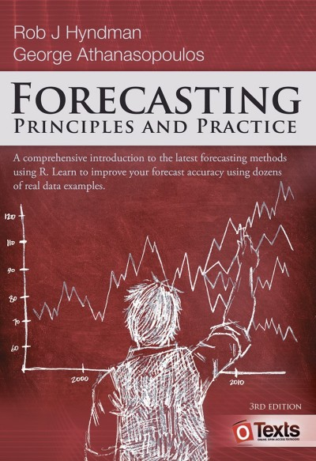
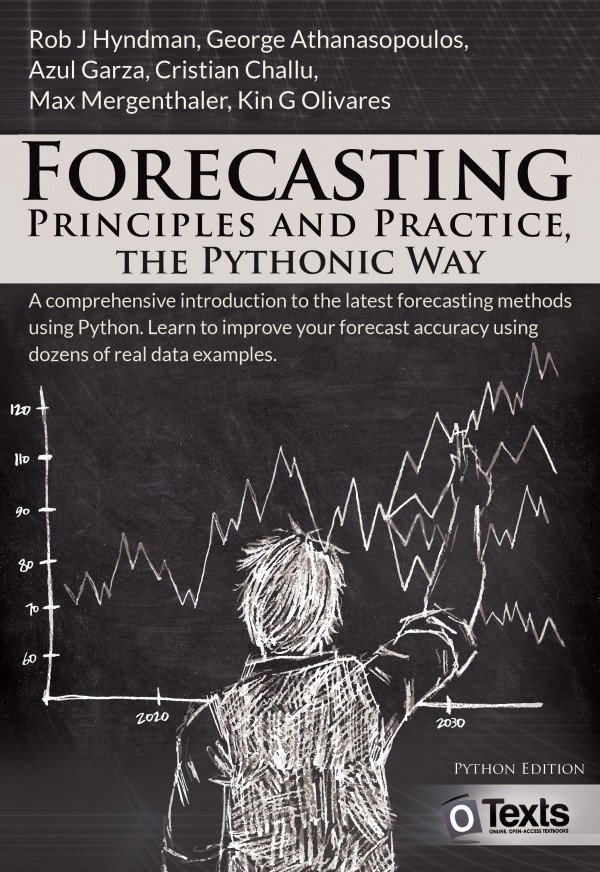

# Last year, in this room {background-iframe=".00_files/libs/colored-particles/index.html"}

## The final project of 2025/26 {.smaller}

Eighteen students. One shared dataset: electricity consumption, recorded every 15 minutes.

The task: forecast the next **48 hours** — 192 steps ahead — with 95% prediction intervals.

Any method from the course was allowed. They had a trimester of ARIMA, ETS and neural networks behind them.

::: {.fragment}
One extra submission was entered alongside theirs, under the name `----SNAIVE----`.

It was a **seasonal naive** forecast: *"next Tuesday at 14:15 will look like last Tuesday at 14:15."* Four lines of code. No model. No fitting.
:::

## The leaderboard {.smaller}

| Rank | Submission | RMSE | MAPE |
|---:|---|---:|---:|
| 1 | Student A | 5.43 | 12.5% |
| 2 | Student B | 6.03 | 13.7% |
| 3 | Student C | 6.97 | 15.0% |
| 4 | Student D | 8.26 | 17.2% |
| **5** | **`----SNAIVE----`** | **8.75** | **20.7%** |
| 6 | Student E | 10.92 | 27.5% |
| 7 | Student F | 11.36 | 28.5% |
| ... | ... | ... | ... |
| 18 | Student Q | 22.64 | 51.1% |
| 19 | Student R | 30.44 | 74.8% |

## Read it again {.smaller}

::: {.incremental}
- Four lines of code finished **5th out of 19**.
- It beat **14 of the 18 people** in the room.
- The last submission was **3.5× worse** than copying last week.
:::

::: {.fragment}
Nobody there was lazy. They did the natural thing: reached for the most sophisticated tool they had and trusted it.

[Sophistication is not accuracy.]{.hi} Everything about how this course is run in 2026/27 follows from that one sentence.
:::

# What this course is {background-iframe=".00_files/libs/colored-particles/index.html"}

## Forecasting, as it actually happens {.smaller}

In industry, a forecast is produced **against a deadline** and judged **against a benchmark**. Nobody asks whether your model is interesting. They ask whether it beats what they already had.

::: {.fragment}
So this course reproduces those two conditions on purpose:

- **Every practice session is a working session.** You build, and you submit. There is no homework.
- **From Week 4, most practice sessions are timed forecasting challenges.** You get your own series, and a benchmark you have to beat.
:::

::: {.fragment}
The course ends with a project on a shared dataset, run the same way — and defended in front of the group.
:::

## What changed since last year {.smaller}

If you heard about MATH840 from last year's students, update your model of it:

| | 2025/26 | 2026/27 |
|---|---|---|
| Assignments | Homework, submitted later | **Produced and submitted in class** |
| Datasets | Same for everyone | **Your own series**, from Week 4 |
| Accuracy | Not graded until the project | **Graded from Week 4**, against a benchmark |
| Late work | −20%/day, 3 days max | **No late scheme** — see absence provisions |
| Defences | For weekly work | **Only for the final project** |
| Mid-term quiz | Separate | **Week 5 practice slot** |
| Grade ceiling | 105 | **100**, participation on top |

## The shape of the trimester {.smaller}

::: {.incremental}
- **Weeks 1–9**: one lecture (80 min) and one practice session (80 min) per week, back to back.
- **Week 1 (today)**: onboarding. Environment, data, submission mechanics. **Nothing is graded today.**
- **Weeks 2–3**: Track A — foundational labs.
- **Week 4, 6, 7, 8, 9**: Track B — in-class forecasting challenges.
- **Week 5**: mid-term quiz, in the practice slot.
- **Week 10**: two sessions — the final project challenge, and the defence.
:::

## Topics {.smaller}

::: {.incremental}
1. Introduction to forecasting + time series graphics *(today)*
2. Time series decomposition
3. The forecaster's toolbox
4. Exponential smoothing
5. Time series regression | Mid-term quiz
6. ARIMA models, part 1
7. ARIMA models, part 2
8. Advanced forecasting methods
9. Neural networks and foundation models
10. Final project
:::

# The rules {background-iframe=".00_files/libs/colored-particles/index.html"}

## Grading {.unnumbered}

| Task | Count | Points each | Total |
|---|---:|---:|---:|
| Weekly assignments | 7 | 8 | 56 |
| Mid-term quiz | 1 | 12 | 12 |
| Final project | 1 | 32 | 32 |
| **Total** | | | **100** |
| Participation (extra) | | | **+5** |

::: {.fragment}
[Passing the final project is mandatory.]{.hi} Without it, no combination of other marks produces a pass.
:::

## Track A — foundational labs (Weeks 2–3) {.smaller}

Named, domain-rich datasets: `vic_elec`, `aus_retail`, `pedestrian`, `PBS`, `tourism`. The domain is visible and the history means something. You each get your own, assigned deterministically — but the task is identical for everyone.

These labs are **not competitive**. At this point in the course there is no forecasting method and no accuracy metric to compete on.

| Criteria | Points |
|---|---:|
| Data preparation | 1 |
| EDA and visualisation | 4 |
| Implementation | 2 |
| Code quality and reproducibility | 1 |
| **Total** | **8** |

## Track B — in-class challenges (Weeks 4, 6, 7, 8, 9) {.smaller}

In Week 4 you are assigned **one time series, which stays yours for the rest of the course.**

::: {.incremental}
- Drawn deterministically from a curated pool by a hash of your student identifier.
- **Anonymised on issue**: identifiers removed, values rescaled, calendar shifted, history trimmed. You will not know what it measures.
- Five challenges on the same series: ETS → ARIMA → SARIMAX → advanced methods → neural and foundation models.
- You will watch your own forecast improve — or fail to — across seven weeks.
:::

::: {.fragment}
Because every student has a different series, discussing methods with each other cannot become copying a result. That discussion is **encouraged**, and it earns participation points.
:::

## Track B — how it is marked {.smaller}

| Criteria | Points |
|---|---:|
| Forecast accuracy vs your benchmark | 3 |
| Justification block | 3 |
| EDA and visualisation | 1 |
| Code quality and reproducibility | 1 |
| **Total** | **8** |

::: {.fragment}
The accuracy points are **thresholds, not a ranking**:

- Beat your benchmark → **3**
- Within 10% of it → **2**
- Worse → **1**, with a written explanation of why
:::

::: {.fragment}
You are never graded against your classmates in a weekly lab. Only in the final project, where everyone forecasts the same data.
:::

## Your benchmark {.smaller}

::: {.incremental}
- It is the **best of four simple methods** — naive, seasonal naive, drift, mean — selected on a validation window. Not fixed to seasonal naive in advance, because seasonal naive is trivially weak on some series and unbeatable on others.
- Accuracy is measured by a **scale-free skill score** (MASE, or the ratio of your RMSE to the benchmark's), so results are comparable across different series.
- The pool is **pre-screened**: a series is only issued if a reference AutoETS/AutoARIMA model lands between **0.70 and 0.90** on it. Below that, the series is trivial. Above it, effectively unbeatable.
:::

::: {.fragment}
[Every series you can be assigned is one that is known to be beatable.]{.hi}

If you do not beat it, that is a fact about your model, not about your luck.
:::

## Two submissions, one day {.smaller}

An 80-minute slot is not enough to specify an ARIMA model by hand, justify it, and package a forecast. So each challenge has two deadlines:

::: {.incremental}
1. **End of the session** — a valid baseline submission. Correct format, submitted on time, any model at all. This one is compulsory: it is what makes the work *in-class*.
2. **23:59 the same day** — your final submission. Improve it, tune it, change the model entirely if you want.
:::

::: {.fragment}
The automated score is published the **next morning**. Rubric marks and comments come back before the next practice session, so there is always time to act on them.
:::

## The justification block {.smaller}

Three short fixed questions, specific to the week's topic. Worth **3 of 8 points** — more than the accuracy itself.

::: {.fragment}
From Week 6 the task is structured so that you must **specify the model manually first** and justify that specification from the evidence — ACF/PACF, differencing, seasonality — and only then compare it against automatic selection and explain any divergence.

[Automatic selection cannot be your first step.]{.hi}
:::

::: {.fragment}
It is marked by hand, and you may be asked follow-up questions about it in the next session.
:::

## Mid-term quiz {.smaller}

One proctored quiz, taken electronically on Moodle in the **Week 5 practice slot**.

Covers Chapters 1–3, 5 and 8 — everything completed before it.

Worth **12 points**.

## Final project {.smaller}

You act as a data scientist for an energy utility. Everyone works with the same 15-minute consumption dataset. You do not choose your own.

::: {.incremental}
- **Session 1** — in-class challenge: point forecasts and 95% prediction intervals for a hidden 48-hour horizon. Scored on RMSE, MAPE, and the **Winkler score** for the intervals.
- **Between sessions** — improve your model at home.
- **Session 2** — defence: present your approach to the group, and see how everyone else attacked the same data.
:::

## Final project — 32 points {.smaller}

| Criteria | Points |
|---|---:|
| Valid in-class submission, correct format, on time | 5 |
| Beating the benchmark in class | 8 |
| Final skill score (ranked against the class) | 5 |
| EDA, methodology and diagnostics — residual analysis is required | 8 |
| Code quality and reproducibility — must run without errors | 2 |
| Defence and presentation | 4 |

::: {.fragment}
Those 5 ranked points are awarded on your **absolute final accuracy**, not on how much you improved. Two gates: an in-class submission must exist, and your final result must be no worse than it.
:::

# The fine print {background-iframe=".00_files/libs/colored-particles/index.html"}

## If you miss a session {.smaller}

All coursework is produced in class, so absence has a direct cost. These provisions exist so that circumstances outside your control do not decide your grade.

| Situation | Provision |
|---|---|
| Missed weekly lab | Asynchronous replacement: same dataset, deadline 24h later, capped at **6 of 8** points. Twice per trimester without documentation. |
| Air raid alert > 10 min | The session converts to asynchronous mode for the whole group. No penalty, no cap. |
| Missed Week 10 challenge | Supervised make-up within a week on documented grounds. Base points in full; the ranking bonus is not awarded. |
| Air raid during Week 10 | Rescheduled in full for the whole group. This session gates passing the course. |

## AI tools {.smaller}

::: {.incremental}
- **Coding — permitted.** Boilerplate, debugging, exploring alternatives. This includes in-class challenges.
- **Narrative and analysis — not permitted.** Your written analysis, your report, your explanation of results, your justification blocks. Anything meant to represent your own understanding.
- **In-class work**: no prompt-level citation required. Citing prompts under time pressure is not enforceable, and a rule everyone breaks is worse than no rule. The justification block replaces it — in your own words, marked by hand.
- **Final report**: citation required. State the tool and the prompts behind any incorporated code.
:::

::: {.fragment}
AI should not reduce your ability to think clearly. ✅ assistant — ❌ decision-maker.
:::

## Academic integrity {.smaller}

[TL;DR: Don't cheat.]{.hi}

 

The minimum penalty for cheating or plagiarism on any task, presentation or project is **zero for that work**, plus a reduction of the final course grade by at least one letter. Repeat violations can lead to dismissal from KSE.

Every student has a different series. Talking about *methods* is encouraged and rewarded. Handing over *results* is not one of the things that is hard to detect.

## Self-study — 80 hours {.smaller}

This is a required component, not optional reading.

| Activity | Hours |
|---|---:|
| Pre-reading the assigned chapter before each lecture | ~35 |
| Final project — improvement between Week 10 sessions | 20 |
| Final project — report and slides | 15 |
| Mid-term quiz preparation | 10 |

::: {.fragment}
The in-class format assumes you arrive already familiar with the week's method. **80 minutes is enough to apply a method you have read about, and nowhere near enough to learn one from scratch.**
:::

## Learning materials {.tiny}

:::: {.columns}

::: {.column width="33%"}
[Forecasting: Principles and Practice](https://otexts.com/fpp3/)

{width="60%"}
:::

::: {.column width="33%"}
[FPP: the Pythonic Way](https://otexts.com/fpppy/)

{width="60%"}

*Our primary reference.*
:::

::: {.column width="33%"}
**Time Series Forecasting Using Foundation Models**

*Week 9.*
:::

::::

## Tools {.smaller}

Python. The course is taught in `pandas`, `statsmodels` and the Nixtla stack — `statsforecast`, `mlforecast`, `neuralforecast`.

::: {.incremental}
- Use whatever environment you like: Colab, Jupyter, Quarto, VS Code.
- Submissions: a **PDF** *and* the **source** (`.qmd` or `.ipynb`). The PDF is what gets read; the source is what makes it reproducible.
- A template with the required sections is issued with every lab. Use it — the sections map one-to-one onto the rubric.
- If you prefer R, you may submit R work. Materials and support are Python only.
:::

## Five tips {.smaller}

::: {.incremental}
1. Do the reading **before** the lecture. The format assumes it.
2. Submit something valid before the end of every session, even if it is bad. A valid bad submission scores; a brilliant missing one does not.
3. Ask questions. Out loud. That is what participation points are for.
4. Talk to each other about methods. Your series is not their series.
5. When your fancy model loses to seasonal naive — and it will — that is data, not failure.
:::

## Where this ends {.smaller}

In Week 9 you will take a **foundation model** — a network trained on millions of time series, which has never seen yours — and run it on your series with **zero training**.

Then you will compare it against the model you built by hand over seven weeks.

::: {.fragment}
Sometimes it wins. Sometimes it loses badly. Either way you will be able to explain *why*, and that explanation is the whole point of the course.
:::

::: {.fragment}
[See you in Week 4, when you get your series.]{.hi}
:::

# Questions? {.unnumbered .unlisted background-iframe=".00_files/libs/colored-particles/index.html"}

   

 [Course materials](https://teaching.kse.org.ua/course/view.php?id=4432)

 <imiroshnychenko@kse.org.ua>

 [@araprof](https://t.me/araprof)

 [@datamirosh](https://www.youtube.com/@datamirosh)

 [\@ihormiroshnychenko](https://www.linkedin.com/in/ihormiroshnychenko/)

 [\@aranaur](https://github.com/Aranaur)

 [aranaur.rbind.io](https://aranaur.rbind.io)
