::: {.callout-note appearance="simple"}
This deck covers **Chapters 1-2** of *Forecasting: Principles and Practice*. It is
published in full as your reference for Week 1; the live session covers the core
path, and the remainder is worked through in the practice slot and in your reading.
:::

```{python}
#| echo: true
#| label: setup
#| include: false

# Define colors
red_pink   = "#e64173"
turquoise  = "#20B2AA"
orange     = "#FFA500"
red        = "#fb6107"
blue       = "#181485"
navy       = "#150E37FF"
green      = "#8bb174"
yellow     = "#D8BD44"
purple     = "#6A5ACD"
slate      = "#314f4f"
```

# Getting started

## Babylonian predicting (~ 1000 BC)

::: {.columns}
::: {.column}

:::
::: {.column}
TU 11: rule for prediction of times of lunar eclipses
:::
:::

::: footer
[Methods for understanding and reconstructing Babylonian predicting rules](https://epub.uni-regensburg.de/58017/1/36.%20Methods%20underst.%20reconst%20.pdf)
:::

## Greeks (~ 300 BC)

::: {.columns}
::: {.column}
{width=300px}<br>
{width=300px}
:::
::: {.column}
Delphic Oracle: predicting the future through cryptic messages

> If Croesus goes to war, he will destroy a great empire.
:::
:::


::: footer
[Pythia](https://en.wikipedia.org/wiki/Pythia)
:::

## John Graunt (17th century)

John Graunt: "Natural and Political Observations Made upon the Bills of Mortality"

::: {.columns}
::: {.column}
{height=400px}<br>
:::
::: {.column}
{width=400px}
:::
:::

::: footer
[John Graunt](https://en.wikipedia.org/wiki/John_Graunt)
:::

## Medical instruments {.smaller}

::: {.columns}
::: {.column}

:::
::: {.column}
- **1901:** The first practical electrocardiogram (ECG) was invented to record the heart's electrical signals.
- **1924:** The first human electroencephalogram (EEG) was recorded, measuring brain impulses.
:::
:::

These medical instruments provided some of the first complex time series for analyzing individual patient health.

::: footer
[Augustus Desire Waller](https://en.wikipedia.org/wiki/Augustus_Desire_Waller)
:::

## Weather Forecasting {.smaller}

:::: {.columns}

::: {.column width="50%"}
- **Antiquity:** Aristotle's *Meteorology* was the dominant text until the Renaissance.
- **Renaissance:** The invention of the barometer and other instruments allowed for data collection.
- **1850s:** Robert FitzRoy, captain of the HMS *Beagle* (of Darwin fame), headed a new government department in Britain and coined the term **"weather forecast."**
- **1870s:** The telegraph allowed for fast compilation of data from many locations, revolutionizing forecasting.
:::

::: {.column width="50%"}
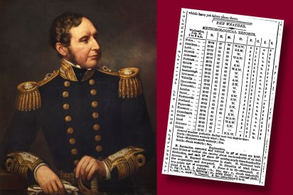{width=700px}
:::

::::

::: footer
[Robert FitzRoy](https://en.wikipedia.org/wiki/Robert_FitzRoy)
:::

## Economics {.smaller}

::: {.columns}
::: {.column}
- **Late 19th-Early 20th Century:** Banking crises in the US and Europe fueled the idea that the economy was a **cyclical system**, much like the weather.
- This created a demand for tracking **economic indicators** to avert crashes.
- Governments began systematically collecting and publishing data like **GDP, unemployment, and tax revenues**.
- This laid the foundation for modern **economics** and **financial** time series analysis.
:::
::: {.column}
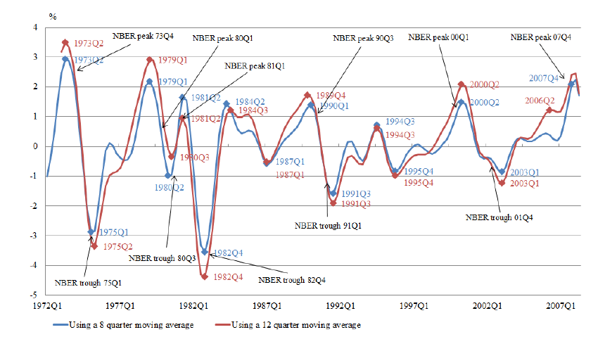{width=700px}
:::
:::

## Famous "Accurate" Forecasts {.smaller}

:::: {.columns}

::: {.column width="50%"}
{width=400px}<br>

> "I think there is a world market for **maybe five computers**."
>
> — *Thomas Watson, chairman of IBM, 1943*
:::
::: {.column width="50%"}
{width=400px}

> "There is **no reason** anyone would want a **computer in their home**."
>
> — *Ken Olsen, president of Digital Equipment Corp., 1977*
:::

::::

Forecasting is hard, but companies that do it well have a massive advantage.

# What is a Time Series?

## Definition

> **A time series** is a set of data points ordered in time.

- The data is often **equally spaced in time**, meaning a consistent interval separates each data point (e.g., hourly, daily, monthly).
- **Examples:**
    - The daily closing price of a stock.
    - A household's monthly electricity consumption.
    - A country's quarterly Gross Domestic Product (GDP).
    - Minute-by-minute temperature readings from a weather station.

## Time Series Are Everywhere

Time series data and its analysis are increasingly important due to the massive production of such data.

- **Internet of Things (IoT):** Sensors in manufacturing, smart homes, and logistics.
- **Digital Healthcare:** ECGs, EEGs, and data from wearable devices.
- **Smart Cities:** Traffic patterns, energy consumption, and air quality data.
- **Economics & Finance:** Stock markets, currency exchange rates, and economic indicators.
- **Science:** Astronomical observations (like sunspots), weather data, and climate records.

## What can be forecast?


- Daily electricity consumption in 3 days ⚡
- Time of sunrise this day next year 🌅
- Google stock price tomorrow 📈
- Google stock price in 6 months 📉
- Maximum temperature tomorrow 🌡️
- Exchange rate UAH/USD next week 💱
- Total sales of product X in 3 months 📊
- Timing of next Halley's comet ☄️

## Which is easier to forecast? {.smaller}

::: {.columns}
::: {.column}
1. Time of sunrise this day next year 🌅
2. Timing of next Halley's comet ☄️
3. Maximum temperature tomorrow 🌡️
4. Daily electricity consumption in 3 days ⚡
5. Total sales of product X in 3 months 📊
6. Google stock price tomorrow 📈
7. Exchange rate UAH/USD next week 💱
8. Google stock price in 6 months 📉
:::
::: {.column}
- What means **"easier"**?
- What makes something easier/harder to forecast?
:::
:::

## Forecastability factors

1. Good **understanding** of the domain and factors affecting the variable. 🤔
2. A **lot** of data. 📊
3. The future is somewhat **similar to the past**. 🔄
4. The forecasts *cannot change the future*. 🛑

## Case study: Stolen or lost mobile phones

```{python}
#| echo: false
#| message: false
#| warning: false
#| fig-height: 6
#| fig-width: 10
#| fig-align: center

import duckdb
import pandas as pd
import plotly.express as px

# Custom colors
red    = "#fb6107"
orange = "#FFA500"
blue   = "#181485"

# Connect to DuckDB
con = duckdb.connect(':memory:')

query = """
SELECT 
    CAST(DK AS DATE) AS date,
    NZ,
    COUNT(*) AS n
FROM 'data/mobile.parquet'
WHERE 
    DK IS NOT NULL
    AND NZ IN ('SAMSUNG', 'XIAOMI', 'APPLE IPHONE')
    AND CAST(DK AS DATE) >= DATE '2020-01-01'
GROUP BY date, NZ
ORDER BY date, NZ
"""

filtered = con.sql(query).df()
con.close()

# Clean data
filtered['date'] = pd.to_datetime(filtered['date'], errors='coerce')
filtered['n'] = pd.to_numeric(filtered['n'], errors='coerce')
filtered = filtered.dropna(subset=['date', 'n'])

# Color mapping
color_map = {
    "SAMSUNG": red,
    "XIAOMI": orange,
    "APPLE IPHONE": blue
}

# Create interactive Plotly figure
fig = px.line(
    filtered,
    x='date',
    y='n',
    color='NZ',
    facet_row='NZ',          # vertical facets
    color_discrete_map=color_map,
    markers=True,
    title="Count of stolen or lost mobile phones over time<br><sup>Data from 2020 onwards for Samsung, Xiaomi, and Apple iPhone</sup>"
)

# Free y-axis per facet
fig.update_yaxes(matches=None)

# Layout sizing (~10x6 inches, assuming 100 px per inch)
fig.update_layout(
    template='plotly_white',
    width=1000,
    height=600,
    title_x=0.5,
    xaxis_title="Date",
    yaxis_title="Number of reports",
    showlegend=False,
    font=dict(size=14)
)

# Clean facet labels
fig.for_each_annotation(lambda a: a.update(text=a.text.split("=")[-1]))

# Caption
fig.add_annotation(
    text="MATH840 | Source: data.gov.ua",
    xref="paper", yref="paper",
    x=1, y=-0.10, showarrow=False,
    font=dict(size=12, color="gray"),
    align="right"
)

# Show interactive plot
fig.show()

con.close()
```


## The Anatomy of a Time Series

Any time series can be broken down, or **decomposed**, into three fundamental components:

1.  **Trend:** The slow-moving, long-term change in a time series. It shows the general direction (increasing, decreasing, or flat).
2.  **Seasonality:** A cyclical pattern that repeats over a fixed period of time (e.g., annually, weekly, daily).
3.  **Residuals (or Noise):** What remains after removing the trend and seasonal components. These are the random, unpredictable fluctuations.

## Case Study: Johnson & Johnson Quarterly EPS (1960-1980)

::: {.columns}
::: {.column}
```{python}
#| echo: false
#| message: false
#| warning: false
import pandas as pd
import matplotlib.pyplot as plt
import statsmodels.api as sm

# Load the Johnson & Johnson dataset
data = sm.datasets.get_rdataset("JohnsonJohnson").data

# Create a proper date-time index for our data
# The original data has a time column like 1960.00, 1960.25...
# A quarterly frequency ('Q') date range is more useful.
date_index = pd.date_range(start='1960-01-01', periods=len(data), freq='Q')
data.index = date_index

# Plotting the series
fig, ax = plt.subplots(figsize=(10, 6))
ax.plot(data.index, data['value'], color=turquoise, linewidth=2)
ax.set_title("Johnson & Johnson Quarterly Earnings Per Share (EPS)", fontsize=16)
ax.set_xlabel("Year")
ax.set_ylabel("EPS (USD)")
ax.grid(True, linestyle='--', alpha=0.6)
plt.show()
```
:::
::: {.column .incremental}
**What do you see?**

- Trend: A clear, upward movement over time.
- Seasonality: A repeating up-and-down pattern within each year.
:::
:::

## Understanding the Components {.smaller}

::: {.columns}
::: {.column}
```{python}
#| echo: false
#| message: false
#| warning: false
#| fig-height: 8

from statsmodels.tsa.seasonal import seasonal_decompose

# We use a multiplicative model because the seasonal fluctuations
# appear to grow larger as the trend goes up.
decomposition = seasonal_decompose(data['value'], model='multiplicative')

# The result is an object with observed, trend, seasonal, and resid attributes.
fig = decomposition.plot()
fig.set_size_inches(10, 8)
fig.suptitle("Decomposition of Johnson & Johnson EPS", y=0.95, fontsize=16)
plt.show()
```
:::
::: {.column}
- **Observed**: Our original time series data.
- **Trend**: A smooth line capturing the long-term growth in earnings.
- **Seasonal**: The repeating pattern within each year. We can see earnings are typically highest in Q2/Q3 and lowest in Q4.
- **Resid** (Residuals): The random, irregular fluctuations. In a good model, this component should have no obvious pattern.
:::
:::

**Why is this important?** Understanding these components is the key to choosing the right forecasting model. If your data has a trend, your model must account for it. If it has seasonality, your model must handle that too.

# The Forecasting Process

## The Forecasting Project {.smaller}

- Forecasting **isn't** just about running an **algorithm**. 🔮
- A successful project requires a **structured approach** from start to finish. 🏗️
- This **workflow** ensures that your model provides real business value and avoids common pitfalls. 🚫
- Let's imagine our goal is to forecast monthly sales for an e-commerce store. 📈

## The Forecasting Roadmap

```{dot}
//| echo: false
digraph SimpleForecastingRoadmap {
    // Graph settings
    rankdir="LR";
    node [shape=box, style="rounded,filled", fillcolor="#deeff5"];
    edge [fontsize=10];

    // Define nodes
    Step1 [label="1. Set Goal"];
    Step2 [label="2. Define What to Forecast"];
    Step3 [label="3. Set Time Horizon"];
    Step4 [label="4. Gather Data"];
    Step5 [label="5. Develop Model"];
    Step6 [label="6. Deploy Model"];
    Step7 [label="7. Monitor & Retrain"];

    // Define the process flow
    Step1 -> Step2 -> Step3 -> Step4 -> Step5 -> Step6 -> Step7;

    // Define the feedback loop
    Step7 -> Step5 [style=dashed, label="Feedback Loop"];
}
```

## Step 1 & 2: Set a Goal & What to Forecast {.smaller}

**1. Setting a Goal (The "Why")** 🎯

- **Vague:** "We want to **forecast sales**."
- **Specific:** "We need to forecast monthly sales for each product category to **optimize inventory levels**, aiming to reduce storage costs by 15% without increasing stockouts."

**2. Determining What Must Be Forecast (The "What")** 📊

- To achieve our goal, we need to predict the **number of units sold per category for the next 3 months.**
- This is the specific *target variable* our model will predict.

## Step 3 & 4: Set the Horizon & Gather Data {.smaller}

**3. Setting the Horizon (The "When")** 🕒

- The **forecast horizon** is the length of time into the future we need to predict.
- For our goal (inventory planning), a **3-month horizon** is appropriate. We need to know what to stock for the upcoming quarter.

**4. Gathering the Data (The "With What")** 📚

- We need historical sales data. How much is enough?
    - Ideally, at least **2-3 full seasonal cycles**. For monthly sales, this means 2-3 years of data to identify yearly patterns.
- We might also gather data on potential drivers (*exogenous variables*):
    - Marketing spend, promotions, holidays, website traffic, competitor prices.

## Step 5-7: Model, Deploy, & Monitor {.smaller}

**5. Developing a Forecasting Model** 🛠️

- This is the core of our course! It involves:
    - Visualizing the data (next lecture!).
    - Preprocessing and feature engineering.
    - Selecting and training models (from simple baselines to complex algorithms).
    - Evaluating model performance on a held-out test set.

**6. Deploying to Production** 🚀

- The model is integrated into a system (e.g., an API, a dashboard) that automatically generates forecasts for the inventory team.

**7. Monitoring & Collecting New Data** 📊

- We continuously compare our forecasts to actual sales. Is the model's accuracy degrading?
- New sales data is collected to **retrain the model regularly**, keeping it relevant and accurate. This creates a feedback loop.

## Forecasting vs. "Normal" Regression {.smaller}

Time series forecasting looks like a regression problem (predict a number), but there are critical differences.

:::: {.columns}
::: {.column width="50%"}
**Regression** 📈

- Data points are often assumed to be independent.
- You can shuffle the data before training without losing information.
- Goal: Find a relationship $y = f(X)$.
- Features $X$ are usually from the same time period as $y$.
:::
::: {.column width="50%"}
**Time Series Forecasting** 🔮

- Data points are ordered and dependent. Time matters!
- Never shuffle the data! This would destroy the temporal structure.
- Goal: Find a relationship $y_{future} = f(y_{past}, X_{past})$.
- You are predicting the future using only information from the past.
:::
::::

## Random futures {.smaller}

> A forecast is an estimate of the probabilities of possible future events.

. . .

```{python}
#| echo: false
#| fig-align: center
from statsforecast import StatsForecast
from statsforecast.models import AutoETS

df = sm.datasets.get_rdataset("JohnsonJohnson").data

#plot of the original series
fig, ax = plt.subplots(figsize=(10, 6))
ax.plot(df['time'], df['value'], color=turquoise, linewidth=2)
ax.set_title("Johnson & Johnson Quarterly Earnings Per Share (EPS)", fontsize=16)
ax.set_xlabel("Year")
ax.set_ylabel("EPS (USD)")
ax.grid(True, linestyle='--', alpha=0.6)
ax.set_ylim([0, 20])
ax.set_xlim([1960, 1984])
plt.show()
```

## Random futures {.smaller}

```{python}
#| echo: false
#| fig-align: center
from statsforecast import StatsForecast
from statsforecast.models import AutoETS, AutoARIMA, SeasonalNaive, AutoCES, HoltWinters, AutoTheta, AutoRegressive, AutoTBATS, SeasonalExponentialSmoothing, DynamicOptimizedTheta
import statsmodels.api as sm
import matplotlib.pyplot as plt
import pandas as pd

df = sm.datasets.get_rdataset("JohnsonJohnson").data
df = pd.DataFrame({
    'unique_id': 'J&J',
    'ds': pd.to_datetime(df['time'].apply(lambda x: f'{int(x)}-Q{int((x - int(x)) * 4) + 1}')),
    'y': df['value']
})

season_length = 4  # Quarterly data
horizon = 8        # Forecasting 8 quarters (2 years)


# Define model configurations
model_configs = [
    AutoETS(season_length=season_length, alias='Model 1'),
    AutoARIMA(season_length=season_length, alias='Model 2'),
    SeasonalNaive(season_length=season_length, alias='Model 3'),
    AutoCES(season_length=season_length, alias='Model 4'),
    HoltWinters(season_length=season_length, alias='Model 5'),
    AutoTheta(season_length=season_length, alias='Model 6'),
    # lags=[4], not lags=4: statsforecast 2.1.1 + statsmodels 0.15 raise on consecutive lags
    AutoRegressive(lags=[season_length], alias='Model 7'),
    AutoTBATS(season_length=season_length, alias='Model 8'),
    SeasonalExponentialSmoothing(season_length=season_length, alpha=0.9, alias='Model 9'),
    DynamicOptimizedTheta(season_length=season_length, alias='Model 10')
]

sf = StatsForecast(models=model_configs, freq='Q')
forecast_df = sf.forecast(df=df, h=horizon)

# pivot longer format for easier plotting
forecast_df = forecast_df.melt(id_vars=['ds'], value_vars=[model.alias for model in model_configs],
                               var_name='model', value_name='yhat')
forecast_df['model'] = forecast_df['model'].str.replace('yhat_', '')


fig, ax = plt.subplots(figsize=(10, 6))
ax.plot(df['ds'], df['y'], label='Observed', color=turquoise)
# plot only the first model
for model in model_configs[:1]:
    model_forecast = forecast_df[forecast_df['model'] == model.alias]
    ax.plot(model_forecast['ds'], model_forecast['yhat'], label=model.alias)
ax.set_title('Johnson & Johnson Quarterly Earnings Per Share (EPS)')
ax.set_xlabel('Year')
ax.set_ylabel('EPS (USD)')
ax.grid(True, linestyle='--', alpha=0.6)
ax.legend()
ax.set_xlim([pd.Timestamp('1960-01-01'), pd.Timestamp('1984-01-01')])
ax.set_ylim([0, 20])
plt.show()
```

## Random futures {.smaller}

```{python}
#| echo: false
#| fig-align: center

fig, ax = plt.subplots(figsize=(10, 6))
ax.plot(df['ds'], df['y'], label='Observed', color=turquoise)
for model in model_configs[:2]:
    model_forecast = forecast_df[forecast_df['model'] == model.alias]
    ax.plot(model_forecast['ds'], model_forecast['yhat'], label=model.alias)
ax.set_title('Johnson & Johnson Quarterly Earnings Per Share (EPS)')
ax.set_xlabel('Year')
ax.set_ylabel('EPS (USD)')
ax.grid(True, linestyle='--', alpha=0.6)
ax.legend()
ax.set_xlim([pd.Timestamp('1960-01-01'), pd.Timestamp('1984-01-01')])
ax.set_ylim([0, 20])
plt.show()
```

## Random futures {.smaller}

```{python}
#| echo: false
#| fig-align: center

fig, ax = plt.subplots(figsize=(10, 6))
ax.plot(df['ds'], df['y'], label='Observed', color=turquoise)
for model in model_configs[:3]:
    model_forecast = forecast_df[forecast_df['model'] == model.alias]
    ax.plot(model_forecast['ds'], model_forecast['yhat'], label=model.alias)
ax.set_title('Johnson & Johnson Quarterly Earnings Per Share (EPS)')
ax.set_xlabel('Year')
ax.set_ylabel('EPS (USD)')
ax.grid(True, linestyle='--', alpha=0.6)
ax.legend()
ax.set_xlim([pd.Timestamp('1960-01-01'), pd.Timestamp('1984-01-01')])
ax.set_ylim([0, 20])
plt.show()
```

## Random futures {.smaller}

```{python}
#| echo: false
#| fig-align: center

fig, ax = plt.subplots(figsize=(10, 6))
ax.plot(df['ds'], df['y'], label='Observed', color=turquoise)
for model in model_configs[:4]:
    model_forecast = forecast_df[forecast_df['model'] == model.alias]
    ax.plot(model_forecast['ds'], model_forecast['yhat'], label=model.alias)
ax.set_title('Johnson & Johnson Quarterly Earnings Per Share (EPS)')
ax.set_xlabel('Year')
ax.set_ylabel('EPS (USD)')
ax.grid(True, linestyle='--', alpha=0.6)
ax.legend()
ax.set_xlim([pd.Timestamp('1960-01-01'), pd.Timestamp('1984-01-01')])
ax.set_ylim([0, 20])
plt.show()
```

## Random futures {.smaller}

```{python}
#| echo: false
#| fig-align: center

fig, ax = plt.subplots(figsize=(10, 6))
ax.plot(df['ds'], df['y'], label='Observed', color=turquoise)
for model in model_configs:
    model_forecast = forecast_df[forecast_df['model'] == model.alias]
    ax.plot(model_forecast['ds'], model_forecast['yhat'], label=model.alias)
ax.set_title('Johnson & Johnson Quarterly Earnings Per Share (EPS)')
ax.set_xlabel('Year')
ax.set_ylabel('EPS (USD)')
ax.grid(True, linestyle='--', alpha=0.6)
ax.legend()
ax.set_xlim([pd.Timestamp('1960-01-01'), pd.Timestamp('1984-01-01')])
ax.set_ylim([0, 20])
plt.show()
```

## Random futures {.smaller}

```{python}
#| echo: false
#| fig-align: center

min_max_df = forecast_df.groupby(['ds']).agg({'yhat': ['min', 'max', 'mean']}).reset_index()

# Plot with the corrected column access on the now-numeric data.
fig, ax = plt.subplots(figsize=(10, 6))
ax.plot(df['ds'], df['y'], label='Observed', color='c')

# Access MultiIndex columns using tuples, which now contain clean numeric data.
ax.fill_between(min_max_df['ds'], min_max_df[('yhat', 'min')].values, min_max_df[('yhat', 'max')].values, color=purple, alpha=0.3)
ax.set_title('Johnson & Johnson Quarterly Earnings Per Share (EPS)')
ax.set_xlabel('Year')
ax.set_ylabel('EPS (USD)')
ax.grid(True, linestyle='--', alpha=0.6)
ax.legend().remove()
ax.set_xlim([pd.Timestamp('1960-01-01'), pd.Timestamp('1984-01-01')])
ax.set_ylim([0, 20])
plt.show()
```

## Random futures {.smaller}

```{python}
#| echo: false
#| fig-align: center

min_max_df = forecast_df.groupby(['ds']).agg({'yhat': ['min', 'max', 'mean']}).reset_index()

# Plot with the corrected column access on the now-numeric data.
fig, ax = plt.subplots(figsize=(10, 6))
ax.plot(df['ds'], df['y'], label='Observed', color='c')
ax.fill_between(min_max_df['ds'], min_max_df[('yhat', 'min')].values, min_max_df[('yhat', 'max')].values, color=purple, alpha=0.3)
ax.plot(min_max_df['ds'], min_max_df[('yhat', 'mean')].values, label='Mean Forecast', color=purple)
ax.set_title('Johnson & Johnson Quarterly Earnings Per Share (EPS)')
ax.set_xlabel('Year')
ax.set_ylabel('EPS (USD)')
ax.grid(True, linestyle='--', alpha=0.6)
ax.legend().remove()
ax.set_xlim([pd.Timestamp('1960-01-01'), pd.Timestamp('1984-01-01')])
ax.set_ylim([0, 20])
plt.show()
```


# Forecasting against a benchmark {background-iframe="colored-particles/index.html"}

## "My model has RMSE 6.03" {.smaller}

That sentence carries no information.

RMSE 6.03 is [good]{.hi} if a reasonable alternative gives 8.75.

RMSE 6.03 is [terrible]{.hi} if repeating last week's values gives 5.43.

::: {.fragment}
A forecast is never evaluated in isolation. It is evaluated **against something you could have done instead** — something cheap, obvious, and available before you started modelling.

That something is called a **benchmark**.
:::

::: {.fragment}
This is not a grading technicality. It is the central working habit of this course: *before you fit anything, know what you have to beat.*
:::

## Four methods that need no fitting {.smaller}

Let $y_1, \dots, y_T$ be the observed history and $h$ the forecast horizon.

::: {.incremental}
- **Mean**: every future value is the average of the past.
  $$\hat{y}_{T+h|T} = \bar{y} = \frac{1}{T}\sum_{t=1}^{T} y_t$$

- **Naive**: every future value equals the last observation.
  $$\hat{y}_{T+h|T} = y_T$$

- **Seasonal naive**: every future value equals the last observation from the same season ($m$ = seasonal period).
  $$\hat{y}_{T+h|T} = y_{T+h-m(k+1)}$$

- **Drift**: naive plus the average historical change.
  $$\hat{y}_{T+h|T} = y_T + \frac{h}{T-1}(y_T - y_1)$$
:::

::: {.fragment}
Four lines of code. No parameters to estimate. No training loop. And on a surprising number of real series, [very hard to beat]{.hi}.
:::

## The benchmark in code {.smaller}

```{python}
#| echo: true
#| code-line-numbers: false

import numpy as np
import pandas as pd

def benchmark_forecasts(y: np.ndarray, h: int, m: int = 1) -> dict:
    """The four simple methods. y is the training history, h the horizon,
    m the seasonal period (m=1 means non-seasonal)."""
    T = len(y)
    return {
        "mean":     np.repeat(y.mean(), h),
        "naive":    np.repeat(y[-1], h),
        "snaive":   np.array([y[-m + (i % m)] for i in range(h)]),
        "drift":    y[-1] + np.arange(1, h + 1) * (y[-1] - y[0]) / (T - 1),
    }
```

::: {.fragment}
Your benchmark for a given series is the [best]{.hi} of these four, selected on a validation window — not seasonal naive by default. Seasonal naive is trivially weak on some series and unbeatable on others; picking it in advance would make the bar arbitrary.
:::

## Comparing across series: the skill score {.smaller}

RMSE is measured in the units of the series. A series in megawatts and a series in thousands of tourists produce RMSE values that cannot be compared.

::: {.fragment}
So we report a [ratio]{.hi}:

$$\text{skill score} = \frac{\text{RMSE}(\text{your model})}{\text{RMSE}(\text{benchmark})}$$
:::

::: {.fragment}
| Skill score | Reading |
|---|---|
| $< 1$ | You beat the benchmark |
| $= 1$ | You matched four lines of code |
| $> 1$ | The benchmark beat you |
:::

::: {.fragment}
MASE (Chapter 5) is the same idea with the naive method's in-sample error in the denominator. Scale-free, comparable across series, and honest.
:::

## Last year, in this course {.smaller}

The final project of 2025/26: 48-hour horizon, 15-minute electricity data, 192 steps ahead. Eighteen students, each free to use any method covered in the course.

A seasonal naive forecast was submitted alongside them, under the name `----SNAIVE----`.

::: {.fragment}
| Rank | Submission | RMSE | MAPE |
|---:|---|---:|---:|
| 1 | Student A | 5.43 | 12.5% |
| 2 | Student B | 6.03 | 13.7% |
| 3 | Student C | 6.97 | 15.0% |
| 4 | Student D | 8.26 | 17.2% |
| **5** | **`----SNAIVE----`** | **8.75** | **20.7%** |
| 6 | Student E | 10.92 | 27.5% |
| ... | ... | ... | ... |
| 19 | Student N | 30.44 | 74.8% |
:::

## Read that table again {.smaller}

::: {.incremental}
- Four lines of code placed **5th out of 19**.
- It beat **14 of the 18 people** who spent a trimester learning ARIMA, ETS and neural networks.
- The worst submission was **3.5× worse** than copying last week's values.
:::

::: {.fragment}
Nobody in that bottom group was lazy. They were doing the natural thing: reaching for the most sophisticated tool available and trusting it.

[The lesson of this course is that sophistication is not the same as accuracy.]{.hi}
:::

::: {.fragment}
This is also why every challenge in this course is scored against a benchmark, and why the benchmark is announced before you start rather than after.
:::

## What this means for your grade {.smaller}

From Week 4, each of you receives your own time series, and with it, its own benchmark.

::: {.incremental}
- Your accuracy points are awarded [against your own series' benchmark]{.hi}, not against your classmates. Beating it is worth full marks whether you are first or fifteenth in the room.
- The pool is pre-screened: a series is only issued if a reference model achieves a skill score between **0.70 and 0.90** on it. Below that band the series is trivial; above it, effectively unbeatable.
- So every series you can be assigned is one that is [known to be beatable]{.hi}. If you do not beat the benchmark, that is a fact about your model — not about your luck.
:::

::: {.fragment}
The one place you are ranked against each other is the final project, where everyone forecasts the same dataset and the comparison is fair by construction.
:::


```{python}
#| label: setup-graphics
#| include: false

# Define colors
red_pink   = "#e64173"
turquoise  = "#20B2AA"
orange     = "#FFA500"
red        = "#fb6107"
blue       = "#181485"
navy       = "#150E37FF"
green      = "#8bb174"
yellow     = "#D8BD44"
purple     = "#6A5ACD"
slate      = "#314f4f"
```


```{python}
#| label: setup-graphics-2
#| include: false

from scipy.stats import pearsonr
import statsmodels.api as sm
from statsmodels.graphics.tsaplots import plot_acf
from utilsforecast.plotting import plot_series as plot_series_utils

import numpy as np
import pandas as pd
import random
import seaborn as sns
import matplotlib.pyplot as plt
import matplotlib as mpl
from cycler import cycler

from fpppy.utils import plot_series

import os

import warnings
warnings.filterwarnings(
    "ignore",
    category=UserWarning,
    message=".*FigureCanvasAgg is non-interactive.*"
)

plt.style.use("ggplot")
sns.set_style("whitegrid")
plt.rcParams.update({
    "figure.figsize": (8, 5),
    "figure.dpi": 100,
    "savefig.dpi": 300,
    "figure.constrained_layout.use": True,
    "axes.titlesize": 12,
    "axes.labelsize": 10,
    "xtick.labelsize": 9,
    "ytick.labelsize": 9,
    "legend.fontsize": 9,
    "legend.title_fontsize": 10,
})
mpl.rcParams['axes.prop_cycle'] = cycler(color=["#000000", "#000000"])
```

<!-- ## Basic operations with time {.smaller}

- To convert a column to a datetime object, use `pd.to_datetime()`
- To set a datetime column as an index, use `df.set_index()`

| Frequency  | Function                                   |
|------------|--------------------------------------------|
| Annual     | `.dt.to_period('Y')` or `.dt.strftime("%Y")` |
| Quarterly  | `.dt.to_period('Q')`                         |
| Monthly    | `.dt.to_period('M')`                         |
| Weekly     | `.dt.to_period('W')` or `.dt.strftime("%Y-%W")`|
| Daily      | `.dt.strftime("%Y-%m-%d")`                   |
| Sub-daily  | `.dt.strftime("%Y-%m-%d %H:%M:%S")`         |

::: {.callout-note}
`.dt.to_period('W')` assumes weeks start on Monday. For Sunday, use `.dt.to_period('W-SUN')`.
::: -->

## The seasonal period

| Data | Minute | Hour | Day | Week | Year |
| :--- | :--- | :--- | :--- | :--- | :--- |
| **Quarters** | | | | | 4 |
| **Months** | | | | | 12 |
| **Weeks** | | | | | 52 |
| **Days** | | | | 7 | 365.25 |
| **Hours** | | | 24 | 168 | 8766 |
| **Minutes** | | 60 | 1440 | 10080 | 525960 |
| **Seconds** | 60 | 3600 | 86400 | 604800 | 31557600 |

## Graphics

Plots allow us to identify:

- Patterns
- Unusual observations
- Changes over time
- Relationships between variables

## Time plots

```{python}
url = '../data/ansett.csv'

ansett = pd.read_csv(url)
ansett["ds"] = pd.to_datetime(ansett["ds"])
melsyd_economy = ansett.query(
        'Airports == "MEL-SYD" & Class == "Economy"'
    ).copy()
melsyd_economy["y"] = melsyd_economy["y"] / 1000

plot_series(df=melsyd_economy,
            id_col="Airports",
            time_col="ds",
            target_col="y",
            ylabel="Passengers ('000)",
            xlabel="Week [1W]",
            title="Ansett airlines economy class: Melbourne-Sydney"
           )
```

## Time plots

```{python}
plot_series_utils(ansett.query(
        'Airports == "MEL-SYD"'
    ), id_col='Class')
```

## Time plots

```{python}

url = '../data/total_cost.csv'

total_cost_df = pd.read_csv(url)
total_cost_df["unique_id"] = "total_cost"
total_cost_df["Month"] = pd.to_datetime(total_cost_df["Month"])
plot_series(total_cost_df,
            id_col="unique_id",
            time_col="Month",
            target_col="Cost",
            xlabel="Month [1M]",
            ylabel="$ (millions)",
            title="Australian antidiabetic drug sales")
```

## Time series patterns

- **Trend**: Long-term increase or decrease in data (not necessarily linear)
- **Seasonal**: Regular patterns at fixed, known intervals (yearly, monthly, weekly, daily)
- **Cyclic**: Rises and falls without fixed frequency, typically lasting 2+ years (often tied to economic conditions)

## Time series patterns

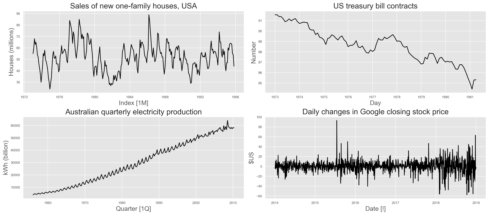{fig-align="center"}

## Seasonal plots

```{python}
#| fig-align: center
#| fig-width: 10
total_cost_df["Month_name"] = total_cost_df["Month"].dt.strftime("%b")
total_cost_df["Year"] = total_cost_df["Month"].dt.year
total_cost_df["Month_num"] = total_cost_df["Month"].dt.month

unique_years = total_cost_df["Year"].unique()
year_palette = sns.color_palette("husl", n_colors=len(unique_years))

fig, ax = plt.subplots()
sns.lineplot(
    data=total_cost_df,
    x="Month_num",
    y="Cost",
    hue="Year",
    palette=year_palette,
    legend=False,
    ax=ax,
)
ax.set_title("Seasonal Plot: Antidiabetic Drug Sales")
ax.set_xlabel("Month")
ax.set_ylabel("$ (millions)")
ax.set_xticks(
    ticks=range(1, 13),
    labels=[
        "Jan", "Feb", "Mar", "Apr", "May", "Jun",
        "Jul", "Aug", "Sep", "Oct", "Nov", "Dec"
    ],
)

min_year = unique_years.min()
for year, subset in total_cost_df.groupby("Year"):
    ax.text(
        subset["Month_num"].iloc[-1],
        subset["Cost"].iloc[-1],
        str(year),
        fontsize=9,
        weight="bold",
        color=year_palette[year - min_year],
    )

fig.show()
```

## Seasonal plots

- Data plotted against time within each seasonal period
- Useful for identifying seasonal patterns and anomalies
- Can be used for multiple seasonal periods

## Multiple seasonal periods

```{python}
#| fig-align: center
#| fig-width: 10

url = '../data/vic_elec.csv'

vic_elec_df = pd.read_csv(url)
vic_elec_df["ds"] = pd.to_datetime(vic_elec_df["ds"])
vic_elec_demand = vic_elec_df[vic_elec_df["unique_id"] == "Demand"].copy()
vic_elec_demand["hour-minute"] = \
  vic_elec_demand["ds"].dt.strftime("%H:%M:%S")
vic_elec_demand["day"] = vic_elec_demand["ds"].dt.date

fig, ax = plt.subplots()
sns.lineplot(
    data=vic_elec_demand,
    x="hour-minute",
    y="y",
    hue="day",
    palette="husl",
    legend=False,
    ax=ax,
)
unique_ticks = vic_elec_demand["hour-minute"].unique()
ticks_to_plot = unique_ticks[::2]
ax.set_xticks(ticks=range(0, len(unique_ticks), 2), labels=ticks_to_plot,
    rotation=45)
ax.set_title("Electricity Demand: Victoria")
ax.set_xlabel("Time")
ax.set_ylabel("MWh")
fig.show()
```

## Multiple seasonal periods

```{python}
#| fig-align: center
#| fig-width: 10

vic_elec_demand["day_of_week"] = vic_elec_demand["ds"].dt.day_name()
vic_elec_demand = vic_elec_demand[
    (vic_elec_demand["ds"] >= "2012-01-02") &
    (vic_elec_demand["ds"] < "2014-12-29")
].copy()

# Використовуйте groups для створення унікальних ключів
groups = vic_elec_demand["ds"].dt.to_period("W-SUN").dt.start_time
unique_weeks = groups.unique() # Унікальні ключі

# Переконайтеся, що ключі є списком об'єктів pandas.Timestamp, щоб уникнути проблем із numpy.datetime64
unique_weeks_list = [pd.to_datetime(w) for w in unique_weeks]

palette = sns.color_palette("husl", n_colors=len(unique_weeks_list))
color_map = dict(zip(unique_weeks_list, palette))

fig, ax = plt.subplots()
# Оскільки groups - це Series з типом Timestamp, ключі (week) в groupby також будуть Timestamp
for week, df_w in vic_elec_demand.groupby(groups):
    # week тут - це об'єкт Timestamp, як і ключі у color_map
    # Ми перетворюємо week на той же тип, що і ключі словника, просто для додаткової безпеки, 
    # хоча в ідеалі це не повинно бути необхідно.
    week_key = pd.to_datetime(week) 
    
    df_w.plot(
        y="y",
        x="day_of_week",
        ax=ax,
        color=color_map[week_key], # Використовуємо явний ключ
        label=str(week_key.date())
    )
ax.get_legend().remove()
ax.set_title("Electricity Demand: Victoria")
ax.set_ylabel("MWh")
ax.set_xlabel("Time")
fig.show()
```

## Multiple seasonal periods

```{python}
#| fig-align: center
#| fig-width: 10

vic_elec_demand["day_of_year"] = vic_elec_demand["ds"].dt.strftime("%m-%d")

unique_years = vic_elec_demand["ds"].dt.year.unique()
palette = sns.color_palette("husl", n_colors=len(unique_years))
color_map = dict(zip(unique_years, palette))

fig, ax = plt.subplots()
for df_year in vic_elec_demand.groupby(vic_elec_demand["ds"].dt.year):
    year, df_y = df_year
    df_y.plot(
        y="y",
        x="day_of_year",
        ax=ax,
        label=str(year),
        color=color_map[year]
    )
ax.set_title("Electricity Demand: Victoria")
ax.set_ylabel("MWh")
ax.set_xlabel("Time")
fig.show()
```

## Seasonal subseries plots

```{python}
#| fig-align: center
#| fig-width: 10

total_cost_df["Month"] = pd.to_datetime(total_cost_df["Month"])
total_cost_df["year"] = total_cost_df["Month"].dt.year
total_cost_df["month"] = total_cost_df["Month"].dt.strftime("%B")
total_cost_df["month"] = pd.Categorical(
  total_cost_df["month"],
  categories=[
    "January", "February", "March", "April", "May", "June",
    "July", "August", "September", "October", "November", "December",
  ],
  ordered=True,
)

fig, axes = plt.subplots(nrows=1, ncols=12, sharey=True)
for i, month in enumerate(total_cost_df["month"].cat.categories):
    month_data = total_cost_df.query("month == @month")
    mean_cost = month_data["Cost"].mean()
    axes[i].plot(month_data["year"], month_data["Cost"], color="black")
    axes[i].axhline(
        mean_cost, color="blue", linestyle="-", linewidth=1, label="Average"
    )
    axes[i].set_title(month[:3])
    axes[i].set_xlabel("")
    axes[i].tick_params(axis='x', rotation=90)
    if i == 0:
        axes[i].set_ylabel("$(millions)")
    else:
        axes[i].set_yticklabels([])

fig.suptitle("Australian Antidiabetic Drug Sales")
fig.text(0.5, -0.05, "Month", ha="center")
fig.subplots_adjust(wspace=0.2)
fig.show()
```

## Seasonal subseries plots

- Data for each season collected together in time plot as separate time series
- Enables the underlying seasonal pattern to be seen clearly, and changes in seasonality over time to be visualized

## Example: Australian holiday tourism

```{python}
#| fig-align: center
#| fig-width: 10

url = '../data/tourism.csv'

tourism = pd.read_csv(url)
tourism["ds"] = pd.to_datetime(tourism["ds"])
tourism["Quarter"] = tourism["ds"].dt.to_period("Q").astype(str)
tourism_sub = tourism.query('Purpose == "Holiday"')
trips = tourism_sub.groupby(["State", "ds"], as_index=False)["y"].sum().round(2)

states = trips["State"].unique()
colors = sns.color_palette("husl", len(states))
fig, ax = plt.subplots()
for state, color in zip(states, colors):
    state_df = trips.query("State == @state")
    state_df.plot(y="y", x="ds", ax=ax, label=state, color=color)
ax.set_title("Australian domestic holidays")
handles, labels = ax.get_legend_handles_labels()
ax.get_legend().remove()
fig.legend(
    handles, labels, loc="center left", bbox_to_anchor=(1.02, .5),
    frameon=False, borderaxespad=0,
)

ax.set_ylabel("Overnight trips ('000)")
ax.set_xlabel("Quarter [1Q]")
fig.show()
```

## Example: Australian holiday tourism

```{python}
#| fig-align: center
#| fig-width: 10

trips["Quarter"] = "Q" + trips["ds"].dt.quarter.astype(str)
trips["Year"] = trips["ds"].dt.year
years = sorted(trips["Year"].unique())
palette = sns.color_palette("husl", len(years))
year_to_color = dict(zip(years, palette))

n_states = trips["State"].nunique()

fig, axs = plt.subplots(n_states, 1, sharex=True, figsize=(8, 10))
for ax, (state, df_state) in zip(axs, trips.groupby("State")):
    pivot_data = df_state.pivot(index="Quarter", columns="Year", values="y")
    pivot_data.plot(ax=ax, color=[year_to_color[year] for year in pivot_data.columns])
    ax.get_legend().remove()
    ax.text(1.02, 0.5, state, va="center", ha="right", rotation=270,
        fontsize=10, transform=ax.transAxes)

handles = [plt.Line2D([0], [0], color=year_to_color[year], lw=4) for year in years]
labels = [str(year) for year in years]
fig.legend(handles, labels, title="Year", loc="center left", bbox_to_anchor=(1.05, 0.5), frameon=False, borderaxespad=0)

fig.supylabel("Overnight trips ('000)")
fig.suptitle("Australian domestic holidays")
fig.show()
```

## Example: Australian holiday tourism

```{python}
#| fig-align: center
#| fig-width: 10

fig, axs = plt.subplots(n_states, 4, sharex=True, figsize=(8, 10))
axs = axs.flatten()
quarters = sorted(trips["Quarter"].unique())
states = sorted(trips["State"].unique())
for idx, (state_i, df_state) in enumerate(trips.groupby("State")):
    y_state_min, y_state_max = df_state["y"].min(), df_state["y"].max()
    for jdx, (quart_i, df_state_quart) in \
            enumerate(df_state.groupby("Quarter")):
        axi = axs[idx * 4 + jdx]
        df_state_quart.plot(y="y", x="ds", label=None, ax=axi,
            color="black")
        axi.axhline(df_state_quart["y"].mean(), color="blue")
        axi.set_ylim(y_state_min, y_state_max)
        axi.set_xlabel("")
        axi.tick_params(axis="x", rotation=90)
        axi.get_legend().remove()
for j, quarter in enumerate(quarters):
    axs[j].set_title(quarter)
for i, state in enumerate(states):
    axs[i * 4 + 3].text(
        1.02, 0.5, state, va="center", ha="left", rotation=270,
        transform=axs[i * 4 + 3].transAxes
    )
fig.supylabel("Overnight trips ('000)", va="center", rotation=90)
fig.supxlabel("Quarter", ha="center")
fig.suptitle("Australian domestic holidays")
fig.show()
```

## Scatterplots {.tiny}

::: {.columns}
::: {.column}
```{python}
plot_series(vic_elec_df, ids=["Demand"],
            max_insample_length=2 * 24 * 365,
            xlabel="Time [30m]",
            ylabel="GW",
            title="Half-hourly electricity demand: Victoria")
```
:::
::: {.column}
```{python}
plot_series(vic_elec_df, ids=["Temperature"],
            max_insample_length=2 * 24 * 365,
            xlabel="Time [30m]",
            ylabel="Degrees Celsius",
            title="Half-hourly temperature: Melbourne, Australia")
```
:::
:::

## Scatterplots

```{python}
#| fig-align: center
#| fig-width: 10
elec_2014 = vic_elec_df.query('ds >= "2014"')
elec_2014_pivot = elec_2014.pivot(
    index=["ds", "Holiday"], columns="unique_id", values="y"
).reset_index()
fig, ax = plt.subplots()
sns.scatterplot(data=elec_2014_pivot, x="Temperature", y="Demand", ax=ax)
ax.set_title("Scatter Plot of Demand vs. Temperature")
ax.set_xlabel("Temperature (degrees Celsius)")
ax.set_ylabel("Electricity demand (GW)")
fig.show()
```

## Correlation

Measures the extent of linear relationship between two variables.

$$
r=\frac{\sum\left(x_t-\bar{x}\right)\left(y_t-\bar{y}\right)}{\sqrt{\sum\left(x_t-\bar{x}\right)^2} \sqrt{\sum\left(y_t-\bar{y}\right)^2}}
$$

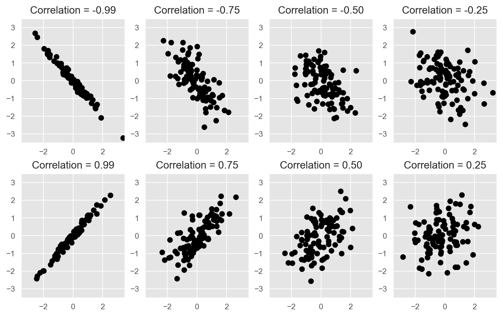{fig-align="center"}

---

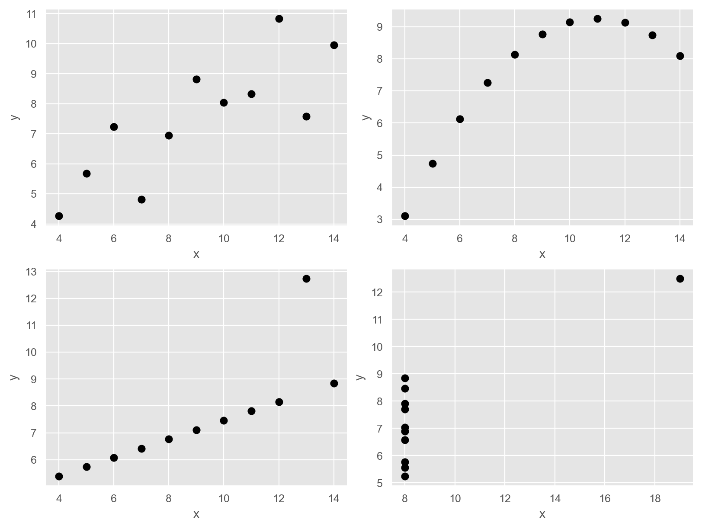{fig-align="center"}

## Scatterplot matrices

```{python}
#| fig-align: center
#| fig-width: 10

visitors = tourism.groupby(["State", "ds"], as_index=False)["y"].sum()
n_states = visitors["State"].nunique()
fig, axs = plt.subplots(n_states, 1, sharex=True, figsize=(8, 10))
for ax, (state, df_state) in zip(axs, visitors.groupby("State")):
    ax.plot(df_state["ds"], df_state["y"])
    ax.grid(True, linestyle="--", alpha=0.6)
    ax.text(1.02, 0.5, state, va="center", ha="right",
        rotation=270, transform=ax.transAxes)
fig.suptitle("Australian domestic tourism")
fig.supylabel("Overnight trips ('000)", va="center", rotation=90)
fig.supxlabel("Quarter", ha="center")
fig.show()
```

## Scatterplot matrices

```{python}
#| fig-align: center
#| fig-width: 10

visitors_pivot = \
    visitors.pivot(index="ds", columns="State", values="y").reset_index()
df_for_plot = visitors_pivot.drop(columns=["ds"])

def corrfunc(x, y, **kws):
    r, pvalue = pearsonr(x, y)
    ax = plt.gca()
    ax.annotate(
        f"Corr: \n{r:.3f}{'***' if pvalue < 0.05 else ''}",
        xy=(0.5, 0.5),
        xycoords="axes fraction",
        ha="center",
        va="center",
        fontsize=12,
    )


g = sns.PairGrid(df_for_plot, height=1.6)
g.map_lower(sns.scatterplot)
g.map_upper(corrfunc)
g.map_diag(sns.kdeplot, lw=2)

# Remove default axis labels
g.set(xlabel="")

# Move y-axis labels to the top
for i, col in enumerate(df_for_plot.columns):
    g.axes[0, i].set_title(col, fontsize=12)

fig.show()
```

## Lag plots {.smaller}

::: {.columns}
::: {.column}
```{python}
#| fig-align: center
#| fig-width: 10

url = '../data/aus_production.csv'

aus_production = pd.read_csv(url)
aus_production["ds"] = pd.to_datetime(aus_production["ds"])

recent_production = aus_production[["ds", "Beer"]].query("ds >= 2000")
recent_production.rename(columns={"Beer": "y"}, inplace=True)
recent_production["ds"] = pd.to_datetime(recent_production["ds"])
recent_production["Quarter"] = recent_production["ds"].dt.quarter

for lag in range(1, 10):
    recent_production[f"lag_{lag}"] = recent_production["y"].shift(lag)
lags = [f"lag_{i}" for i in range(1, 10)]
lims = [
    np.min([recent_production[lag].min() for lag in lags] +
        [recent_production["y"].min()]),
    np.max([recent_production[lag].max() for lag in lags] +
        [recent_production["y"].max()]),
]
fig, axes = plt.subplots(3, 3)
for ax, lag in zip(axes.flatten(), lags):
    ax.scatter(
        recent_production[lag],
        recent_production["y"],
        c=recent_production["Quarter"],
        cmap="viridis"
    )
    ax.plot(lims, lims, "grey", linestyle="--", linewidth=1)
    ax.set_title(lag)
unique_quarters = sorted(recent_production["Quarter"].unique())
colors = plt.cm.viridis(np.linspace(0, 1, len(unique_quarters)))
handles = [plt.Line2D([0], [0], color=color, lw=4) for color in colors]
labels = [f"Q{q}" for q in unique_quarters]
fig.legend(handles, labels, title="Season", loc="center left", bbox_to_anchor=(1.02, .5),
    frameon=False, borderaxespad=0,)
fig.supxlabel("lag(Beer, k)")
fig.supylabel("Beer")
fig.show()
```
:::
::: {.column}
- Each graph shows $y_t$ against $y_{t-k}$ for lag \(k\).
- The autocorrelations are the correlations associated with these lag plots.
- $r_1$ = correlation between $y_t$ and $y_{t-1}$.
- $r_2$ = correlation between $y_t$ and $y_{t-2}$.
- And so on...
:::
:::

## Autocorrelation

::: {.columns}
::: {.column}
$$
r_k=\frac{\sum_{t=k+1}^T\left(y_t-\bar{y}\right)\left(y_{t-k}-\bar{y}\right)}{\sum_{t=1}^T\left(y_t-\bar{y}\right)^2},
$$
:::
::: {.column}
```{python}
acf_df = pd.DataFrame(
    {"Lag": range(10), "ACF": sm.tsa.acf(recent_production["y"], nlags=9,
        fft=False, bartlett_confint=False)}
).set_index("Lag")
acf_df[1:]
```
:::
:::

## Autocorrelation plots

```{python}
#| fig-align: center
#| fig-width: 10
recent_production["ds"] = pd.to_datetime(recent_production["ds"])
fig, ax = plt.subplots()
plot_acf(recent_production["y"], lags=16,
         ax=ax,
         zero=False, bartlett_confint=False, auto_ylims=True)

ax.set_title("Autocorrelation Function for Beer")
ax.set_xlabel("Lags")
ax.set_ylabel("ACF")

fig.show()
```

---

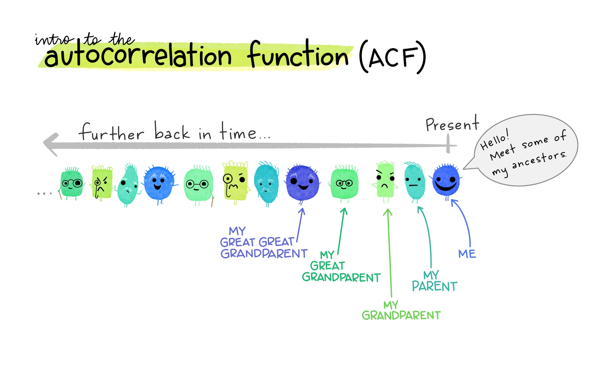{fig-align="center"}

::: footer
Art by [Allison Horst](https://allisonhorst.com/time-series-acf)
:::

---

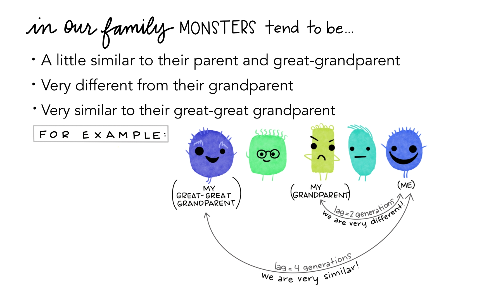{fig-align="center"}

::: footer
Art by [Allison Horst](https://allisonhorst.com/time-series-acf)
:::

---

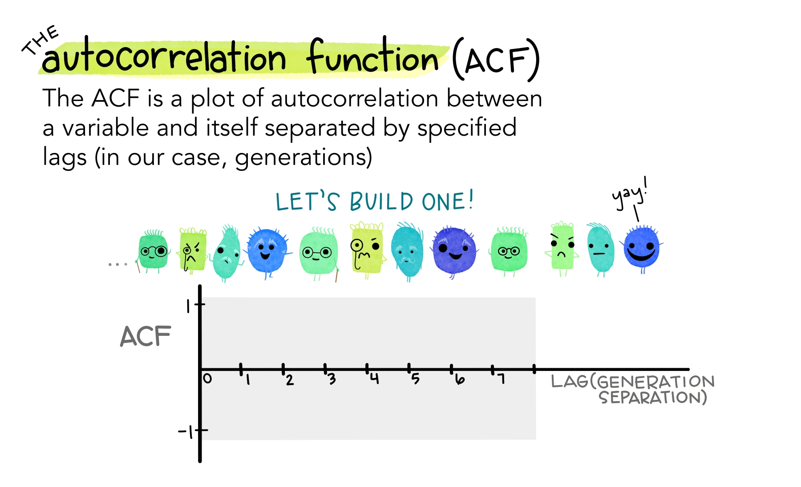{fig-align="center"}

::: footer
Art by [Allison Horst](https://allisonhorst.com/time-series-acf)
:::

---

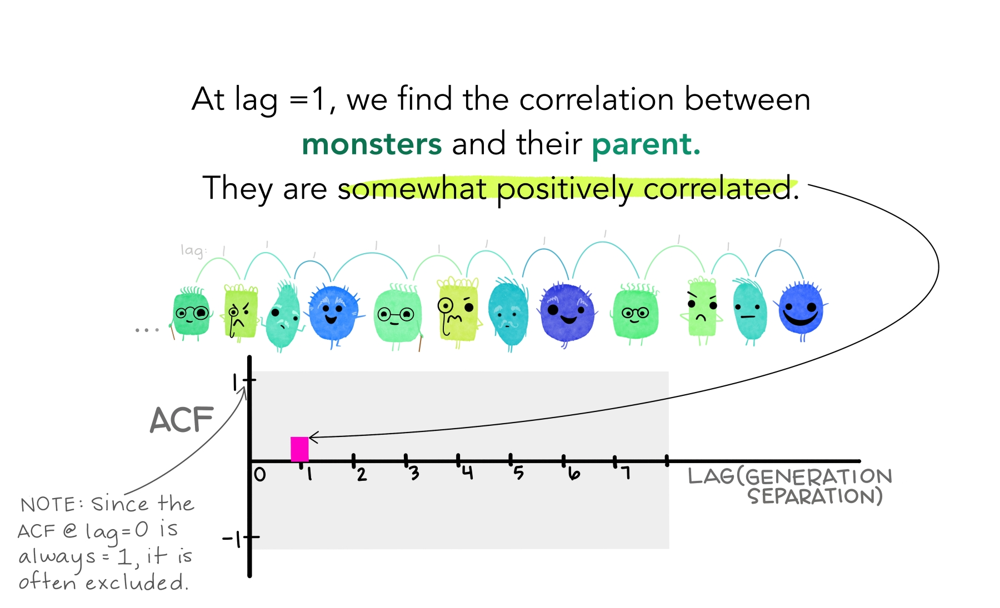{fig-align="center"}

::: footer
Art by [Allison Horst](https://allisonhorst.com/time-series-acf)
:::

---

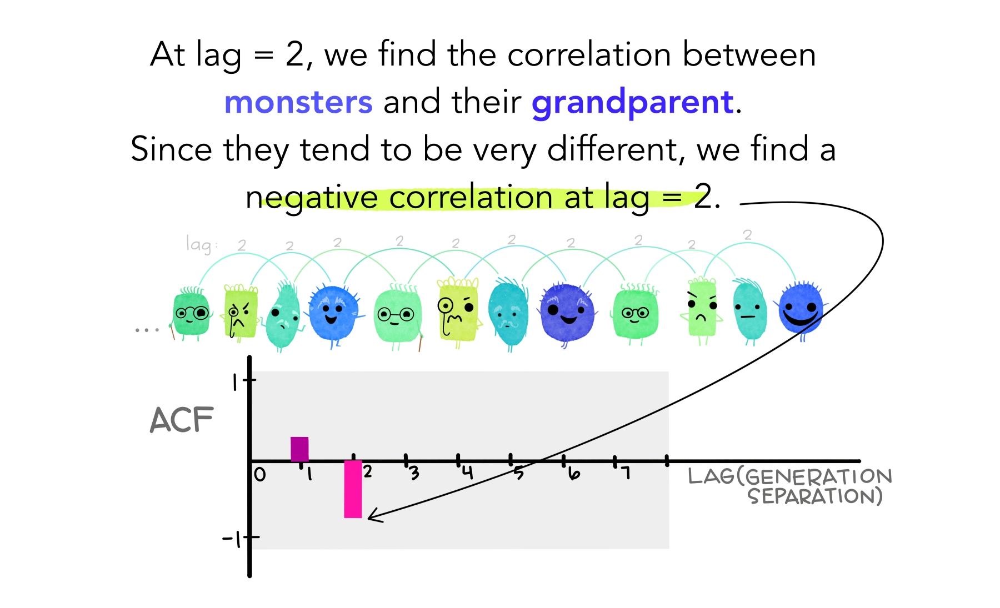{fig-align="center"}

::: footer
Art by [Allison Horst](https://allisonhorst.com/time-series-acf)
:::

---

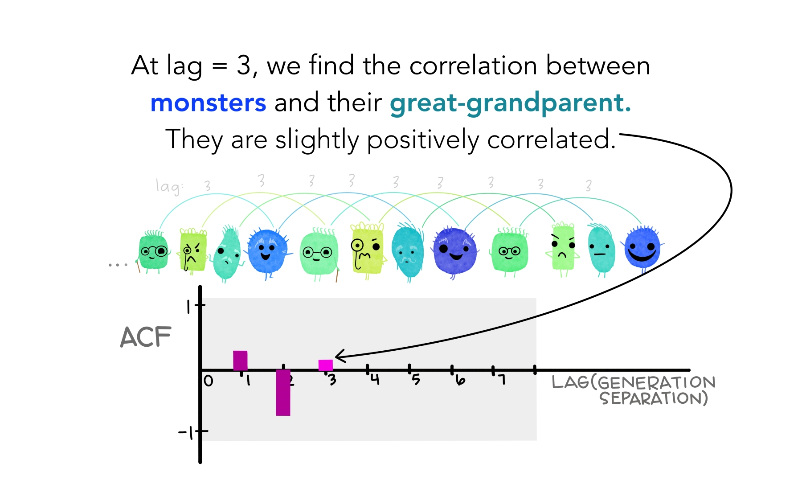{fig-align="center"}

::: footer
Art by [Allison Horst](https://allisonhorst.com/time-series-acf)
:::

---

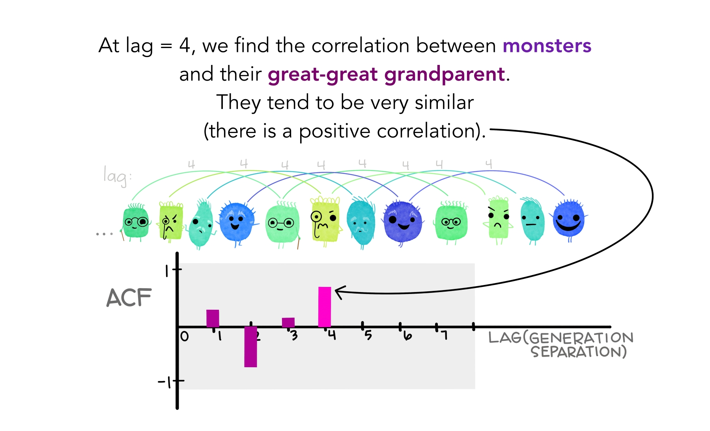{fig-align="center"}

::: footer
Art by [Allison Horst](https://allisonhorst.com/time-series-acf)
:::

---

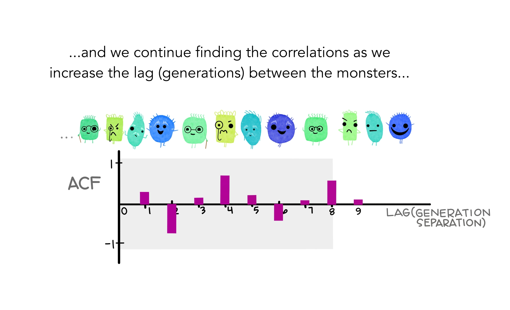{fig-align="center"}

::: footer
Art by [Allison Horst](https://allisonhorst.com/time-series-acf)
:::

---

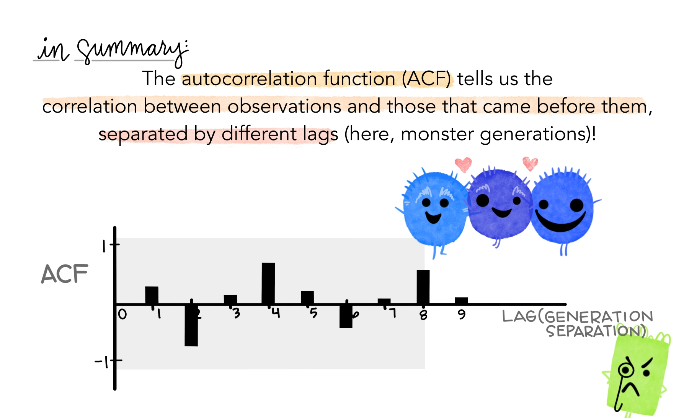{fig-align="center"}

::: footer
Art by [Allison Horst](https://allisonhorst.com/time-series-acf)
:::


## Trend and seasonality in ACF plots

```{python}
#| fig-align: center
#| fig-width: 10
total_cost_df["Month"] = pd.to_datetime(total_cost_df["Month"])
fig, ax = plt.subplots()
plot_acf(total_cost_df["Cost"], lags=48, ax=ax,
         zero=False, bartlett_confint=False, auto_ylims=True)

ax.set_title("Australian antidiabetic drug sales")
ax.set_xlabel("Lags")
ax.set_ylabel("ACF")
ax.set_ylim(bottom=-0.3)

fig.show()
```

## Trend and seasonality in ACF plots

- When the data have trend, ACF for small lags tend to be large and positive.
- When data are seasonal, ACF tends to be large and positive at seasonal lags (e.g., 12, 24 for monthly data with yearly seasonality).
- When data are trended and seasonal, ACF tends to be large and positive at small lags and seasonal lags.

## White noise

```{python}
np.random.seed(73)
y = pd.DataFrame(
    {"wn": np.random.normal(0, 1, 50), "ds": np.arange(1, 51),
        "unique_id": "wn"}
)
plot_series(y, target_col="wn",
            xlabel="sample [1]",
            title = "White noise")
```

## White noise ACF

```{python}
#| fig-align: center
#| fig-width: 10
fig, ax = plt.subplots()
plot_acf(y["wn"], lags=16, ax=ax,
         zero=False, bartlett_confint=False,
         auto_ylims=True)
ax.set_title("White Noise")
ax.set_xlabel("Lag[1]")
ax.set_ylabel("ACF")
#ax.set_ylim(bottom=-0.3)
fig.show()
```

## CI for ACF

- Sampling distribution of $r_k$ for white noise data is asymptotically $N(0, 1/T)$.
- Approximate 95% confidence interval for $r_k$ is

$$
\pm \frac{1.96}{\sqrt{T}}
$$

where $T$ is the length of the series.


# Questions? {.unnumbered .unlisted background-iframe="colored-particles/index.html"}

<br> <br>

 [Course materials](https://teaching.kse.org.ua/course/view.php?id=4432)

 imiroshnychenko\@kse.org.ua

 [@araprof](https://t.me/araprof)

 [@datamirosh](https://www.youtube.com/@datamirosh)

 [\@ihormiroshnychenko](https://www.linkedin.com/in/ihormiroshnychenko/)

 [\@aranaur](https://github.com/Aranaur)

 [aranaur.rbind.io](https://aranaur.rbind.io)
