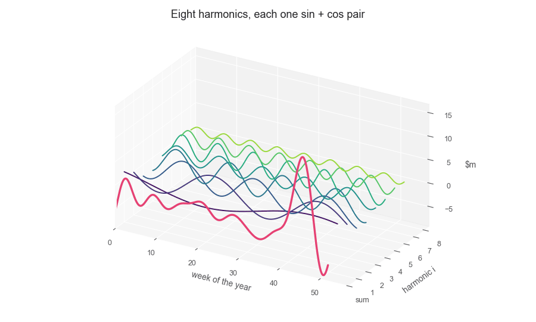

```{python}
#| label: setup
#| include: false

# Define colors
red_pink   = "#e64173"
turquoise  = "#20B2AA"
orange     = "#FFA500"
red        = "#fb6107"
blue       = "#181485"
navy       = "#150E37FF"
green      = "#8bb174"
yellow     = "#D8BD44"
purple     = "#6A5ACD"
slate      = "#314f4f"

import warnings
warnings.filterwarnings("ignore")
import os
os.environ["NIXTLA_ID_AS_COL"] = "true"
import numpy as np
np.set_printoptions(suppress=True)
np.random.seed(1)
import pandas as pd
pd.set_option("display.width", 130)
pd.set_option("display.precision", 3)
import seaborn as sns
sns.set_style("whitegrid")
import matplotlib.pyplot as plt
plt.style.use("ggplot")
plt.rcParams.update({
    "figure.figsize": (8, 5),
    "figure.dpi": 100,
    "savefig.dpi": 300,
    "figure.constrained_layout.use": True,
    "axes.titlesize": 12,
    "axes.labelsize": 10,
    "xtick.labelsize": 9,
    "ytick.labelsize": 9,
    "legend.fontsize": 9,
})
import matplotlib as mpl
from cycler import cycler
mpl.rcParams['axes.prop_cycle'] = cycler(color=[slate, blue, turquoise, orange, red, green, purple, yellow, red_pink])

import statsmodels.api as sm
from statsmodels.stats.diagnostic import acorr_ljungbox
from statsmodels.graphics.tsaplots import plot_acf

M, H = 52, 13          # weekly season, a quarter held out


def aicc(res):
    """AIC with the small-sample correction, counting the intercept and sigma."""
    k, n = res.df_model + 1, res.nobs
    return res.aic + 2 * k * (k + 1) / (n - k - 1)
```

# Where this fits

## Four weeks of models that only look inwards {.smaller}

| Week | What the model was allowed to use |
|---|---|
| 1 | The last value, the last season, the mean, the average slope |
| 2 | The series split into trend, season and remainder |
| 3 | Any of those, scored honestly on a holdout |
| 4 | A level, a slope and a season that update — still only from $y$'s own past |

. . .

Every one of them forecasts $y$ from **$y$**. Nothing in the course so far can answer: *what happens to
sales if the temperature drops five degrees*, or *how much of December is Christmas and how much is
trend*.

[Regression is where the outside world gets in.]{.hi}

## What this lecture is for {.smaller}

Week 5's practice slot is the **mid-term quiz**, so this lecture has no lab of its own. It pays off
twice anyway:

1. **Features.** Trend, seasonal dummies, Fourier terms, holiday and intervention variables — the
   vocabulary every later model uses to describe *when* something happens.
2. **Week 7.** Dynamic regression is regression plus ARIMA errors. The residual autocorrelation we are
   about to meet, repeatedly, is exactly what it fixes.

::: {.callout-tip}
## Reading

[FPP3 ch. 7 — Time series regression models](https://otexts.com/fpp3/regression.html) ·
[FPP the Pythonic Way, ch. 7](https://otexts.com/fpppy/nbs/07-regression.html)
:::

## Our data for the day {.smaller}

Walmart: 45 stores, weekly sales, February 2010 to October 2012, with the covariates the retailer
actually had — a holiday flag, temperature, fuel price, CPI and unemployment.

```{python}
#| echo: true
#| code-fold: false
url = '../data/walmart.csv'

walmart = pd.read_csv(url, parse_dates=["ds"])
chain = (walmart.groupby("ds", as_index=False)
         .agg(y=("y", "sum"), holiday=("holiday", "max"), temperature=("temperature", "mean"),
              fuel_price=("fuel_price", "mean"), cpi=("cpi", "mean"),
              unemployment=("unemployment", "mean")))
chain["y"] = chain["y"] / 1e6            # millions of dollars per week
print(f"{len(chain)} weeks, {chain.ds.min().date()} to {chain.ds.max().date()}")
chain.head(3)
```

## The series, and the predictors that come with it {.smaller}

```{python}
#| label: walmart-overview
#| fig-align: center
fig, axes = plt.subplots(3, 1, figsize=(11, 6), sharex=True)
axes[0].plot(chain.ds, chain.y, color=slate, linewidth=1)
axes[0].set_ylabel("sales, $m")
axes[1].plot(chain.ds, chain.temperature, color=orange, linewidth=1)
axes[1].set_ylabel("temperature, °F")
axes[2].plot(chain.ds, chain.unemployment, color=blue, linewidth=1, label="unemployment, %")
axes[2].plot(chain.ds, chain.fuel_price, color=turquoise, linewidth=1, label="fuel price, $")
axes[2].legend(loc="upper right")
axes[2].set_ylabel("economy")
fig.suptitle("Walmart chain: what we forecast, and what we may forecast it with")
plt.show()
```

# The linear model

## The model {.smaller}

$$
y_t = \beta_0 + \beta_1 x_{1,t} + \beta_2 x_{2,t} + \cdots + \beta_k x_{k,t} + \varepsilon_t
$$

- $y_t$ — what we forecast. $x_{j,t}$ — the predictors, known at time $t$.
- $\beta_j$ — the **marginal** effect: the change in $y$ for a one-unit change in $x_j$, *holding the
  other predictors fixed*. That last clause is where most misreadings start.
- $\varepsilon_t$ — everything the predictors do not explain.

::: {.callout-note icon="false"}
## What OLS does

Choose $\hat\beta$ to minimise $\displaystyle\sum_{t=1}^{T} \varepsilon_t^2$. There is a closed-form
solution — unlike ETS, nothing here is iterative.
:::

## The assumptions, and which one breaks {.smaller}

::: {.callout-note icon="false"}
## For the coefficients to mean anything

1. $\mathbb{E}[\varepsilon_t] = 0$ — no systematic bias.
2. $\varepsilon_t$ uncorrelated with the predictors.
3. Constant variance.
4. **$\varepsilon_t$ uncorrelated with each other.**
:::

- Assumptions 1–3 are the ones a cross-sectional course spends its time on.
- **Assumption 4 is the one time series breaks**, and it breaks almost every time: today's unexplained
  part looks like yesterday's.
- The forecasts stay usable. What stops being usable are the **standard errors, the $t$ statistics and
  the prediction intervals** — they are all computed as if the errors were independent.

[Every regression in this lecture will be checked on assumption 4, and most will fail it.]{.hi}

# Features you build from a date

## Trend {.smaller}

The simplest predictor is the row number: $x_t = t$.

```{python}
#| echo: true
#| code-fold: false
chain["trend"] = np.arange(1, len(chain) + 1)

fit_trend = sm.OLS(chain.y, sm.add_constant(chain[["trend"]])).fit()
print(f"slope {fit_trend.params['trend']:+.4f} $m per week   "
      f"t {fit_trend.tvalues['trend']:+.2f}   R² {fit_trend.rsquared:.3f}   "
      f"adj R² {fit_trend.rsquared_adj:.3f}")
```

Nothing. Two and a half years of Walmart have no linear trend worth naming — and a model that is only
a trend is not a model, it is a ruler.

```{python}
#| label: trend-fit
#| fig-align: center
fig, ax = plt.subplots(figsize=(11, 3))
ax.plot(chain.ds, chain.y, color="lightgray", linewidth=1, label="sales")
ax.plot(chain.ds, fit_trend.fittedvalues, color=red_pink, linewidth=2,
        label=f"trend: {fit_trend.params['trend']:+.3f} $m per week")
ax.set_ylabel("$m")
ax.legend(loc="upper left")
ax.set_title("A straight line through the whole sample")
plt.show()
```

## Seasonal dummies on weekly data {.smaller}

For a quarterly series, three dummies (one quarter is the baseline) and you have the season.

For **weekly** data the same idea needs $52 - 1 = 51$ dummies:

```{python}
#| echo: true
#| code-fold: false
print(f"observations: {len(chain)}   dummies needed for a weekly season: {M - 1}   "
      f"left over: {len(chain) - (M - 1) - 2}")
```

::: {.callout-warning}
51 predictors on 143 observations: every dummy rests on two or three weeks. Whether that is a model of
seasonality or a lookup table depends on something the count cannot tell you: **how much the same
week differs from one year to the next.**
:::

## What 51 dummies estimate {.smaller}

```{python}
#| label: weekly-dummies
#| fig-align: center
chain["year"] = chain.ds.dt.year
chain["week"] = chain.ds.dt.isocalendar().week.astype(int)
week_d = pd.get_dummies(chain.week, prefix="w", drop_first=True, dtype=float)
fit_week = sm.OLS(chain.y, sm.add_constant(pd.concat([chain[["trend"]], week_d], axis=1))).fit()

fig, ax = plt.subplots(figsize=(11, 4.2))
for yr, colour in zip((2010, 2011, 2012), [turquoise, orange, blue]):
    d = chain[chain.year == yr]
    ax.plot(d.week, d.y, "o", color=colour, markersize=5, alpha=0.8, label=str(yr))
profile = chain.groupby("week").y.mean()
ax.plot(profile.index, profile.values, color=red_pink, linewidth=2,
        label="what a week dummy estimates (the average)")
ax.set_xlabel("week of the year")
ax.set_ylabel("$m")
ax.legend(loc="upper left", ncol=4)
ax.set_title(f"Trend + {len(week_d.columns)} week dummies on {int(fit_week.nobs)} weeks: "
             "every dummy averages two or three points")
plt.show()
```

In-sample adj R² is `{python} f"{fit_week.rsquared_adj:.2f}"`. For Walmart the three years sit almost on top
of each other, Thanksgiving and Christmas included, so an average of two or three points is already a
good estimate. If the years disagreed, the same pink line would be mostly noise: same count, opposite
verdict.

## What if we aggregate to quarters? {.smaller}

Average weekly sales per quarter (a mean, not a sum: quarters hold 12, 13 or 14 weeks), full quarters
only, then trend plus three dummies:

```{python}
#| echo: true
#| code-fold: false
q = chain.set_index("ds").y.resample("QE").agg(["mean", "count"])
q = q[q["count"] >= 12].rename(columns={"mean": "y"})          # drop the partial first and last quarter
q["trend"] = np.arange(1, len(q) + 1)
dummies = pd.get_dummies(q.index.quarter, prefix="Q", drop_first=True, dtype=float).set_index(q.index)

fit_q = sm.OLS(q.y, sm.add_constant(pd.concat([q[["trend"]], dummies], axis=1))).fit()
print(f"{int(fit_q.nobs)} quarters, {int(fit_q.df_resid)} residual df, adj R² {fit_q.rsquared_adj:.2f}")
print(pd.DataFrame({"coef": fit_q.params, "t": fit_q.tvalues, "p": fit_q.pvalues}).round(3))
```

::: {.callout-important}
Aggregation adds no information: $10 / 4 = 2.5$ observations per quarter, against
$143 / 52 \approx 2.75$ per week. **You see each season as many times as you have years.** It only
trades 51 estimates for 3 coarse ones, and Thanksgiving and Christmas dissolve into a single Q4 number.
:::

## Quarterly dummies, drawn {.smaller}

```{python}
#| label: quarterly-dummies
#| fig-align: center
fig, ax = plt.subplots(figsize=(11, 4.5))
ax.plot(chain.ds, chain.y, color="lightgray", linewidth=1, label="weekly sales")
for i, (end, row) in enumerate(q.iterrows()):
    start = end - pd.offsets.QuarterBegin(startingMonth=1)
    ax.hlines(row.y, start, end, color=slate, linewidth=2.5, label="quarterly mean" if i == 0 else None)
    ax.hlines(fit_q.fittedvalues[end], start, end, color=red_pink, linewidth=2, linestyle="--",
              label="trend + quarter dummies" if i == 0 else None)
ax.set_ylabel("$m, average week")
ax.legend(loc="upper left")
ax.set_title("Quarterly dummies fit the averages well, and flatten the holiday weeks into Q4")
plt.show()
```

The dashed line is nearly on the solid one, and that is exactly the problem: the model is good at
describing quarters, and the spikes that matter to a retailer live **inside** Q4, not between quarters.

## Fourier terms {.smaller}

A seasonal pattern of period $m$ can be written as a sum of sines and cosines:

$$
y_t = \beta_0 + \sum_{i=1}^{K}\left[\alpha_i \sin\!\left(\frac{2\pi i t}{m}\right)
+ \gamma_i \cos\!\left(\frac{2\pi i t}{m}\right)\right] + \varepsilon_t
$$

- $K$ pairs cost $2K$ parameters instead of $m-1$. For $m = 52$ and $K = 3$: **six** instead of
  fifty-one.
- Small $K$ — a smooth annual shape. Large $K$ — sharper, spikier seasonality.
- $K \le m/2$, and at $K = m/2$ Fourier terms reproduce the dummies exactly.

📖 [FPP 7.4 — useful predictors](https://otexts.com/fpp3/useful-predictors.html)

## What K buys {.smaller}

```{python}
#| label: fourier-shapes
#| fig-align: center
def fourier(index, m, k):
    out = {}
    for i in range(1, k + 1):
        out[f"sin{i}"] = np.sin(2 * np.pi * i * index / m)
        out[f"cos{i}"] = np.cos(2 * np.pi * i * index / m)
    return pd.DataFrame(out, index=index.index)


fig, ax = plt.subplots(figsize=(11, 4))
ax.plot(chain.ds, chain.y, color="lightgray", linewidth=1, label="sales")
for k, colour in zip((1, 3, 6), [red_pink, turquoise, blue]):
    X = sm.add_constant(pd.concat([chain[["trend"]], fourier(chain.trend, M, k)], axis=1))
    fitted = sm.OLS(chain.y, X).fit()
    ax.plot(chain.ds, fitted.fittedvalues, color=colour, linewidth=1.6,
            label=f"K = {k} ({2 * k} terms), adj R² {fitted.rsquared_adj:.2f}")
ax.legend(loc="upper left")
ax.set_title("Trend plus Fourier terms, three values of K")
ax.set_ylabel("$m")
plt.show()
```

## How the harmonics add up {.smaller}

```{python}
#| label: fourier-3d
#| output: false
from matplotlib.animation import FuncAnimation, PillowWriter

K_SHOW = 8
fit_show = sm.OLS(chain.y, sm.add_constant(pd.concat([chain[["trend"]], fourier(chain.trend, M, K_SHOW)],
                                                     axis=1))).fit()
tau = np.linspace(0, M, 400)                               # one year, drawn smooth
waves = [fit_show.params[f"sin{i}"] * np.sin(2 * np.pi * i * tau / M)
         + fit_show.params[f"cos{i}"] * np.cos(2 * np.pi * i * tau / M) for i in range(1, K_SHOW + 1)]
amps = [np.hypot(fit_show.params[f"sin{i}"], fit_show.params[f"cos{i}"]) for i in range(1, K_SHOW + 1)]
total = np.sum(waves, axis=0)
colours = plt.cm.viridis(np.linspace(0.05, 0.85, K_SHOW))

fig = plt.figure(figsize=(9, 5.4), layout=None)
ax = fig.add_axes([-0.04, 0.0, 1.08, 0.94], projection="3d", proj_type="ortho")


def draw(azim, elev, caption):
    ax.cla()
    ax.set_facecolor("white")
    side = float(np.clip((azim + 60) / 60, 0, 1))          # 0 = the waves, 1 = the spectrum
    for i, (wave, c) in enumerate(zip(waves, colours), start=1):
        ax.plot(tau, np.full_like(tau, i), wave, color=c, linewidth=1.4, alpha=1 - 0.9 * side)
        if side > 0:
            ax.plot([M / 2] * 2, [i, i], [0, amps[i - 1]], color=c, linewidth=6, alpha=side,
                    solid_capstyle="round")
    ax.plot(tau, np.zeros_like(tau), total, color=red_pink, linewidth=2.4, alpha=1 - 0.9 * side)
    ax.set_xlim(0, M + 5)
    ax.set_ylim(0, K_SHOW + 0.5)
    ax.set_zlim(total.min() - 1, total.max() + 1)
    ax.set_xlabel("week of the year")
    ax.set_ylabel("harmonic i")
    ax.set_zlabel("$m")
    ax.set_yticks(range(0, K_SHOW + 1))
    ax.set_yticklabels(["sum"] + [str(i) for i in range(1, K_SHOW + 1)])
    ax.set_box_aspect((2, 1.2, 1), zoom=1.1)
    ax.view_init(elev=elev, azim=azim)
    fig.suptitle(caption, fontsize=13, y=0.97)


# keyframes: camera angle, caption, frames to hold it
keys = [(-60, 25, "Eight harmonics, each one sin + cos pair", 12),
        (-90, 0, "Time domain: add them up, and you get the seasonal shape", 16),
        (0, 0, "Frequency domain: each wave collapses to its amplitude", 16),
        (-60, 25, "Eight harmonics, each one sin + cos pair", 0)]
frames = []
for (a0, e0, c0, hold), (a1, e1, c1, _) in zip(keys[:-1], keys[1:]):
    frames += [(a0, e0, c0)] * hold
    for s in np.linspace(0, 1, 24)[1:]:
        s = 0.5 - 0.5 * np.cos(np.pi * s)                   # ease in and out
        frames.append((a0 + (a1 - a0) * s, e0 + (e1 - e0) * s, c1 if s > 0.5 else c0))

ani = FuncAnimation(fig, lambda f: draw(*f), frames=frames)
ani.save("img/fourier_3d.gif", writer=PillowWriter(fps=12), dpi=100)
plt.close(fig)
```

{fig-align="center" width="80%"}

Each harmonic is a sine and a cosine at frequency $i$ cycles per year; the regression chooses their
weights. The pink curve is their sum, the seasonal part of the $K = 8$ model fitted to Walmart.

## Larger K {.smaller}

```{python}
#| label: fourier-large-k
#| fig-align: center
def fourier_design(k):
    F = fourier(chain.trend, M, k)
    if 2 * k == M:
        F = F.drop(columns=f"sin{k}")                       # sin(pi * t) is zero at every integer t
    return sm.add_constant(pd.concat([chain[["trend"]], F], axis=1))


fits_k = {k: sm.OLS(chain.y, fourier_design(k)).fit() for k in range(1, M // 2 + 1)}
k_path = pd.DataFrame({"K": list(fits_k), "AICc": [aicc(f) for f in fits_k.values()]})
best_k = int(k_path.loc[k_path.AICc.idxmin(), "K"])

fig, (ax, ax2) = plt.subplots(2, 1, figsize=(11, 5.2), height_ratios=[2, 1])
ax.plot(chain.ds, chain.y, color="lightgray", linewidth=1, label="sales")
for k, colour in zip((10, M // 2), [turquoise, red_pink]):
    ax.plot(chain.ds, fits_k[k].fittedvalues, color=colour, linewidth=1.6,
            label=f"K = {k} ({int(fits_k[k].df_model) - 1} terms), adj R² {fits_k[k].rsquared_adj:.2f}")
ax.legend(loc="upper left")
ax.set_ylabel("$m")
ax.set_title("Larger K: from a seasonal shape to a copy of the calendar")
ax2.plot(k_path.K, k_path.AICc, "o-", color=slate, markersize=4)
ax2.plot(best_k, k_path.AICc.min(), "o", color=red_pink, markersize=9, label=f"lowest AICc: K = {best_k}")
ax2.set_xlabel("K")
ax2.set_ylabel("AICc")
ax2.legend(loc="upper left")
plt.show()
```

AICc keeps falling all the way to $K = 26$, where the 51 Fourier terms span the same space as 51 week
dummies. The holiday weeks are narrow spikes, and only high frequencies can draw a narrow spike.

## Larger K, out of sample {.smaller}

```{python}
#| echo: true
#| code-fold: false
#| output-location: column
y_arr = chain.y.to_numpy()
scale = float(np.mean(np.abs(y_arr[M:] - y_arr[:-M])))    # MASE scale
origins = range(len(chain) - H - 8, len(chain) - H)       # 8 origins, 13 weeks ahead


def rolling_mase_k(k):
    X, errors = fourier_design(k), []
    for end in origins:
        f = sm.OLS(chain.y[:end], X[:end]).fit()
        pred = f.predict(X[end:end + H])
        errors.append(np.mean(np.abs(y_arr[end:end + H] - pred)) / scale)
    return float(np.mean(errors))


snaive_k = np.mean([np.mean(np.abs(y_arr[e:e + H] - y_arr[e - M:e - M + H])) / scale
                    for e in origins])
k_table = pd.DataFrame([{"model": f"K = {k}", "AICc": aicc(fits_k[k]),
                         "rolling MASE": rolling_mase_k(k)} for k in (3, 10, 18, 26)]
                       + [{"model": "seasonal naive", "rolling MASE": snaive_k}])
k_table.round(3)
```

The rolling origin agrees with AICc: more harmonics forecast better, and from $K = 18$ the regression
beats seasonal naive.

::: {.callout-important}
**"Small $K$" is a default for smooth or noisy seasonality, not a law.** Walmart's season is sharp and
lands on the same weeks every year, so the data asks for the whole calendar. Choose $K$ the way you
choose any model: AICc to shortlist, a holdout to decide.
:::

## Dummy and intervention variables {.smaller}

A predictor that is 1 when something happens and 0 otherwise.

| Kind | Example | Shape |
|---|---|---|
| Calendar event | a public holiday, a school break | 1 on the affected periods |
| Intervention, permanent | a new store opens, a tax changes | a step: 0 then 1 |
| Intervention, temporary | a strike, a stockout, a promotion week | a spike, one period |
| Trading days | how many Saturdays fall in this month | a count, not an indicator |

::: {.callout-note}
The coefficient answers "how much higher is $y$ in those periods, everything else equal". That is
exactly the question a retailer asks about Christmas, and exactly the question the *next slide* shows
is easy to get wrong.
:::

## The holiday flag that ships with the data {.smaller}

```{python}
#| echo: true
#| code-fold: false
chain["prechristmas"] = (chain.ds.dt.month.eq(12) & chain.ds.dt.day.between(10, 26)).astype(int)

print("the six biggest weeks in the series:")
print(chain.nlargest(6, "y").assign(week=lambda d: d.ds.dt.strftime("%Y-%m-%d"))
      [["week", "y", "holiday", "prechristmas"]].to_string(index=False))
print(f"\ncorrelation with sales — shipped flag {np.corrcoef(chain.y, chain.holiday)[0, 1]:+.2f}, "
      f"pre-Christmas weeks {np.corrcoef(chain.y, chain.prechristmas)[0, 1]:+.2f}")
```

The flag marks Super Bowl, Labour Day, Thanksgiving and the week **after** Christmas. The two biggest
weeks of the whole series are not in it: the shopping happens *before* the holiday.

[A dummy variable has to line up with the mechanism, not with the calendar's own labels.]{.hi}

# Building a model

## Five models, one series {.tiny}

```{python}
#| echo: true
#| code-fold: false
#| output-location: column
F3 = fourier(chain.trend, M, 3)
data = pd.concat([chain, F3], axis=1)
FOURIER = list(F3.columns)

SPECS = {
    "trend":                    ["trend"],
    "+ Fourier(K=3)":           ["trend"] + FOURIER,
    "+ holiday flag":           ["trend"] + FOURIER + ["holiday"],
    "+ pre-Christmas":          ["trend"] + FOURIER + ["prechristmas"],
    "+ economy":                ["trend"] + FOURIER + ["prechristmas", "temperature",
                                                       "fuel_price", "cpi", "unemployment"],
}

rows, fits = [], {}
for name, cols in SPECS.items():
    res = sm.OLS(data.y, sm.add_constant(data[cols])).fit()
    fits[name] = res
    rows.append({"model": name, "k": int(res.df_model), "adj R²": res.rsquared_adj,
                 "AICc": aicc(res), "residual sd": res.resid.std(ddof=1),
                 "Ljung-Box p": acorr_ljungbox(res.resid, lags=[26], model_df=0)["lb_pvalue"].iloc[0],
                 "acf(1)": pd.Series(res.resid).autocorr(1)})
pd.DataFrame(rows).round(3)
```

## Five models {.smaller}

- **trend** explains nothing: adj R² is *negative*, which is what that statistic does when a predictor
  earns less than it costs.
- **Fourier(K=3)** lifts adj R² to 0.23. Six parameters for the annual shape, and worth it.
- **the shipped holiday flag** adds 0.01 to adj R², with $t \approx 1.8$. It is not wrong, it is
  mistimed.
- **the pre-Christmas dummy** takes adj R² to 0.52 and cuts AICc by 66 points. One column, placed
  where the mechanism is.
- **the economy** raises adj R² by 0.01 and **raises AICc** — four predictors that do not pay for
  themselves.

All five keep $K = 3$ on purpose: a smooth shape leaves the holiday spikes to the dummies, so each
dummy's worth is visible. For forecasting alone, *Larger K* already showed the other road.

[One well-timed dummy beat the trend, the $K = 3$ shape and four macro series put together.]{.hi}

## The coefficients of the full model {.smaller}

```{python}
#| echo: true
#| code-fold: false
res = fits["+ economy"]
show = ["const", "trend", "prechristmas", "temperature", "fuel_price", "cpi", "unemployment"]
pd.DataFrame({"coefficient": res.params[show], "t": res.tvalues[show],
              "p-value": res.pvalues[show]}).round(3)
```

- `prechristmas` — **+18.6 $m** a week, $t = 9.1$. Unmissable.
- `cpi` — significant at 5%, and almost certainly standing in for the trend it is collinear with: with
  `cpi` in the model the trend coefficient loses what little it had.
- `temperature`, `fuel_price`, `unemployment` — nothing, on 143 observations.

## Fitted against actual {.smaller}

```{python}
#| label: fitted-actual
#| fig-align: center
best = fits["+ pre-Christmas"]
fig, axes = plt.subplots(1, 2, figsize=(12, 4))
axes[0].plot(chain.ds, chain.y, color=slate, linewidth=1, label="actual")
axes[0].plot(chain.ds, best.fittedvalues, color=turquoise, linewidth=1.4, label="fitted")
axes[0].legend()
axes[0].set_title("trend + Fourier(K=3) + pre-Christmas")
axes[0].set_ylabel("$m")
axes[1].scatter(best.fittedvalues, chain.y, s=18, color=slate)
lims = [chain.y.min() * 0.95, chain.y.max() * 1.02]
axes[1].plot(lims, lims, color=red_pink, linewidth=1)
axes[1].set_xlabel("fitted")
axes[1].set_ylabel("actual")
axes[1].set_title(f"adj R² = {best.rsquared_adj:.2f}")
plt.show()
```

## R² is not a forecast {.smaller}

- $R^2$ is the share of variance explained **in the data the model was fitted to**. It never falls when
  you add a predictor, which is why adjusted $R^2$ exists.
- Adjusted $R^2$ can fall, and did — but it is still an in-sample measure. It cannot tell you that the
  `+ economy` model will be the worst of the five out of sample. AICc came closer; cross-validation
  said it outright.
- The honest sequence is the one from Week 3: **fit on a training set, score on data the model has not
  seen.**

## R² grows with anything {.smaller}

Ten thousand observations of pure noise. A thousand predictors, also pure noise. Nothing here is
related to anything — and the regression still explains more and more of it.

```{python}
#| label: r2-noise
#| fig-align: center
rng = np.random.default_rng(1234)
n_sim, k_sim = 10_000, 1_000
y_sim = rng.normal(size=n_sim)
X_sim = rng.normal(size=(n_sim, k_sim))


def r2_path(X, y):
    """R² after adding each column in turn, from one QR decomposition instead of k regressions."""
    Xc, yc = X - X.mean(axis=0), y - y.mean()
    Q, _ = np.linalg.qr(Xc)
    return np.cumsum((Q.T @ yc) ** 2) / (yc @ yc)


ks = np.arange(1, k_sim + 1)
r2_sim = r2_path(X_sim, y_sim)
adj_sim = 1 - (1 - r2_sim) * (n_sim - 1) / (n_sim - ks - 1)

fig, ax = plt.subplots(figsize=(11, 4.2))
ax.plot(ks, r2_sim, color="lightgray", linewidth=2.5, label="$R^2$")
ax.plot(ks, ks / n_sim, "--", color=slate, linewidth=1, label="$k/n$")
ax.plot(ks, adj_sim, color=red_pink, linewidth=1.6, label="adjusted $R^2$")
ax.axhline(0, color="black", linewidth=0.8)
ax.set_xlabel("number of predictors, all of them noise")
ax.set_ylabel("$R^2$")
ax.legend(loc="upper left")
ax.set_title("A thousand predictors that mean nothing, fitted to noise")
plt.show()

print(f"R²: {r2_sim[199]:.3f} at k=200, {r2_sim[499]:.3f} at k=500, {r2_sim[-1]:.3f} at k={k_sim}")
print(f"adjusted R² over the same path: mean {adj_sim.mean():+.4f}, max {adj_sim.max():+.4f}")
```

## What that costs you {.smaller}

For predictors that are pure noise, the expected $R^2$ is

$$
\mathbb{E}\left[R^2\right] \approx \frac{k}{n}
$$

— the dashed line the simulation follows exactly. $R^2$ is not measuring a relationship; it is
measuring **how much room you gave the model to fit the sample**.

Adjusted $R^2$ subtracts precisely that, which is why the pink line sits on zero across a thousand
useless predictors.

::: {.callout-important}
## Now count the free R² in our own model

```{python}
#| echo: true
#| code-fold: false
n_model, k_model = int(fits["+ economy"].nobs), int(fits["+ economy"].df_model)
draws = [r2_path(rng.normal(size=(n_model, k_model)), rng.normal(size=n_model))[-1]
         for _ in range(500)]
print(f"n = {n_model}, k = {k_model}  ->  free R² for pure noise: k/n = {k_model / n_model:.3f}")
print(f"500 noise draws at that size: mean R² {np.mean(draws):.3f}, "
      f"95th percentile {np.percentile(draws, 95):.3f}")
print(f"our model: R² {fits['+ economy'].rsquared:.3f}, adjusted {fits['+ economy'].rsquared_adj:.3f}")
```
:::

## What that costs you {.smaller}

- Twelve predictors on 143 weeks buy about **8% of $R^2$ for free**, and one time in twenty a model of
  pure noise that size would report $R^2 = 0.14$.
- Our `+ economy` model reports 0.57. So the fit is real — but the gap between $R^2$ and adjusted
  $R^2$, 0.04, is exactly the rent we pay for those twelve columns.
- And the earlier tables already showed where that rent goes: the four economic predictors raised
  adjusted $R^2$ by 0.01, raised AICc, and made the forecast worse.

[Adjusted $R^2$ protects you from noise predictors. It does not protect you from overfitting the
*shape* of a short series — only a holdout does that.]{.hi}

# Two ways to fool yourself

## Residual autocorrelation {.smaller}

```{python}
#| label: residual-diagnostics
#| fig-align: center
resid = best.resid
fig, axes = plt.subplots(1, 3, figsize=(13, 3.4))
axes[0].plot(chain.ds, resid, color=orange, linewidth=0.9)
axes[0].axhline(0, color="black", linewidth=0.8)
axes[0].set_title("residuals over time")
plot_acf(resid, lags=30, zero=False, ax=axes[1], title="ACF of residuals")
axes[2].scatter(best.fittedvalues, resid, s=16, color=slate)
axes[2].axhline(0, color=red_pink, linewidth=1)
axes[2].set_xlabel("fitted")
axes[2].set_title("residuals against fitted")
plt.tight_layout()
plt.show()

lb = acorr_ljungbox(resid, lags=[26], model_df=0)
print(f"Ljung-Box (26 lags): statistic {lb['lb_stat'].iloc[0]:.1f}, p {lb['lb_pvalue'].iloc[0]:.3f}"
      f"   residual acf(1) {pd.Series(resid).autocorr(1):+.2f}")
```

## What the autocorrelation costs {.smaller}

- The point forecasts are still the best this model can do.
- The **standard errors are too small**, so every $t$ statistic on the previous slides is too large,
  and the $p$-values too small. A predictor can look significant purely because the errors are
  correlated.
- The **prediction intervals are too narrow**, for the same reason.
- The information is still in the residuals, unused. A model that leaves an ACF like that has not
  finished.

[This is the gap dynamic regression closes in Week 7: the same predictors, with ARIMA errors.]{.hi}

## Spurious regression {.smaller}

Two series that trend, and nothing else in common.

```{python}
#| echo: true
#| code-fold: false
emp = pd.read_csv('../data/us_employment_titles.csv', parse_dates=["ds"])
retail = pd.read_csv('../data/aus_retail.csv', parse_dates=["Month"])

a = emp.query("unique_id == 'CEU0500000001'").tail(240)["y"].to_numpy(float)
b = (retail.query("State == 'Australian Capital Territory' and "
                  "Industry == 'Cafes, restaurants and catering services'")
     .tail(240)["Turnover"].to_numpy(float))

spurious = sm.OLS(a, sm.add_constant(b)).fit()
print(f"US private employment on Australian café turnover, 240 months")
print(f"  R² {spurious.rsquared:.2f}   t {spurious.tvalues[1]:.1f}   p {spurious.pvalues[1]:.1e}")
print(f"  residual acf(1) {pd.Series(spurious.resid).autocorr(1):+.2f}   "
      f"Ljung-Box p {acorr_ljungbox(spurious.resid, lags=[24], model_df=0)['lb_pvalue'].iloc[0]:.1e}")
```

A $t$ statistic above 12 and a $p$-value of $10^{-29}$ on a relationship that does not exist.

::: {.callout-important}
The tell is **not** $R^2$ and it is not the $p$-value. It is the residual ACF: 0.96 means the residuals
are a random walk, and a random walk in the residuals means the regression is fitting two trends to
each other.
:::

# Selecting predictors

## What not to select on {.smaller}

::: {.callout-warning}
## Not on p-values

A predictor can be significant because the errors are autocorrelated, or because it is collinear with
something that matters. Stepwise selection on $p$-values does both at once.
:::

::: {.callout-warning}
## Not on R²

It cannot fall. Adjusted $R^2$ can, but it still only knows the data you fitted.
:::

::: {.callout-note icon="false"}
## On AICc, then on a holdout

$$
\text{AIC} = -2\log(L) + 2k, \qquad
\text{AIC}_c = \text{AIC} + \frac{2k(k+1)}{T-k-1}
$$

AICc to shortlist on one series; time series cross-validation on the horizon you will be scored on to
choose. Same rule as for ETS.
:::

📖 [FPP 7.5 — selecting predictors](https://otexts.com/fpp3/selecting-predictors.html)

## AICc against a rolling origin {.tiny}

```{python}
#| echo: true
#| code-fold: false
#| output-location: column
scale = float(np.mean(np.abs(chain.y.to_numpy()[M:] - chain.y.to_numpy()[:-M])))   # MASE scale

def rolling_mase(cols, windows=8, h=H):
    errors = []
    for end in range(len(data) - h - windows, len(data) - h):
        tr, te = data.iloc[:end], data.iloc[end:end + h]
        f = sm.OLS(tr.y, sm.add_constant(tr[cols])).fit()
        pred = f.predict(sm.add_constant(te[cols], has_constant="add"))
        errors.append(np.mean(np.abs(te.y.to_numpy() - pred.to_numpy())) / scale)
    return float(np.mean(errors))


comparison = pd.DataFrame([
    {"model": name, "k": int(fits[name].df_model), "adj R²": fits[name].rsquared_adj,
     "AICc": aicc(fits[name]), "rolling MASE": rolling_mase(cols)}
    for name, cols in SPECS.items()
])
comparison.round(3)
```

## AICc against a rolling origin {.smaller}

- **AICc picks `+ pre-Christmas`**, and among the regressions the rolling origin agrees.
- **`+ economy` is the worst out of sample** — 1.72 against 1.27 — while having the second-best
  adjusted $R^2$. Four predictors that improved the fit and damaged the forecast.
- And the uncomfortable line: **plain `trend` forecasts better than four of the five models.** A flat
  line is less wrong at thirteen weeks than a $K = 3$ shape, which spreads the holiday spikes over the
  weeks around them.

::: {.callout-note}
The same lesson as Week 4, in a different model family: in-sample criteria shortlist, out-of-sample
measurement decides. Never publish the first without the second.
:::

# Forecasting with regression

## You need the predictors' future {.smaller}

To forecast $y_{T+h}$ the model needs $x_{T+h}$. Where that comes from splits the exercise in two:

::: {.callout-note icon="false"}
## Ex-post

Use the predictors' **actual** later values. Not a forecast — a diagnostic: it asks how good the model
would have been with perfect knowledge of its inputs.
:::

::: {.callout-note icon="false"}
## Ex-ante

Use only what is knowable in advance: calendar features (exact), forecasts of the predictors
(uncertain), or an assumption (a scenario).
:::

Calendar features are the free lunch — Fourier terms, trend and holiday dummies are known for any
future date. Temperature and unemployment are not.

📖 [FPP 7.6 — forecasting with regression](https://otexts.com/fpp3/forecasting-regression.html)

## The same model, three ways {.tiny}

```{python}
#| echo: true
#| code-fold: false
#| output-location: column
train, valid = data.iloc[:-H], data.iloc[-H:]
cols = SPECS["+ economy"]
fit = sm.OLS(train.y, sm.add_constant(train[cols])).fit()

mase = lambda pred: float(np.mean(np.abs(valid.y.to_numpy() - np.asarray(pred))) / scale)

ex_post = fit.predict(sm.add_constant(valid[cols], has_constant="add"))
frozen = valid[cols].copy()
for c in ("temperature", "fuel_price", "cpi", "unemployment"):
    frozen[c] = train[c].iloc[-1]                      # "assume today lasts"
ex_ante = fit.predict(sm.add_constant(frozen, has_constant="add"))

calendar_only = sm.OLS(train.y, sm.add_constant(train[SPECS["+ pre-Christmas"]])).fit()
no_economy = calendar_only.predict(sm.add_constant(valid[SPECS["+ pre-Christmas"]],
                                                  has_constant="add"))
snaive = np.array([train.y.to_numpy()[-M + (i % M)] for i in range(H)])

pd.DataFrame([{"forecast": "ex-post, true covariates", "MASE": mase(ex_post)},
              {"forecast": "ex-ante, covariates frozen", "MASE": mase(ex_ante)},
              {"forecast": "calendar features only", "MASE": mase(no_economy)},
              {"forecast": "seasonal naive", "MASE": mase(snaive)}]).round(3)
```

## The result nobody advertises {.smaller}

On this series, **every regression in the table loses to the one-line seasonal naive** — and ex-post, with the true
future of temperature, fuel, CPI and unemployment, is *worse* than ex-ante with those four frozen.

Why, in order of importance:

1. The economy coefficients are **noise fitted to 130 weeks**. Feeding them true, moving values
   propagates that noise; freezing them at least keeps it constant.
2. **$K = 3$ cannot draw this season.** The pre-Christmas dummy catches one spike; Thanksgiving and the
   rest are smeared. The $K = 26$ regression from *Larger K* did beat `snaive`, by becoming an average
   of past years plus a trend.
3. The residuals are **autocorrelated**, so the model is ignoring the strongest predictor available:
   last week's error.

::: {.callout-important}
A regression that explains the past well and forecasts worse than `snaive` is not a broken script. It
is the normal outcome of a short series, weak covariates and errors nobody modelled.
:::

## Scenario forecasting {.smaller}

The one thing regression does that no model in this course has done yet: answer a question about a
future that has not happened.

```{python}
#| echo: true
#| code-fold: false
warm, cold = valid[cols].copy(), valid[cols].copy()
warm["temperature"] = valid["temperature"] + 5
cold["temperature"] = valid["temperature"] - 5

base = fit.predict(sm.add_constant(valid[cols], has_constant="add")).sum()
spread = (fit.predict(sm.add_constant(warm, has_constant="add")).sum()
          - fit.predict(sm.add_constant(cold, has_constant="add")).sum())
print(f"quarter total, as modelled: {base:.0f} $m")
print(f"five degrees warmer minus five degrees colder: {spread:+.1f} $m "
      f"({spread / base:+.1%} of the quarter)")
```

The number is small **and** its coefficient was insignificant — so the honest report is "this model
finds no temperature effect worth planning around", not "+8 million".

[A scenario is only as good as the coefficient behind it.]{.hi}

## Nonlinear trends, in one slide {.smaller}

When a straight line will not do:

- **Log the target.** $\log y_t = \beta_0 + \beta_1 t$ makes the trend a constant *growth rate* rather
  than a constant amount. Requires $y > 0$.
- **Piecewise linear.** Add $x_t = \max(0, t - \tau)$ to let the slope change at a knot $\tau$ you
  choose — a shop refit, a lockdown, a competitor opening.
- **Splines.** Several knots, smoother; easy to overfit, and dangerous to extrapolate.

::: {.callout-warning}
Any nonlinear trend is an extrapolation device, and the more flexible it is, the more violently it
extrapolates. Quadratic trends in particular should be treated as a red flag.
:::

📖 [FPP 7.7 — nonlinear regression](https://otexts.com/fpp3/nonlinear-regression.html)

# Regression in practice

## Five ways to get this wrong {.smaller}

| Trap | What you see | Fix |
|---|---|---|
| Choosing $K$ by habit | A smooth seasonal curve under spikes that repeat every year | Let AICc and a rolling origin choose $K$, up to $m/2$ when the season is sharp and stable |
| A dummy that marks the label, not the effect | Coefficient near zero on an event you can see in the plot | Move the dummy to where the mechanism is |
| Reading $t$ statistics off autocorrelated residuals | Ljung-Box rejects, everything looks significant | Believe the point forecasts, not the $p$-values; Week 7 fixes it properly |
| Two trending series regressed on each other | Huge $t$, residual acf near 1 | Check the residual ACF before the coefficient |
| A predictor whose future you do not know | A model that fits and cannot forecast | Calendar features, a scenario, or leave it out |

## What regression is, and is not {.smaller}

- **Is:** the only tool so far that lets outside information in, and the vocabulary — trend, Fourier,
  dummies, interventions — that every later model uses to say *when*.
- **Is:** the right frame for a question like "how much of December is Christmas", which no benchmark
  or ETS can answer at all.
- **Is not:** automatically better than a seasonal benchmark. Our five specifications lost to `snaive`;
  the one that won, $K = 26$, is `snaive` averaged over past years, with a trend.
- **Is not:** finished. Its residuals still carry structure, and structure in residuals is exactly
  what ARIMA is for.

[Week 7 puts the two halves together: regression for the covariates, ARIMA for the errors.]{.hi}

## In the practice session {.smaller}

**This week there is no practice session and no lab: the slot is the mid-term quiz.**

The quiz covers Weeks 1–4 — forecasting basics and graphics, decomposition, the toolbox, exponential
smoothing. Today's material is **not** on it.

::: {.callout-tip}
## Next week

**Week 6 is Challenge 2**, on the series you were issued in Week 4, with ETS — and from Week 6
accuracy counts: every series in the pool is one that an automatic ETS is known to beat. Read
[FPP3 ch. 8](https://otexts.com/fpp3/expsmooth.html) and re-open the Week 4 lecture before then.
:::

# Questions? {.unnumbered .unlisted background-iframe="colored-particles/index.html"}

<br> <br>

 [Course materials](https://teaching.kse.org.ua/course/view.php?id=4432)

 imiroshnychenko\@kse.org.ua

 [@araprof](https://t.me/araprof)

 [@datamirosh](https://www.youtube.com/@datamirosh)

 [\@ihormiroshnychenko](https://www.linkedin.com/in/ihormiroshnychenko/)

 [\@aranaur](https://github.com/Aranaur)

 [aranaur.rbind.io](https://aranaur.rbind.io)
