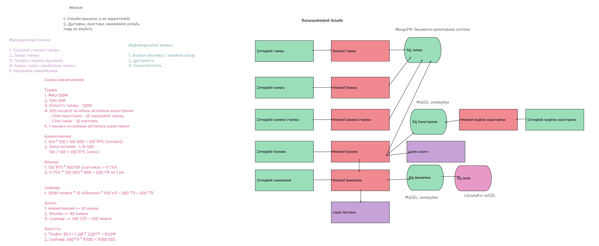

# Про цей розбір

На практичному занятті ми спроєктували онлайн-магазин на кшталт Amazon: зібрали вимоги, намалювали високорівневий дизайн і оцінили навантаження ([дошка у PDF](Amazon.pdf)). Тут перевіряємо кожен крок, виправляємо помилки й доповнюємо те, чого бракувало.

Позначки: ✅ правильно, ⚠️ неточність або пропуск, ❌ помилка.



# 1. Межі системи

**На дошці:**

1. Онлайн-магазин, а не маркетплейс.
2. Доставка, логістика, поповнення складу тощо не входить.

✅ Добре, що межі задано явно: без цього неможливо зрозуміти, що саме ми проєктуємо.

⚠️ Два уточнення:

- Доставка поза межами, але на діаграмі є «Сервіс доставки». Суперечності немає, якщо вважати його **зовнішнім** сервісом, якому ми лише передаємо оплачене замовлення. На дошці він, як і сервіс оплати, позначений окремим кольором.
- Поповнення складу поза межами, а от **резервування залишків** під час оформлення замовлення --- ні. Без нього магазин продасть товар, якого вже немає на складі.

# 2. Функціональні вимоги

**На дошці:**

1. Перегляд сторінки товару.
2. Пошук товару.
3. Головна сторінка магазину.
4. Кошик, списки улюбленого, оплата.
5. Керування замовленням.

✅ Основні сценарії покупця охоплено.

⚠️ Що варто виправити:

- Бракує **реєстрації та профілю користувача**, хоча на діаграмі є інтерфейс, бекенд і БД профілю. Вимоги й діаграма мають збігатися: кожен блок на діаграмі підтримує якусь вимогу.
- Кошик і оплата об'єднані в одному пункті, але мають протилежні вимоги до консистентності (див. [розділ 3](#нефункціональні-вимоги)). Їх варто розділити.
- Дрібниці: «Функуціональні» → «Функціональні», «Бєекенд» → «Бекенд», «Корзина» → «Кошик».

**Доповнений список:**

1. Перегляд сторінки товару.
2. Пошук товару з фільтрами.
3. Головна сторінка магазину.
4. Кошик і списки улюбленого.
5. Оформлення та оплата замовлення.
6. Керування замовленнями: статус, скасування, історія.
7. Реєстрація та профіль користувача з адресами доставки.

**Свідомо винесено за межі:** відгуки й рейтинги, рекомендації, продавці-партнери (це вже маркетплейс), склад і доставка.

# 3. Нефункціональні вимоги {#нефункціональні-вимоги}

**На дошці:**

1. Низька затримка / швидкий відгук.
2. Доступність.
3. Консистентність.

⚠️ Дві проблеми:

1. **Вимоги неможливо перевірити.** Що таке «низька затримка» --- 50 мс чи 2 секунди?
2. **Доступність і консистентність заявлено одночасно.** За CAP-теоремою під час розділення мережі розподілена система не може гарантувати обидві. Тому вибір робимо окремо для кожної операції.

## Вимірювані формулювання

| Вимога | Формулювання |
|:---|:---|
| Затримка | сторінка товару й пошук відповідають не довше ніж за 200 мс для 99% запитів |
| Доступність | каталог і кошик доступні 99.99% часу, тобто не більше ≈ 4 хв простою на місяць |
| Надійність | оплачене замовлення не губиться |
| Масштаб | система витримує пікове навантаження, утричі більше за середнє |

Сама Amazon формулює вимоги саме так. У [статті про сховище Dynamo](https://www.allthingsdistributed.com/files/amazon-dynamo-sosp2007.pdf) (SOSP 2007) наведено приклад угоди про рівень обслуговування: сервіс гарантує відповідь за 300 мс для 99.9% запитів за пікового навантаження 500 запитів на секунду. Середній час відповіді не показує, що відчувають найповільніше обслужені покупці, тому Amazon вимірює саме 99.9-й перцентиль.

## Консистентність чи доступність

| Операція | Під час збою мережі обираємо | Чому |
|:---|:---|:---|
| Перегляд товару, пошук, головна сторінка | **Доступність** | Ціна чи опис, застарілі на кілька секунд, --- не біда. Недоступний магазин --- втрачені продажі. |
| Кошик | **Доступність** | Додати товар у кошик можна завжди. Якщо через збій з'явилися дві версії кошика, їх зливають в одну. |
| Оформлення замовлення й оплата | **Консистентність** | Не можна двічі списати гроші або продати товар, якого немає. Краще показати «спробуйте пізніше». |

Вибір для кошика --- не вигадка. За словами Amazon, покупці повинні мати змогу переглядати й додавати товари в кошик, «навіть якщо відмовляють диски, мережеві маршрути нестабільні або дата-центри руйнує торнадо», а операція «Додати в кошик» ніколи не має губитися.

Кошик міг «застаріти», поки покупець вагався, тож ціни й залишки перевіряємо ще раз під час оформлення замовлення.

# 4. Високорівневий дизайн

## Що на дошці

| Компонент | Звертається до |
|:---|:---|
| Бекенд товару | БД товару (MongoDB) |
| Бекенд пошуку | БД товару |
| Бекенд головної сторінки | БД товару |
| Бекенд кошика | БД товару, БД користувачів (MySQL), сервіс оплати, бекенд замовлень |
| Бекенд замовлень | БД замовлень (MySQL), сервіс доставки |
| БД замовлень | архів (Cassandra) |
| Бекенд профілю | БД користувачів |

Кожен бекенд має свій інтерфейс. Насправді це сторінки одного веб- чи мобільного клієнта, тож на оновленій діаграмі вони об'єднані в один блок.

✅ Вдалі рішення:

- **Сервіси розділено за функціями**, тож кожен можна масштабувати окремо: пошук отримує набагато більше запитів, ніж профіль.
- **MongoDB для каталогу.** Товари різних категорій мають різні атрибути (у ноутбука --- процесор, у футболки --- розмір), і документна модель зберігає їх без порожніх колонок.
- **MySQL для користувачів і замовлень.** Тут потрібні транзакції.
- **Окремий архів для старих замовлень.** Основна БД не росте безмежно, а Cassandra добре витримує великі обсяги даних і читання за ключем, наприклад історію замовлень користувача.

## Що варто виправити

1. ❌ **Немає сховища зображень і CDN.** Зображення дають майже весь трафік і більшу частину сховища (див. [розрахунки](#оцінка-навантаження)), а на діаграмі їх не видно. Зображення зберігаємо в об'єктному сховищі (на кшталт Amazon S3) і роздаємо через CDN, щоб вони не проходили через наші бекенди.
2. ❌ **Оплату викликає бекенд кошика ще до створення замовлення.** Якщо оплата пройде, а замовлення не збережеться через збій чи тайм-аут, гроші буде списано без замовлення. А повторний запит спише їх удруге. Оформленням має керувати сервіс замовлень: спершу створює замовлення зі статусом «очікує оплати», потім викликає оплату з **ключем ідемпотентності** (див. [схему](#оформлення-замовлення)).
3. ⚠️ **Пошук іде напряму в БД товару.** Повнотекстовий пошук серед 100 млн товарів з фільтрами й сортуванням --- окреме завдання для пошукового індексу (Elasticsearch або OpenSearch), який оновлюється зі змін у каталозі.
4. ⚠️ **Немає залишків товару.** Під час оформлення замовлення товар треба зарезервувати в тій самій транзакції, що й замовлення. Інакше двоє покупців куплять останній примірник.
5. ⚠️ **Невідомо, де зберігається кошик.** Кошики часто змінюються і мають бути доступні завжди. Тут пасує key-value сховище: сама Amazon зберігає кошики в Dynamo, ідеї якого лягли в основу Amazon DynamoDB.
6. ⚠️ **Сервіс доставки викликається синхронно.** Якщо зовнішній сервіс доставки недоступний, оформлення замовлення не повинно через це падати. Передаємо подію «замовлення оплачено» через чергу повідомлень, а доставка обробить її, щойно зможе.
7. ⚠️ **Немає балансувальника та кешу.** Головну сторінку й сторінки товарів читають значно частіше, ніж змінюють, тож їх варто кешувати (наприклад, у Redis), а запити розподіляти між кількома копіями кожного сервісу.

## Оновлена діаграма

Прямокутники --- наші сервіси, циліндри --- сховища даних. Жовтим позначено нові компоненти, фіолетовим --- зовнішні сервіси.

::: {.column-page}
```{mermaid}
flowchart TB
  client["Клієнт"]
  cdn["CDN"]:::new
  gateway["API Gateway"]:::new
  images[("S3<br>зображення")]:::new

  home["Головна"]
  product["Товар"]
  search["Пошук"]
  cart["Кошик"]
  orders["Замовлення"]
  profile["Профіль"]

  cache[("Redis<br>кеш")]:::new
  catalog[("MongoDB<br>каталог")]
  index[("Elasticsearch<br>індекс")]:::new
  carts[("key-value<br>кошики")]:::new
  ordersdb[("MySQL<br>замовлення, залишки")]
  users[("MySQL<br>користувачі")]
  payment["Оплата"]:::external
  queue[["Черга подій"]]:::new
  delivery["Доставка"]:::external
  archive[("Cassandra<br>архів")]

  client --> cdn --> images
  client --> gateway
  gateway --> home & product & search & cart & orders & profile

  home --> cache & catalog
  product --> cache & catalog
  catalog -. зміни .-> index
  search --> index
  cart --> carts
  orders --> cart & product & ordersdb & payment & queue
  queue --> delivery
  ordersdb -. старі .-> archive
  profile --> users

  classDef new fill:#fff3bf,stroke:#e0a800,stroke-width:2px
  classDef external fill:#e5dbff,stroke:#7048e8
```
:::

## Оформлення замовлення {#оформлення-замовлення}

::: {.column-page}
```{mermaid}
%%{init: {"sequence": {"actorFontSize": 16, "messageFontSize": 16, "noteFontSize": 16}}}%%
sequenceDiagram
  autonumber
  participant C as Клієнт
  participant O as Замовлення
  participant K as Кошик
  participant T as Товар
  participant DB as MySQL
  participant P as Оплата
  participant Q as Черга
  participant D as Доставка

  C->>O: POST /orders, Idempotency-Key
  O->>K: вміст кошика
  O->>T: актуальні ціни
  O->>DB: резерв і «очікує оплати»
  O->>P: списати суму, той самий ключ
  P-->>O: результат
  alt оплачено
    O->>DB: «оплачено»
    O->>Q: подія «оплачено»
    Q-)D: створити відправлення
  else відмова
    O->>DB: зняти резерв, «скасовано»
  end
  O-->>C: результат оформлення
```
:::

Резерв залишків і створення замовлення виконуються в одній транзакції MySQL, а доставку сервіс замовлень не чекає: подія з черги обробляється асинхронно.

**Навіщо ключ ідемпотентності.** Клієнт генерує унікальний ключ для кожної спроби оформлення. Якщо відповідь загубилася і клієнт повторив запит з тим самим ключем, сервіс замовлень поверне вже створене замовлення, а сервіс оплати не спише гроші вдруге.

## Основні API

| Метод | Шлях | Що робить |
|:---|:---|:---|
| `GET` | `/home` | головна сторінка |
| `GET` | `/products/{id}` | сторінка товару |
| `GET` | `/search?q=…&category=…&page=…` | пошук з фільтрами |
| `POST` | `/cart/items` | додати товар у кошик |
| `DELETE` | `/cart/items/{id}` | прибрати товар з кошика |
| `POST` | `/wishlist/items` | додати товар у список улюбленого |
| `POST` | `/orders` | оформити замовлення (заголовок `Idempotency-Key`) |
| `GET` | `/orders/{id}` | статус замовлення |
| `POST` | `/orders/{id}/cancel` | скасувати замовлення |

# 5. Оцінка навантаження {#оцінка-навантаження}

## Припущення

**На дошці:**

| Припущення | Коментар |
|:---|:---|
| MAU 100 млн | ✅ |
| DAU 10 млн | ✅ DAU/MAU = 10% --- правдоподібно для магазину, куди заходять не щодня. На дошці «DAu» → «DAU». |
| 100 млн товарів | ✅ |
| 100 зображень на активного користувача: 10 переглядів товару × 10 зображень | ⚠️ Не вказано, що це **на день**. |
| 1 покупка на активного користувача | ⚠️ Дуже песимістично: конверсія інтернет-магазинів зазвичай вимірюється одиницями відсотків. Якщо купують 3% активних користувачів, це 300 тис. замовлень на день (≈ 3--4 за секунду), а не 10 млн. Залишаємо як верхню межу. |

**Додано для повного розрахунку:**

| Припущення | Значення |
|:---|:---|
| Пошукових запитів на активного користувача за день | 5 |
| Відвідувань головної сторінки на активного користувача за день | 2 |
| Дій з кошиком на активного користувача за день | 3 |
| Середня тривалість сесії | 15 хв |
| Середній розмір зображення | 500 кБ (як на дошці) |
| Зменшені копії зображень (прев'ю) | +20% до обсягу оригіналів |
| Запис про товар / замовлення / користувача / кошик | 10 кБ / 2 кБ / 10 кБ / 5 кБ |
| Усього акаунтів | 200 млн (удвічі більше за MAU) |
| Пікове навантаження | ×3 від середнього |
| Реплікація | ×3 |
| Горизонт | 5 років, каталог не росте (як на дошці) |

Як і на дошці, вважаємо добу ≈ 10^5^ с. Точніше це 86 400 с, тож реальні RPS приблизно на 15% вищі, але цю різницю покриває запас на пік.

## Перевірка розрахунків з дошки

::: {.callout-tip}
## 🔮 Спершу перевірте самі

Перш ніж читати таблицю, перевірте розрахунки на дошці. В одному рядку є груба помилка, ще в кількох --- неточності.
:::

| На дошці | Перевірка | Вердикт |
|:---|:---|:---|
| 10 млн × 100 / 10^5^ ≈ 10 тис. RPS (читання) | 10^9^ / 10^5^ = 10 тис. | ✅ Але це запити **зображень**. До API надходить ≈ 2 тис. RPS (див. нижче). |
| Запис : читання = 1 : 100 → 10 тис. / 100 = 100 RPS (запис) | 10 млн покупок / 10^5^ = 100 | ✅ Збігається з «1 покупка на активного користувача». |
| 10 тис. RPS × 500 кБ = 5 ГБ/с | 5 · 10^6^ кБ/с = 5 ГБ/с | ✅ Це гігабайти. У гігабітах --- 40 Gbps, і на дошці це правильно враховано в «≥ 40 машин». |
| 5 ГБ/с × 100 000 × 400 = 200 PB на рік | 5 ГБ/с × 86 400 с × 365 ≈ 160 PB | ✅ З округленням угору. |
| 100 млн × 10 × 500 кБ = 500 ТБ < 600 ТБ | 5 · 10^11^ кБ = 500 ТБ | ⚠️ Без реплікації. 600 ТБ можна вважати запасом на прев'ю. |
| Навантаження ≤ 10 машин | 6.3 тис. RPS у пік | ✅ З запасом. Але якщо тримати кожен сервіс у 2--3 копіях, машин буде ≈ 15. |
| Мережа ≥ 40 машин | 40 Gbps / 1 Gbps | ⚠️ Лише якщо роздавати зображення з власних машин по 1 Gbps. З CDN і мережевими картами на 10 Gbps вистачить 2--3 машин. |
| Сховище ≤ 100 SSD ≈ 100 машин | 600 ТБ / 50 ТБ на машину = 12 | ❌ ≈ 100 --- це кількість **дисків** по 8 ТБ (600 / 8 = 75), а не машин. В одну машину ставимо кілька дисків: 12 машин, з реплікацією --- 36. |
| Трафік: $0.1 / 1 ГБ × 200 PT = $20 млн | 2 · 10^8^ ГБ × $0.1 = $20 млн | ✅ За рік. «PT» → «PB». За 5 років --- ≈ $80 млн. |
| Сховище: 600 ТБ × $300 = $180 тис. | ✅ | ⚠️ Без реплікації. І SSD для зображень, які й так роздає CDN, --- зайва витрата: на HDD це $18 тис. |

## Запити

| Запити | Формула | Середнє, RPS | Пік (×3), RPS |
|:---|:---|---:|---:|
| Сторінки товарів | 10 млн × 10 / 10^5^ | 1 000 | 3 000 |
| Пошук | 10 млн × 5 / 10^5^ | 500 | 1 500 |
| Головна сторінка | 10 млн × 2 / 10^5^ | 200 | 600 |
| Кошик (запис) | 10 млн × 3 / 10^5^ | 300 | 900 |
| Замовлення (запис) | 10 млн × 1 / 10^5^ | 100 | 300 |
| **API разом** | | **2 100** | **6 300** |
| Зображення (через CDN) | 10 млн × 100 / 10^5^ | 10 000 | 30 000 |

- Для API співвідношення читання до запису --- 1 700 : 400 ≈ 4 : 1. Співвідношення 100 : 1 з дошки виходить, лише якщо порівнювати запити зображень із замовленнями.
- **Одночасні користувачі:** 10 млн × 15 хв × 60 / 86 400 ≈ 100 тис. (у пік ≈ 300 тис.), тобто рівень C100k.

## Мережа

- **Зображення:** 10 тис. RPS × 500 кБ = 5 ГБ/с = **40 Gbps**, у пік --- 120 Gbps.
- **API:** навіть якщо відповідь займає 50 кБ, 2 100 RPS × 50 кБ ≈ 105 МБ/с ≈ **1 Gbps**.
- **Вихідний трафік:** 5 ГБ/с × 86 400 с × 365 ≈ **160 PB на рік**, за 5 років ≈ **790 PB ≈ 0.8 EB**.
- **З CDN:** якщо CDN віддає з кешу 90% зображень, до наших серверів доходить лише ≈ 4 Gbps, а в пік --- 12 Gbps.

## Сховище на 5 років

| Дані | Формула | Обсяг | З реплікацією ×3 |
|:---|:---|---:|---:|
| Зображення з прев'ю | 100 млн × 10 × 500 кБ × 1.2 | 600 ТБ | 1.8 PB |
| Каталог | 100 млн × 10 кБ | 1 ТБ | 3 ТБ |
| Замовлення | 10 млн × 2 кБ × 1 825 днів | 36.5 ТБ | ≈ 110 ТБ |
| Користувачі | 200 млн × 10 кБ | 2 ТБ | 6 ТБ |
| Кошики | 10 млн × 5 кБ | 50 ГБ | 150 ГБ |
| **Разом** | | **≈ 640 ТБ** | **≈ 1.9 PB** |

У MySQL тримаємо замовлення лише за останній рік: 20 ГБ на день × 365 × 3 ≈ 22 ТБ. Решта, ≈ 88 ТБ з реплікацією, --- в архіві.

## Залізо

| Компонент | Розрахунок | Машин |
|:---|:---|---:|
| Сервіси API | 6.3 тис. RPS у пік вмістилися б на одну машину, але тримаємо по 2--3 копії кожного з 6 сервісів | ≈ 15 |
| Сховище зображень на HDD | 1.8 PB / 200 ТБ = 9, плюс запас на відмови дисків | ≈ 10 |
| MongoDB (каталог) | 3 ТБ, набір із 3 реплік | 3 |
| MySQL (користувачі, замовлення за рік, залишки) | ≈ 28 ТБ, основна машина й 2 репліки | 3 |
| Cassandra (архів) | ≈ 88 ТБ з реплікацією, по ≈ 30 ТБ на машину | 3 |
| Пошуковий індекс, кеш, черга | по 3 машини для відмовостійкості | 9 |
| Роздача зображень за CDN | 12 Gbps у пік, мережеві карти на 10 Gbps | 3 |
| **Разом** | | **≈ 45** |

Якби зображення зберігалися на SSD, як на дошці, сховище зайняло б 1.8 PB / 50 ТБ = 36 машин.

## Вартість на 5 років

| Стаття | Розрахунок | Вартість |
|:---|:---|---:|
| Вихідний трафік | 0.8 EB × $0.1 за ГБ | ≈ $80 млн |
| Сервери (для ілюстрації) | 45 машин × $10 тис. на рік × 5 років | ≈ $2.3 млн |
| Диски під зображення, SSD | 1 800 ТБ × $300 | ≈ $540 тис. |
| Диски під зображення, HDD | 1 800 ТБ × $30 | ≈ $54 тис. |
| Диски під бази даних, SSD | ≈ 120 ТБ × $300 | ≈ $36 тис. |

Ціни з лекції --- це вартість самих дисків. У хмарі за сховище платять щомісяця: в Amazon S3 Standard ≈ $0.022 за ГБ на місяць, тобто 600 ТБ коштуватимуть ≈ $13 тис. на місяць, або ≈ $0.8 млн за 5 років. Реплікація вже входить у цю ціну.

# Висновки

1. **Трафік зображень --- понад 95% вартості системи.** Решта статей разом не дотягує навіть до $3 млн.
2. **Найсильніший важіль --- розмір зображень:** прев'ю у списках товарів, сучасні формати (WebP, AVIF), завантаження лише тих зображень, до яких покупець догорнув. Якщо середній переданий розмір зменшити з 500 до 100 кБ, трафік і його вартість упадуть уп'ятеро: ≈ $16 млн замість $80 млн.
3. **CDN знімає навантаження з наших серверів** (≈ 4 Gbps замість 40), але трафік усе одно оплачуємо, тільки тепер CDN-провайдеру. За таких обсягів ціна за гігабайт нижча за прайсову.
4. **Вибір носія теж важливий**, хоча на меншому масштабі: SSD замість HDD для зображень у 10 разів дорожчий.
5. **Архітектурно найважливіші виправлення:** сховище зображень із CDN, оформлення замовлення через сервіс замовлень з ідемпотентною оплатою та резервування залишків.

# Питання для обговорення

- Як зміняться розрахунки, якщо магазин стане маркетплейсом і продавці самі завантажуватимуть фото товарів?
- Що станеться в «чорну п'ятницю», коли пік може в рази перевищити звичайний? Які компоненти впадуть першими?
- Які дані можна втратити без шкоди для бізнесу, а які --- ні? Як це впливає на вибір реплікації?

# Матеріали

- [Розбір практики: платформа ШІ-оцінювання робіт](https://01a0ac5a-72cd-826b-0cfd-0e48590c57e6.share.connect.posit.cloud) --- справжня система з виміряними числами
- [Слайди лекції «Збір вимог та оцінка навантаження»](https://01a0ac59-427d-8338-d03c-f00171d8ef69.share.connect.posit.cloud)
- [Dynamo: Amazon's Highly Available Key-value Store](https://www.allthingsdistributed.com/files/amazon-dynamo-sosp2007.pdf) (SOSP 2007)
- [The System Design Primer](https://github.com/donnemartin/system-design-primer)
